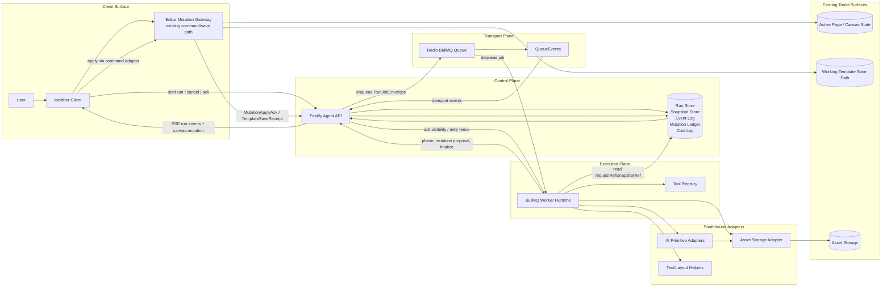

# Tooldi 자연어 에이전트/워크플로우 v1 아키텍처 초안

## 문서 정보

| 항목 | 값 |
| --- | --- |
| 문서명 | Tooldi 자연어 에이전트/워크플로우 v1 아키텍처 초안 |
| 문서 목적 | 빈 캔버스 배너 생성 대표 시나리오와 이후 구현 계약의 기준점을 먼저 고정 |
| 상태 | Draft |
| 문서 유형 | TO-BE |
| 작성일 | 2026-04-02 |
| 기준 시스템 | FE `toolditor`, 신규 `Fastify` Agent Control API, 신규 `BullMQ Worker Runtime`, `Redis` 기반 `BullMQ Queue`, 기존 AI primitive |
| 기준 데이터 | 기존 AI 기능 명세서, T2I 현재 상태 문서, AI 기회 조사 문서 |
| 대상 독자 | PM, FE, Agent/Backend 개발자, Worker 개발자, QA |
| Owner | TBD |
| Reviewers | TBD |
| Approver | TBD |

## Document Authority and Verification Metadata

### Document authority hierarchy

- 이 문서는 v1 ontology와 semantic contract의 최상위 authoritative source다. artifact identity, counted completion moment, lifecycle ownership, contract-chain root identity, ordering primitive, checkpoint/rollback semantics, asset normalization boundary, primitive reuse boundary, acceptance-criterion closure는 오직 이 문서가 닫는다.
- [tooldi-agent-workflow-v1-functional-spec-to-be.md](/home/ubuntu/github/tooldi/tws-editor-api/docs/tooldi-agent-workflow-v1/tooldi-agent-workflow-v1-functional-spec-to-be.md) 는 product/API projection 문서다. northbound request, FR/BR/NFR, payload shape, persistence table을 정의할 수는 있지만, 이 문서가 이미 닫은 artifact identity, completion semantics, authority ownership, AC closure를 재정의하거나 override할 수 없다.
- [tooldi-agent-workflow-v1-backend-boundary.md](/home/ubuntu/github/tooldi/tws-editor-api/docs/tooldi-agent-workflow-v1/tooldi-agent-workflow-v1-backend-boundary.md) 는 backend/control-plane scope와 sync/async split의 authoritative source다. 다만 lifecycle ownership의 normative 판정, canonical completion moment, canonical draft artifact identity는 이 문서를 재참조만 해야 한다.
- [tooldi-agent-workflow-v1-scope-operations-decisions.md](/home/ubuntu/github/tooldi/tws-editor-api/docs/tooldi-agent-workflow-v1/tooldi-agent-workflow-v1-scope-operations-decisions.md) 는 v1 scope/non-scope, stack lock, day-one operations decision의 authoritative source다. 이 문서 역시 artifact identity, completion semantics, lifecycle ownership을 별도 source로 만들면 안 된다.

### Integrated Verification

- Integrated Verification: `manual_cross_doc_consistency_review_v1`
- Verification artifact set:
  - [tooldi-natural-language-agent-v1-architecture.md](/home/ubuntu/github/tooldi/tws-editor-api/docs/tooldi-agent-workflow-v1/tooldi-natural-language-agent-v1-architecture.md)
  - [tooldi-agent-workflow-v1-functional-spec-to-be.md](/home/ubuntu/github/tooldi/tws-editor-api/docs/tooldi-agent-workflow-v1/tooldi-agent-workflow-v1-functional-spec-to-be.md)
  - [tooldi-agent-workflow-v1-backend-boundary.md](/home/ubuntu/github/tooldi/tws-editor-api/docs/tooldi-agent-workflow-v1/tooldi-agent-workflow-v1-backend-boundary.md)
  - [tooldi-agent-workflow-v1-scope-operations-decisions.md](/home/ubuntu/github/tooldi/tws-editor-api/docs/tooldi-agent-workflow-v1/tooldi-agent-workflow-v1-scope-operations-decisions.md)
- Canonical Test Command:

```bash
rg -n "RunCompletionRecord\\.draftGeneratedAt|canonical_completion_moment|LiveDraftArtifactBundle|authority_matrix|tool_activation_policy|StoredAssetDescriptor|verification_traceability_map|ordering_policy|request_ingress_boundary|record_invariant_matrix|evaluation_closure_policy" \
  docs/tooldi-agent-workflow-v1/tooldi-natural-language-agent-v1-architecture.md \
  docs/tooldi-agent-workflow-v1/tooldi-agent-workflow-v1-functional-spec-to-be.md \
  docs/tooldi-agent-workflow-v1/tooldi-agent-workflow-v1-backend-boundary.md \
  docs/tooldi-agent-workflow-v1/tooldi-agent-workflow-v1-scope-operations-decisions.md
```

- This revision is valid only when the command above shows no sibling document asserting a second canonical completion moment, a second canonical draft artifact, or a second lifecycle-ownership source.
- This artifact set is Markdown-only. No TypeScript files are changed here, so `npm test` is intentionally not part of the canonical verification path for this revision.

### Previous-vs-Current Delta

- The previous revision still left a cross-doc mismatch where [tooldi-agent-workflow-v1-functional-spec-to-be.md](/home/ubuntu/github/tooldi/tws-editor-api/docs/tooldi-agent-workflow-v1/tooldi-agent-workflow-v1-functional-spec-to-be.md) used `final_save_receipt_acked` as the canonical completion moment while this document had already fixed `RunCompletionRecord.draftGeneratedAt` as the sole counted success moment.
- The previous revision also allowed [tooldi-agent-workflow-v1-backend-boundary.md](/home/ubuntu/github/tooldi/tws-editor-api/docs/tooldi-agent-workflow-v1/tooldi-agent-workflow-v1-backend-boundary.md) to read `RunCompletionRecord.completedAt` like a canonical completion moment, which contradicted `completion_sla_definition`.
- This revision closes those contradictions and adds an explicit document-authority hierarchy plus integrated verification metadata so the next evaluation can test one authoritative rule set instead of re-inferring it from sibling prose.

## 0. Verification Traceability Map

이 절은 문서의 `verification_traceability_map` 이다. acceptance criterion과 named spec section의 normative 매핑은 오직 이 절만 따른다. 다른 절은 자신의 계약을 정의할 수는 있지만, AC별 pass/fail anchor를 별도로 선언하거나 이 표와 다른 매핑을 만들면 안 된다.

검증 규칙은 아래처럼 고정한다.

- 각 acceptance criterion은 아래 표의 `단일 검증 section` 1개로만 판정한다.
- 다른 절에서 같은 주제를 재진술하더라도 그것은 projection, example, 운영 메모일 뿐 별도 AC anchor가 아니다.
- 같은 AC에 대해 둘 이상의 section을 근거로 상반된 verdict를 내리면 안 된다. 충돌이 발생하면 이 표의 매핑을 우선한다.

| AC ID | acceptance criterion | 단일 검증 section |
| --- | --- | --- |
| AC-01 | representative v1은 빈 캔버스에서 `봄 세일 이벤트 배너 만들어줘` 를 받아 2분 안에 live-commit 방식으로 편집 가능한 배너 초안 1개를 남기는 폐쇄형 배너 생성 시나리오를 유지해야 한다. | `§2.2 폐쇄형 대표 사용자 여정` |
| AC-02 | v1의 canonical draft artifact는 committed `LiveDraftArtifactBundle` 1개뿐이어야 하며 sibling draft artifact authority를 허용하지 않아야 한다. | `§6.4 draft_artifact_model: LiveDraftArtifactBundle as the sole canonical v1 draft artifact` |
| AC-03 | 성공 SLA의 counted completion moment는 `RunCompletionRecord.draftGeneratedAt` 1개 시각으로만 닫혀야 한다. | `§4.1.1 completion_sla_definition` |
| AC-04 | authority ownership과 lifecycle owner 판정은 `authority_matrix` 1곳에서만 normative 하게 닫혀야 한다. | `§2.9 authority_matrix` |
| AC-05 | root-to-child persisted contract chain의 root identity는 `AgentRunRecord.runId` 하나로만 닫히고, ordering은 immutable `planStepOrder` 와 immutable `eventSequence` 로만 닫혀야 하며, timestamp 류 값은 tie-breaker, dispute resolver, recovery input이 되면 안 된다. | `§6.2.1.1 ordering_policy` |
| AC-06 | last-known-good checkpoint는 rehydratable canonical state 1개로만 정의되고, rollback/recovery는 hidden state rewrite 없이 그 state를 기준으로 수행되어야 한다. | `§3.4.1.1 last-known-good checkpoint contract` |
| AC-07 | `updateLayer` 와 `deleteLayer` 의 v1 scope/status는 same-run internal correction only로만 고정되고, northbound user-facing post-creation edit/delete와 혼동되면 안 된다. | `§2.8 v1 범위와 v2 확장 경계` |
| AC-08 | asset-bearing execution은 search/generate/store/place 경계마다 raw provider payload가 아니라 canonical `StoredAssetDescriptor` 를 통해서만 canvas mutation으로 넘어가야 한다. | `§6.3.3.2 StoredAssetDescriptor: canonical schema freeze` |
| AC-09 | one-shot AI primitive output은 worker-owned plan/tool lineage 아래의 subordinate candidate evidence로만 남아야 하며, plan state, authority, completion의 대체 source가 되면 안 된다. | `§6.3.3.1 OneShotCandidateRecord: subordinate advisory record freeze` |
| AC-10 | acceptance criterion별 검증 anchor는 문서 전체에서 정확히 하나의 named section에만 매핑되어야 하며, 그 단일 AC-to-section closure는 이 traceability map이 독점한다. | `§0 Verification Traceability Map` |

## 1. 목적

이 문서는 Tooldi 안에 새로 추가할 자연어 에이전트/워크플로우 레이어의 v1 기준점을 정의한다.

v1의 대표 사용자 가치와 구현 범위는 다음 한 문장으로 고정한다.

- 사용자는 빈 배너 캔버스에서 `봄 세일 이벤트 배너 만들어줘`처럼 자연어로 요청하고, 시스템은 2분 안에 실제 캔버스에 실시간 반영되는 편집 가능한 배너 초안 1개를 남겨야 한다.

이 문서의 첫 단계 목표는 아키텍처 논의 전에 대표 시나리오의 시작 상태, 허용된 가정, 성공 종료 상태를 모호하지 않게 고정하는 것이다.

## 2. 대표 시나리오 경계

### 2.1 대표 시나리오 한 줄 정의

- Tooldi 편집기 안의 에이전트 입력창에서 사용자가 `봄 세일 이벤트 배너 만들어줘`를 보내면, 시스템은 현재 비어 있는 배너 페이지를 대상으로 계획 수립과 캔버스 변경을 연속 실행해 편집 가능한 초안 1개를 실시간으로 완성한다.

이 UX는 Cursor, Claude Code, Codex 같은 에이전트형 입력 경험을 참고하되, 결과물은 채팅 답변이 아니라 `Tooldi 캔버스에 남는 live-commit 초안`이어야 한다.

### 2.2 폐쇄형 대표 사용자 여정

이 절은 문서의 `representative_scenario` happy path를 단일 폐쇄형 시나리오로 고정한다. 아래 여정에서는 추가 질의, 사용자 승인, 분기 선택, 다중 시안 제시가 없다.

이 절에서 말하는 `편집 가능한 배너 초안 1개` 는 사용자-visible 결과와 성공 조건을 설명하는 표현일 뿐이다. 어떤 persisted artifact가 그 초안을 canonical editable draft로 대표하는지는 §6.4 `draft_artifact_model` 의 normative inclusion/exclusion table만 따르며, 이 절은 artifact identity를 별도로 재정의하지 않는다.

| 단계 | 고정 내용 |
| --- | --- |
| 0. 시작 상태 | 사용자는 로그인된 편집 세션 안에 있고, 활성 페이지는 `1200x628` 배너 사이즈의 빈 캔버스다. 선택된 레이어는 없고, 사전 업로드 이미지/로고/브랜드 키트도 없으며, 이미 실행 중인 agent run도 없다. |
| 1. 사용자 입력 | 사용자는 Tooldi 편집기 안의 에이전트 입력창에 정확히 `봄 세일 이벤트 배너 만들어줘`를 입력하고 전송한다. |
| 2. v1 해석 | 시스템은 이 요청을 `빈 캔버스에 봄 시즌 프로모션용 배너 초안 1개 생성`으로 해석한다. 브랜드명, 할인율, 종료일, 상품명 같은 구체 사실은 주어지지 않았으므로 generic sale banner 기본값을 사용한다. |
| 3. 실행 원칙 | 시스템은 추가 질문이나 승인 모달 없이 즉시 run을 시작한다. planning, asset 준비, layer 생성/수정/정리 과정은 모두 live-commit으로 현재 활성 페이지에 반영된다. |
| 4. 중간 진행 | 사용자는 run 진행 상태를 보면서 기다리고, 캔버스에는 배경, 헤드라인, 보조 카피, CTA, 장식 그래픽/이미지 슬롯이 순차적으로 나타나거나 보정된다. worker는 필요하면 임시 레이어를 만들 수 있지만, `updateLayer`, `deleteLayer` 는 같은 run 안에서 생성 중인 draft를 self-correction 하거나 compensation 하는 범위에서만 사용할 수 있다. |
| 5. 종료 상태 | 최초 전송 후 2분 안에 활성 페이지에는 편집 가능한 배너 초안 1개가 남아야 한다. 결과는 flat 결과물이 아니라 개별 레이어들로 구성되어 사용자가 즉시 선택, 이동, 텍스트 수정, 삭제를 할 수 있어야 한다. |

이 폐쇄형 여정의 추가 고정 가정은 아래와 같다.

- 시스템은 추가 정보가 없더라도 멈추지 않고 범용 배너 초안을 완성해야 한다.
- 시스템은 사실 근거가 없는 할인율, 날짜, 브랜드, 상품명을 임의로 확정하지 않는다.
- 시스템은 run 중 `createLayer`, 이미지 삽입, 저장을 승인 없이 실행할 수 있고, `updateLayer`, `deleteLayer` 는 같은 run 안에서 생성 중인 draft의 self-correction 및 compensation에 한해 승인 없이 실행할 수 있다.
- 시스템은 숨겨진 staging area가 아니라 실제 활성 페이지를 직접 갱신한다.

대표 결과물은 아래 수준을 만족해야 한다.

| 항목 | 결과 기대 |
| --- | --- |
| 배너 수 | 1개 |
| 편집 가능성 | 헤드라인, 서브카피, CTA, 장식 요소가 각각 레이어 또는 레이어 그룹으로 남음 |
| 카피 톤 | `봄 세일`, `시즌 특가`, `지금 확인하기`처럼 일반 프로모션 문구 중심 |
| 비주얼 방향 | 봄 시즌을 연상시키는 파스텔 배경, 꽃/잎 패턴, 추상 그래픽, 또는 내부 이미지 도구로 생성한 장식 비주얼 중 하나 이상 포함 |
| 사용자 체감 | 사용자는 run 종료 직후 기존 편집기 조작만으로 결과를 추가 편집할 수 있음 |

### 2.3 초기 편집기 상태

대표 시나리오의 시작 상태는 아래처럼 고정한다.

| 항목 | 시작 상태 |
| --- | --- |
| 로그인 상태 | 로그인 완료, 현재 문서 편집 권한 보유 |
| 문서/페이지 | 현재 문서의 활성 페이지 1개가 존재 |
| 페이지 크기 | 대표 기준은 `1200x628` 웹 프로모션 배너 사이즈 |
| 캔버스 내용 | 사용자 추가 레이어가 하나도 없는 빈 캔버스 |
| 선택 상태 | 선택된 오브젝트 없음 |
| 업로드 자산 | 사전 업로드 이미지, 로고, 브랜드 키트가 없다고 가정 |
| 에이전트 실행 상태 | 진행 중인 에이전트 run 없음 |
| 저장 상태 | 문서는 편집 가능한 정상 상태이며 live-commit 가능한 세션임 |

추가 경계는 다음과 같다.

- v1 대표 시나리오는 `기존 캔버스 위 편집`이 아니라 `빈 캔버스에서 새 초안 생성`만 다룬다.
- 활성 페이지는 이미 배너 작업이 가능한 페이지라고 가정한다.
- 페이지 추가 생성, 문서 생성, 복수 페이지 동시 생성은 대표 시나리오 범위에서 제외한다.

### 2.4 사용자 발화와 시스템 해석

원문 발화는 아래 그대로 고정한다.

- `봄 세일 이벤트 배너 만들어줘`

이 발화에 대한 v1 시스템 해석은 아래로 고정한다.

| 항목 | 해석 |
| --- | --- |
| 사용자 의도 | 빈 배너 캔버스에 봄 시즌 세일용 홍보 배너 초안 1개를 생성하려는 요청 |
| 산출물 수 | 1개 |
| 산출물 형식 | Tooldi 레이어로 편집 가능한 배너 초안 |
| 언어 | 한국어 카피 중심 |
| 실행 방식 | 승인 대기 없이 즉시 live-commit |
| 완료 기대 | 2분 이내 초안 완성 |

해석상 포함되는 것:

- 시스템은 계절감 있는 프로모션 톤, 배너형 레이아웃, 기본 CTA 구조를 스스로 선택할 수 있다.
- 시스템은 기존 one-shot AI 기능을 내부 도구처럼 호출할 수 있다.

해석상 포함되지 않는 것:

- 실제 할인율, 종료일, 브랜드명, 상품명처럼 근거 없는 사실값을 임의 확정하는 것
- 사용자 승인 이후에만 캔버스에 반영하는 staged apply UX
- 2개 이상 시안 동시 생성

### 2.5 대표 시나리오 가정

대표 시나리오는 아래 가정 위에서 성공해야 한다.

1. 사용자 입력은 한 문장뿐이며, 추가 질의 없이 초안을 생성하는 것이 기본 경로다.
2. 브랜드 키트, 상품 이미지, 로고, 행사 세부 조건이 없으면 시스템은 `범용 세일 배너` 초안을 만든다.
3. 범용 세일 배너의 텍스트는 사실 단정이 적은 표현만 사용한다.
4. 예시: `봄 세일`, `시즌 특가`, `지금 확인하기`, `한정 혜택` 같은 일반 프로모션 카피는 허용한다.
5. 예시: `최대 70% 할인`, `4월 10일까지`, 특정 브랜드/상품명 같은 구체 수치는 사용자 입력이 없으면 금지한다.
6. 에이전트 run 동안 create, update, delete, image insertion, save는 모두 승인 없이 실행 가능해야 한다.
7. 모든 캔버스 변경은 숨겨진 staging area가 아니라 실제 활성 페이지에 즉시 반영되어야 한다.
8. 내부 단계에서 실패한 일부 변경이 있더라도, 시스템은 남은 시간 안에 복구 또는 대체 실행을 시도해 최종적으로 편집 가능한 초안 1개를 남기는 것을 우선한다.

### 2.6 성공 종료 상태

다음 조건을 모두 만족해야 대표 시나리오 성공으로 본다.

| 구분 | 성공 조건 |
| --- | --- |
| 시간 | 최초 사용자 전송부터 `120초 이내`에 완료 상태 진입 |
| 캔버스 결과 | 활성 페이지에 배너 초안 1개가 실제로 존재 |
| 편집 가능성 | 결과가 flat 이미지 1장으로 끝나지 않고 개별 레이어로 수정 가능 |
| live-commit | 생성 과정 중 주요 레이아웃/텍스트/이미지 변경이 실시간으로 페이지에 반영됨 |
| 사용자 후속 행동 | 사용자는 run 종료 직후 기존 편집기 도구로 요소 선택, 이동, 수정, 삭제 가능 |
| 실행 종료 | run 상태가 성공으로 닫히고, 어떤 변경이 반영됐는지 추적 가능한 실행 기록이 남음 |

성공 초안의 최소 구성은 아래를 만족해야 한다.

- 배경 레이어 1개 이상
- 메인 헤드라인 텍스트 레이어 1개 이상
- 보조 카피 또는 배지 텍스트 레이어 1개 이상
- CTA 성격의 버튼/배지/텍스트 그룹 1개 이상
- 장식 그래픽, 도형, 이미지 레이어 중 1개 이상

허용되는 결과 예시는 다음과 같다.

- 추상 봄 패턴 + `봄 세일` 헤드라인 + `지금 확인하기` CTA
- 꽃, 잎, 파스텔 그래픽 중심 배경 + 일반 프로모션 문구
- 내부 이미지 생성 도구로 만든 장식 이미지를 포함하되 해당 이미지가 일반 이미지 레이어처럼 교체/이동 가능

#### 2.6.1 대표 시나리오 terminal state matrix

이 절의 canonical entity는 `RunResult.finalStatus` 이다. success 계열 행은 artifact identity를 새로 정의하지 않고, §6.4 `draft_artifact_model` 의 normative inclusion/exclusion table이 canonical editable v1 draft artifact로 분류한 committed `LiveDraftArtifactBundle` 을 terminal outcome evidence로 소비한다. 대표 시나리오의 제품 scope, persistence, SLA verification은 아래 매트릭스만을 terminal outcome 기준으로 사용한다.

| 대표 시나리오 terminal state | `RunResult.finalStatus` | 최종 시스템 outcome | 사용자 visible 결과 |
| --- | --- | --- | --- |
| success | `completed` | `LiveDraftArtifactBundle` 이 committed 상태로 persisted 되고, `saveMetadata.latestSaveReceipt.savedRevision` 이 final revision과 일치한다. required slot은 모두 `ready` 또는 `fallback_ready` 이며 warning이 success bar를 넘지 않는다. | 활성 페이지에 편집 가능한 배너 초안 1개가 남고, 사용자는 별도 승인 없이 즉시 요소 선택, 이동, 텍스트 수정, 삭제를 할 수 있다. |
| partial success | `completed_with_warning` | `completed` 와 동일한 durability 증빙을 가지지만 optional asset, polish, copy refinement 중 일부가 fallback 또는 warning summary로 남는다. required slot 충족과 editable draft durability는 유지된다. | 활성 페이지에 편집 가능한 배너 초안 1개가 남고 바로 수정 가능하다. 다만 UI는 `일부 장식 요소가 대체되었습니다` 같은 warning summary를 함께 노출해야 한다. |
| failure after visible apply | `save_failed_after_apply` | visible draft는 한때 존재했을 수 있지만 latest save receipt가 없거나 final revision과 불일치하므로 canonical completion으로 인정되지 않는다. 시스템은 run을 failure로 닫고 마지막 last-known-good checkpoint와 save failure 근거를 보존한다. | 사용자는 캔버스에서 초안을 잠시 봤을 수 있으나, run 종료 메시지는 `저장 완료 실패` 여야 한다. 새로고침 후 동일 초안이 유지된다고 약속할 수 없으며, 사용자에게 durability 미보장을 명확히 알려야 한다. |
| failure before usable draft | `failed` | editable minimum을 충족하지 못했거나 unrecoverable conflict/timeout이 발생해 representative draft를 canonical artifact로 남기지 못한다. 시스템은 run 시작 상태 또는 명시된 last-known-good checkpoint 기준으로 rollback/cleanup 하고 terminal error summary를 남긴다. | 사용자는 완성된 editable 배너 초안을 받지 못한다. 캔버스에는 새 draft가 남지 않거나 마지막으로 확정 저장된 상태만 남고, UI는 실패 이유와 재시도 가능 여부를 보여줘야 한다. |

추가 고정 규칙은 아래와 같다.

- 대표 시나리오 success로 집계되는 terminal state는 `completed`, `completed_with_warning` 두 가지뿐이다.
- `save_failed_after_apply` 는 사용자가 화면에서 일부 결과를 봤더라도 partial success가 아니라 failure다.
- `cancelled` 는 시스템 전체에서는 유효한 terminal status지만, 대표 시나리오 검증에서는 사용자가 stop action을 하지 않는 폐쇄형 여정을 전제로 하므로 제외한다.

### 2.7 성공으로 보지 않는 상태

아래 중 하나라도 해당하면 대표 시나리오 성공이 아니다.

- 채팅창에 계획만 보여주고 캔버스에는 아무것도 남기지 않은 경우
- 결과가 단일 flatten 비트맵으로만 삽입되어 텍스트 수정이 불가능한 경우
- 사용자의 추가 승인, 적용 버튼, 확인 모달이 있어야만 캔버스 반영이 끝나는 경우
- 1개 초안 대신 여러 시안만 만들고 사용자가 고르도록 넘기는 경우
- 실행은 끝났지만 어느 레이어가 왜 생겼는지 추적할 run 기록이 없는 경우
- 2분 안에 편집 가능한 결과를 남기지 못한 경우

### 2.8 v1 범위와 v2 확장 경계

대표 시나리오를 기준으로 한 v1과 v2의 경계는 아래처럼 고정한다.

| 구분 | v1 포함 여부 | 설명 |
| --- | --- | --- |
| 빈 캔버스에서 새 배너 초안 생성 | 포함 | 대표 시나리오 핵심 |
| 신규 workflow control plane을 non-PHP backend + queue + worker로 분리 구축 | 포함 | v1부터 PHP 밖의 신규 스택으로 구현해야 한다. 기존 PHP는 이 workflow의 주 실행면이 아니다. |
| 기존 one-shot AI primitive를 내부 tool adapter로 재사용 | 포함 | T2I/Rewrite류 기능은 southbound tool로 재사용 가능하지만, northbound workflow owner는 새 agent/workflow layer다. |
| run 중 내부적으로 layer create/update/delete 사용 | 포함 | live-commit 실행에 필요 |
| v1 northbound 사용자 진입점을 empty-canvas create 1종으로 제한 | 포함 | 사용자에게 여는 기능은 `빈 캔버스 -> 초안 생성` 한 가지다. |
| 사용자가 배너 생성 완료 후 기존 요소를 대상으로 `이 문구만 바꿔줘` 실행 | 제외 | user-initiated post-creation existing-canvas editing은 독립 사용자 기능으로 v2 |
| 사용자가 배너 생성 완료 후 기존 요소를 대상으로 `이 스티커 지워줘` 실행 | 제외 | user-initiated post-creation existing-canvas editing은 독립 사용자 기능으로 v2 |
| 기존 one-shot primitive flow를 직접 조합해 workflow 전체를 대체 | 제외 | primitive 재사용은 허용하지만 orchestration, 상태 관리, rollback, traceability는 새 workflow layer 책임이다. |
| 다중 시안 병렬 생성 | 제외 | v1은 초안 1개 |
| embeddings/RAG, 브랜드 자동 학습, personalization | 제외 | 후속 단계 |
| 복잡한 multi-agent 협업, 외부 SaaS/tool integration | 제외 | 후속 단계 |
| 자동 퍼블리시, export, 외부 전송 | 제외 | 후속 단계 |

즉, v1은 `create-only user scenario`로 시작하지만, `updateLayer`, `deleteLayer` 는 이미 v1의 same-run internal correction / compensation surface로 포함되며, 이후 northbound post-creation edit/delete flow가 열리더라도 같은 계약을 재사용해야 한다.

이 절은 문서의 `v1_scope` 로 동작하며, `updateLayer` 와 `deleteLayer` 의 v1 status를 결정하는 유일한 normative source다. 다른 절은 이 결정을 소비하거나 검증 메모로만 재진술할 수 있고, 다른 status를 추가하거나 override하면 안 된다.

다만 representative run의 editable draft artifact identity는 이 절이 아니라 §6.4 `draft_artifact_model` 의 normative inclusion/exclusion table만 닫는다. 따라서 이 절의 `초안`, `draft`, `completion` 표현은 user-entry scope와 tool-activation boundary를 설명하는 projection으로만 읽어야 하며, 어떤 persisted artifact가 canonical editable draft인지는 §6.4 표를 재참조해야 한다.

| shared v1 scope decision | applies to | status | 의미 |
| --- | --- | --- | --- |
| `within_run_internal_correction_only` | `updateLayer`, `deleteLayer` | 포함 | 두 op는 v1에 포함되지만 오직 same-run self-correction / compensation internal tools 로만 활성화된다. northbound user-entry, post-completion existing-canvas edit/delete, run 시작 전부터 존재하던 사용자 레이어 대상 mutation은 모두 v1 밖이다. |

추가 경계 규칙은 아래처럼 고정한다.

- v1의 사용자 표면은 `empty canvas -> banner draft 1개 생성`만 연다. `existing canvas -> edit/delete` 는 request schema를 미리 열어 두더라도 UI entrypoint와 제품 약속으로는 v2다.
- `updateLayer`, `deleteLayer` 의 shared v1 status는 항상 `within_run_internal_correction_only` 다. representative create run이 §6.4 `draft_artifact_model` 표에서 canonical editable draft artifact로 분류한 committed `LiveDraftArtifactBundle` 을 남긴 뒤 새 사용자 프롬프트가 기존 캔버스 요소 수정을 요구하더라도, 이를 v1 northbound post-creation workflow로 받아 직접 실행하지 않는다.
- `within_run_internal_correction_only` status 아래에서 `updateLayer`, `deleteLayer` 는 현재 `runId` 가 조립 중인 `draftId` 내부의 self-correction 및 compensation으로만 사용할 수 있다. placeholder 교체, 정렬 보정, 실패 복구, 임시 레이어 정리에만 허용되며, run 시작 전 존재하던 사용자 레이어를 일반 편집 대상으로 삼거나 기존 레이어 대상 독립 사용자 기능으로 노출하면 안 된다.
- 신규 agent/workflow backend는 PHP 코드베이스의 기능 추가가 아니라 별도 non-PHP orchestration stack으로 둔다. PHP는 기존 레거시 제품 경계로 남을 수 있지만, 새 run lifecycle의 canonical owner가 되지 않는다.
- 기존 T2I/Rewrite/Outpaint 같은 one-shot AI 기능은 재사용 가능한 실행 도구일 뿐이다. prompt 해석, run 상태, queue dispatch, rollback, observability를 primitive별 flow 안에 다시 분산시키지 않는다.

### 2.8.1 `tool_activation_policy`

이 절을 문서의 `tool_activation_policy` 로 정의한다. canonical entity는 `NorthboundRunRequest.executionPolicy`, `ExecutablePlan.assetActions[].toolChain`, `EditableBannerDraftCommitPayload.mutations[]` 다. `workflowVersion='v1'` 인 run은 아래 매트릭스만을 tool-surface truth로 사용한다.

`active` 의 의미는 v1 representative flow에서 planner/worker가 해당 surface를 persisted plan, mutation payload, mutation ledger에 남길 수 있다는 뜻이다. `inactive` 의 의미는 v1 scope에서 금지된다는 뜻이며, 추론 단계에서 떠올랐더라도 persisted artifact에 기록하거나 실행하면 안 된다. `within_run_internal_correction_only` 의 의미는 §2.8 `v1_scope` 와 동일하게, planner/worker가 해당 surface를 persisted plan, mutation payload, mutation ledger에 남길 수 있지만 오직 same-run self-correction / compensation internal tools 로만 활성화된다는 뜻이다.

| 요청 이름 | canonical contract surface | v1 상태 | 사용 경계 | 결정 |
| --- | --- | --- | --- | --- |
| `createLayer` | `EditableBannerDraftCommitPayload.mutations[].commands[].op='createLayer'` | active | internal runtime active | empty-canvas skeleton, final editable layer 생성의 기본 mutation이다. v1 create flow의 필수 op다. |
| `editText` | 별도 v1 canonical surface 없음. text 변경은 `createLayer` 또는 `updateLayer` 로 compile 한다. | inactive | not allowed in v1 persisted contracts | v1은 text 전용 mutation family를 열지 않는다. copy 초기 생성은 `createLayer`, 후속 copy/polish 수정은 text layer 대상 `updateLayer` 로만 처리한다. |
| `searchImage` | `ExecutablePlan.assetActions[].toolChain` 의 `asset.searchImage` | active | internal runtime active | 이미지 candidate discovery는 허용한다. 다만 search 결과는 직접 canvas mutation authority를 갖지 않으며, 반드시 후속 asset selection 또는 generation contract를 거친다. |
| `generateImage` | `ExecutablePlan.assetActions[].toolChain` 의 `asset.generateImage` | active | internal runtime active | hero/decor/background용 이미지를 생성할 수 있다. 결과는 persisted `StoredAssetDescriptor` 로 정규화된 뒤에만 canvas 단계로 넘어간다. |
| `updateLayer` | `EditableBannerDraftCommitPayload.mutations[].commands[].op='updateLayer'` | `within_run_internal_correction_only` | same-run self-correction / compensation internal tools only | 두 op는 v1에 포함되지만 오직 same-run self-correction / compensation internal tools 로만 활성화된다. northbound user-entry, post-completion existing-canvas edit/delete, run 시작 전부터 존재하던 사용자 레이어 대상 mutation은 모두 v1 밖이다. |
| `deleteLayer` | `EditableBannerDraftCommitPayload.mutations[].commands[].op='deleteLayer'` | `within_run_internal_correction_only` | same-run self-correction / compensation internal tools only | 두 op는 v1에 포함되지만 오직 same-run self-correction / compensation internal tools 로만 활성화된다. northbound user-entry, post-completion existing-canvas edit/delete, run 시작 전부터 존재하던 사용자 레이어 대상 mutation은 모두 v1 밖이다. |
| `saveTemplate` | `EditableBannerDraftCommitPayload.mutations[].commands[].op='saveTemplate'` | active | internal runtime active | canonical completion과 durability verification에 필수다. save receipt가 없으면 representative draft를 성공으로 닫을 수 없다. |

추가 고정 규칙은 아래와 같다.

- v1 create-only scope는 `user entrypoint` 를 뜻한다. `updateLayer`, `deleteLayer` 의 v1 상태는 항상 §2.8의 shared status `within_run_internal_correction_only` 와 동일하며, same-run internal runtime availability만 의미한다.
- `within_run_internal_correction_only` status는 `RunAccepted` 이후부터 `RunCompletionRecord.completedAt` 으로 기록되는 terminal run-close bookkeeping 시각 전까지의 same-run execution window에만 적용된다. run 종료 후 새 사용자 요청으로 기존 캔버스를 수정/삭제하는 standalone workflow는 v1에 존재하지 않는다.
- `within_run_internal_correction_only` status는 broad internal edit 권한이 아니다. `RunAccepted` 이전에 페이지에 존재하던 사용자 레이어를 target으로 삼으면 안 된다.
- `editText` 가 `inactive` 이므로 v1 worker는 text 수정 intent를 별도 tool family로 남기지 않고 반드시 `updateLayer` 로 lower 해야 한다.
- `searchImage` 와 `generateImage` 는 asset-prep surface일 뿐이며, plan state ownership, tool selection authority, direct canvas mutation authority를 갖지 않는다.
- `workflowVersion='v1'` 인 run에서 위 매트릭스에 없는 새 tool/op를 추가하려면 v1 문서 개정과 schema version 증가가 함께 일어나야 한다.

### 2.8.2 `updateLayer` / `deleteLayer` authority fence

이 절의 canonical entity는 `CanvasMutationEnvelope.ownershipScope`, `EditableBannerDraftCommitPayload.mutations[].commands[]`, `MutationLedger.orderedEntries[]` 다. v1 representative flow에서 `updateLayer`, `deleteLayer` authority는 아래 규칙으로만 해석한다.

- representative v1 create run은 항상 `CanvasMutationEnvelope.ownershipScope='draft_only'` 로 author한다. `draft_and_descendants` 는 future northbound post-creation edit/delete flow가 열릴 때까지 예약 상태다.
- `updateLayer` 는 현재 `runId` 와 `draftId` 가 이미 만든 layer 또는 같은 run 안에서 직전에 mutate한 layer에 대해서만 사용할 수 있다. 허용 목적은 placeholder replacement, copy/layout refinement, failed branch self-correction, rollback compensation뿐이다.
- `deleteLayer` 는 현재 `runId` 와 `draftId` 가 만든 임시 layer, fallback layer, cleanup 대상 layer를 수렴시키는 용도로만 사용할 수 있다. `deleteReason` 은 `cleanup_placeholder`, `replace_with_final`, `rollback`, `compensation` 중 하나여야 하며, 모두 same-run compensation family로 해석한다.
- run bootstrap 시점 이전에 페이지에 존재하던 사용자 레이어는 v1 authority boundary 밖이다. worker는 이를 planning context로 읽을 수는 있지만, `updateLayer` 나 `deleteLayer` 로 직접 수정하거나 삭제할 수 없다.
- 따라서 v1에서 `updateLayer`, `deleteLayer` 가 `within_run_internal_correction_only` 상태라는 사실은 `existing canvas -> edit/delete` 기능이 암묵적으로 열렸다는 뜻이 아니다. 이 둘은 representative create run을 안전하게 수렴시키기 위한 execution-only surface다.

### 2.9 authority_matrix

이 절을 문서의 `authority_matrix` 로 정의한다. run lifecycle ownership, authority boundary, ownership override 여부에 관한 normative 판정은 오직 이 절만을 기준으로 한다. 따라서 §2.8, §3, §4, §5, §6, 예시 payload, 운영 설명에 나오는 ownership/authority/source-of-truth 표현은 모두 이 절의 projection 또는 검증 메모로만 읽어야 하며, 별도의 owner를 새로 만들거나 이 절의 결론을 override할 수 없다.

이 절은 대표 시나리오를 구현할 때 어떤 컴포넌트가 어느 평면에 속하고, 어떤 경로로 요청, mutation, ack, 로그, 저장물이 흐르는지 한 눈에 고정하기 위한 system context view다. ownership lookup은 이 절 안의 `authority_matrix.lifecycleOwnershipAssignments` 한 곳에서 완결되며, §2.9.1 이후 subsection은 이 row set을 component별로 풀어 쓴 projection만 제공할 수 있다. 따라서 lifecycle owner를 판정하려고 §2.8, §3, §4, §5, §6 또는 §2.9 바깥 설명을 조합할 필요가 없고, §2.9 안의 후속 설명 subsection도 새 owner, 예외 owner, 보조 owner를 추가할 수 없다.

핵심 구조는 아래처럼 요약된다.

- `toolditor client` 는 유일한 사용자-facing surface이며, live-commit mutation의 실제 적용자다.
- `Fastify Agent API` 는 northbound control plane이며, canonical run state, event log, cost log, snapshot reference의 owner다.
- `BullMQ Queue + QueueEvents` 는 API와 worker 사이의 transport plane이며, durable handoff와 transport-level event만 담당한다.
- `BullMQ Worker Runtime` 은 execution plane이며, planning, tool adapter orchestration, compensation 계산을 맡는다.
- `tool adapters` 는 기존 one-shot AI primitive와 asset storage, text/layout helper를 canonical tool contract 뒤에 숨긴다.
- `existing editor canvas/save path` 는 visible draft와 working template durability의 최종 반영면이며, shadow canvas나 별도 publish surface는 두지 않는다.

#### 2.9.0 lifecycle ownership closure

이 subsection의 sole verification field는 `authority_matrix.lifecycleOwnershipAssignments` 다. verifier는 아래 표 한 개만으로 representative v1 run의 lifecycle owner 판정을 끝내야 하며, 다른 절이나 예시 payload를 합성해서 owner를 다시 계산하면 안 된다. 각 lifecycle slice는 아래 표의 exclusive owner 1명만 가질 수 있고, §2.9.1 이후 subsection은 이 row를 설명하거나 금지 규칙을 풀어 쓸 수만 있다.

`authority_matrix.lifecycleOwnershipAssignments` 의 minimum closed row set은 아래 7개 key로 고정한다. 어떤 ownership 판정도 이 key 밖의 임시 slice를 만들어 우회할 수 없다.

| ownership key | lifecycle slice | exclusive owner | owned responsibilities closed here | non-owner rule | authoritative artifacts |
| --- | --- | --- | --- | --- | --- |
| `prompt_ingress_and_local_apply_reporting` | prompt capture and local apply/save reporting | `toolditor client` | raw prompt capture, empty-canvas entry context packaging, `StartAgentWorkflowRunRequest` authoring, visible apply/save 결과의 local observation과 ack/receipt emission | backend, queue, worker, southbound primitive/adapter는 raw prompt, editor entry context, `MutationApplyAck`, `TemplateSaveReceipt` 를 대신 author하거나 fabricate할 수 없다. | `StartAgentWorkflowRunRequest`, `MutationApplyAck`, `TemplateSaveReceipt` |
| `run_root_bootstrap_and_policy_fence` | run bootstrap and lifecycle control policy | `Fastify Agent API` | `NorthboundRunRequest` acceptance, `AgentRunRecord` root issuance, `runId`/`traceId`/`deadlineAt`/page lock/idempotency 확정, empty-canvas gate, create-only scope, retry/cancel/SLA fence, initial `RunAccepted` / `RunJobEnvelope` bootstrap | FE, queue, worker, primitive는 `AgentRunRecord` root identity, lifecycle fence, policy 문구, attempt/cancel/deadline authority를 발급하거나 override할 수 없다. | `NorthboundRunRequest`, `AgentRunRecord`, `RunAccepted`, `RunJobEnvelope` |
| `transport_custody_and_native_delivery_signal` | transport custody and native delivery signaling | `BullMQ Queue + QueueEvents` | backend가 발행한 `RunJobEnvelope` 의 durable enqueue/dequeue/lease custody, native waiting/active/delayed/stalled/completed/failed delivery signal 방출 | queue는 transport delivery만 소유하며 `NormalizedIntent`, `ExecutablePlan`, checkpoint, terminal status, completion closure를 author하거나 envelope business field를 재해석할 수 없다. | `RunJobEnvelope` |
| `planning_tool_selection_and_candidate_adjudication` | planning, tool selection, and primitive candidate adjudication | `BullMQ Worker Runtime` | `PlanningInput` hydrate 해석, `NormalizedIntent`/`ExecutablePlan` authoring, toolChain 선택, primitive candidate 채택/폐기/병합 결정, asset-prep result의 next-step 승격 여부 판단 | backend, queue, FE, reused primitive/adapter는 plan state, tool selection, candidate adoption decision을 author, approve, override할 수 없다. | `PlanningInput`, `NormalizedIntent`, `ExecutablePlan` |
| `mutation_ordering_checkpoint_compensation_and_terminal_status_authoring` | mutation ordering, checkpoint authoring, compensation scope, terminal status authorship | `BullMQ Worker Runtime` | `CanvasMutationEnvelope` authoring, `seq`/`planStepId`/`workerSequence` progression, `LastKnownGoodCheckpoint` authoring, compensation boundary/rollback group 계산, `RunResult.finalStatus` authorship | backend, queue, FE, primitive는 ordering primitive를 재작성하거나 checkpoint scope, compensation scope, terminal run status를 새로 author할 수 없다. | `CanvasMutationEnvelope`, `LastKnownGoodCheckpoint`, `RunResult` |
| `visible_canvas_apply_and_save_receipt_production` | visible canvas apply and save receipt production | `toolditor client` | `Editor Mutation Gateway` 를 통한 실제 visible canvas mutation apply, apply result 확인, save path 실행, `MutationApplyAck`/`TemplateSaveReceipt` production | worker, backend, queue, primitive는 existing command/save path를 우회해 visible canvas revision을 직접 바꾸거나 apply/save evidence를 위조할 수 없다. | `CanvasMutationEnvelope`, `MutationApplyAck`, `TemplateSaveReceipt` |
| `durable_persistence_bundle_commit_and_completion_close` | durable run persistence, bundle commit, and completion close | `Fastify Agent API` | `MutationLedger`/event log/cost log append, checkpoint reference persistence, save receipt binding, committed `LiveDraftArtifactBundle` persist, `RunCompletionRecord` append, terminal lifecycle closure publish | worker가 terminal status를 author하더라도 durable append, committed bundle persist, completion record append, lifecycle closure publish는 backend만 수행할 수 있다. FE, queue, primitive는 run completion을 닫을 수 없다. | `AgentRunRecord`, `MutationLedger`, `LiveDraftArtifactBundle`, `RunCompletionRecord` |

추가 closure 규칙은 아래처럼 고정한다.

- lifecycle ownership 질문은 항상 먼저 `authority_matrix.lifecycleOwnershipAssignments.ownershipKey` 를 찾고, 그 row의 `exclusive owner`, `owned responsibilities closed here`, `non-owner rule`, `authoritative artifacts` 만으로 답해야 한다. 다른 절의 prose나 예시를 더해 owner를 보완하면 안 된다.
- `southbound primitive` 와 `adapter` 는 위 row set 어디에도 exclusive owner로 등장하지 않는다. primitive/provider output은 evidence나 candidate로만 남고 lifecycle ownership source가 될 수 없다.
- `AgentRunRecord` root identity, `RunJobEnvelope` transport custody, worker-authored ordering/checkpoint/status, committed `LiveDraftArtifactBundle`, `RunCompletionRecord` close chain은 row 간 handoff일 뿐 shared ownership이 아니다. 각 artifact는 위 표에서 지정된 단일 owner의 lifecycle slice 안에서만 authoritative하다.
- §2.9.1 이후의 component boundary subsection, §3 실행 순서, §4 SLA, §5 record model, §6 artifact model은 모두 이 row set의 projection 또는 downstream contract일 뿐이며, 새 lifecycle owner를 만들거나 어떤 row의 owner를 더 좁거나 넓게 다시 정의할 수 없다.

#### 2.9.1 system_architecture

이 절은 representative v1 run의 배치와 경로를 빠르게 훑기 위한 non-normative summary다. lifecycle ownership, exclusive owner, ownership override 금지, authoritative artifact 판정은 오직 §2.9.0 `authority_matrix.lifecycleOwnershipAssignments` 만 따른다. 따라서 아래 component map, diagram, interaction summary, summary guardrail은 구현 이해를 돕는 요약 뷰일 뿐이며, 새로운 owner를 만들거나 기존 authority를 재정의하지 않는다.

| 영역 | 컴포넌트 | v1 role summary | 주 입출력 |
| --- | --- | --- | --- |
| 사용자/클라이언트 평면 | `toolditor client` + `Editor Mutation Gateway` | 사용자 입력 수집, `StartAgentWorkflowRunRequest` 패키징, `PublicRunEvent` 진행 표시, 승인된 live-commit mutation 적용, `MutationApplyAck`/save receipt 전송, local checkpoint 유지 | `POST /runs` request transport, SSE `PublicRunEvent`, `POST /mutation-acks`, 기존 command/save path |
| control plane | `Fastify Agent API` | auth/session 검증, page lock, request/snapshot persistence, queue publish, SSE fan-out, cancel/watchdog, terminal artifact persistence | northbound HTTP/SSE, southbound worker callback API, store append/read |
| transport plane | `Redis` 기반 `BullMQ Queue` + `QueueEvents` | enqueue/dequeue, delayed retry transport, stalled/completed/failed/waiting event 제공 | `RunJobEnvelope`, queue transport events |
| execution plane | `BullMQ Worker Runtime` | hydrate, intent normalization, executable planning, tool dispatch, mutation emission ordering, checkpointing, compensation, finalize payload 생성 | queue consume, callback/write-back, tool adapter 호출 |
| southbound adapter plane | `AI primitive adapters`, `Asset Storage Adapter`, `Text/Layout helpers` | provider-specific 요청/응답 정규화, asset 저장, fallback 흡수 | canonical tool request/result, stored asset descriptor |
| editor durability plane | 기존 `canvas command` 경로 + `working template save` 경로 | 실제 활성 페이지 mutation, autosave/force-save, revision 증가, editable draft durability | `createLayer`, `updateLayer`, `deleteLayer`, `saveTemplate`, `TemplateSaveReceipt` |
| observability/storage plane | `Run Store`, `Snapshot Store`, `Event Log`, `Mutation Ledger`, `Cost Log`, `Draft/Save artifacts` | traceability persistence, rollback 기준점, 비용 가시성, audit read path 제공 | append/read by backend, hydrate/read by worker, FE summary read |

#### 2.9.2 시스템 컨텍스트 다이어그램



#### 2.9.3 `toolditor client` authority boundary

이 절의 canonical entity는 `StartAgentWorkflowRunRequest`, `PublicRunEvent`, `CanvasMutationEnvelope`, `MutationApplyAck` 다. `toolditor client` 는 이 4개 계약을 다루는 실행/표시 surface일 뿐이며, control-plane owner가 아니다.

| authority slice | `toolditor client` 가 authoritative한 것 | `toolditor client` 가 authoritative하면 안 되는 것 | canonical entity |
| --- | --- | --- | --- |
| prompt capture | 사용자가 입력한 raw prompt, empty-canvas editor context, entrypoint를 수집하고 `StartAgentWorkflowRunRequest` 로 패키징 | `runId`, `traceId`, `deadlineAt`, page lock, idempotency record, queue job 같은 run 생성 행위 | `StartAgentWorkflowRunRequest` |
| progress rendering | backend가 보낸 phase/timeline/error event를 현재 세션 UX에 투영하고 stop/retry affordance를 렌더링 | 새 phase 생성, terminal status 확정, retry/backoff/SLA fence 계산, policy override | `PublicRunEvent` |
| canvas apply | 현재 run에 대해 backend가 authorise한 `CanvasMutationEnvelope` 만 기존 command/save path로 적용하고 selection/viewport/autosave 일관성을 유지 | 새 mutation 생성, mutation body 수정, `seq` 재정렬, direct store write, 승인되지 않은 canvas side effect 실행 | `CanvasMutationEnvelope` |
| local reporting | apply 결과를 `MutationApplyAck` 와 `TemplateSaveReceipt` 로 보고하고 session-local checkpoint를 유지 | authoritative mutation ledger, durable save receipt 판정, canonical rollback ledger, completion snapshot 저장 | `MutationApplyAck` |

추가 고정 규칙은 아래와 같다.

- FE가 `POST /runs` 를 호출하더라도 그것은 transport initiation일 뿐이다. run은 `Fastify Agent API` 가 `RunAccepted` 를 반환하며 `runId`, `traceId`, page lock, deadline, persistence를 기록한 시점에만 생성된다.
- FE는 `PublicRunEvent` 를 요약 표시할 수 있지만, `NormalizedIntent`, `ExecutablePlan`, tool selection, guardrail/policy decision, compensation model, completion 판정 로직을 가지면 안 된다.
- FE는 out-of-order 또는 다른 `runId` 의 mutation을 거부할 수 있지만, 그것은 local safety behavior일 뿐 canonical ordering authority가 아니다. canonical `seq` 와 `planStepId` 는 worker가 author하고 backend가 그대로 ledger에 기록하며, `rollbackGroupId` 는 그 값을 mirror 할 뿐이다. retry/cancel fence는 backend가 소유한다.
- FE local checkpoint는 in-session revert 도구다. backend의 `MutationLedger`, `Run Store`, `AuthoritativeCanvasFinalState` 를 대체하지 않는다.

#### 2.9.4 `Fastify Agent Backend` authority boundary

이 절의 canonical entity는 `NorthboundRunRequest`, `AgentRunRecord`, `CanonicalAgentRunRequest`, `RunAccepted`, `RunJobEnvelope`, `MutationLedger`, `LiveDraftArtifactBundle`, `RunResult`, `RunCompletionRecord` 다. `Fastify Agent Backend` 는 v1에서 유일한 run control-plane authority이며, run creation, policy authorship/enforcement, persistence, queue interpretation, transport orchestration을 소유한다. 반대로 `NormalizedIntent`, `ExecutablePlan`, tool invocation, mutation emission ordering, checkpoint authoring, terminal run-status authoring, canvas mutation application의 실행 owner가 아니다.

| authority slice | `Fastify Agent Backend` 가 authoritative한 것 | `Fastify Agent Backend` 가 authoritative하면 안 되는 것 | canonical entity |
| --- | --- | --- | --- |
| run creation | 세션/권한 확인, page lock, idempotency/dedupe, `requestId`/`runId`/`traceId`/`deadlineAt` 발급, `requestRef`/`snapshotRef` durable write, accepted 시점 고정 | raw prompt의 의미 해석, draft 구조 설계, action order 작성 | `NorthboundRunRequest`, `AgentRunRecord`, `RunAccepted`, `RunJobEnvelope` |
| policy authorship / enforcement | v1 create-only scope, empty-canvas gate, `commitMode=apply_immediately`, allowed mutation op fence, retry/cancel/deadline/SLA rule, terminal success eligibility를 canonical rule로 고정 | `NormalizedIntent` 필드 생성, `ExecutablePlan` 조합, provider/tool 선택, creative fallback 내용 결정 | `NorthboundRunRequest`, `AgentRunRecord`, `RunJobEnvelope`, `RunResult` |
| persistence | `Run Store`, `Event Log`, `MutationLedger`, cost log, save receipt binding, `LiveDraftArtifactBundle` persist, `RunCompletionRecord` append, final audit trail 보존 | FE local checkpoint를 durable truth로 승격, provider raw payload를 workflow source of truth로 채택 | `MutationLedger`, `LiveDraftArtifactBundle`, `RunResult`, `RunCompletionRecord` |
| transport orchestration | queue publish, worker callback acceptance, SSE fan-out, ack reconciliation, retry/timeout/cancel fence, queue native state interpretation, worker-authored terminal result commit, committed bundle을 가리키는 completion record publish | executable planning 수행, tool execution 수행, canonical `seq` authoring, checkpoint/rollback scope authoring, `CanvasMutationEnvelope` body 재작성, canvas mutation 직접 적용, terminal status 내용 결정 | `RunJobEnvelope`, `MutationLedger`, `RunResult`, `RunCompletionRecord` |

추가 고정 규칙은 아래와 같다.

- backend는 policy gate와 lifecycle fence를 소유하지만, 그 정책을 만족하는 실제 `NormalizedIntent`, `ExecutablePlan`, mutation ordering, checkpoint, `RunResult.finalStatus` 생성은 worker만 수행한다.
- backend는 `CanvasMutationEnvelope` 를 기록하고 전달할 수는 있어도, 새 mutation body를 합성하거나 `seq` 를 재배열하거나 `Editor Mutation Gateway` 를 우회해 캔버스를 직접 mutate하면 안 된다.
- backend가 committed `LiveDraftArtifactBundle` 을 저장하고 그 bundle을 가리키는 `RunCompletionRecord` 를 append하는 순간이 completion control-plane closure이며, 그 자체가 planner/tool executor ownership이나 terminal status authorship을 뜻하지는 않는다.

#### 2.9.5 `BullMQ Queue` queue and handoff boundary

이 절의 canonical entity는 `RunJobEnvelope` 다. `BullMQ Queue + QueueEvents` 는 v1에서 transport-only boundary이며, backend가 닫은 실행 handoff를 worker에게 안전하게 전달하고 native delivery signal만 방출한다. queue는 `PlanningInput`, `NormalizedIntent`, `ExecutablePlan`, `CanvasMutationEnvelope`, `LiveDraftArtifactBundle`, `RunResult` 의 source of truth가 아니며, prompt 의미 해석이나 business status 판정 권한을 가지지 않는다.

| authority slice | `BullMQ Queue + QueueEvents` 가 authoritative한 것 | `BullMQ Queue + QueueEvents` 가 authoritative하면 안 되는 것 | canonical entity |
| --- | --- | --- | --- |
| transport payload custody | backend가 publish한 `RunJobEnvelope` 의 durable enqueue/dequeue, delay, lease, delivery isolation | `RunAccepted` 생성, request/snapshot/policy durability, prompt 의미 해석, planning input 조립 | `RunJobEnvelope` |
| native transport signaling | `waiting`, `active`, `delayed`, `stalled`, `completed`, `failed` 같은 queue-native event 발행 | transport event를 `planning`, `executing`, `completed`, `failed`, `cancelled` 같은 business phase/status로 승격 | `RunJobEnvelope` |
| worker pickup boundary | worker가 consume할 delivery unit과 해당 unit의 native lifecycle 추적 | retry budget 결정, rollback scope 확정, checkpoint 이동, terminal status authorship, FE stream fan-out | `RunJobEnvelope` |

추가 고정 규칙은 아래와 같다.

- queue가 운반하는 business payload는 항상 `RunJobEnvelope` 하나뿐이다. `NormalizedIntent`, `ExecutablePlan`, `CanvasMutationEnvelope`, provider raw handle, FE local checkpoint는 queue payload에 싣지 않는다.
- backend만 `RunJobEnvelope` 를 author하고 publish할 수 있다. queue는 native `jobId` 와 delivery event를 부여할 수는 있어도, envelope 안의 `runId`, `traceId`, `attemptSeq`, `requestRef`, `snapshotRef`, `deadlineAt`, `pageLockToken`, `cancelToken` 을 재작성하거나 business field를 추가하면 안 된다.
- worker는 dequeue 자체를 execution approval로 해석하지 않는다. dequeue 이후에도 반드시 store에서 `requestRef` 와 `snapshotRef` 를 hydrate해 `PlanningInput` 을 복원해야만 intent normalization으로 넘어갈 수 있다.
- `QueueEvents` 는 watchdog 입력이다. backend만 queue-native event를 retry/cancel/resume fence와 연결해 해석할 수 있고, worker와 FE는 queue-native state를 직접 business state로 해석하지 않는다.
- v1의 retry authority는 queue가 아니라 backend다. `BullMQ` 의 native attempts/backoff는 transport convenience로만 사용할 수 있으며, canonical retry decision은 backend가 새 `RunJobEnvelope` 를 enqueue하며 `attemptSeq` 를 증가시킬 때만 성립한다.
- handoff closure는 `backend persistent bootstrap -> queue publish success -> worker hydrate success` 순서로만 닫힌다. 세 단계 중 하나라도 빠지면 `NormalizedIntent` 생성이나 mutation emission을 시작하면 안 된다.

#### 2.9.6 `BullMQ Worker Runtime` authority boundary

이 절의 canonical entity는 `PlanningInput`, `NormalizedIntent`, `ExecutablePlan`, `CanvasMutationEnvelope`, `MutationApplyAck`, `TemplateSaveReceipt`, `LiveDraftArtifactBundle`, `RunResult` 다. `BullMQ Worker Runtime` 은 queue-isolated execution authority이며, 사용자의 raw prompt를 직접 받지 않고 persisted planning input만 읽는 조건 아래에서 intent normalization, executable planning, tool dispatch, mutation emission ordering, checkpointing, terminal run-status authorship을 독점한다. 반대로 prompt capture, policy authorship, queue native state interpretation behavior의 owner가 아니다.

| authority slice | `BullMQ Worker Runtime` 이 authoritative한 것 | `BullMQ Worker Runtime` 이 authoritative하면 안 되는 것 | canonical entity |
| --- | --- | --- | --- |
| intent normalization / executable planning | `PlanningInput` 을 v1 제약이 반영된 `NormalizedIntent`, `ExecutablePlan` 으로 닫고 invalid/partial plan을 차단 | raw prompt capture, entrypoint 선택, empty-canvas 판정 자체, policy 문구 작성 | `NormalizedIntent`, `ExecutablePlan` |
| tool dispatch | canonical tool family 선택, `ExecutablePlan.assetActions[].toolChain` authoring, adapter 호출 순서, fallback path, southbound tool retry를 결정 | provider raw UX, FE apply, backend retry budget, policy authorship, primitive가 다음 tool이나 plan branch를 스스로 선택하게 위임하는 것 | `ExecutablePlan`, `StoredAssetDescriptor` |
| mutation emission ordering | run 내부 `seq`, `planStepId`, `dependsOnSeq`, `expectedBaseRevision`, save milestone 순서를 author하고 backend에는 그대로 persist/relay만 요구한다. `rollbackGroupId` 는 같은 `planStepId` 의 mirror field로만 사용한다. | queue delivery 순서 해석, FE apply result 위조, backend side reordering | `CanvasMutationEnvelope` |
| checkpointing | `first_draft_visible`, `editable_draft_ready`, `latest saved revision` 중 어느 지점이 execution의 last-known-good checkpoint인지 계산하고 다음 compensation/salvage 범위를 닫음 | FE local checkpoint를 durable truth로 승격, queue native state만으로 checkpoint 이동 결정, terminal persistence write | `MutationApplyAck`, `TemplateSaveReceipt`, `LiveDraftArtifactBundle` |
| terminal run status | ack/save evidence와 SLA budget을 근거로 `RunResult.finalStatus` 와 warning/fallback summary를 author | user-visible completion event 송신, queue completed/failed event를 business status로 해석, page lock 해제 | `RunResult`, `LiveDraftArtifactBundle` |

추가 고정 규칙은 아래와 같다.

- worker는 FE가 보낸 raw request body를 직접 읽지 않고 backend가 고정한 `PlanningInput` 과 최신 ack/save evidence만 읽는다. 따라서 user-intent capture authority를 가지지 않는다.
- worker는 backend가 작성한 정책을 소비할 뿐, `create-only`, 허용 mutation op, hard deadline 같은 policy 문구 자체를 새로 정의하거나 완화할 수 없다.
- worker만 `PlanningInput -> NormalizedIntent -> ExecutablePlan -> toolChain` 승격 체인을 author할 수 있다. southbound one-shot primitive는 이미 선택된 bounded subtask request만 받으며, `NormalizedIntent`, `ExecutablePlan`, `toolChain`, `planStepId`, `fallbackBranchId` 를 생성, 수정, 승인할 수 없다.
- one-shot primitive가 copy/layout/image 후보를 반환하더라도 그것은 advisory result일 뿐이다. 어떤 primitive를 호출할지, primitive 결과를 채택할지, 다음 tool이나 mutation branch로 진행할지는 모두 worker가 결정한다.
- worker는 `BullMQ` 의 `waiting`, `active`, `stalled`, `completed`, `failed` 같은 native 상태를 business meaning으로 해석하지 않는다. queue interpretation은 backend watchdog와 transport adapter의 책임이다.
- worker가 author한 `seq` 와 checkpoint 판단은 backend가 durability와 fan-out을 위해 기록할 수 있지만, backend가 새로운 ordering이나 terminal status를 덮어써서는 안 된다.

#### 2.9.6.1 `southbound_primitive_non_authority_fence`

이 subsection은 §2.9 `authority_matrix` 의 일부다. reused one-shot primitive와 `AI primitive adapters` 는 southbound bounded helper일 뿐이며, run/plan authority owner가 아니다. primitive는 worker가 이미 닫은 bounded subtask request에 대해 후보만 반환할 수 있고, planning, tool selection, mutation authorization, checkpointing, completion 중 어느 것도 직접 소유하거나 override할 수 없다.

이 subsection의 sole verification field는 `southbound_primitive_non_authority_fence.retainedAuthorityMap` 다. 이 field는 `planning`, `toolSelection`, `checkpointing` 을 `BullMQ Worker Runtime` 에, `mutationAuthorization` 을 `Fastify Agent API` 와 worker의 `CanvasMutationEnvelope` authoring chain에, `completionClose` 를 worker-authored terminal status와 backend committed close chain에 고정하고, primitive/adapters는 모든 slice에서 `non_owner` 로만 기록해야 한다.

| authority / decision-right slice | retained higher-level authority | primitive / adapter에 금지되는 것 | canonical entity |
| --- | --- | --- | --- |
| planning | `BullMQ Worker Runtime` | `NormalizedIntent`, `ExecutablePlan`, `planStepId`, `fallbackBranchId` 를 생성, 수정, 승인, 승격 | `NormalizedIntent`, `ExecutablePlan` |
| tool selection | `BullMQ Worker Runtime` | `ExecutablePlan.assetActions[].toolChain` 선택, tool retry/branch 결정, 다음 tool dispatch 승인 | `ExecutablePlan.assetActions[].toolChain` |
| mutation authorization | `Fastify Agent API` 의 policy fence + `BullMQ Worker Runtime` 의 `CanvasMutationEnvelope` authoring chain | 허용 mutation op 판정, direct canvas mutation 승인/방출, mutation body/ordering 재작성, apply/save trigger 단독 개시 | `NorthboundRunRequest.executionPolicy`, `CanvasMutationEnvelope` |
| checkpointing | `BullMQ Worker Runtime` | `LastKnownGoodCheckpoint` 승격, `MutationLedger.lastKnownGoodCheckpointId` 이동, rollback scope 또는 compensation boundary 확정 | `LastKnownGoodCheckpoint`, `MutationLedger.lastKnownGoodCheckpointId` |
| completion | `BullMQ Worker Runtime` 의 terminal status authorship + `Fastify Agent API` 의 committed bundle persist / close chain | `RunResult.finalStatus` 저자 역할, `LiveDraftArtifactBundle` 직접 commit, `RunCompletionRecord` append, terminal completion close/publish | `RunResult`, `LiveDraftArtifactBundle`, `RunCompletionRecord` |

추가 고정 규칙은 아래와 같다.

- primitive는 candidate-generation helper로만 참여한다. 어떤 primitive 결과를 채택할지, 버릴지, 병합할지는 항상 higher-level run/plan authority가 결정한다.
- primitive가 레거시 flow에서 자체적으로 tool chaining, canvas apply, save, completion callback을 가졌더라도, v1 agent workflow 안에서는 그 권한을 모두 박탈한 adapter mode로만 재사용한다.
- primitive/provider output은 authority transfer artifact가 아니다. raw provider payload, primitive callback, primitive-local status는 `NormalizedIntent`, `ExecutablePlan`, `CanvasMutationEnvelope`, checkpoint, completion record를 대체하는 source-of-truth로 승격되면 안 된다.

#### 2.9.7 상위 상호작용 흐름

아래 순서는 `system_architecture` 요약 흐름이다. lifecycle ownership과 authority override 판정은 여전히 §2.9 `authority_matrix` 를 기준으로만 읽는다.

1. 사용자는 `toolditor client` 의 empty-canvas agent entry에서 프롬프트를 보낸다.
2. `Fastify Agent API` 는 세션과 page lock을 검증하고, `runId`, `traceId`, `deadlineAt` 을 발급한 뒤 request/snapshot reference와 초기 run row를 저장한다.
3. 같은 API가 `RunJobEnvelope` 를 `BullMQ Queue` 에 enqueue하고, FE에는 즉시 `queued` 응답과 event stream 정보를 돌려준다.
4. `BullMQ Worker Runtime` 은 queue에서 job을 가져와 store에서 snapshot을 hydrate하고, planner/composer/tool adapter 호출을 통해 실행 계획과 초기 mutation batch를 만든다.
5. worker는 provider별 세부를 직접 노출하지 않고 `AI primitive adapters`, `Asset Storage Adapter`, `Text/Layout helpers` 뒤에 숨긴 canonical contract만 사용한다.
6. worker가 만든 mutation proposal과 phase log는 다시 `Fastify Agent API` 로 올라오고, API는 같은 `runId` / `traceId` / `seq` 체인을 유지한 채 event log와 mutation ledger에 기록한다.
7. API는 `canvas.mutation` 이벤트를 SSE로 `toolditor client` 에 보내고, FE 안의 `Editor Mutation Gateway` 는 이를 기존 `AddObjectsCommand`, `UpdateObjectsCommand`, `DeleteObjectsCommand`, `saveCanvas` 경로로 즉시 실행해 활성 페이지를 실시간으로 바꾼다.
8. FE는 각 mutation 결과를 `MutationApplyAck` 와 `TemplateSaveReceipt` 로 API에 되돌리고, API는 이를 durable store에 기록해 후속 `updateLayer`, `deleteLayer`, compensation, checkpoint advance, finalize 판단에 필요한 evidence chain을 이어 준다.
9. `QueueEvents` 와 API watchdog는 stalled/failed transport 신호를 감시하지만, 그것은 어디까지나 queue delivery 상태다. representative flow의 terminal status, checkpoint 보존 대상, completion close는 persisted execution evidence를 기준으로 다음 절들에서 닫힌다.
10. run 종료 시 worker는 `LiveDraftArtifactBundle` 과 `RunResult` 를 조립해 API에 넘기고, API는 terminal completion chain을 persist한 뒤 FE에 완료 상태를 스트리밍한다. 사용자는 즉시 남아 있는 editable layer를 후편집할 수 있어야 한다.

#### 2.9.8 system_architecture summary guardrails

이 절의 bullet은 요약용 guardrail이다. lifecycle ownership, authority closure, canonical source-of-truth 판정은 §2.9 `authority_matrix` 와 이후 canonical section을 따른다.

- live-commit mutation path는 representative flow에서 `Worker -> Agent API -> toolditor client` 로 이동하며, 실제 적용은 FE command path에서만 일어난다. ordering ownership과 relay closure는 §2.9 `authority_matrix` 가 정의한다.
- queue는 delivery boundary이며, queue-native event는 transport signal로만 읽는다. business status, rollback, cost, completion semantics의 normative 판정은 이 절이 아니라 `authority_matrix`, §3, §4, §5가 닫는다.
- 기존 one-shot AI primitive는 adapter 뒤의 bounded helper로만 등장한다. representative flow에서 primitive는 standalone lifecycle actor나 별도 authority source로 승격되지 않는다.
- checkpoint, committed bundle, completion record는 execution/control-plane close path에 나타나는 terminal artifact다. 어떤 record가 canonical인지와 어떤 시점이 completion moment인지는 이후 canonical section이 정의한다.
- storage는 최소 세 갈래로 분리해 본다.
  - control-plane storage: run, snapshot, event, mutation, cost
  - editor durability storage: working template save output
  - asset storage: generated or selected visual asset binary/reference
- 모든 경계 이동 payload에는 최소 `runId`, `traceId`, `attemptSeq` 또는 동등 상관키가 포함돼야 end-to-end 추적과 재시도 복구가 가능하다.

## 3. 대표 시나리오 End-to-End 실행 파이프라인

이 절을 문서의 `execution_pipeline` 으로 정의한다. 이 절은 대표 시나리오를 실제 구현 가능한 실행 단계와 handoff 순서로 빠르게 읽기 위한 non-normative summary다. lifecycle ownership, exclusive owner, authority override 금지, terminal authorship 판정은 오직 §2.9 `authority_matrix` 를 기준으로 읽는다. 따라서 아래 actor/단계/경계/플랫폼 표는 flow projection일 뿐이며, 새로운 owner를 만들거나 §2.9의 ownership closure를 재진술하거나 override하지 않는다.

핵심 파이프라인 관찰은 아래 4가지다.

- FE 구간은 `입력 수집`, `run 상태 표시`, `live-commit 결과 반영` 단계로 읽고, 계획 생성이나 이미지 primitive orchestration 단계로 확장하지 않는다.
- Agent API 구간은 `run 생성`, `context snapshot 고정`, `queue enqueue`, `run 상태 스트리밍` 단계로 읽고, 장시간 모델/도구 실행 단계로 확장하지 않는다.
- Worker 구간은 `계획`, `tool dispatch`, `mutation batch/ordering`, `checkpoint`, `terminal status` 형성 단계가 모이는 runtime path로 읽는다.
- 캔버스 반영은 항상 실제 활성 페이지에 즉시 적용되며, pipeline summary에서는 `createLayer`, `updateLayer`, `deleteLayer` 공통 계약을 통해 FE apply path로 이어진다고만 고정한다.

### 3.0 v1 실행 플랫폼 결정

v1의 실행 플랫폼은 더 이상 generic `backend + worker + queue` 로 열어 두지 않고 아래처럼 `Final` decision으로 고정한다.

| 축 | 결정 상태 | v1 고정 선택 | 주 책임 | 선택 이유 | 명시적으로 기각한 대안 |
| --- | --- | --- | --- | --- | --- |
| backend service | Final | 별도 non-PHP `Fastify` 기반 TypeScript/Node control-plane 서비스 | public run API, worker internal API, SSE fan-out, auth/session 검증, page lock, run/attempt/event/cost 저장, queue state interpretation, retry/cancel/watchdog, worker-side completion persist path | 기존 Tooldi/toolditor가 이미 JS/TS 운영 문맥 위에 있고, Fastify 공식 문서가 JSON Schema 기반 validation, plugin 구조, logger 통합을 제공하므로 strict northbound contract를 가장 가볍게 닫을 수 있다. | PHP를 orchestration 주 실행면으로 유지하는 구조, API 프로세스 안에서 planner/tool 실행까지 동거시키는 구조 |
| worker runtime | Final | 별도 TypeScript/Node 프로세스로 분리된 `BullMQ Worker` | hydrate, planning, tool adapter 호출, mutation proposal, mutation ordering, checkpointing, compensation, terminal status shaping, finalize payload 생성 | planning/tool 실행을 API 프로세스에서 분리하고 queue consumer를 독립 스케일링해야 하며, runtime과 schema를 backend와 공유하면서도 execution path를 분리할 수 있다. | API와 worker를 단일 프로세스로 합치는 구조, FE가 backend를 우회해 직접 실행 주체가 되는 구조 |
| queue mechanism | Final | `Redis` 기반 `BullMQ` 단일 interactive run queue + `QueueEvents` | durable handoff, delayed retry, active lease, stalled/completed/failed transport event 제공 | BullMQ 공식 문서가 `Queue`, `Worker`, `QueueEvents`, delayed job 패턴을 제공하므로 v1의 separated worker boundary, delayed re-enqueue, watchdog 입력을 별도 workflow engine 없이 충족한다. | multi-broker 분산 설계, heavyweight workflow engine 도입, BullMQ native retry/backoff를 canonical retry authority로 두는 구조 |
| canonical persistence store | Final | append-only `PostgreSQL` control-plane DB + restricted `S3-compatible object store` | `agent_runs`, `agent_plans`, `agent_tool_calls`, `agent_canvas_mutation_events`, `agent_live_draft_bundles`, `agent_run_completions` 같은 queryable canonical row 저장과 prompt/tool/bundle payload ref 저장 | run/plan/tool/mutation/cost lineage는 relational join과 transactionally advanced head pointer가 필요하고, prompt/bundle/image payload는 row 바깥 object ref로 분리해야 giant body inline 저장과 audit/store 혼선을 막을 수 있다. | `Redis/BullMQ` 를 canonical store로 승격하는 구조, giant prompt/bundle/blob를 DB row에 inline 저장하는 구조, telemetry sink만으로 audit record를 재구성하는 구조 |
| operational logging / observability | Final | `OpenTelemetry` trace/metric instrumentation + redacted `pino` structured logs | HTTP -> queue -> worker 경계의 trace propagation, latency/error/queue stall 운영 관측, short-retention structured log 수집 | queue producer/consumer 경계와 `runId`/`traceId` 상관관계를 day-one부터 복원해야 하고, Fastify/pino 통합 및 OpenTelemetry의 propagation model이 dual-plane observability를 operational telemetry 쪽에서 가장 단순하게 구현한다. | telemetry sink를 canonical audit source로 취급하는 구조, provider 로그만으로 상관관계를 맞추는 구조, redaction 없는 raw prompt/body 운영 로그 |

아래 bullet은 실행 플랫폼을 읽기 위한 summary guardrail이다. lifecycle ownership과 canonical source 판정은 계속 §2.9 `authority_matrix` 및 후속 canonical section을 따른다.

- backend service와 worker runtime은 같은 언어/스키마 패키지를 공유할 수 있지만, 같은 프로세스로 합치지 않는다.
- `BullMQ Queue` 는 pipeline summary에서 transport boundary로만 읽는다. canonical run state, retry budget, cancel fence, queue native state interpretation의 normative 판정은 §2.9와 후속 canonical section을 따른다.
- `BullMQ Worker` 는 planning, mutation ordering, checkpoint, terminal status가 모이는 execution runtime으로 요약한다. 어떤 artifact가 어디서 authoritative하게 닫히는지는 §2.9 `authority_matrix` 가 정의한다.
- `QueueEvents` 는 watchdog와 운영 관측 입력으로만 쓰고, audit source of truth로 승격하지 않는다.
- canonical audit persistence는 `PostgreSQL` control-plane row + restricted object ref chain으로만 닫는다. `Redis`, `QueueEvents`, OTel backend, log sink는 운영 힌트일 뿐 canonical persistence가 아니다.
- operational observability는 `OpenTelemetry + pino` 로 고정하되, prompt/tool/mutation/save의 durable 감사 기록이 어디에서 authoritative하게 닫히는지는 §2.9와 후속 persistence section을 따른다.

### 3.1 파이프라인 단계 요약

| 단계 | 주체 | 입력 | 출력 | 핸드오프 경계 | 목적 |
| --- | --- | --- | --- | --- | --- |
| 1. 요청 접수 | Editor Client | 사용자 발화, 현재 페이지/캔버스 상태 | `AgentRunRequest` | Editor Client -> Agent API | 대표 시나리오 조건을 만족하는 run 시작 요청 생성 |
| 2. run bootstrap | Agent API | `AgentRunRequest` | `RunAccepted`, `RunJobEnvelope` | Agent API -> Editor Client, Agent API -> Queue | run id/trace id 발급, snapshot 고정, queue 등록 |
| 3. worker hydrate | Worker | `RunJobEnvelope` | `PlanningInput` | Queue -> Worker Runtime | 실행에 필요한 편집기 문맥과 guardrail 복원 |
| 4. 의도 정규화 | Worker + Planner Model | `PlanningInput` | `NormalizedIntent` | Worker planning phase 내부 경계 | 자유 텍스트를 v1 제약이 반영된 구조화 요청으로 변환 |
| 5. 실행 계획 생성 | Worker + Planner Model | `NormalizedIntent` | `ExecutablePlan` | Worker planner -> Worker composer/tool scheduler | 레이아웃, 카피, asset job, mutation 전략 확정 |
| 6. 초기 드래프트 템플릿 스켈레톤 조립 | Worker + Composer | `ExecutablePlan` | `SkeletonMutationBatch` | Worker composer -> Editor Mutation Gateway | 1차 live-commit 가능한 기본 레이어 세트 생성 |
| 7. 스켈레톤 적용 | Editor Mutation Gateway | `SkeletonMutationBatch` | `MutationApplyAck` | Editor Mutation Gateway -> Worker, Editor Mutation Gateway -> Editor Client | 사용자가 즉시 보게 될 초안 골격을 캔버스에 반영 |
| 8. asset/template 확장 + placement intent normalization | Worker + Tool Adapters | `ExecutablePlan`, `MutationApplyAck` | `StoredAssetDescriptor[]`, descriptor-linked placement intent, `RefinementMutationBatch[]` | Worker tool adapters -> Worker placement normalization, Worker -> Editor Mutation Gateway | 장식 그래픽, 생성 이미지, 스타일 보강 레이어를 준비하고 descriptor-linked placement input으로 닫는다. |
| 9. 보강 반영 및 정리 | Editor Mutation Gateway | `RefinementMutationBatch[]` | `MutationApplyAck[]`, `CanvasRunState` | Editor Mutation Gateway -> Worker, Editor Mutation Gateway -> Agent API | placeholder 교체, 세부 정렬, 임시 레이어 정리 |
| 10. run 종료 | Worker | `CanvasRunState`, `RunCompletionSnapshot`, `TemplateSaveReceipt?`, 실행 로그 | `RunResult`, `AuthoritativeCanvasFinalState` | Worker -> Agent API, Agent API -> Editor Client/Observability | terminal outcome shaping, durability handoff, 최종 캔버스 상태 확정 준비 |

### 3.1.1 경계별 handoff 원칙

아래 경계 규칙은 각 단계가 무엇을 넘기고 무엇을 넘기지 말아야 하는지까지 포함해 고정한다.

| 경계 | 넘기는 것 | 넘기지 않는 것 | 이유 |
| --- | --- | --- | --- |
| Editor Client -> Agent API | `AgentRunRequest`, 빈 캔버스 판정 결과, idempotency key, editor revision/context | planner 판단, tool 선택, provider 파라미터 | FE는 UX/context 수집 구간까지만 포함하고, orchestration lifecycle의 normative 판정은 §2.9를 따른다. |
| Agent API -> Queue/Worker | `RunJobEnvelope`, `traceId`, `snapshotRef`, `requestRef`, deadline, attempt metadata | 전체 canvas JSON 복사본, raw provider payload, 장시간 plan 실행 결과 | API 구간은 control-plane handoff로만 읽고, long-running execution lifecycle의 normative 판정은 §2.9 `authority_matrix` 기준으로 해석한다. |
| Worker planning -> Worker execution | `NormalizedIntent`, `ExecutablePlan`, fallback 정책, mutation strategy | 자유형 자연어 지시문, 검증되지 않은 partial schema | 실행 경계에는 strict plan artifact만 넘어가야 재현성과 resume가 가능하다. |
| Worker -> Editor Mutation Gateway | `SkeletonMutationBatch`, `RefinementMutationBatch`, `CompensationMutationBatch`, `expectedBaseRevision` | provider URL, raw image bytes, 임시 SDK handle, candidate placement hint/raw tool payload | editor는 Tooldi canonical mutation과 stable asset reference + descriptor-linked placement-ready field만 받아야 한다. |
| Editor Mutation Gateway -> Worker/API/FE | `MutationApplyAck`, `newRevision`, 실패 command 목록, save receipt | 최종 성공/실패 판정 내용 생성, retry 정책 결정, queue 상태 해석 | gateway는 apply 결과만 보고한다. terminal status/persist/announce의 normative 판정은 이 표가 아니라 §2.9 `authority_matrix` 와 후속 canonical section이 닫는다. |
| Worker/Agent API -> Editor Client | public run status, progress event, final `RunResult`, warning/error summary | 승인 대기형 staged apply decision | v1은 live-commit이므로 FE는 상태를 보여주되 apply gate가 되어서는 안 된다. |

### 3.1.2 단계 exit contract

각 단계는 다음 단계가 시작되기 전에 무엇이 immutable하게 고정돼야 하는지까지 계약으로 가져야 한다.

| 단계 | canonical handoff artifact | producer exit guarantee | consumer start condition | 실패 시 handoff |
| --- | --- | --- | --- | --- |
| 1. 요청 접수 | `AgentRunRequest` | 원문 prompt, page identity, active revision, empty-canvas gate, `clientRequestId` 가 한 envelope 안에 고정된다. FE는 planner/tool/provider를 직접 선택하지 않는다. | Agent API가 auth, idempotency, page lock을 판단할 수 있는 최소 입력이 준비됨 | sync reject. run row와 queue job을 만들지 않는다. |
| 2. run bootstrap | `RunAccepted`, `RunJobEnvelope` | `runId`, `traceId`, `deadlineAt`, `snapshotRef`, `pageLockToken`, `queueJobId`, `attempt=1` 이 durable write 후 발급된다. `Queue.add()` 성공 전에는 accepted를 반환하지 않는다. | FE는 `queued` 를 표시하고 stream을 붙일 수 있다. Worker는 mutable FE state가 아니라 stable reference만 읽는다. | `rejected`, `enqueue_timeout`, `page_lock_conflict` 로 종료한다. 아직 live mutation은 0건이어야 한다. |
| 3. worker hydrate | `PlanningInput` | worker가 request snapshot, editor snapshot, guardrail, rollback checkpoint ref, time budget, allowed tools를 하나의 immutable planning input으로 복원한다. | planner는 추가 FE round-trip 없이 intent 정규화를 시작할 수 있다. | attempt failure 또는 retry candidate로 넘긴다. hydrate 실패 상태에서 mutation emission은 금지한다. |
| 4. 의도 정규화 | `NormalizedIntent` | create-only scope, draft count 1, missing facts, 금지 claim, theme/copy policy가 구조화된다. provider-specific 파라미터는 남기지 않는다. | plan stage는 자유 텍스트가 아니라 strict schema intent만 본다. | `planning_failed` 로 handoff 하거나 같은 attempt 내 bounded re-plan만 허용한다. |
| 5. 실행 계획 생성 | `ExecutablePlan` | `planId`, action order/dependency, save milestone, plan step, fallback path가 validation 통과 후 persisted 된다. | execution/composer/tool 단계는 validated plan만 소비한다. | `plan_validation_failed`, `planning_timeout` 으로 종료한다. invalid plan의 실행 handoff는 금지한다. |
| 6. 초기 드래프트 템플릿 스켈레톤 조립 | `SkeletonMutationBatch` | 첫 visible 초안을 위한 최소 레이어 batch가 stable `clientLayerKey`, `slotKey`, `expectedBaseRevision` 과 함께 만들어진다. | mutation gateway가 `seq=1` 부터 live-commit emission을 시작할 수 있다. | `compose_failed`, `skeleton_timeout` 후보로 넘기며, 아직 첫 visible ack가 없으면 full revert만 허용한다. |
| 7. 스켈레톤 적용 | `MutationApplyAck` | ack는 `applied`, `noop_already_applied`, `rejected` 같은 terminal outcome으로 정규화되고, 실제 `layerId` 와 `ackRevision` 이 바인딩된다. | worker는 ack된 layer binding과 revision을 기준으로 dependent refinement/tool execution을 시작한다. | compensation, reconciliation, fail-fast 중 하나로 handoff 한다. blind replay는 금지한다. |
| 8. asset/template 확장 + placement intent normalization | `StoredAssetDescriptor[]`, descriptor-linked placement intent, `RefinementMutationBatch[]` | tool 결과는 persisted `StoredAssetDescriptor` 와 worker-local descriptor-linked placement intent, 그리고 mutation batch로만 handoff되고, provider handle은 observability metadata로만 남는다. | refinement 단계는 이미 ack된 `layerId` 와 descriptor-linked placement intent에서 닫힌 `assetId` / placement-ready field만 사용해 update/delete/create를 제안할 수 있다. | optional asset fallback, `salvage_only` 전환, 실패한 plan step cleanup으로 handoff 한다. |
| 9. 보강 반영 및 정리 | `MutationApplyAck[]`, `CanvasRunState` | 모든 emitted `seq` 에 대해 ack 또는 reconciled terminal outcome이 생기고, `latestSavedRevision`, active plan step, draft milestone 충족 여부가 계산된다. | finalizer는 pending mutation 없이 terminal outcome을 판정할 수 있다. | `save_failed_after_apply`, `completed_with_warning`, `failed`, `cancelled` 후보 중 하나로 handoff 한다. |
| 10. run 종료 | `RunResult`, `AuthoritativeCanvasFinalState` | worker 단계에서 정리된 terminal status, final save evidence, final revision, draft scope, layer diff, warnings/fallbacks, durability state가 backend persistence-ready 상태로 닫힌다. | FE는 backend가 이를 저장/스트리밍한 뒤 run panel을 닫고 현재 캔버스를 그대로 editable surface로 이어받을 수 있다. | terminal 이후에는 새 mutation/save를 시작하지 않는다. |

### 3.1.3 대표 시나리오 폐쇄형 step sequence

이 절은 대표 발화 `봄 세일 이벤트 배너 만들어줘` 에 대한 v1 ordered happy-path summary다. lifecycle ownership, exclusive actor, terminal authorship의 normative 판정은 계속 §2.9 `authority_matrix` 를 따른다. 아래 sequence는 actor ambiguity를 줄이기 위한 step-order view이며, handoff artifact chain은 representative verification input으로만 읽는다.

- `AgentRunRequest -> RunAccepted + RunJobEnvelope -> PlanningInput -> NormalizedIntent -> ExecutablePlan -> CanvasMutationEnvelope + MutationApplyAck -> StoredAssetDescriptor -> descriptor-linked placement intent -> EditableBannerDraftCommitPayload -> LiveDraftArtifactBundle -> RunResult -> RunCompletionRecord`

아래 표는 각 step에서 사용자와 구현자가 먼저 떠올려야 할 primary flow actor를 요약한다. lifecycle ownership을 새로 배정하려는 표가 아니며, 각 step은 표에 적힌 handoff artifact가 durable 또는 replay-safe 상태가 되기 전에는 다음 step으로 넘어가면 안 된다.

| step | primary flow actor | closed action | output / handoff artifact | handoff boundary | next step start condition |
| --- | --- | --- | --- | --- | --- |
| 1 | `toolditor Editor Client` | empty-canvas editor에서 사용자의 원문 발화 `봄 세일 이벤트 배너 만들어줘` 와 현재 편집기 문맥을 고정한다. 여기서 FE는 `isEmptyCanvas=true`, `selectedLayerIds=[]`, `activePageObjectCount=0`, `pageSize=1200x628`, `active run 없음` 을 함께 검증한다. | `AgentRunRequest` | `Editor Client -> Fastify Agent API` | API가 auth, idempotency, page lock 판단에 필요한 최소 northbound 입력을 모두 받는다. |
| 2 | `Fastify Agent API` | 세션/권한/중복 요청을 검증하고 `runId`, `traceId`, `deadlineAt`, `pageLockToken` 을 발급한다. request snapshot과 editor snapshot ref를 저장한 뒤 queue publish를 완료한다. | `RunAccepted`, `RunJobEnvelope` | `Fastify Agent API -> Editor Client`, `Fastify Agent API -> BullMQ Queue` | FE는 `queued` 상태와 stream 연결 정보를 받았고, queue에는 durable job handoff가 1회 이상 존재한다. |
| 3 | `BullMQ Worker Runtime` | queue에서 job을 pickup해 request/snapshot/guardrail/time-budget을 hydrate한다. 이 단계는 FE의 mutable runtime state를 다시 읽지 않고 persisted ref만으로 planning input을 복원한다. | `PlanningInput` | `BullMQ Queue -> BullMQ Worker Runtime` | worker 내부 planning phase가 추가 round-trip 없이 시작 가능하다. |
| 4 | `BullMQ Worker Runtime` | 대표 발화를 v1 제약이 반영된 구조로 정규화한다. 여기서 `create_banner_draft`, `draftCount=1`, `empty_canvas_only`, `ko-KR`, `fact-safe generic sale banner`, `missing facts 유지` 가 확정된다. | `NormalizedIntent` | `Worker planning phase -> Worker plan composition phase` | 자유 텍스트 해석이 끝나고 strict intent schema만 다음 단계에 남는다. |
| 5 | `BullMQ Worker Runtime` | `NormalizedIntent` 를 실행 가능한 초안 계획으로 변환한다. 최소 slot, action order, fallback, save milestone, plan step, same-run self-correction / compensation에 필요한 `updateLayer`/`deleteLayer` 수렴 경로를 포함한 validated plan만 남긴다. | `ExecutablePlan` | `Worker planning phase -> Worker execution phase` | plan validation이 통과했고 invalid 또는 partial plan이 실행 단계로 새어 나가지 않는다. |
| 6 | `BullMQ Worker Runtime` | 외부 asset 완료를 기다리지 않고 first-visible skeleton을 만든다. 배경, 헤드라인, 서브카피, CTA, 장식 placeholder를 `createLayer` 중심 mutation으로 조립하고 stable `clientLayerKey`, `slotKey`, `expectedBaseRevision` 을 붙인다. | `CanvasMutationEnvelope[]` for skeleton, first `EditableBannerDraftCommitPayload.mutations[]` subset | `BullMQ Worker Runtime -> Fastify Agent API -> Editor Mutation Gateway` | API ledger append와 FE fan-out이 끝나 `seq` ordered mutation emission이 가능하다. |
| 7 | `Editor Mutation Gateway` | skeleton mutation을 실제 활성 페이지에 live-commit 적용한다. command path 실행 결과를 `layerId`, `ackRevision`, `applyStatus` 와 함께 정규화해 되돌린다. | `MutationApplyAck` for skeleton | `Editor Mutation Gateway -> Fastify Agent API -> BullMQ Worker Runtime` | worker가 draft-owned 실제 `layerId` binding과 최신 revision을 받았고 dependent refinement를 안전하게 계산할 수 있다. |
| 8 | `BullMQ Worker Runtime` | skeleton ack를 기준으로 refinement와 asset 단계를 수행한다. 필요 시 one-shot primitive나 내부 선택 도구를 호출하되, 그 결과는 반드시 persisted asset로 정규화하고 descriptor-linked placement intent normalization step까지 닫은 뒤 후속 layer mutation으로 연결한다. primitive는 이 단계에서 후보 공급자에 머문다. | `StoredAssetDescriptor`, descriptor-linked placement intent, refinement `CanvasMutationEnvelope[]` | `Worker tool/asset phase -> Fastify Agent API -> Editor Mutation Gateway` | canvas에 연결 가능한 stable asset ref가 생겼고, refinement mutation이 draft-owned layer scope 안에서만 계산됐으며 raw provider/tool payload는 placement logic에 남지 않았다. |
| 9 | `Editor Mutation Gateway` | refinement `createLayer`/`updateLayer`/`deleteLayer`/`saveTemplate` 를 실제 캔버스와 저장 경로에 반영한다. placeholder 교체, 임시 장식 정리, save receipt 수집까지 끝낸다. | refinement `MutationApplyAck[]`, `TemplateSaveReceipt`, `CanvasRunState` | `Editor Mutation Gateway -> Fastify Agent API -> BullMQ Worker Runtime` | pending mutation이 없고 worker가 final bundle을 만들 수 있을 만큼 latest revision, save evidence, active plan step 상태가 닫혔다. |
| 10 | `BullMQ Worker Runtime` | ack/save evidence를 바탕으로 대표 초안의 canonical draft artifact를 조립하고 terminal run summary를 정리한다. 이때 최종 mutation order, slot binding, editable layer scope, stored asset binding, warning/fallback 내역을 하나의 draft bundle과 `RunResult` 로 묶는다. | `EditableBannerDraftCommitPayload`, `LiveDraftArtifactBundle`, `RunResult` | `BullMQ Worker Runtime -> Fastify Agent API` | backend가 completion persistence에 필요한 final draft artifact, terminal status, completion snapshot 근거, trace linkage를 모두 받았다. |
| 11 | `Fastify Agent API` | `LiveDraftArtifactBundle`, `RunResult`, `TemplateSaveReceipt`, cost/log summary를 저장한 뒤 committed bundle을 가리키는 `RunCompletionRecord` 를 persist하고 public run completion을 publish한다. v1 success SLA는 standalone event로 선언하지 않고, §4.1.1 `completion_sla_definition` 이 정의한 `RunCompletionRecord.draftGeneratedAt` 이 `120초 이내`에 기록되며 그 동일 시점에 editable layer 유지, final save evidence 존재, committed `LiveDraftArtifactBundle` 존재가 함께 성립할 때만 닫힌다. | `RunCompletionRecord`, terminal SSE event | `Fastify Agent API -> Editor Client` | 사용자는 run panel에서 완료를 보고 즉시 남아 있는 editable banner draft를 후편집할 수 있다. `RunCompletionRecord.completedAt` 은 terminal bookkeeping/status close 시각이며, v1 SLA success moment는 §4.1.1의 `RunCompletionRecord.draftGeneratedAt` 이다. |

대표 시나리오의 handoff closure 요약은 아래처럼 읽는다. lifecycle ownership이나 exclusive owner 판정은 이 bullet이 아니라 §2.9 `authority_matrix` 가 닫는다.

- step 1에서는 FE가 prompt intake와 session sync 입력을 고정할 뿐이며, `NormalizedIntent`, `ExecutablePlan`, tool selection은 이 경계를 넘기지 않는다.
- step 2에서는 API가 queue publish 이전에 accepted run을 성립시키지 않으며, queue publish 이후에도 새 mutation body를 창작하거나 직접 apply하지 않는다. FE relay는 API의 policy/ledger path를 통과한 emission으로만 이어진다.
- step 3부터 step 5까지는 persisted planning input을 바탕으로 intent normalization과 executable planning이 진행되고, southbound primitive는 이 단계의 schema를 직접 닫지 않는다.
- step 6과 step 8에서 만들어진 `CanvasMutationEnvelope` 는 API의 policy/ledger 경로를 지난 뒤에만 FE로 relay된다. step 8에서는 descriptor-linked placement intent normalization이 먼저 닫혀 있어야 하며, `Editor Mutation Gateway` 는 승인된 envelope를 apply/save path로 실행하고 결과 evidence를 되돌린다.
- step 7과 step 9에서 FE는 apply 결과만 보고한다. rollback 정책과 retry budget은 backend/worker 체인에 남고, southbound primitive/provider output은 이 경로를 건너뛰어 직접 apply, save, finalize signal을 보낼 수 없다.
- step 10의 canonical v1 output artifact는 `LiveDraftArtifactBundle` 이다. 대표 시나리오 검증은 이 bundle이 없으면 pass가 아니다.
- step 11의 terminal bookkeeping/status close 시각은 `Fastify Agent API` 가 committed `LiveDraftArtifactBundle` 을 가리키는 `RunCompletionRecord` 를 durable write한 시점이다. terminal SSE fan-out은 이보다 빠를 수 없고, save receipt 없이 canvas에 일부 결과만 남아 있는 상태는 completion으로 보지 않는다. 다만 이 시각은 downstream bookkeeping용일 뿐이며, v1 SLA success moment를 supersede/redefine 하지 않는다. SLA success는 §4.1.1의 `RunCompletionRecord.draftGeneratedAt` 으로만 판정한다.

### 3.2 단계별 상세와 handoff 입출력

#### 3.2.1 1단계. 요청 접수

| 항목 | 내용 |
| --- | --- |
| 입력 | `userPrompt`, `documentId`, `pageId`, `pageSize`, `activeRevision`, `selectedLayerIds=[]`, `userLayerCount=0`, `locale=ko-KR`, `timezone`, `sessionId`, `userId` |
| 처리 | FE는 현재 페이지가 빈 캔버스인지 확인하고, 에이전트 입력창에서 새 run을 시작한다. UX는 Cursor/Claude Code/Codex 계열처럼 `입력창 + run 진행 영역 + 취소 가능 상태 표시`를 제공하되, 결과는 채팅 답변이 아니라 캔버스 변경이어야 한다. |
| 출력 | `AgentRunRequest` |
| 다음 handoff | Editor Client -> Agent API |

`AgentRunRequest`는 최소 아래 필드를 포함해야 한다.

| 필드 | 설명 |
| --- | --- |
| `runRequestId` | FE가 발급한 요청 idempotency key |
| `prompt` | 원문 발화 |
| `editorContext` | 문서/페이지/사이즈/현재 revision/선택 상태/빈 캔버스 여부 |
| `userContext` | `userId`, `sessionId`, `locale`, `timezone` |
| `clientCapabilities` | live event 구독 가능 여부, mutation ack 수신 가능 여부 |

#### 3.2.2 2단계. run bootstrap

| 항목 | 내용 |
| --- | --- |
| 입력 | `AgentRunRequest` |
| 처리 | Agent API는 `runRequestId` dedupe를 먼저 판정한 뒤 새 run row가 필요할 때만 `runId`, `traceId`를 발급한다. 동시에 현재 페이지 context snapshot을 고정하고, 장시간 실행에 필요한 최소 정보만 담은 queue job을 발행한다. |
| 출력 | FE용 `RunAccepted`, queue용 `RunJobEnvelope` |
| 다음 handoff | Agent API -> Editor Client, Agent API -> Queue |

이 단계의 핵심 제약은 다음과 같다.

- API는 planner 호출이나 이미지 생성 같은 장시간 작업을 직접 수행하지 않는다.
- Queue에는 무거운 캔버스 전체 JSON을 싣지 않고, snapshot reference와 guardrail reference만 실어 보낸다.
- FE는 `queued` 상태를 즉시 표시하고 run 타임라인 구독을 시작한다.

#### 3.2.3 3단계. worker hydrate

| 항목 | 내용 |
| --- | --- |
| 입력 | `RunJobEnvelope { runId, traceId, queueJobId, snapshotRef, requestRef, priority, deadlineAt }` |
| 처리 | Worker는 snapshot과 요청 본문을 읽어 실행 문맥을 복원한다. 이때 페이지 크기, 빈 캔버스 여부, locale, 금지된 사실 단정 규칙, 120초 deadline을 하나의 planning input으로 합친다. |
| 출력 | `PlanningInput` |
| 다음 handoff | Worker 내부 planner 단계 |

`PlanningInput`에는 최소 아래 정보가 포함돼야 한다.

- 원문 사용자 발화
- 고정된 editor snapshot
- 허용 도구 목록
- 금지 claim 규칙
- time budget
- fallback theme recipe

#### 3.2.4 4단계. 의도 정규화

| 항목 | 내용 |
| --- | --- |
| 입력 | `PlanningInput` |
| 처리 | Planner Model은 자유 텍스트를 구조화된 생성 의도로 바꾼다. 여기서 `산출물 1개`, `빈 캔버스`, `한국어 카피`, `범용 세일 배너`, `근거 없는 수치 금지` 같은 제약을 확정한다. |
| 출력 | `NormalizedIntent` |
| 다음 handoff | Worker 계획 생성 단계 |

`NormalizedIntent` 예시 필드:

| 필드 | 설명 |
| --- | --- |
| `goalType` | `create_banner_draft` |
| `draftCount` | 항상 `1` |
| `language` | `ko-KR` |
| `theme` | `spring_sale` 같은 작업용 내부 theme key |
| `copyPolicy` | 허용/금지 카피 규칙 |
| `assetNeedHints` | 장식 이미지, 배경 패턴, 배지 필요 여부 |
| `deadlineAt` | run hard deadline |

#### 3.2.5 5단계. 실행 계획 생성

| 항목 | 내용 |
| --- | --- |
| 입력 | `NormalizedIntent` |
| 처리 | Worker는 planner를 통해 실제 실행 가능한 계획을 생성한다. 여기에는 레이어 계층, 텍스트 블록, 색/타이포 방향, asset 생성 작업, fallback 순서, live-commit 순서가 포함된다. |
| 출력 | `ExecutablePlan` |
| 다음 handoff | Composer, Tool Adapters |

`ExecutablePlan`은 최소 아래 4개 파트를 가져야 한다.

| 파트 | 설명 |
| --- | --- |
| `layoutPlan` | 배경, 헤드라인, 보조카피, CTA, 장식요소의 위치/계층/우선순위 |
| `copyPlan` | 각 텍스트 슬롯의 초안 문구와 길이 제한 |
| `assetPlan` | 어떤 슬롯이 어떤 primitive를 요구하는지와 fallback 경로 |
| `mutationStrategy` | 어떤 레이어를 먼저 만들고, 이후 어떤 `updateLayer`/`deleteLayer`가 가능해야 하는지 |

이 단계의 결과는 `설명용 계획`이 아니라 바로 실행할 수 있는 계획이어야 한다.

#### 3.2.6 6단계. 초기 스켈레톤 조립

| 항목 | 내용 |
| --- | --- |
| 입력 | `ExecutablePlan` |
| 처리 | Composer는 외부 asset completion을 기다리지 않고, 텍스트/도형/배경만으로 즉시 보일 수 있는 기본 초안 골격을 만든다. 예를 들어 파스텔 배경, `봄 세일` 헤드라인, 서브 카피, CTA 버튼, 임시 장식 shape를 먼저 배치한다. |
| 출력 | `SkeletonMutationBatch` |
| 다음 handoff | Worker -> Editor Mutation Gateway |

`SkeletonMutationBatch`는 반드시 `createLayer` 중심이어야 하지만, 후속 교체를 위한 안정적인 `clientLayerKey`를 포함해야 한다.

#### 3.2.7 7단계. 스켈레톤 적용

| 항목 | 내용 |
| --- | --- |
| 입력 | `SkeletonMutationBatch` |
| 처리 | Editor Mutation Gateway는 batch 안의 명령을 순서대로 실행하고, 각 mutation 결과와 새 revision을 ack 한다. 이 시점부터 사용자는 실제 캔버스에 형성되는 초안을 본다. |
| 출력 | `MutationApplyAck` |
| 다음 handoff | Editor Mutation Gateway -> Worker, Editor Mutation Gateway -> Editor Client |

이 단계에서 중요한 점:

- live-commit은 이 시점부터 시작된다.
- FE는 ack를 받는 즉시 run 타임라인과 캔버스 상태를 함께 갱신한다.
- `createLayer` 실패가 일부 발생해도 전체 run을 바로 중단하지 않고, 가능한 초안 최소 구성을 우선 확보한다.

#### 3.2.7.1 mutation emission / ack 계약

스켈레톤이든 refinement든 FE에 전달되는 모든 live-commit 변경은 동일한 mutation envelope family를 사용해야 한다.

`CanvasMutationEnvelope` 최소 필드는 아래와 같다.

| 필드 | 설명 |
| --- | --- |
| `mutationId` | run 내부 mutation dedupe key |
| `runId` | canonical run 식별자 |
| `draftId` | 이번 run이 만들고 있는 초안 식별자 |
| `traceId` | 전 구간 상관관계 id |
| `seq` | run 내부 strict total order |
| `planStepId` | `ExecutablePlan.commitPlan.planSteps[].planStepId` 와 1:1 대응되는 canonical rollback unit |
| `rollbackGroupId` | FE/transport 호환용 mirror field. 독립 rollback 단위가 아니며 반드시 `planStepId` 와 같은 값을 가져야 한다. |
| `expectedBaseRevision` | FE가 적용 전에 확인해야 하는 기준 revision |
| `dependsOnSeq` | 선행 ack 없이는 시작하면 안 되는 mutation dependency |
| `commands[]` | `createLayer`, `updateLayer`, `deleteLayer`, `saveTemplate` 중 하나 이상의 command |
| `emittedAt` | backend가 worker execution path에서 올라온 mutation을 ledger append 후 FE로 fan-out 한 시각 |

`MutationApplyAck` 최소 필드는 아래와 같다.

| 필드 | 설명 |
| --- | --- |
| `mutationId` | 어떤 emission에 대한 ack인지 식별 |
| `seq` | ack 대상 mutation 순번 |
| `ackOutcome` | `applied`, `noop_already_applied`, `rejected`, `reconciled_applied`, `reconciled_not_applied`, `timed_out` |
| `ackRevision` | 적용 또는 reconciliation 이후 canonical revision |
| `resolvedLayerIds` | `clientLayerKey` 가 실제 `layerId` 로 바인딩된 결과 |
| `failedCommandIds` | 부분 실패가 있으면 어떤 command가 실패했는지 식별 |
| `saveReceiptId` | `saveTemplate` ack일 때 연결되는 저장 영수증 |
| `at` | FE가 ack를 기록한 시각 |

추가 고정 규칙은 아래와 같다.

- worker는 mutation을 submit하기 전에 `planStepId`, `seq`, `dependsOnSeq`, `rollbackGroupId` 를 모두 채워야 하고, `rollbackGroupId === planStepId` 를 항상 만족해야 한다. Agent API는 이를 바꾸지 않은 채 FE emit 전에 ledger에 기록해야 한다.
- FE는 `nextExpectedSeq` 와 일치하는 mutation만 적용한다. 미래 seq는 버퍼링 가능하지만 선적용은 금지한다.
- worker는 같은 `planStepId` 안의 다음 dependent mutation을 시작하기 전에 직전 mutation의 `ackOutcome` 이 terminal로 확정됐는지 확인해야 한다.
- `saveTemplate` 도 일반 mutation과 같은 seq/ack 경로를 탄다. 즉, save ack가 없으면 completion semantics를 닫을 수 없다.
- `timed_out` 또는 `unknown_apply_state` 가 의심되면 blind replay 대신 `ledger + layer metadata + latest save receipt` 기준 reconciliation을 먼저 수행해야 한다.

#### 3.2.8 8단계. asset/template 확장

| 항목 | 내용 |
| --- | --- |
| 입력 | `ExecutablePlan`, `MutationApplyAck` |
| 처리 | Worker는 필요한 primitive를 호출해 advisory copy candidate, layout proposal, image candidate를 얻고, 그중 채택한 결과만 canonical plan/asset contract로 정규화해 장식 이미지, 배경 패턴, 추가 shape, 이미지 레이어 자산을 준비한다. 동시에 스켈레톤에 맞춰 어떤 레이어를 교체/보강/삭제할지 계산한다. |
| 출력 | `StoredAssetDescriptor[]`, `RefinementMutationBatch[]` |
| 다음 handoff | Worker -> Editor Mutation Gateway |

이미지 계열 asset handoff는 `StoredAssetDescriptor[]` 로만 닫는다. shape recipe, text style token, color fallback처럼 persisted object가 없는 결과는 asset object를 만들지 않고 `RefinementMutationBatch[]` 에만 남겨야 한다.

| 필드 | 설명 |
| --- | --- |
| `assetId` | 내부 저장소 기준 자산 식별자 |
| `assetRefKey` | plan의 `canvasAssetRefKey` 와 join 되는 run-local stable key |
| `slotKey` | 어느 계획 슬롯에 대응하는지 |
| `storageKey`, `sourceImageUrl` | persisted object를 찾는 canonical pointer |
| `placementDefaults` | crop, fit, opacity, focal 같은 최초 배치 힌트 |
| `provenance` | 생성/선택 lineage와 provider trace |

#### 3.2.9 9단계. 보강 반영 및 정리

| 항목 | 내용 |
| --- | --- |
| 입력 | `RefinementMutationBatch[]` |
| 처리 | Editor Mutation Gateway는 worker execution path에서 만들어지고 API가 ledger append + policy fence를 통과시킨 후속 batch만 순차 적용한다. 이때 임시 장식 shape를 실제 이미지로 바꾸는 `updateLayer`, 실패한 placeholder를 제거하는 `deleteLayer`, 위치/스타일 미세 조정 등을 함께 수행한다. 특정 batch가 부분 적용 후 실패하면 Worker는 직전 ack를 바탕으로 `CompensationMutationBatch`를 만들어 임시 레이어 제거 또는 직전 속성 복구를 수행한다. primitive/provider output은 이 단계를 건너뛰어 직접 canvas를 mutate할 수 없다. |
| 출력 | `MutationApplyAck[]`, `CanvasRunState` |
| 다음 handoff | Editor Mutation Gateway -> Worker, Agent API |

v1에서 `updateLayer`와 `deleteLayer`는 아래 용도로 이미 필요하다.

- placeholder 텍스트/도형을 실제 생성 asset으로 교체
- 실패한 장식 레이어 제거
- overflow 또는 겹침 교정을 위한 위치/스타일 수정
- fallback 경로에서 불필요해진 임시 레이어 정리

즉, 사용자 시나리오는 create-only여도 내부 실행 계약은 create/update/delete를 모두 지원해야 한다.

#### 3.2.9.1 mutation authorization fence

이 절의 canonical entity는 `CanvasMutationEnvelope`, `MutationApplyAck`, `TemplateSaveReceipt` 다. 이 subsection은 mutation relay/apply boundary를 읽기 위한 summary다. mutation content, relay authorization, apply/save evidence의 lifecycle ownership은 §2.9 `authority_matrix` 만 따른다. southbound primitive 또는 adapter는 직접 apply 경로를 열 수 없다.

- `CanvasMutationEnvelope.commands[]`, `seq`, `planStepId`, `rollbackGroupId`, `expectedBaseRevision` 은 worker execution path에서 형성되고, FE에는 API ledger/policy path를 지난 envelope만 도달해야 한다.
- `Fastify Agent API` 는 worker emission을 ledger append, policy validation, same-run ownership scope 검사 후에만 FE relay path로 내보낸다. API에 기록되지 않은 mutation은 FE가 받아도 canonical run mutation으로 승격되지 않는다.
- `Editor Mutation Gateway` 는 API relay path를 통과한 envelope만 기존 command/save path로 적용한다. 새 `createLayer`, `updateLayer`, `deleteLayer`, `saveTemplate` 를 독자 판단으로 만들거나, primitive 결과를 바로 canvas command로 번역해 실행하면 안 된다.
- `MutationApplyAck` 와 `TemplateSaveReceipt` 는 오직 FE apply/save path에서만 발생한다. primitive job success, provider `done`, image URL 반환은 applied/save-complete와 동의어가 아니다.
- primitive/provider/advisory output은 `ExecutablePlan.copyBlocks[]`, `ExecutablePlan.slotPlan[]`, `ImageSearchCandidate[]`, `StoredAssetDescriptor[]` 같은 worker-consumable evidence로만 workflow에 들어올 수 있다. 이 output이 직접 `CanvasMutationEnvelope` 로 persisted 되거나 FE apply를 트리거하면 안 된다.

#### 3.2.10 10단계. run 종료

| 항목 | 내용 |
| --- | --- |
| 입력 | `CanvasRunState`, `MutationApplyAck[]`, planner/tool 실행 로그 |
| 처리 | Worker는 pending mutation이 없는지, 최신 save receipt가 최신 revision과 일치하는지, 최소 editable draft가 남았는지 검증한 뒤 finalized `EditableBannerDraftCommitPayload`, `LiveDraftArtifactBundle`, `RunResult` 를 조립한다. Agent API는 이 artifact와 ack/save evidence를 사용해 `RunCompletionRecord` 를 append하고 FE에 fan-out 한다. 이 append는 `draftGeneratedAt` 이후 downstream bookkeeping, audit, terminal status fan-out을 위해 수행될 수 있지만, §4.1.1 `completion_sla_definition` 이 정한 SLA success moment를 재정의하거나 덮어쓸 수 없다. primitive/provider output은 completion의 직접 입력이 아니라 worker가 채택한 evidence에 머문다. |
| 출력 | `RunResult`, `AuthoritativeCanvasFinalState` |
| 다음 handoff | Agent API -> Editor Client, Logging/Observability 저장소 |

`RunResult`는 최소 아래를 포함해야 한다.

| 필드 | 설명 |
| --- | --- |
| `finalStatus` | `completed`, `completed_with_warning`, `save_failed_after_apply`, `failed`, `cancelled` |
| `draftId` | 이번 run이 남긴 logical draft 식별자 |
| `finalRevision` | run 종료 시점 페이지 revision |
| `createdLayerIds` | 새로 만든 레이어 |
| `updatedLayerIds` | 수정한 레이어 |
| `deletedLayerIds` | 정리 또는 복구로 삭제한 레이어 |
| `fallbackCount` | fallback 실행 횟수 |
| `durabilityState` | `no_saved_draft`, `milestone_saved`, `final_saved`, `save_uncertain` 중 하나 |
| `saveReceiptId` | 최신 persisted save receipt |
| `authoritativeCanvasFinalStateRef` | 이번 run이 남긴 최종 캔버스 상태 요약 ref |
| `errorSummary` | 사용자 노출용 짧은 실패 요약 |
| `traceId` | 추적용 상관관계 id |

#### 3.2.10.1 terminal completion semantics

terminal status는 단순 UI 문구가 아니라 `최종 캔버스를 어디까지 신뢰할 수 있는가` 를 뜻해야 한다.

| terminal status | 필수 증빙 | 최종 캔버스 의미 |
| --- | --- | --- |
| `completed` | `editable minimum 충족 + final save receipt + final revision 일치 + pending mutation 0` | 사용자가 보고 있는 초안이 최신 저장 상태와 일치하며 바로 후속 편집 가능 |
| `completed_with_warning` | `completed` 의 증빙 + `warningCount>0` 또는 `fallbackCount>0` | 저장 가능한 초안은 남았지만 일부 optional asset 또는 polish가 degraded 됨 |
| `save_failed_after_apply` | `editable minimum 충족 + latest visible revision 존재 + latest save receipt 불일치 또는 부재` | 화면에는 usable draft가 보일 수 있지만 durability는 확정되지 않음 |
| `failed` | `editable minimum 미충족` 또는 unrecoverable conflict/timeout | usable editable draft를 남기지 못했으므로 run 시작 상태 또는 마지막 확정 save 기준으로 복구돼야 함 |
| `cancelled` | `cancel fence 저장 + pending ack 정리 완료 + active plan step 정리` | 사용자가 run을 멈췄고 시스템은 더 이상 mutation을 내보내지 않음 |

#### 3.2.10.2 completion close handoff summary

이 절의 canonical entity는 `RunResult`, `LiveDraftArtifactBundle`, `RunCompletionRecord` 다. 이 subsection은 completion close path를 읽기 위한 summary다. terminal status, bundle finalize, public closeout의 lifecycle ownership은 §2.9 `authority_matrix` 만 따른다. primitive output은 completion close path를 직접 commit/apply/finalize할 수 없다. 여기서 `RunCompletionRecord` 는 run closeout row만 뜻하며, canonical draft artifact나 editable product state를 대체하지 않는다.

| completion slice | flow path summary | primitive/adapters에 금지되는 것 | handoff rule |
| --- | --- | --- | --- |
| terminal status closure | `BullMQ Worker Runtime -> Fastify Agent API` | provider `done`, primitive success flag, raw candidate payload를 `RunResult.finalStatus` 로 승격 | `RunResult` 는 persisted `CanvasMutationEvent`, `MutationApplyAck`, `TemplateSaveReceipt`, `StoredAssetDescriptor` evidence를 읽어 닫힌 뒤 API closeout path로 전달된다. |
| canonical draft artifact finalize | `BullMQ Worker Runtime` | primitive output을 `EditableBannerDraftCommitPayload` 또는 `LiveDraftArtifactBundle` 로 직접 저장하거나 bundle ID를 발급 | bundle과 payload는 worker-side canonical schema 조립 이후에만 finalize path로 넘어가고, primitive는 content/asset evidence만 공급할 수 있다. |
| public completion commit | `Fastify Agent API` | primitive callback, adapter webhook, FE local state를 근거로 `RunCompletionRecord` 없이 완료 선언 | API는 committed `LiveDraftArtifactBundle` 과 `RunResult` 가 모두 존재할 때만 `RunCompletionRecord` 를 append하고 terminal SSE를 fan-out 할 수 있다. |
| run closeout record meaning | `RunCompletionRecord` closeout layer | `RunCompletionRecord` 자체를 canonical draft artifact, editable canvas state로 읽거나 expose | `RunCompletionRecord` 는 어떤 committed `LiveDraftArtifactBundle` 이 어떤 `RunResult` 로 closeout 되었는지 bind하는 terminal closeout record일 뿐이다. canonical draft artifact는 계속 `LiveDraftArtifactBundle` 이고, editable product state는 bundle 내부 `editableCanvasState` 로만 해석한다. |
| terminal apply/finalize side effect | `Workflow chain` | primitive가 직접 saveTemplate 실행, FE apply 요청, terminal close, completion timestamp 기록 | primitive는 same-run workflow chain 밖에서 direct mutation/apply/finalize side effect를 만들 수 없다. 필요한 visible change는 mutation relay path로, terminal close는 completion record path로만 닫는다. |

추가 고정 규칙은 아래와 같다.

- primitive/provider output이 `final image`, `final copy`, `job completed` 를 반환하더라도 그것은 advisory evidence일 뿐이다. worker가 채택하지 않으면 draft contract와 completion chain 어디에도 들어가지 않는다.
- `RunCompletionRecord` 는 run closeout record일 뿐이며, v1 product artifact identity, durable draft persistence unit, editable canvas rehydration source를 담당하지 않는다. 이 세 역할은 각각 §6.4 `draft_artifact_model` 의 committed `LiveDraftArtifactBundle`, §2.9 `authority_matrix` 가 정의한 lifecycle ownership, bundle 내부 `editableCanvasState` 로만 닫힌다.
- `RunCompletionRecord.completedAt` 과 completion row append는 terminal bookkeeping/status close 시각이다. 이 값은 `RunCompletionRecord.draftGeneratedAt` 이후에 기록될 수 있지만, §4.1.1 `completion_sla_definition` 이 정한 SLA-counted success moment를 대체, 보정, 재정의할 수 없다.
- primitive 완료 시각, provider webhook 수신 시각, FE apply 종료 시각, completion row append 시각만으로 completion/SLA success를 선언하면 안 된다.
- completion 직전에도 primitive가 직접 새 visible mutation을 열 수 없다. 새 user-visible change가 필요하면 worker execution path가 다시 `CanvasMutationEnvelope` 를 만들고 API relay/authorization path를 거쳐야 한다.

### 3.3 주요 handoff artifact 계약

아래 artifact 이름은 FE, Agent API, Worker가 공통으로 공유해야 하는 구현 계약이다.

| Artifact | Producer | Consumer | 필수 필드 |
| --- | --- | --- | --- |
| `AgentRunRequest` | Editor Client | Agent API | `runRequestId`, `prompt`, `editorContext`, `userContext`, `clientCapabilities` |
| `RunAccepted` | Agent API | Editor Client | `runId`, `traceId`, `status=queued`(public projection of internal `planning_queued`), `snapshotRevision`, `streamChannel` |
| `RunJobEnvelope` | Agent API | Queue/Worker | `runId`, `traceId`, `queueJobId`, `requestRef`, `snapshotRef`, `deadlineAt`, `attempt` |
| `PlanningInput` | Worker | Planner | `prompt`, `editorSnapshot`, `guardrails`, `toolBudget`, `deadlineAt` |
| `NormalizedIntent` | Planner | Worker | `goalType`, `theme`, `copyPolicy`, `assetNeedHints`, `draftCount` |
| `ExecutablePlan` | Worker/Planner | Composer/Tool Adapters | `layoutPlan`, `copyPlan`, `assetPlan`, `mutationStrategy` |
| `SkeletonMutationBatch` | Composer | Editor Mutation Gateway | `batchId`, `commands[]`, `expectedBaseRevision` |
| `StoredAssetDescriptor[]` | Asset Storage Adapter | Worker/Composer/Finalizer | `assetId`, `assetRefKey`, `slotKey`, `storageKey`, `sourceImageUrl`, `checksumSha256`, `placementDefaults`, `provenance` |
| `RefinementMutationBatch` | Worker/Composer | Editor Mutation Gateway | `batchId`, `commands[]`, `dependsOnBatchId`, `reason` |
| `CompensationMutationBatch` | Worker | Editor Mutation Gateway | `batchId`, `revertsBatchId`, `commands[]`, `reason` |
| `MutationApplyAck` | Editor Mutation Gateway | Worker/FE | `mutationId`, `seq`, `ackOutcome`, `ackRevision`, `resolvedLayerIds`, `failedCommandIds`, `saveReceiptId` |
| `DraftManifest` | Worker | Agent API/FE/Observability | `draftId`, `runId`, `pageId`, `rootLayerIds`, `editableLayerIds`, `slotBindings`, `finalRevision` |
| `TemplateSaveReceipt` | Editor Mutation Gateway | Worker/Agent API/FE | `outputTemplateCode`, `savedRevision`, `savedAt`, `reason` |
| `RunCompletionSnapshot` | Worker | Agent API/FE/Observability | `draftId`, `completionState`, `terminalStatus`, `minimumDraftSatisfied`, `warnings[]`, `completedAt` |
| `AuthoritativeCanvasFinalState` | Agent API finalizer | FE/Observability | `draftId`, `finalRevision`, `rootLayerIds`, `editableLayerIds`, `deletedLayerIds`, `reconciledThroughSeq`, `durabilityState`, `saveReceiptId` |
| `RunResult` | Worker | Agent API/FE/Observability | `finalStatus`, `draftId`, `finalRevision`, `layerDiffSummary`, `fallbackCount`, `durabilityState`, `traceId` |
| `RunCompletionRecord` | Agent API finalizer | FE/Observability/Audit | `completionRecordId`, `runId`, `traceId`, `draftId`, `bundleId`, `finalStatus`, `draftGeneratedAt`, `completedAt`, `bundleRef` |

### 3.3.1 분리된 worker / queue 실행 경계

v1의 separated worker boundary는 단순히 `API 밖에서 worker를 돌린다` 수준이 아니라, 아래 규칙을 만족하는 queue orchestration이어야 한다.

- Agent API는 `Fastify` 프로세스 안에서 `BullMQ Queue.add()` 성공이 확인된 뒤에만 run accepted를 반환한다.
- queue transport는 `BullMQ + Redis` 로 고정하며, `waiting/active/delayed/completed/failed` 같은 native 상태는 backend transport adapter가 `enqueued -> dequeued -> hydrating -> running -> awaiting_ack -> finalizing` 같은 attempt lifecycle 힌트로만 정규화해 해석한다. business terminal status인 `completed|completed_with_warning|save_failed_after_apply|failed|cancelled` 는 worker가 ack/save evidence 기준으로 닫는다.
- retry와 cancel의 normative 판정은 §2.9 `authority_matrix` 를 따른다. 이 경계 요약에서는 backend가 새 attempt enqueue/cancel fence path를 담당하고, worker는 retryable 판단과 cooperative stop 신호만 제공한다고 읽는다.
- retry는 새 run을 만드는 것이 아니라 같은 `runId` 의 새 attempt로 이어져야 하며, 이미 ack된 mutation ledger를 기준으로 resume 해야 한다.
- failure가 첫 visible ack 이전에 나면 full retry가 가능하지만, live-commit 이후에는 blind restart를 금지하고 `last ack 기준 resume` 또는 `실패한 current plan step cleanup 후 partial/fail handoff` 만 허용한다.
- `BullMQ QueueEvents` 는 stalled/completed/failed transport event를 backend watchdog에 전달할 수 있지만, 상태 전이 자체를 결정하지는 않는다.

즉, v1은 lightweight하게 시작하더라도 `queue는 delivery`, `worker는 execution/ordering/checkpoint/status path`, `backend는 state/policy/persistence/cancel/retry/queue interpretation path` 라는 3단 분리를 초기에 고정해야 한다. lifecycle ownership closure는 여전히 §2.9 `authority_matrix` 가 닫는다.

### 3.3.2 asset / image adapter 실행 경계

asset/image 경로는 Worker가 직접 provider SDK나 응답 포맷에 묶이지 않도록 아래 4단 경계로 고정한다.

| 경계 | boundary component | 입력 | 출력 | 직접 알면 안 되는 것 |
| --- | --- | --- | --- | --- |
| Planner / `ExecutablePlan` | Planner + Worker | slot 의도, prompt, style hint, output constraint, fallback 정책 | canonical `asset.searchImage`, `asset.selectImageCandidate`, `asset.generateImage`, future `asset.editImage` action | provider endpoint, SDK method, raw auth header, provider-specific field명 |
| Asset Tool Executor | Worker Runtime | canonical tool request, run deadline, retry budget | `ProviderJobSnapshot`, `StoredAssetDescriptor[]`, `selectedAssetRefKey` | canvas mutation 세부 구현, provider별 저장소 key 규칙 |
| Image Provider Adapter | provider-specific adapter | canonical asset request | provider job handle 또는 inline candidate output | Tooldi layer id, working template save 규칙 |
| Asset Storage Adapter | Tooldi storage boundary | provider output bytes/base64/url, trace/run metadata | stable `StoredAssetDescriptor` (`assetId`, `assetRefKey`, `storageKey`, `checksumSha256`, `placementDefaults`, provenance) | planner prompt 구조, provider transport 재시도 규칙 |

이 분리가 필요한 이유는 provider마다 completion mode가 다르기 때문이다. 어떤 provider는 prediction/job id를 먼저 반환하고 polling/webhook으로 완료를 알려주며, 다른 provider는 요청 응답에서 바로 image bytes 또는 JSON artifact를 돌려준다. Tooldi runtime은 이런 차이를 `ProviderJobSnapshot` + `StoredAssetDescriptor[]` 로 정규화해야 한다.

핵심 규칙은 아래와 같다.

- persisted plan과 queue payload에는 canonical `tool_name`, `tool_version`, `slotKey`, `provider_hint` 같은 Tooldi 필드만 남기고, provider raw payload/body는 넣지 않는다.
- provider 선택은 runtime concern이다. planner는 `provider_hint` 또는 `fallback_order` 를 줄 수 있지만, 실제 provider/model/version 결정은 adapter registry가 맡고 결과에는 실제 사용값만 기록한다.
- provider output이 bytes, base64, remote URL 어떤 형태이든, 캔버스 레이어에 연결되기 전에는 반드시 Asset Storage Adapter를 거쳐 stable `assetId` 로 변환돼야 한다.
- live-commit mutation은 provider URL이나 ephemeral output handle을 직접 참조하면 안 된다. canvas는 오직 Tooldi asset reference와 render hint만 본다.
- cancel/retry/rollback은 provider job reference와 `assetId` 기준으로 추적해야 하며, provider-specific request id는 observability metadata로만 저장한다.

이 경계 위에서 v1 canonical asset tool family는 아래처럼 고정한다.

| tool | v1 상태 | 역할 | side effect | downstream contract |
| --- | --- | --- | --- | --- |
| `asset.searchImage` | enabled | stock/search provider 또는 내부 catalog에서 후보를 찾고 ranking metadata를 정규화 | canvas mutation 없음. optional cache warming만 허용 | `candidateSetId` + `ImageSearchCandidate[]` 반환. raw candidate는 바로 canvas에 꽂지 않는다. |
| `asset.selectImageCandidate` | enabled | `asset.searchImage` 후보 1개를 internal asset ref로 import/confirm | asset storage only | `selectedAssetRefKey` + `selectedAssetId` + `StoredAssetDescriptor[]` 반환. asset object는 descriptor만 허용된다. |
| `asset.generateImage` | enabled | hero/decor/background용 이미지를 새로 생성 | asset storage only | `selectedAssetRefKey` + `selectedAssetId` + `StoredAssetDescriptor[]` 반환. asset object는 descriptor만 허용된다. |
| `asset.editImage` | reserved | future replace/outpaint/masked edit | asset storage only | `asset.generateImage` 와 같은 descriptor result family를 공유하되 request validation만 다름 |

추가 규칙은 아래와 같다.

- `asset.searchImage` 는 candidate discovery 단계일 뿐이므로 canvas mutation을 직접 방출하면 안 된다.
- `asset.selectImageCandidate` 와 `asset.generateImage` 는 모두 provider raw output을 persisted `StoredAssetDescriptor` 로 발급한 뒤에만 성공으로 간주한다.
- later canvas mutation은 provider URL, provider asset id, base64 blob을 직접 참조하지 않고 `selectedAssetRefKey` 와 그 아래 `assetId` 를 통해서만 이미지를 연결한다.
- `CanvasReadyImageAsset`, `AssetBundle` 같은 별도 asset object 이름은 v1 interface contract에서 금지한다. worker가 placement 최적화를 위해 일시 projection을 만들더라도 process-local 계산값일 뿐, queue/API/storage/FE 경계를 넘길 수 없다.
- 사용자 표면은 v1에서 create-only지만, 내부 adapter는 source image, mask, replacement target 같은 edit 입력을 future reserved contract로 수용할 수 있어야 한다.

### 3.3.3 `primitive_reuse_boundary`: one-shot AI primitive 재사용 경계

이 절의 canonical decision record는 `primitive_reuse_boundary` 다. v1에서 재사용하는 one-shot AI primitive output은 모두 worker가 채택/거절/병합할 수 있는 `candidate-generation only` 결과로만 취급한다. primitive가 worker 경계 밖으로 낼 수 있는 허용 candidate family는 `copy candidate`, `layout proposal`, `image candidate` 정확히 3종뿐이며, 이 3종 외의 plan state, mutation state, checkpoint state, completion state를 직접 형성하거나 전달하면 안 된다.

이 절의 sole verification field는 `primitive_reuse_boundary.allowedPrimitiveOutputContract` 다. 이 field는 `authorityClass='candidate_generation_only'` 와 `allowedCandidateFamilies=['copy_candidate', 'layout_proposal', 'image_candidate']` 를 함께 포함하는 단일 decision field로 고정하며, traceability verdict는 이 field만 semantic target으로 읽어야 한다.

| allowed candidate family | primitive가 낼 수 있는 것 | worker가 수렴시켜야 하는 canonical entity | primitive에 금지되는 권한 |
| --- | --- | --- | --- |
| copy candidate | generic promo headline/supporting copy/CTA 후보, 길이/톤 variant | `ExecutablePlan.copyBlocks[]` | `NormalizedIntent` 형성, `ExecutablePlan` validation/승격, direct `CanvasMutationEnvelope` 생성 |
| layout proposal | slot 우선순위, 정렬, grouping, visual hierarchy, spacing 제안 | `ExecutablePlan.slotPlan[]` 및 그에 대응하는 `layoutPlan` | `seq` ordering 결정, layer id binding, `EditableBannerDraftCommitPayload` 직접 조립 |
| image candidate | search/generate/edit 계열 primitive가 반환한 candidate metadata, preview, bytes/url 기반 후보 | `AssetActionResult` 의 candidate result 또는 후속 `ImageSearchCandidate[]` -> `StoredAssetDescriptor[]` 정규화 체인 | direct canvas mutation, `StoredAssetDescriptor` 필드 결정, `LiveDraftArtifactBundle`/`RunResult` 직접 조립 |

추가 고정 규칙은 아래와 같다.

- primitive output은 언제나 worker가 채택/거절/병합할 수 있는 advisory input이다. primitive는 accepted proposal만 남기는 `plan head` 나 `mutation head` 를 소유하지 않는다.
- 기존 one-shot primitive가 레거시 flow에서 직접 canvas를 바꾸거나 저장을 트리거할 수 있더라도, v1 agent workflow는 그 권한을 재사용하지 않는다. 재사용 가능한 것은 copy, layout, image에 대한 후보 생성 경로뿐이다.
- primitive output은 `CanvasMutationEnvelope`, `EditableBannerDraftCommitPayload`, `LiveDraftArtifactBundle`, `RunResult`, `RunCompletionRecord` 로 직접 persisted 되면 안 된다. 반드시 worker가 canonical schema로 재작성하고 책임 경계를 다시 부여해야 한다.
- tool selection, mutation ordering, checkpointing, rollback/compensation, terminal completion 판단은 모두 worker/backend chain에 남는다. primitive는 같은 run 안에서도 plan state나 rollback unit을 직접 닫는 경계가 될 수 없다.

### 3.4 live-commit 초안 구현 계약

v1에서 worker/backend가 product scope, persistence, SLA verification에 공통으로 사용하는 sole canonical draft artifact는 채팅 응답이나 flat bitmap이 아니라 `LiveDraftArtifactBundle` 하나뿐이다.

`DraftManifest`, `StoredAssetDescriptor`, `MutationLedger`, `TemplateSaveReceipt`, `RunCompletionSnapshot` 은 모두 `LiveDraftArtifactBundle` 내부 구성요소이지, completion을 대체하는 별도 최종 artifact가 아니다.

이 bundle은 아래 4개 구성 파트를 모두 가질 때만 성립한다.

- `editableCanvasState`: 실제 활성 페이지에 즉시 반영 가능한 `EditableBannerDraftCommitPayload` 와 동일 상태를 설명하는 `DraftManifest`
- `referencedStoredAssets`: 캔버스 layer가 참조하는 stable `StoredAssetDescriptor[]`
- `mutationLedger`: live-commit 순서, reconciliation, rollback 근거가 되는 ordered `MutationLedger`
- `saveMetadata`: working template 저장 증빙과 완료 판정을 닫는 `TemplateSaveReceipt` + `RunCompletionSnapshot`

`EditableBannerDraftCommitPayload` 는 `LiveDraftArtifactBundle.editableCanvasState.commitPayload` 에 들어가는 durable commit payload다. worker는 mutation ordering, slot binding, revision reconciliation, save plan이 모두 닫힌 뒤에만 이 payload를 finalize할 수 있다.

v1 draft flow의 persistable unit은 개별 mutation, `DraftManifest`, `TemplateSaveReceipt` 가 아니라 `EditableBannerDraftCommitPayload` 를 포함해 commit 완료된 `LiveDraftArtifactBundle` 전체다. backend의 저장, 재개, rollback hydrate, SLA 검증은 모두 이 committed bundle을 기준으로 읽어야 한다.

`RunCompletionRecord` 는 second draft artifact가 아니다. committed `LiveDraftArtifactBundle` 을 product scope, persistence, public terminal status, SLA completion 순간에 단일로 연결하는 유일한 terminal close record다. 따라서 v1의 editable output artifact는 여전히 `LiveDraftArtifactBundle` 하나이고, run closed state의 canonical persistence record만 `RunCompletionRecord` 로 별도 둔다.

`draftCount=1` 인 v1에서도 `draftId` 를 별도로 둔다. 그래야 이후 `draftCount>1`, 기존 요소 update, 기존 요소 delete 시나리오가 와도 동일 계약을 확장할 수 있다.

#### 3.4.1 `LiveDraftArtifactBundle` 필수 구성요소

| Bundle Component | Canonical entity | 역할 | 필수 필드 | 구현 포인트 |
| --- | --- | --- | --- | --- |
| `editableCanvasState` | `EditableBannerDraftCommitPayload` + `DraftManifest` | FE가 실제 editable draft를 렌더링하고 어떤 layer가 draft 소유인지 판정하는 유일한 canvas-state 계약 | `runId`, `traceId`, `draftId`, `pageId`, `mutations`, `rootLayerIds`, `editableLayerIds`, `slotBindings`, `finalRevision` | 각 agent 생성 레이어는 최소 `runId`, `draftId`, `slotKey`, `isPlaceholder` 메타데이터를 가져야 이후 `updateLayer`, `deleteLayer`, rollback이 쉬워진다. |
| `referencedStoredAssets` | `StoredAssetDescriptor[]` | 초안이 참조하는 생성/선택 자산의 stable storage 계약 | `assetId`, `assetRefKey`, `storageKey`, `slotKey`, `sourceKind`, `mimeType`, `checksumSha256`, `provenance`, `placementDefaults` | 비트맵/패턴/장식 이미지는 반드시 stable asset reference를 얻은 뒤 레이어에 연결해야 한다. shape-only fallback은 이 배열에 들어오지 않는다. bundle에는 실제 draft가 참조하는 asset만 남겨야 한다. |
| `mutationLedger` | `MutationLedger` | live-commit 변경 이력과 checkpoint state를 함께 담는 정렬된 원장 | `seq`, `mutationId`, `batchId`, `commandOps`, `clientLayerKeys`, `targetLayerIds`, `baseRevision`, `ackRevision`, `applyStatus`, `compensatesMutationId?`, `appliedAt`, `checkpoints[]`, `lastKnownGoodCheckpointId` | rollback, replay, checkpoint resume, observability, 비용 추적의 최소 단위다. 사용자가 보는 실제 캔버스 상태와 1:1 대응해야 한다. |
| `saveMetadata` | `TemplateSaveReceipt` + `RunCompletionSnapshot` | working template 저장 성공과 완료 판정을 닫는 persistence 계약 | `savedRevision`, `savedAt`, `reason`, `completionState`, `terminalStatus`, `completedAt`, `finalRevision` | FE run panel, QA 판정, analytics의 공통 입력이다. terminal success는 save receipt와 completion snapshot이 같은 final revision을 가리킬 때만 허용한다. |

##### 3.4.1.1 last-known-good checkpoint contract

이 절의 canonical entity는 `LastKnownGoodCheckpoint` 다. 이 subsection은 checkpoint shape와 append discipline을 정의한다. checkpoint authoring/persistence의 lifecycle ownership은 §2.9 `authority_matrix` 를 따르며, FE local checkpoint는 session UX를 돕는 보조 수단일 뿐 이 canonical contract를 대체하거나 승격할 수 없다.

`LastKnownGoodCheckpoint` 는 `append-only checkpoint row 1개 + 그 row가 가리키는 rehydratable LiveDraftArtifactBundle snapshot 1개` 의 쌍으로만 성립한다. checkpoint row는 boundary, provenance, ordering을 닫고, snapshot은 그 boundary에서의 canonical live-commit draft state를 닫는다. step이 성공적으로 닫힐 때마다 새 row와 새 snapshot을 함께 append하고, 기존 row/snapshot을 수정해 덮어쓰지 않는다. 현재 execution에서 참조해야 하는 checkpoint는 항상 `MutationLedger.lastKnownGoodCheckpointId` 하나로만 가리킨다.

checkpoint row의 `restoreTargetKind` 는 왜 그 checkpoint가 안전한 restore base인지 설명하는 semantic label일 뿐이다. 실제 restore source는 언제나 그 row의 `bundleSnapshot.bundleSnapshotRef` 가 가리키는 checkpoint snapshot 하나뿐이며, worker/backend/FE는 primitive output, provider raw payload, FE local state, hidden editor snapshot을 대체 restore source로 승격하면 안 된다.

`MutationLedger.lastKnownGoodCheckpointId` 승격 규칙은 checkpoint family append 규칙보다 더 좁다. 새 last-known-good checkpoint는 현재 `planStepId` 가 성공적으로 완료되고, 그 step이 `ledgerBoundary.openPlanStepIds[]` 에서 빠진 뒤에만 캡처할 수 있다. active `planStepId` 가 아직 진행 중인 동안 생긴 emit/ack/save evidence는 append-only checkpoint evidence로 남길 수는 있지만, 새 last-known-good checkpoint로 승격하거나 prior restore base를 교체하거나 `새 안정 지점` 으로 표현하면 안 된다.

v1 rollback의 유일한 단위는 `ExecutablePlan.commitPlan.planSteps[].planStepId` 다. 여기서 rollback unit은 `restore target을 선택할 수 있는 유일한 completed-step boundary` 를 뜻한다. checkpoint row는 성공적으로 닫힌 마지막 plan step을 가리키고, 실패 복구는 언제나 `실패한 plan step 직전 checkpoint` 로만 돌아간다. run 전체나 별도 rollback group을 기준으로 scope를 다시 계산하면 안 된다.

같은 `planStepId` 내부의 `ToolInvocation`, `CanvasMutationEvent.eventSequence`, `CanvasMutationEvent.seq`, `commandId`, `mutationId`, `TemplateSaveReceipt`, `checkpointSeq` 는 failed step의 visible tail을 정리하기 위한 evidence 또는 compensation ordering일 뿐이다. 이 lower-level row들은 독립 rollback unit이나 partial rewind anchor가 아니므로, 시스템은 `특정 mutation까지만 되돌리기`, `마지막 save 직전까지만 rewind하기`, `eventSequence 또는 seq 범위 일부만 base로 채택하기` 같은 식으로 restore target을 고를 수 없다. rollback이 열리면 canonical restore target은 언제나 `stepEntryCheckpointId -> bundleSnapshot.bundleSnapshotRef` 가 가리키는 checkpoint state 하나뿐이다.

worker-side plan/execution step마다 checkpoint를 어떻게 다루는지는 아래 표로 고정한다.

| worker step boundary | checkpoint row 생성 시점 | `stepKey` | `checkpointClass` | `restoreTargetKind` | 비고 |
| --- | --- | --- | --- | --- | --- |
| step 3. hydrate | `PlanningInput` 복원과 `requestRef`/`snapshotRef` 검증이 끝난 직후 | `worker_hydrated` | `baseline` | `run_start_snapshot` | 첫 canonical checkpoint다. backend가 저장한 시작 snapshot을 worker가 empty-canvas `LiveDraftArtifactBundle` shape의 checkpoint snapshot으로 canonicalize 한다. |
| step 4. intent normalize | `NormalizedIntent` 가 validation을 통과하고 persisted ref가 생긴 직후 | `intent_normalized` | `decision` | `run_start_snapshot` | canvas는 아직 untouched다. 실패 시 복구 대상은 여전히 run 시작 상태다. |
| step 5. validated plan | `ExecutablePlan` 이 validation을 통과하고 persisted ref가 생긴 직후 | `plan_validated` | `decision` | `run_start_snapshot` | 이후 execution/resume은 이 validated plan ref만 사용한다. |
| step 6. skeleton emit | 첫 skeleton `CanvasMutationEnvelope[]` 가 ledger append까지 끝난 직후 | `skeleton_emitted` | `resume_only` | `run_start_snapshot` | `planStepId=commitPlan.planSteps[stepKind=emit_skeleton]` 에 묶이는 in-progress evidence다. visible ack로 same `planStepId` 가 성공적으로 닫히기 전까지 `MutationLedger.lastKnownGoodCheckpointId` 는 기존 `plan_validated` checkpoint에 머문다. |
| step 7. first visible ack | 첫 visible `MutationApplyAck(applied|noop_already_applied|reconciled_applied)` 가 ledger에 반영된 직후 | `first_visible_ack` | `visible_unsaved` | `run_start_snapshot` | 이 checkpoint는 `emit_skeleton` step이 성공적으로 닫혔음을 의미한다. milestone save 전이므로 canonical restore snapshot은 empty-canvas checkpoint snapshot이고, 화면에 보이는 unsaved tail을 canonical base로 승격하지 않는다. |
| step 8. refinement emit | refinement/asset replacement mutation batch가 ledger append까지 끝난 직후 | `refinement_emitted` | `resume_only` | `run_start_snapshot` 또는 `latest_saved_revision` | 현재 활성 `planStepId` 의 실행 중간 경계다. save 이전이면 empty-canvas checkpoint snapshot, milestone save 이후면 latest-saved checkpoint snapshot을 restore target으로 쓴다. 다만 same `planStepId` 가 아직 open인 동안에는 이 row를 새 last-known-good checkpoint로 승격할 수 없다. |
| step 9. editable milestone save | `TemplateSaveReceipt(reason=milestone_first_editable)` 가 `savedRevision` 과 함께 ledger에 묶인 직후 | `editable_milestone_saved` | `durable_saved` | `latest_saved_revision` | 이 save boundary를 새 last-known-good checkpoint로 승격하려면 planner가 이 boundary를 닫는 별도 `planStepId` 를 cut 해야 한다. same `planStepId` 의 후속 refinement가 계속 열려 있으면 이 row는 durability evidence로만 남고 canonical rollback base는 아직 이동하지 않는다. |
| step 9. subsequent save | refinement cleanup 또는 final save receipt가 최신 revision과 일치한다고 확인된 직후 | `latest_saved_revision` | `durable_saved` | `latest_saved_revision` | 더 늦은 save receipt가 생기면 이전 durable checkpoint를 supersede한다. 다만 supersede는 그 save가 현재 `planStepId` 를 성공적으로 닫을 때만 가능하며, active step이 계속 열려 있으면 durability evidence로만 남는다. |
| step 10. final bundle finalized | worker가 `LiveDraftArtifactBundle` 과 `RunResult` 를 finalize-ready 상태로 닫은 직후 | `bundle_finalized` | `terminal_ready` | `latest_saved_revision` | backend는 이 row를 새로 해석하지 않고 그대로 persist만 한다. |

checkpoint row는 §6.2.1.1 `ordering_policy` 의 `record invariant table` 이 요구하는 `canonicalRunId`, `parentRunRef`, `eventSequence` 를 먼저 충족한 뒤, 최소 아래 데이터를 반드시 추가로 포함해야 한다.

| 데이터 범주 | 필수 필드 | 이유 |
| --- | --- | --- |
| 식별/순서 | `checkpointId`, `eventSequence`, `checkpointSeq`, `runId`, `traceId`, `draftId`, `attemptSeq`, `planStepId?`, `planStepOrder?`, `stepKey`, `createdAt` | step 경계와 causal ordering을 wall-clock 추정 없이 고정한다. cross-family append lineage는 `eventSequence`, checkpoint family local order는 `checkpointSeq` 로 검증한다. |
| source linkage | `requestRef`, `snapshotRef`, `normalizedIntentRef?`, `executablePlanRef?`, `latestSaveReceiptId?`, `bundleRef?` | prompt-to-draft contract chain의 어느 지점까지 닫혔는지 재현 가능해야 한다. |
| ledger boundary | `latestEmittedSeq`, `latestAckedSeq`, `reconciledThroughSeq`, `openPlanStepIds[]` | resume, reconciliation, compensation 범위를 동일하게 계산하기 위한 최소 경계값이다. |
| bundle snapshot locator | `bundleSnapshot.bundleSnapshotRef`, `bundleSnapshot.snapshotArtifactType='LiveDraftArtifactBundle'`, `bundleSnapshot.snapshotArtifactVersion='v1'` | row가 어떤 rehydratable checkpoint snapshot을 authoritative restore source로 가리키는지 고정한다. |
| bundle snapshot summary | `bundleSnapshot.checkpointRevision`, `bundleSnapshot.rootLayerIds[]`, `bundleSnapshot.editableLayerIds[]`, `bundleSnapshot.slotStatuses[]`, `bundleSnapshot.referencedAssetIds[]` | query/index 용 요약이다. summary는 반드시 `bundleSnapshot.bundleSnapshotRef` 가 가리키는 snapshot과 동일한 state를 mirror 해야 한다. |
| recovery base | `restoreTargetKind`, `restoreTargetRevision`, `restoreTargetCheckpointId?`, `durabilityState` | 현재 checkpoint가 가리키는 canonical rollback target을 명시적으로 닫는다. |

checkpoint snapshot은 최소 아래 4개 segment를 모두 가져야 한다. 이 4개는 final `LiveDraftArtifactBundle` 의 top-level topology를 그대로 따라야 하며, 일부만 있거나 다른 artifact family로 대체되면 checkpoint는 `lastKnownGoodCheckpointId` 로 승격될 수 없다.

| snapshot segment | minimum contents | restore purpose |
| --- | --- | --- |
| `editableCanvasState` | `EditableBannerDraftCommitPayload` projection 1개와 같은 boundary의 `DraftManifest` 1개. 최소 `runId`, `traceId`, `draftId`, `pageId`, `mutations[]`, `manifest.rootLayerIds[]`, `manifest.editableLayerIds[]`, `manifest.slotBindings[]`, `manifest.expectedFinalRevision` 이 필요하다. | FE/backend가 같은 layer tree, slot binding, editable state를 다시 hydrate 한다. |
| `referencedStoredAssets` | checkpoint 시점 `slotBindings` 가 실제로 참조하는 `StoredAssetDescriptor[]` 의 closure. unused candidate, provider raw payload, orphan tentative asset은 제외한다. | image/decor layer가 raw provider payload 없이 동일 asset binding으로 재수화된다. |
| `mutationLedger` | 최소 `orderedEntries[]`, `reconciledThroughSeq`, `lastKnownGoodRevision`, `lastKnownGoodCheckpointId` 를 포함한 checkpoint 시점 ledger projection | compensation cutoff, replay range, rollback provenance를 동일하게 복원한다. |
| `saveMetadata` | `latestSaveReceipt` 또는 `null`, `durabilityState`, `checkpointRevision` | restore가 run-start empty state인지, saved editable draft인지, save-uncertain tail인지를 명시적으로 고정한다. |

successful rehydration guarantee는 아래처럼 고정한다.

1. `bundleSnapshot.bundleSnapshotRef` 가 가리키는 snapshot만으로 같은 `draftId`, `pageId`, `rootLayerIds`, `editableLayerIds`, `slotBindings`, `assetId/assetRefKey` binding, `checkpointRevision`, `reconciledThroughSeq` 를 재구성할 수 있어야 한다.
2. rehydration은 primitive candidate, provider raw response, FE local checkpoint, hidden editor snapshot, wall-clock 추정에 의존하지 않는다. 필요한 모든 canonical state는 checkpoint row와 snapshot 안에 이미 있어야 한다.
3. snapshot에 필요한 asset descriptor, mutation entry, save evidence 중 하나라도 빠지면 그 checkpoint는 `resume_only` 메모로는 남길 수 있어도 `MutationLedger.lastKnownGoodCheckpointId` 나 rollback restore base로 승격할 수 없다. 이 경우 시스템은 직전 유효 checkpoint로만 후퇴한다.
4. restore는 hidden state rewrite가 아니라 `bundleSnapshot.bundleSnapshotRef` 로 rehydrate한 canonical base와 append-only compensation evidence를 조합해 수렴해야 한다. checkpoint snapshot을 근거로 기존 mutation row를 덮어써 과거를 다시 쓰면 안 된다.

checkpoint persistence 규칙은 아래처럼 고정한다.

1. backend는 checkpoint를 별도 mutable row로 upsert하지 않고, `MutationLedger.checkpoints[]` 에 append-only로 기록한다. 같은 durable write boundary 안에서 `bundleSnapshot.bundleSnapshotRef` 가 가리키는 snapshot object도 함께 써야 하며, row만 있고 snapshot이 없으면 valid checkpoint가 아니다.
2. `eventSequence` 가 checkpoint family의 canonical cross-family append order이고, `checkpointSeq` 는 run 내부 monotonic increasing checkpoint-local counter다. checkpoint causal order는 먼저 `eventSequence`, 그 다음 `checkpointSeq` 로 검증하며, `createdAt` 은 사람 읽기용 timestamp로만 사용한다.
3. mutation 또는 save evidence 때문에 생성된 checkpoint는 그 원인이 된 `MutationApplyAck` 또는 `TemplateSaveReceipt` 와 같은 durable write 경계 안에서 row와 snapshot이 함께 persist돼야 한다.
4. `MutationLedger.lastKnownGoodCheckpointId` 는 가장 최근에 성공적으로 닫힌 step의 checkpoint를 가리킨다. 특히 `planStepId` 가 열린 이후에는 active `planStepId` 가 아직 open인 동안의 emission/ack/save evidence를 새 last-known-good checkpoint로 승격할 수 없다. `eventSequence`, `seq`, `mutationId`, `toolCallSeq`, save receipt 자체도 completed-step gate를 우회해 rollback base로 승격할 수 없다. 특정 step이 실패하면 backend/worker는 그 step에 속한 in-progress evidence를 checkpoint로 승격하지 않고, step 시작 직전 기록해 둔 `lastKnownGoodCheckpointId` 로만 복구를 연다.
5. `LiveDraftArtifactBundle` 이 commit될 때는 그 시점의 `MutationLedger.checkpoints[]` 와 `lastKnownGoodCheckpointId` 가 그대로 bundle 내부로 함께 포함돼야 한다. finalizer가 checkpoint chain이나 checkpoint snapshot 내용을 재구성하면 안 된다.

#### 3.4.2 editor 반영 및 persistence 규칙

live-commit 초안은 별도의 shadow canvas나 승인 대기 버퍼에 저장하지 않는다. 실제 활성 페이지와 기존 working template 저장 경로가 유일한 편집 surface다.

적용 및 persistence 순서는 아래처럼 고정한다.

1. Worker는 `ExecutablePlan` 을 실행 가능한 `SkeletonMutationBatch`, `RefinementMutationBatch`, 필요 시 `CompensationMutationBatch` 로 분해한다.
2. 각 batch는 안정적인 `clientLayerKey` 를 포함해야 하며, 최초 `createLayer` 이후 gateway가 응답한 실제 `layerId` 를 이후 `updateLayer` 와 `deleteLayer` 에 그대로 재사용한다.
3. Editor Mutation Gateway는 batch를 활성 페이지에만 적용한다. 숨겨진 임시 페이지, staging page, 별도 draft document를 만들지 않는다.
4. FE는 mutation을 받는 즉시 기존 command/history 경로로 적용하고 revision이 증가한 `MutationApplyAck` 를 돌려준다. direct store mutation은 금지한다.
5. Agent API는 모든 ack와 worker execution path에서 올라온 checkpoint row를 `MutationLedger` 와 run event log에 즉시 기록한다. 즉, control-plane source of truth는 ledger이고, editor source of truth는 최신 page revision이다.
6. 생성 이미지나 패턴 같은 바이너리 자산은 먼저 기존 asset storage에 저장되어 `assetId` 또는 동등한 stable reference를 받아야 한다. layer command는 storage/provider handle 대신 그 stable reference와 descriptor에서 파생된 placement-ready field만 가진다.
7. `saveTemplate` 는 최소 두 시점에서 필요하다.
8. 첫 번째는 `minimumDraftSatisfied=true` 가 처음 성립한 직후다. 이 시점 save는 사용자가 중간 취소를 하더라도 첫 editable 초안을 잃지 않게 하기 위한 milestone 저장이다.
9. 두 번째는 마지막 refinement/cleanup 직후다. 이 시점 save receipt의 `savedRevision` 이 최신 applied revision과 같을 때만 FE는 최종 완료를 선언할 수 있다.
10. rollback은 `stepEntryCheckpointId` 가 가리키는 checkpoint row의 `bundleSnapshot.bundleSnapshotRef` + `MutationLedger` + `CompensationMutationBatch` 조합으로 수행한다. 별도의 unpublished snapshot이나 hidden editor state를 복원 기준으로 삼지 않는다.
11. worker가 final persistence를 요청할 때는 먼저 `EditableBannerDraftCommitPayload` 를 닫고, 그 payload를 포함한 committed `LiveDraftArtifactBundle` 을 한 번에 작성해야 한다. payload 단독 upsert나 bundle 외부의 별도 final draft row는 canonical path가 아니다.
12. 기존 working template 저장 경로가 `outputTemplateCode` 또는 동등한 키를 가진 saved template row/object를 유지하더라도, 그 record는 committed `LiveDraftArtifactBundle` 에서 파생된 derivative persistence output으로만 취급한다. 이 record는 `bundleId`, `commitPayloadId`, `runId`, `traceId`, `draftId`, `savedRevision` 을 bundle 참조값으로 가져야 하며, bundle 없이 단독으로 authoritative draft를 주장할 수 없다.
13. saved template record, `TemplateSaveReceipt`, working template code는 모두 editor reopen/lookup과 durability 증빙을 돕는 subordinate persistence projection일 뿐이다. 이들은 primary editable artifact도 아니고 SLA-counted completion artifact도 아니다. representative v1 run은 committed `LiveDraftArtifactBundle` 이 없거나 saved template record가 그 bundle과 revision/identity가 일치하지 않으면 성공으로 닫히지 않는다.
14. run resume, terminal verification, ops audit는 ledger/snapshot/save receipt를 각각 다시 조합해 final draft를 재구성하지 않는다. 항상 마지막으로 commit된 `LiveDraftArtifactBundle` 을 읽고, 필요할 때 그 안의 `commitPayload` 를 역참조한다. saved template record는 reopen index로만 사용할 수 있고 canonical editable state hydrate source가 아니다.

#### 3.4.3 live-commit rollback policy

이 절의 canonical entity는 `ExecutablePlan.commitPlan.planSteps[]`, `MutationLedger.orderedEntries[]`, `LastKnownGoodCheckpoint` 다. v1 rollback의 유일한 단위는 run 전체나 ad-hoc rollback group이 아니라 `ExecutablePlan.commitPlan.planSteps[].planStepId` 하나다. rollback의 canonical 의미는 `failed plan step 이전에 마지막으로 성공적으로 닫힌 checkpoint state를 restore target으로 복원한다` 는 것이지, lower-level mutation/save/tool row를 골라 현재 state를 부분 rewind 한다는 뜻이 아니다. `commitGroup` 과 `rollbackHint.rollbackGroupId` 는 transport mirror field일 뿐이며, 둘 다 반드시 같은 `planStepId` 값을 복제해야 한다.

retry, abort, resume, partial completion 때문에 canvas 또는 working-template durable state가 바뀌는 execution mechanism은 모두 아래 §3.4.3.3 `compensating action contract` 만 따른다. §3.5.5, §3.5.6, §3.5.6.1 은 recovery mode, CTA label, 사용자 문구를 projection 하는 운영/UX 절일 뿐이며, 별도 mutation path나 hidden restore path를 새로 정의하지 않는다.

plan step rollback 경계는 아래처럼 고정한다.

- worker/backend는 각 step 시작 직전에 `stepEntryCheckpointId = MutationLedger.lastKnownGoodCheckpointId` 를 decision log에 고정한다.
- 하나의 tool call, `CanvasMutationEnvelope`, `saveTemplate` attempt는 정확히 하나의 `planStepId` 에만 속한다. 둘 이상의 step에 걸친 rollback scope는 허용하지 않는다.
- completed step boundary만 rollback-addressable unit이다. same `planStepId` 안의 `ToolInvocation`, `seq`, `commandId`, `mutationId`, `save receipt` 는 failed step을 정리하는 evidence와 compensation ordering으로만 사용하고, restore target을 새로 지정하는 하위 rollback unit으로 해석하면 안 된다.
- 같은 step이 여러 `seq` 를 방출할 수는 있지만, 그 step이 success checkpoint를 남기기 전에는 다음 step을 active로 만들 수 없다.
- step이 실패하면 그 step 안에서 새 visible mutation을 더 내보내지 않고, 반드시 `stepEntryCheckpointId` 가 가리키는 prior last-known-good checkpoint를 기준으로만 복구를 시작한다.
- milestone save 이후에도 rollback base는 `가장 최근 saved revision을 가리키는 prior checkpoint` 다. failed step이 이전에 성공적으로 닫힌 step을 다시 되감아서는 안 된다.

아래 표는 v1의 canonical rollback 정책을 고정한다.

| 실패/중단 시점 | 실패한 `planStepId` 판정 | 복구 기준 checkpoint | 그대로 남는 durable 상태 | 최종적으로 복구해야 하는 사용자 상태 |
| --- | --- | --- | --- | --- |
| 첫 visible ack 이전 | active step의 `planStepId` 하나. 일반적으로 skeleton emit step이다. | step 시작 직전에 캡처한 checkpoint. 보통 `run_start_snapshot` 을 가리킨다. | run request/snapshot/event log는 남지만 draft/save receipt는 남지 않음 | 사용자는 기존 빈 캔버스를 그대로 본다. |
| visible ack는 있었지만 `editable_draft_ready` 와 milestone save 이전 | 현재 visible/unsaved 상태를 만든 active step의 `planStepId` 하나 | 해당 step의 `stepEntryCheckpointId`. 보통 run 시작 checkpoint다. | control-plane record는 모두 남지만, durable editor 상태는 run 시작 전 저장본이 유지된다. | 유효한 초안이 없으므로 빈 캔버스 또는 run 시작 상태로 복원된다. |
| milestone save 이후 optional refinement step 실패, cancel, timeout | 현재 optional refinement 또는 cleanup step의 `planStepId` 하나 | 그 step 직전의 `durable_saved` checkpoint | latest milestone `TemplateSaveReceipt`, `DraftManifest`, ack ledger, tool/cost log가 남는다. | 사용자는 마지막으로 저장된 editable 초안을 유지한 채 `completed_with_warning` 또는 `cancelled` 결과를 본다. |
| final save step이 실패하고 latest save receipt가 최신 revision을 가리키지 못함 | `saveTemplate(reason=run_completed)` 를 포함한 final save step의 `planStepId` 하나 | final save step 직전의 `latest_saved_revision` checkpoint | 마지막 성공 save receipt와 그 이전까지의 draft는 durable하게 남고, 실패한 tail은 ledger상 `compensation_failed` 또는 `unknown_apply_state` 로 남는다. | 최우선 목표는 마지막 저장된 editable draft로 복원하는 것이다. 그 복원도 확정하지 못하면 `save_failed_after_apply` 로 종료하고, 새로고침 시 마지막 save 기준 draft가 다시 열려야 한다. |

##### 3.4.3.1 failed plan step identification

rollback은 임의로 시작하지 않고, 아래 순서로 `실패한 plan step 1개` 를 식별했을 때만 열린다.

1. 실패 증거가 이미 `planStepId` 를 직접 들고 있으면 그 값을 그대로 쓴다. 대상은 `ToolExecutionLog.actionId`, `CanvasMutationEnvelope.mutationId`, `SaveTemplateCommand.commandId`, `MutationLedgerEntry.planStepId` 다.
2. 실패 증거가 transport ambiguity(`timed_out`, `unknown_apply_state`, worker stall, resume drift`) 인 경우에는 `step_entered(planStepId, stepEntryCheckpointId)` decision event는 있으나 matching success checkpoint가 아직 없는 step 중 가장 이른 active step 하나를 고른다.
3. cancel fence나 `T+105초` 이후 deadline fence가 열린 경우에도 rollback scope는 `현재 active planStepId` 하나로만 계산한다. active step이 없으면 rollback work는 없고 terminal close만 진행한다.
4. step이 식별되면 restore target은 항상 그 step의 `stepEntryCheckpointId` 다. 이 값은 step 진입 시점의 `MutationLedger.lastKnownGoodCheckpointId` 를 복사해 둔 것이며, 실제 rehydrate source는 그 checkpoint row의 `bundleSnapshot.bundleSnapshotRef` 하나뿐이다. `run_start_snapshot` 또는 `latest_saved_revision` 같은 구분은 그 snapshot의 semantic class를 설명하는 `recoveryBase` 에서만 읽는다.
5. `failedPlanStepId` 를 식별하지 못한 상태에서는 blind rollback을 시작할 수 없다. 이 경우 먼저 reconciliation을 수행하고, 그래도 step linkage를 복원하지 못하면 `save_failed_after_apply` 또는 `failed` 로 닫는다.

##### 3.4.3.2 rollback execution ordering

rollback이 열리면 실행 순서는 아래처럼 고정한다.

1. backend가 rollback decision event를 append하고, `failedPlanStepId`, `stepEntryCheckpointId`, `failedReason`, `latestSaveReceiptId`, `lastAckedSeq`, `deadline`, `cancelFence`, `orphan asset 후보` 를 하나의 decision snapshot으로 고정한다.
2. backend는 새 user-visible mutation proposal을 즉시 fence한다. 이후 허용되는 action은 `failedPlanStepId` 의 compensation, reconciliation, save, finalize 뿐이다.
3. worker는 `stepEntryCheckpointId` 가 가리키는 prior `LastKnownGoodCheckpoint` row와 그 row의 `bundleSnapshot.bundleSnapshotRef` snapshot을 함께 읽고, snapshot 자체를 유일한 rehydrate target으로 사용한다. `ledgerBoundary.latestAckedSeq` 는 checkpoint 이후 failed step tail 중 무엇을 정리해야 하는지 계산하는 compensation cutoff일 뿐 restore target을 더 미세하게 고르는 값이 아니다. `recoveryBase` 는 snapshot의 semantic class를 설명하는 보조 metadata일 뿐 별도 restore source가 아니다.
4. worker는 `MutationLedger.orderedEntries[]` 중 `planStepId === failedPlanStepId` 이고 `seq > priorCheckpoint.ledgerBoundary.latestAckedSeq` 인 row만 compensation 대상으로 포함한다. 이미 성공적으로 닫힌 이전 step의 mutation은 되돌리지 않는다. 즉 `seq` 역순 compensation은 checkpoint restore 이후 visible state를 prior checkpoint와 수렴시키기 위한 execution mechanism이지, rollback destination 자체를 mutation 단위로 선택하는 규칙이 아니다.
5. compensation 순서는 항상 `seq` 역순이다. 다만 `saveTemplate` 실패는 save 자체를 inverse 하지 않고 prior checkpoint가 가리키는 `latest_saved_revision` 또는 `run_start_snapshot` 을 preserve하는 방식으로 처리한다.
6. FE는 backend/worker가 내린 compensation batch 또는 checkpoint revert를 실행하고, 각 결과를 기존 mutation과 back-reference가 연결된 ledger row로 닫는다.
7. compensation이 끝난 뒤 backend는 canvas revision이 목표 revision과 실제로 수렴했는지 확인한다. 수렴하지 않았다면 새 draft 확장 없이 reconciliation, 추가 compensation, save/finalize만 허용한다.
8. 모든 open mutation/save가 terminal outcome으로 닫히고 최종 summary가 append된 뒤에만 page lock을 해제하고 terminal status를 확정한다.

즉, v1 rollback은 `failedPlanStepId 식별 -> stepEntryCheckpointId 확정 -> checkpoint snapshot restore target 고정 -> failed step 전용 reverse-order compensation -> prior checkpoint revision 수렴 확인 -> terminal close` 순서로만 수행한다.

##### 3.4.3.3 compensating action contract

이 절의 canonical entity는 `CanvasMutationEvent`, `CanvasMutationEvent.compensatesMutationId`, `MutationApplyAck`, `TemplateSaveReceipt` 다. v1 representative flow에서 retry, abort, resume, partial completion이 visible canvas 또는 working-template durable state를 바꾸는 방법은 오직 이 절만이 normative source다. §3.5.5, §3.5.6, §3.5.6.1 은 recovery mode와 user-visible wording을 설명하는 projection일 뿐, compensation 외의 다른 mutation mechanism을 추가하거나 override할 수 없다.

compensation은 rollback step 수준에서 여러 row가 함께 하나의 recovery를 이룰 수 있지만, canonical audit row 수준에서는 각 compensating mutation이 정확히 하나의 prior `mutationId` 를 `compensatesMutationId` 로 가리키는 명시적 action으로 남아야 한다. 즉, 여러 forward mutation을 되돌리면 compensation row도 여러 건 append해야 하며, 기존 row를 덮어써 undo 결과만 남기면 안 된다. 이 compensation rows는 어디까지나 `stepEntryCheckpointId` 가 가리키는 checkpoint state로 수렴시키는 subordinate execution artifact이며, checkpoint를 대체하는 별도 rollback unit이 아니다.

아래 표는 recovery mode별 state-change mechanism을 고정한다.

| recovery mode | 열리는 조건 | canvas / durable state를 바꾸는 유일한 방법 | 명시적 금지 |
| --- | --- | --- | --- |
| pre-visible retry | 첫 visible ack 이전에 retryable failure가 발생함 | 아직 ack된 visible mutation이 없다면 새 `attemptSeq` 로 planning/hydrate 를 다시 열 수 있다. 단, 이미 emission 되었으나 apply 결과가 불명확한 mutation이 있으면 먼저 해당 mutation을 `CanvasMutationEvent` + `MutationApplyAck` lineage로 reconciliation 해야 한다. | queue 재등록만으로 editor state가 pristine 하다고 가정, FE local reset으로 canvas 복구, 기존 mutation row 삭제 |
| post-visible resume | 첫 visible ack 이후 active `planStepId` 가 실패/중단됨 | `stepEntryCheckpointId` 이후 tail에 대해 compensating `CanvasMutationEvent` 를 append해 prior checkpoint로 수렴시킨 뒤, 필요한 후속 작업도 더 큰 `eventSequence` / `seq` 를 가진 새 `CanvasMutationEvent` 로만 이어간다. | 이미 ack된 `seq` blind replay, checkpoint snapshot을 restore 결과로 가장해 page tree를 직접 rewrite, `DraftManifest`/payload만 고쳐 resume 성공으로 선언 |
| abort / cancel | user cancel fence 또는 deadline fence가 열림 | 새 forward draft expansion을 fence한 뒤 open tail을 compensating `CanvasMutationEvent` 로만 정리한다. checkpoint 이후 visible 변화가 없었다면 `no_compensation_needed` terminal evidence로만 닫을 수 있다. | editor store direct reset, save row/working template overwrite만으로 rollback 표시, out-of-band cleanup job이 layer tree를 조용히 수정 |
| partial completion | optional tail 포기, save durability risk, finalize-only 수렴 경로 | 포기하거나 제거하는 모든 visible tail은 compensating `CanvasMutationEvent` 로 남기고, 유지하는 committed prefix는 연결된 `TemplateSaveReceipt` 와 checkpoint evidence로만 보증한다. | warning/failure tail을 unlogged visible state로 남긴 채 success family로 승격, compensation 없이 optional work를 silently drop 처리 |

| forward mutation | compensation에 필요한 durable 입력 | canonical compensating action | 추가 규칙 |
| --- | --- | --- | --- |
| `createLayer` | `layerId`, `clientLayerKey`, parent/group 위치, run-owned metadata | 같은 `layerId` 를 대상으로 `deleteLayer` 실행 | agent-owned layer만 자동 삭제 대상이다. target이 이미 없으면 `noop_already_compensated` 로 닫는다. |
| `updateLayer` | pre-update snapshot 또는 inverse patch, `layerId`, `baseRevision` | 같은 `layerId` 에 prior state를 복원하는 `updateLayer` 실행 | update compensation은 delete+recreate로 대체하면 안 된다. |
| `deleteLayer` | tombstone payload, 원래 parent/z-order, layer metadata | tombstone을 사용한 `createLayer` + 필요 시 restore `updateLayer` | same-run internal compensation에 즉시 쓰이며, future northbound delete workflow도 같은 tombstone 복원 계약을 재사용해야 한다. |
| asset insert / asset replace | 이전 `assetRef`, placeholder state, attached layer ids | 이전 asset ref 복원 또는 placeholder/failed tail layer 삭제 | rollback 뒤 어떤 visible layer에도 연결되지 않은 새 asset은 `orphaned` 로 표기한다. |
| `saveTemplate` | 직전 성공 `TemplateSaveReceipt`, target revision | save 자체를 되감지 않고 canonical base를 이전 saved revision으로 유지 | 실패한 save는 compensation 대상 mutation이 아니라 `durable base 채택 실패` 로 기록한다. |

추가 고정 규칙은 아래처럼 고정한다.

- 첫 visible ack 이전이라도 apply state가 불명확한 emitted mutation이 있었다면 `pre-visible retry` 예외를 사용할 수 없다. 이 경우에도 먼저 `CanvasMutationEvent` lineage와 ack/save evidence를 기준으로 reconciliation 해야 하며, 필요한 cleanup은 compensating `CanvasMutationEvent` 로만 수행한다.
- 모든 compensation row는 `failedPlanStepId` 와 동일한 `planStepId` 를 가져야 한다. `rollbackGroupId` 는 그 값을 mirror 하는 compatibility field일 뿐이다.
- `stepEntryCheckpointId` 이전 checkpoint가 가리키지 않던 layer나 asset은 자동 compensation 범위에 넣을 수 없다.
- retry, abort, resume, partial completion decision 이후 visible layer tree, `DraftManifest`, `EditableBannerDraftCommitPayload.mutations[]`, `LiveDraftArtifactBundle.editableCanvasState`, working template revision, checkpoint snapshot을 바꾸려면 항상 더 큰 `eventSequence` / `seq` 를 가진 새 `CanvasMutationEvent` 와 대응 `MutationApplyAck` 또는 `TemplateSaveReceipt` 를 append해야 한다. 기존 row/object를 in-place update 해서 recovery 결과를 반영하면 안 된다.
- hidden rewrite / out-of-band mutation path는 모두 금지한다. 예시는 FE local store direct mutation, page tree bulk overwrite, checkpoint snapshot object 교체, saved template row만 단독 overwrite, provider callback이 ledger 없이 layer를 직접 붙이는 경로, 기존 mutation row/delete tombstone을 수정해 rollback 결과를 가장하는 경로다.
- 어떤 recovery mode에서도 safe compensation을 `CanvasMutationEvent` 로 표현할 수 없으면 시스템은 canvas를 더 건드리지 말고 reconciliation evidence를 남긴 뒤 `save_failed_after_apply` 또는 `failed` 로 닫아야 한다. `보이지 않게 고쳐 둠` 식의 hidden repair는 허용되지 않는다.

##### 3.4.3.4 post-rollback consistency and audit requirements

rollback 이후 terminal close 전에 아래 조건을 모두 확인해야 한다.

| 체크 항목 | 요구 사항 |
| --- | --- |
| ledger closure | dispatch된 모든 mutation/save/compensation row가 `acked`, `rejected`, `timed_out`, `compensated`, `cancelled`, `compensation_failed`, `unknown_apply_state` 중 하나로 닫혀야 한다. open row를 남긴 채 terminal close 하면 안 된다. |
| canvas convergence | canonical 사용자 상태는 반드시 `run 시작 checkpoint` 또는 `latest saved revision` 중 하나로 설명 가능해야 한다. 둘 다 증명하지 못할 때만 `save_failed_after_apply` 가 허용된다. |
| draft manifest consistency | full rollback이면 `DraftManifest.status=abandoned` 또는 동등 상태로 닫고, preserve 경로면 `finalRevision` 과 `savedRevision` 을 같은 durable base로 고정해야 한다. |
| asset consistency | detached generated asset은 preserved draft에서 제거되고, orphan 여부와 cleanup 필요 여부가 기록돼야 한다. |
| rollback decision provenance | 어떤 trigger로 어떤 `failedPlanStepId` 를 선택했고, 어느 `stepEntryCheckpointId` 와 어느 seq 범위를 되돌렸는지 `agent_run_events` 또는 동등한 append-only decision log로 남겨야 한다. |
| compensation provenance | 각 compensation row는 `compensatesMutationId`, `planStepId`, `rollbackGroupId(=planStepId)`, `targetRevision`, `applyStatus` 를 남겨 원래 mutation과 양방향으로 연결 가능해야 한다. |
| terminal gating | page lock 해제, FE 완료 패널 갱신, terminal status 확정은 위 항목이 모두 만족된 뒤에만 허용된다. |

추가 규칙은 아래처럼 고정한다.

1. 자동 rollback은 `runId` 와 `draftId` 메타데이터가 붙은 agent-owned layer만 대상으로 한다. 사용자가 원래 갖고 있던 layer나 다른 run의 layer는 자동 정리 대상이 아니다.
2. placeholder, 임시 장식 shape, 실패한 asset 교체 tail은 언제든 현재 실패한 `planStepId` 안에서만 자동 삭제할 수 있다.
3. `editable_draft_ready` 와 첫 milestone save가 성립한 뒤에는 `최신 저장된 editable draft 보존` 이 `최신 시각적 polish 보존` 보다 우선한다.
4. rollback의 durable 기준점은 FE local state가 아니라 가장 최근의 `TemplateSaveReceipt.savedRevision` 이다. FE checkpoint는 in-session 복구 수단일 뿐 canonical durability source가 아니다.
5. latest save receipt가 없는 상태에서 실패하면 FE는 즉시 run 시작 checkpoint로 되돌리고, backend는 editor durable state를 `run 시작 전 revision` 으로 해석한다.
6. latest save receipt는 있으나 latest visible revision과 어긋나면, worker/backend는 먼저 `savedRevision` 으로 수렴시키는 compensation을 시도한다. 이때 새 draft 확장 mutation은 금지하고 cleanup/save/finalize만 허용한다.
7. generated asset이 저장까지 됐더라도 rollback 후 어떤 visible layer에도 연결되지 않으면 `orphaned` 로 표기해 후속 GC 대상으로 남긴다. asset ref와 orphan 판정 기록은 audit에 남겨야 한다.

복구 결과는 아래 셋 중 하나로 귀결돼야 한다.

- `run 시작 상태` 로 복구: durable draft가 아직 없던 실패/취소 구간
- `마지막 saved editable draft` 로 복구: milestone 이후 실패/취소/partial completion 구간의 기본 목표
- `visible state와 durable state가 불일치한 채 종료` : compensation 또는 save 확정이 끝내 실패한 예외 경로이며, 이 경우에만 `save_failed_after_apply` 가 허용된다.

즉, v1 rollback은 `모든 걸 자동으로 되감는 기능` 이 아니라, `유효한 editable draft 또는 pristine start state 중 하나로 수렴시키는 recovery policy` 여야 한다.

#### 3.4.4 사용자 기준 완료 판정

사용자 기준 완료는 단순히 `run.completed` 이벤트가 왔다는 뜻이 아니라, 편집기에서 곧바로 후속 작업을 할 수 있는 상태가 됐다는 뜻이어야 한다.

| 상태 | 진입 조건 | 사용자 의미 | 대표 시나리오 성공 여부 |
| --- | --- | --- | --- |
| `first_draft_visible` | 첫 `SkeletonMutationBatch` ack 성공 | 배너 방향성이 캔버스에 보이기 시작함 | 아직 아님 |
| `editable_draft_ready` | 최소 구성 충족, 관련 layer가 모두 실제 선택/이동/수정 가능, pending apply 없음 | 사용자가 지금 멈춰도 기본 편집은 가능 | 아직 아님 |
| `completed` | `editable_draft_ready` + 최신 revision에 대한 `TemplateSaveReceipt(reason=run_completed)` 확보 + run 타임라인 종료 | 사용자는 즉시 기존 도구로 편집을 이어갈 수 있고, 새로고침 후에도 초안이 남는다 | 성공 |
| `completed_with_warning` | `completed` 이지만 일부 optional asset이 fallback으로 대체되거나 경고가 남음 | 초안은 usable하며 경고만 확인하면 됨 | 성공 |
| `cancelled` | cancel fence 저장 후 pending ack/active plan step 정리 완료 | 사용자가 중단을 선택했고, 마지막으로 확정된 draft 또는 pristine state가 남는다 | 중립 |
| `save_failed_after_apply` | `editable_draft_ready` 이지만 최신 revision save receipt 없음 | 캔버스에는 초안이 보이지만 durability가 보장되지 않음 | 실패 |
| `failed` | 120초 내 editable 최소 초안을 남기지 못함 | 사용자가 수동 편집으로 이어갈 실행 기반이 없음 | 실패 |

여기서 `completionState` 는 FE run panel용 사용자 상태 이름이고, API 최종 상태와의 매핑은 아래처럼 고정한다.

- `completed` -> `RunResult.finalStatus=completed`
- `completed_with_warning` -> `RunResult.finalStatus=completed_with_warning`
- `cancelled` -> `RunResult.finalStatus=cancelled`
- `save_failed_after_apply` -> `RunResult.finalStatus=save_failed_after_apply`
- `failed` -> `RunResult.finalStatus=failed`

즉, v1 대표 시나리오의 사용자 관점 완료는 아래를 모두 만족할 때만 인정한다.

- 활성 페이지에 논리적으로 하나의 draft로 식별 가능한 레이어 세트가 존재한다.
- 그 draft는 flat 결과물이 아니라 기존 편집기 툴로 바로 선택, 이동, 텍스트 수정, 이미지 교체, 삭제가 가능하다.
- FE run panel에는 더 이상 미처리 mutation/save 작업이 남아 있지 않다.
- 마지막 저장 영수증이 최신 revision을 가리키며, 사용자가 새로고침해도 working template에서 동일 draft를 다시 볼 수 있다.

#### 3.4.5 레이어 mutation / reconciliation contract

v1 live-commit의 최소 실행 단위는 ad-hoc command RPC가 아니라 `CanvasMutationEnvelope` 다. 이 envelope는 `seq`, `planStepId`, `commitGroup`, `idempotencyKey`, `expectedBaseRevision`, `commands[]` 를 함께 가지며, 각 command는 반드시 `createLayer`, `updateLayer`, `deleteLayer`, `saveTemplate` 넷 중 하나로 정규화된다. 여기서 `commitGroup` 은 별도 단위가 아니라 `planStepId` 를 그대로 mirror 하는 호환 필드다.

핵심 규칙은 아래와 같다.

- `seq` 는 run 내부 strict total order다. FE는 `nextExpectedSeq` 보다 큰 mutation을 적용하면 안 되며, reconnect replay는 같은 `mutationId` 또는 `idempotencyKey` 로만 허용된다.
- `createLayer` 는 `runId + draftId + clientLayerKey` metadata를 남겨 duplicate replay 시 기존 layer를 재사용할 수 있어야 한다.
- `updateLayer` 는 같은 `layerId` 유지가 계약이다. delete 후 recreate를 update로 위장하면 안 된다.
- `deleteLayer` 는 실제 page tree에서 target을 제거하되, append-only mutation chain과 terminal completion evidence에는 tombstone을 남겨 reconciliation과 rollback 근거를 보존해야 한다.
- `unknown_apply_state` 가 발생하면 blind replay를 금지하고, ledger + layer metadata + latest revision/save receipt를 기준으로 먼저 reconciliation 해야 한다.

run 종료 시 Agent Backend finalizer는 `AuthoritativeCanvasFinalState` 를 산출해야 한다. 이것은 full document 전체를 대체하는 snapshot이 아니라, `finalRevision` 시점에 이번 run이 남긴 draft scope를 authoritative하게 설명하는 control-plane model이다. 최소 `rootLayerIds`, `editableLayerIds`, `slotBindings`, `activeLayers`, `deletedLayers`, `reconciledThroughSeq`, `durabilityState`, `saveReceiptId` 를 포함해야 하며, `completed` 계열 terminal status는 이 final state가 최신 save receipt와 일치할 때만 허용된다.

### 3.5 대표 시나리오 시간 예산

`120초 이내 완성`은 단일 SLA 문장이 아니라, worker와 FE가 함께 지켜야 하는 누적 milestone budget으로 분해돼야 한다. v1은 `첫 skeleton을 빨리 보여주고`, `editable minimum을 먼저 확보한 뒤`, `남은 시간으로 asset polish를 보강`하는 구조여야 한다. 마지막 `15초`는 저장, 종료, 보상 처리 전용 buffer로 남겨 둔다.

이 절의 canonical entity는 `RepresentativeScenarioLatencyBudget` 다. representative scenario의 stage 정의, 각 stage의 target/hard cutoff, 그리고 budget 초과 시 mode/terminal 전환은 이 entity만이 source of truth다. latency-budget enforcement와 stage transition의 lifecycle ownership은 §2.9 `authority_matrix` 를 따른다. pipeline summary에서는 `Fastify Agent API` 경로가 `targetMissedAt`, `cutoffExceededAt`, `stageMode`, `terminalReason` 을 기록/전파하는 enforcement path로 읽는다. 따라서 §4.2, §4.3 은 독립 정책이 아니라 이 entity의 운영 projection으로만 읽어야 한다.

```ts
type RepresentativeScenarioLatencyBudget = {
  budgetPolicyId: 'empty_canvas_banner_create_v1';
  anchoredAt: 'T0_user_prompt_sent';
  enforcedBy: 'Fastify Agent API';
  hardDeadlineMs: 120000;
  stages: Array<{
    stageKey:
      | 'request_accept_queue_ack'
      | 'worker_hydrate_intent'
      | 'validated_plan_ready'
      | 'first_skeleton_ack'
      | 'editable_minimum_ready'
      | 'final_mutation_cutoff_save_start'
      | 'hard_close';
    representativeStepRange: string;
    primaryExecutor:
      | 'Fastify Agent API'
      | 'BullMQ Worker Runtime'
      | 'Editor Mutation Gateway';
    successArtifact: string;
    targetMs: number;
    hardCutoffMs: number;
    onTargetMiss: string;
    onHardCutoff: string;
  }>;
};
```

#### 3.5.1 누적 milestone budget

| stage key | 대표 step | primary executor | budget satisfied when | target | hard cutoff | target 초과 시 | hard cutoff 초과 시 |
| --- | --- | --- | --- | --- | --- | --- | --- |
| `request_accept_queue_ack` | step 1-2 | `Fastify Agent API` | `RunAccepted` 와 `RunJobEnvelope` 가 durable write 후 FE에 `queued` 로 반환됨 | `T+2초` | `T+5초` | backend가 `run.stage_late(stage=request_accept_queue_ack)` warning event를 append하고 bootstrap만 계속한다. 중복 queue publish, 재snapshot, FE-side speculative mutation은 금지한다. | `enqueue_timeout` 또는 `page_lock_conflict` 로 terminal close 한다. 캔버스 mutation은 0건이어야 한다. |
| `worker_hydrate_intent` | step 3-4 | `BullMQ Worker Runtime` | `PlanningInput` hydrate와 `NormalizedIntent` 생성이 끝나 planning phase가 strict schema intent만 보게 됨 | `T+8초` | `T+12초` | backend가 `planning_late` warning을 기록하고 worker는 추가 FE round-trip, 추가 context fetch, optional planner turn을 금지한다. 남은 budget은 현재 intent turn 마무리에만 쓴다. | `planning_timeout` 으로 현재 turn을 중단하고 execution 진입을 금지한다. 아직 mutation emission은 시작할 수 없다. |
| `validated_plan_ready` | step 5 | `BullMQ Worker Runtime` | `ExecutablePlan` 이 validation을 통과하고 persisted plan ref가 생김 | `T+15초` | `T+25초` | 첫 target miss 이후에는 re-plan/repair budget을 더 늘리지 않는다. 이미 시작한 repair 1회만 끝낼 수 있고, optional slot expansion은 즉시 제거한다. | `plan_validation_failed` 또는 `planning_timeout` 으로 종료한다. invalid plan의 execution handoff는 금지한다. |
| `first_skeleton_ack` | step 6-7 | `Editor Mutation Gateway` | 첫 visible skeleton mutation에 대한 `MutationApplyAck(applied or noop_already_applied)` 가 ledger에 반영됨 | `T+20초` | `T+35초` | backend가 `first_visible_late` warning을 emit하고 worker는 skeleton path를 막는 optional asset/tool wait를 중단한다. skeleton에 필요 없는 장식/이미지 생성 call은 결과를 기다리지 않고 fallback slot으로 강등한다. | `skeleton_timeout` 으로 종료한다. first visible 이전이면 pristine start state로 full revert, 일부 visible 후면 실패한 current plan step만 compensation 한다. |
| `editable_minimum_ready` | step 8-9 | `Editor Mutation Gateway` | background, headline, supporting copy, CTA, decoration이 editable layer로 정착하고 pending apply가 0이 됨 | `T+60초` | `T+75초` | backend가 `editable_minimum_late` warning을 emit하고 worker는 hero 재생성, secondary decoration, typography polish를 즉시 중단한다. required layer completion, save-prep, cleanup만 남긴다. | `salvage_only` 모드로 전환한다. optional asset/polish는 중단하고 최소 초안 완성과 저장만 허용한다. |
| `final_mutation_cutoff_save_start` | step 9-10 | `BullMQ Worker Runtime` | latest editable revision 기준 새 visible mutation이 닫히고 `saveTemplate` 또는 동등 save sequence가 시작됨 | `T+95초` | `T+105초` | backend가 `save_window_at_risk` warning을 emit하고 worker는 optional mutation emit을 즉시 멈춘다. 남은 작업은 save start, finalize input assembly, compensation으로 제한한다. | `mutation_frozen` 모드로 전환한다. `T+105초` 이후에는 새 `createLayer`/`updateLayer`/`deleteLayer` 를 시작하지 않고 `saveTemplate`, compensation, reconciliation만 허용한다. |
| `hard_close` | step 11 | `Fastify Agent API` | committed bundle을 가리키는 `RunCompletionRecord` 가 persisted 되고 `draftGeneratedAt` 또는 terminal failure 시각이 기록됨 | `T+120초` | `T+120초` | 해당 없음 | 진행 중 provider/tool call을 취소 또는 결과 무시 처리하고, `completed`, `completed_with_warning`, `save_failed_after_apply`, `failed`, `cancelled` 중 하나로 강제 종료한다. |

여기서 `editable minimum ready`는 최소 아래 조건을 만족하는 시점을 뜻한다.

- background layer, headline text layer, supporting copy layer, CTA layer, decoration layer가 실제 canvas layer로 존재한다.
- 해당 layer들은 기존 편집기 도구로 바로 선택, 이동, 텍스트 수정, 삭제가 가능하다.
- pending mutation apply가 남아 있지 않다.

#### 3.5.2 단계별 timeout threshold

이 threshold들은 stage 내부 sub-budget이다. 어떤 local timeout도 상위 stage의 target/hard cutoff를 연장하지 못한다. 즉 local call이 아직 retry 가능해도 stage hard cutoff를 넘기면 stage rule이 우선한다.

| 단위 | soft timeout | hard timeout | soft timeout 초과 시 | hard timeout 초과 시 |
| --- | --- | --- | --- | --- |
| planner/intent model turn | `6초` | `10초` | `planning_late` warning을 추가하고 남은 planning stage budget에서만 계속한다. target을 넘긴 뒤에는 새 planner turn을 더 열지 않는다. | 현재 planner turn을 실패로 닫는다. 최대 2턴, repair 1회 규칙 안에서만 재시도할 수 있고 `T+25초` stage cutoff를 넘기면 즉시 `planning_timeout` 이다. |
| plan schema validation + repair | `1초` | `3초` | validation repair를 1회만 허용하고 optional slot expansion은 버린다. | repair를 중단하고 plan을 invalid로 남긴다. `validated_plan_ready` stage가 아직 열려 있더라도 추가 repair는 금지한다. |
| single asset generation call | `20초` | `35초` | slot을 `asset_late` 로 표시하고 gradient/shape/placeholder fallback 준비를 시작한다. 이때 asset call은 optional path로 격하돼 skeleton 또는 editable minimum critical path를 막을 수 없다. | call 결과를 더 이상 기다리지 않는다. optional slot이면 fallback으로 대체하고, required slot이면 `salvage_only` 또는 `failed` 판정을 위해 worker가 해당 slot을 non-image composition으로 축소한다. |
| canvas mutation batch ack | `2초` | `5초` | `ack_late` warning을 남기고 dependent seq emit을 보수적으로 멈춘다. stage target을 이미 넘겼으면 재전송보다 reconciliation 준비를 우선한다. | blind replay 없이 먼저 reconciliation 한다. 미반영이 확인되고 남은 global budget이 `15초` 이상일 때만 같은 `idempotency_key` 로 1회 재전송할 수 있으며, 아니면 compensation 또는 skip으로 수렴한다. |
| saveTemplate ack | `4초` | `10초` | `durability_at_risk` warning을 emit하고 finalize payload assembly를 대기 상태로 둔다. | `T+105초` 이전 시작분이면 `0~1500ms` fixed delay로 1회 retry할 수 있다. 그래도 receipt가 없으면 `save_failed_after_apply` 후보로 남기고 새 visible mutation 없이 terminal 판정으로 넘어간다. |

이 threshold는 provider별 상세 timeout이 아니라 orchestration 계층이 반드시 지켜야 하는 wall-clock guardrail이다.

#### 3.5.3 실패 / abort boundary

각 stage는 `on_track -> late -> cutoff_exceeded` 3단계 상태만 가진다. `late` 는 terminal이 아니라 경고 상태이며, 이 시점부터는 해당 stage의 optional work를 줄이고 canonical success artifact를 닫는 데 남은 예산을 집중해야 한다. `cutoff_exceeded` 는 stage별 mode 전환 또는 terminal reason으로 바로 연결된다.

| boundary | trigger | `late` 상태에서 허용되는 동작 | `cutoff_exceeded` 시 결과 |
| --- | --- | --- | --- |
| planning boundary | `validated_plan_ready` stage가 target 또는 cutoff를 넘김 | 현재 planner/repair turn 마무리만 허용. 추가 planner turn, optional slot expansion, extra tool resolution 금지 | `plan_validation_failed` 또는 `planning_timeout`. execution 단계로 넘어가지 않는다. |
| first visible boundary | `first_skeleton_ack` stage가 target 또는 cutoff를 넘김 | optional asset wait를 끊고 skeleton create path만 진행 | `skeleton_timeout`. first visible 이전이면 full revert, 이후면 실패한 current plan step compensation |
| editable minimum boundary | `editable_minimum_ready` stage가 target 또는 cutoff를 넘김 | required layer completion, cleanup, save-prep만 허용 | `salvage_only` 진입. hero 재생성, secondary decoration, typography polish 중단 |
| save window boundary | `final_mutation_cutoff_save_start` stage가 target 또는 cutoff를 넘김 | save start, finalize payload assembly, compensation만 허용 | `mutation_frozen` 진입. 새 visible mutation batch 금지 |
| hard deadline boundary | `hard_close` 도달 | 해당 없음 | `completed`, `completed_with_warning`, `save_failed_after_apply`, `failed`, `cancelled` 중 하나로 강제 종료 |
| user cancel boundary | 사용자 stop 요청 수신 | 새 action fence, active plan step cleanup, save/finalize만 조건부 허용 | `cancelled` 또는 마지막 saved draft 유지 |

따라서 v1의 운영 기준은 `최종 완성 120초`뿐 아니라 `T+20초 skeleton 가시화`, `T+75초 editable minimum 확보`, `T+105초 save 시작`까지 함께 추적하는 것이다.

#### 3.5.4 failure taxonomy / recovery policy

v1은 실패를 단일 `retry` 로 뭉개지 않는다. 어떤 단계에서 무엇이 깨졌는지에 따라 retry scope, backoff, escalation, resume 기준점을 다르게 가져가야 한다.

| failure family | 대표 감지 지점 / detector | retryability / scope | backoff / escalation | resume rule |
| --- | --- | --- | --- | --- |
| ingress / queue handoff | request validation, queue publish ack, pickup watchdog / Agent API | `invalid_request`, `queue_publish_failed` 는 non-retryable. `pickup_timeout` 만 same `runId` 기준 queue attempt 1회 재등록 가능 | publish 실패는 즉시 `failed`. pickup miss만 `1~3초` fixed delay 후 재enqueue. 2회 연속 miss면 terminal error | 첫 visible ack 전이므로 hydrate부터 다시 시작한다. canvas reconciliation은 필요 없다. |
| planning / contract | planner timeout, plan schema validation, tool resolution / Worker Runtime | 같은 attempt 안에서 re-plan/repair 1회만 허용. validation/policy 류는 non-retryable | delay 없이 즉시 repair. `T+25초`를 넘기거나 2회 연속 실패하면 terminal `failed` 로 escalation | execution phase에 진입하지 않았으므로 plan 단계부터 다시 계산한다. |
| tool / provider transient | provider 5xx, temporary network failure, rate limit, asset storage 일시 장애 / Tool Executor | retryable. 동일 `action_id` 안에서 tool call 1회 추가 시도 가능 | 기본 `0ms -> 1500ms` bounded backoff, rate limit은 `retry_after_ms` 우선. 2회 실패 시 optional slot은 fallback + `warn`, required slot은 salvage/fail 판정 | 같은 `action_id`, 같은 logical idempotency로 재개한다. 이미 ack된 mutation seq는 건드리지 않는다. |
| unknown side effect | provider job state unknown, asset persist outcome unknown, mutation/save ack 유실 / Executor + Agent API | 직접 blind replay 금지. reconciliation 후에만 조건부 retry | 즉시 reconciliation을 시작하고, 미반영이 확인된 경우에만 `0~1500ms` 안에서 1회 replay 허용. 계속 불명확하면 `error` escalation | `last_acked_mutation_seq` 이후의 첫 미확정 tool call 또는 mutation부터 재개한다. |
| deterministic canvas reject / conflict | stale revision, missing target layer, FE mutation reject / Editor Gateway + Worker | blind retry 금지. `conflict` 로 분류된 경우에만 최신 base revision 재조회 후 1회 rebased retry 가능 | 추가 backoff 없이 즉시 재계산한다. 재시도도 실패하면 현재 plan step compensation 후 fallback 또는 terminal | 현재 실패한 plan step 안에서만 정리한다. 이전 ack layer는 유지하고 다음 safe action으로 넘어간다. |
| worker liveness after visible ack | heartbeat loss, queue lease loss, worker crash / Queue event + Agent API watchdog | retryable이더라도 `resumeFromSeq` 또는 ledger 기반 safe resume이 있을 때만 새 attempt 허용 | backend가 `1~3초` delayed retry를 건다. safe resume 불가면 salvage/partial/fail 로 escalation | 같은 `runId`, 새 `attempt_seq` 로 `lastAckSeq + 1`부터 이어간다. blind full restart는 금지한다. |
| save / finalize durability | save ack timeout/reject, final save 이후 finalize 유실 / Editor Gateway + Agent API watchdog | save는 `T+105초` 이전 시작분에 한해 1회 retry 가능. finalize 유실은 backend recovery로 복원 가능 | save retry는 `0~1500ms` fixed delay 1회. receipt가 끝내 없으면 `save_failed_after_apply`, finalize만 유실됐으면 backend가 outcome 복원 | 새 user-visible mutation은 열지 않고 save/finalize만 재개한다. 기준 revision은 최신 ack revision이다. |
| deadline / cancel fence | `T+75`, `T+105`, `T+120`, 사용자 cancel / Agent API + Worker | 일반 retry 대상이 아니다 | `T+75`는 `salvage_only`, `T+105`는 `mutation_frozen`, `T+120`은 terminal close. cancel은 새 action fence + cleanup only | cleanup, compensation, save, finalize만 허용한다. 전체 auto-revert는 하지 않는다. |

실패 escalation은 아래 3단계로 고정한다.

- action-local retry나 fallback은 내부적으로 수행하되 `run.log(level=warn)` 와 cost/latency 로그를 남긴다.
- attempt 재등록, `salvage_only` 진입, save durability 위험은 FE run panel에도 보이는 warning event로 승격한다.
- retry budget 소진, safe resume 불가, latest save receipt 상실은 terminal status `failed`, `completed_with_warning`, `save_failed_after_apply` 중 하나와 함께 error event로 닫는다.

#### 3.5.5 resume / reconciliation invariants

이 절은 resume boundary와 terminal mapping만 정의한다. retry, abort, partial completion이 실제 canvas 또는 durable state를 바꾸는 execution mechanism은 §3.4.3.3 `compensating action contract` 만 따른다.

복구 경로는 아래 불변식을 따라야 한다.

1. 첫 visible ack 이전에는 full attempt replay가 가능하다.
2. 첫 visible ack 이후에는 `last ack 기준 resume` 만 허용한다. 이미 ack된 mutation, save receipt, asset attach를 처음부터 다시 적용하는 blind restart는 금지한다. open tail 정리와 resume 준비는 compensating `CanvasMutationEvent` 로만 수행한다.
3. `unknown_apply_state` 나 save outcome ambiguity가 나오면 retry보다 reconciliation이 먼저다. `idempotency_key`, `mutation ledger`, `savedRevision`, asset checksum 같은 durable 근거가 생기기 전에는 replay할 수 없다.
4. non-retryable 오류가 현재 plan step 안에서 나면 whole run 전체를 즉시 revert하지 않는다. 현재 step만 compensating `CanvasMutationEvent` 로 cleanup 또는 compensation 하고, 이미 사용자가 본 editable draft는 최대한 유지한다.
5. required step이 회복되지 않으면 `failed`, optional step만 포기하면 `completed_with_warning`, editable minimum은 있으나 최신 저장 영수증이 없으면 `save_failed_after_apply` 로 귀결한다.

#### 3.5.6 execution UX retry / resume behavior

이 절의 canonical entity는 `PublicRunEvent.recovery`, `MutationLedger.lastKnownGoodCheckpointId`, `LastKnownGoodCheckpoint.recoveryBase` 다. v1 실행 UX는 step failure를 generic error text로만 표현하면 안 되고, 사용자가 `지금 무엇이 실패했는지`, `시스템이 자동으로 복구 중인지`, `무엇까지 다시 시도할 수 있는지`, `어느 checkpoint부터 이어서 실행하는지` 를 동일 vocabulary로 이해할 수 있어야 한다. 이 UX vocabulary가 실제 state change를 수행할 때의 mutation mechanism은 여전히 §3.4.3.3 `compensating action contract` 하나뿐이다.

| 실패 시점 / 상태 | 사용자가 즉시 보는 것 | 사용자가 볼 수 있는 retry surface | resume / checkpoint 규칙 |
| --- | --- | --- | --- |
| 첫 visible ack 이전 step 실패 | run panel은 `초안 적용 전 단계에서 문제가 발생했습니다` 와 함께 `자동 재시도 중` 또는 terminal error를 표시한다. 캔버스에는 새 draft가 보이지 않거나 그대로 빈 캔버스가 유지된다. | retryable이면 backend가 같은 `runId` 의 새 `attemptSeq` 로 자동 재시도를 먼저 시도한다. 이 구간에서는 manual retry 버튼을 노출하지 않는다. terminal `failed` 후에만 backend가 `retryMode='manual_same_run'` 를 준 경우 `다시 시도` 버튼을 보여줄 수 있다. | `MutationLedger.lastKnownGoodCheckpointId` 는 `run_start_snapshot` 또는 `plan_validated` 를 가리켜야 하며, resume은 `fresh` 모드로 hydrate/planning부터 다시 시작한다. canvas reconciliation은 필요 없다. |
| first visible 이후 milestone save 이전 current plan step 실패 | run panel은 실패한 step label, `복구 중`, `마지막 확인 지점부터 다시 이어갑니다` 를 표시해야 한다. 사용자가 본 draft tail은 cleanup/compensation 때문에 일부 사라질 수 있지만, 이미 ack된 prefix를 blind restart 한다고 말하면 안 된다. | active recovery 동안에는 stop만 유지하고 manual retry는 숨긴다. retryable이더라도 backend/worker가 same-run recovery를 끝낸 뒤 terminal close를 낸 경우에만 `마지막 안정 지점부터 다시 시도` CTA를 노출할 수 있다. | worker는 `lastKnownGoodCheckpointId` 가 가리키는 성공 checkpoint를 읽고 그 이후 미완료 `planStepId` 만 다시 연다. `seq <= latestAckedSeq` 인 mutation은 재방출 금지이며, checkpoint의 `recoveryBase` 가 `run_start_snapshot` 인 경우에도 resume source는 checkpoint row 자체다. recovery 실패 시 최종 사용자 상태는 checkpoint가 가리키는 pristine state로 수렴할 수 있다. |
| milestone save 이후 optional refinement / cleanup step 실패 | run panel은 `저장된 초안은 유지됩니다` 를 먼저 보여주고, optional polish 또는 decoration 정리가 실패했음을 warning으로 표시한다. 사용자는 현재 editable draft가 사라지지 않는다고 이해할 수 있어야 한다. | optional tail은 user-triggered restart 대상이 아니다. backend는 cleanup, fallback, finalize만 수행하고, 필요하면 terminal `completed_with_warning` 으로 닫는다. retry CTA가 있더라도 optional polish를 새로 여는 것이 아니라 same-run finalize 경로만 허용한다. | resume 기준점은 가장 최근 `durable_saved` checkpoint다. worker는 `LastKnownGoodCheckpoint.recoveryBase.restoreTargetKind='latest_saved_revision'` 을 따라 마지막 저장본 이후의 open tail만 정리하며, 이미 저장된 editable draft prefix는 유지한다. |
| final save / finalize step 실패 | run panel은 `저장 확인 실패` 를 별도 상태로 보여주고, `화면의 초안은 보일 수 있지만 새로고침 후 유지가 보장되지 않습니다` 또는 `마지막 저장본으로 복구 중` 중 하나를 명시해야 한다. | 이 경우 retry surface는 save/finalize만이다. backend가 retryable로 판정하면 `저장 다시 시도` 를 노출할 수 있지만, 새 visible mutation이나 layout 재생성 CTA는 금지한다. retryable이 아니면 manual retry 없이 terminal `save_failed_after_apply` 또는 `failed` 로 닫는다. | resume은 `finalize_only` 모드여야 하며, last-known-good checkpoint가 가리키는 `latest_saved_revision` 또는 `save_uncertain` 근거만 사용한다. 새 mutation `seq` 를 열지 않고 save receipt 확인, finalize persistence, compensation만 수행한다. |

#### 3.5.6.1 user-visible abort / partial-completion closure

이 절의 canonical entity는 `RunResult.finalStatus`, `PublicRunEvent.recovery`, `MutationLedger.lastKnownGoodCheckpointId`, `LastKnownGoodCheckpoint.recoveryBase`, `TemplateSaveReceipt` 다. recovery UX는 `중단됨`, `일부만 남음`, `저장은 보장되지 않음` 을 같은 말처럼 섞어 쓰면 안 된다. 아래 매트릭스만이 v1의 user-visible abort / partial-completion truth다. 단, 각 행의 `rollback / cleanup 되는 범위` 는 모두 §3.4.3.3 에서 정의한 compensating `CanvasMutationEvent` append-only contract로만 실행할 수 있다.

| 사용자 visible recovery outcome | `RunResult.finalStatus` | committed로 남는 상태 | rollback / cleanup 되는 범위 | incomplete work를 사용자에게 surface하는 방식 |
| --- | --- | --- | --- | --- |
| 사용자가 stop을 눌렀고 milestone save 이전에 종료됨 | `cancelled` | 새 draft 관련 durable 상태는 남지 않는다. committed base는 `LastKnownGoodCheckpoint.recoveryBase.restoreTargetKind='run_start_snapshot'` 이 가리키는 run 시작 상태뿐이다. | active `planStepId` 와 그 step에서 생긴 run-owned visible tail 전체를 compensation 한다. placeholder, 임시 decoration, 미저장 copy/layout mutation은 모두 제거한다. | run panel은 `생성이 중단되었고 새 변경은 되돌려졌습니다` 를 terminal message로 보여줘야 한다. 캔버스는 원래 빈 캔버스 또는 run 시작 상태로 돌아가야 하며, incomplete draft가 남아 있는 것처럼 보이는 copy는 금지한다. |
| 사용자가 stop을 눌렀지만 milestone save 이후라 마지막 저장본이 있음 | `cancelled` | 최신 성공 `TemplateSaveReceipt` 가 가리키는 editable draft가 그대로 남는다. 이 draft가 사용자가 이후 수동 편집할 수 있는 유일한 committed 결과다. | cancel 시점의 open `planStepId` 하나만 rollback / cleanup 한다. 마지막 저장본 이후에 붙은 optional polish, cleanup tail, 미완료 asset replacement만 제거 또는 fallback 처리한다. | run panel은 `생성이 중단되었습니다. 마지막 저장된 초안은 유지됩니다` 를 먼저 보여주고, 이어서 `일부 마무리 작업은 적용되지 않았습니다` 를 secondary note로 노출해야 한다. 사용자는 무엇이 남았고 무엇이 포기됐는지 분리해서 이해할 수 있어야 한다. |
| 시스템이 optional work를 포기하고 usable draft만 남김 | `completed_with_warning` | terminal summary가 final durable base로 채택한 `TemplateSaveReceipt` 와 일치하는 editable draft 1개가 committed 상태로 남는다. required slot과 user-editable layer set은 유지된다. | 실패한 optional `planStepId` 의 tail만 rollback / fallback 한다. decoration polish, optional hero image, badge cleanup, copy micro-refinement 같은 non-required work만 제거 또는 대체한다. | UI는 success처럼 닫되 warning summary를 반드시 함께 보여줘야 한다. 예: `배너 초안은 준비되었습니다`, `일부 장식 요소는 기본 스타일로 대체되었습니다`. warning은 화면에서 보이는 draft가 왜 원래 계획보다 덜 완성됐는지 설명해야 한다. |
| 화면에는 초안이 보였지만 latest save가 확정되지 않음 | `save_failed_after_apply` | committed라고 약속할 수 있는 것은 `latest_saved_revision` checkpoint와 마지막 성공 `TemplateSaveReceipt` 까지뿐이다. 그 이후 visible tail은 durable result로 간주하면 안 된다. | 시스템은 latest saved checkpoint 이후 tail을 우선 rollback / reconcile 한다. 다만 apply 상태를 끝내 증명하지 못하면 tail을 완전히 숨겼다고 약속하지 않고 `unknown_apply_state` 또는 `compensation_failed` 근거를 남긴 채 종료한다. | run panel은 `저장 확인 실패` 를 primary state로 보여주고, `화면의 초안 일부는 새로고침 후 유지되지 않을 수 있습니다` 를 명시해야 한다. retryable이면 `저장 다시 시도` 만 노출하고, retryable이 아니면 manual edit 또는 close만 허용한다. incomplete work는 `미저장 변경` 또는 `저장 불확실` 로 표시해야지 성공 경고처럼 표시하면 안 된다. |

추가 고정 규칙은 아래와 같다.

- `cancelled` 와 `completed_with_warning` 는 둘 다 `일부 작업이 끝까지 수행되지 않았다` 는 점은 같지만 의미가 다르다. `cancelled` 는 사용자가 run을 멈춘 결과이고, `completed_with_warning` 는 시스템이 required draft를 성공으로 닫은 뒤 optional tail만 포기한 결과다.
- milestone save 이전 abort에서는 `committed draft가 없다` 는 사실을 UX가 숨기면 안 된다. 사용자가 잠깐 본 visible skeleton이 있더라도 그것을 `남겨 둔 초안` 으로 설명하면 안 된다.
- milestone save 이후 abort 또는 partial completion에서는 `마지막 저장된 초안` 과 `포기된 tail 작업` 을 한 문장으로 뭉개지 말고 분리해서 설명해야 한다. committed prefix는 유지 약속이고, rolled-back tail은 포기 또는 정리 대상이다.
- `save_failed_after_apply` 는 partial success가 아니라 durability failure다. 따라서 UI 색상, label, analytics 분류 모두 success family와 분리해야 한다.
- recovery UX가 `무엇이 남았는지` 를 설명할 때 canonical source는 항상 `MutationLedger.lastKnownGoodCheckpointId` 와 그 checkpoint의 `recoveryBase`, 그리고 연결된 `TemplateSaveReceipt` 다. FE local memory에 남은 visible state를 committed truth로 승격하면 안 된다.

추가 고정 규칙은 아래와 같다.

- manual retry 버튼은 새 사용자 run을 만드는 affordance가 아니라, backend가 허용한 경우 같은 `runId` 에 새 `attemptSeq` 를 여는 same-run recovery entry여야 한다.
- button label은 recovery mode와 일치해야 한다. `fresh` 는 `다시 시도`, checkpoint resume은 `마지막 안정 지점부터 다시 시도`, finalize-only는 `저장 다시 시도` 로 제한한다.
- run panel은 failure 직후 항상 `lastKnownGoodCheckpointId` 에 대응하는 사용자 문구를 함께 보여줘야 한다. `run_start_snapshot` 이면 `원래 빈 캔버스로 복구`, `latest_saved_revision` 이면 `마지막 저장된 초안 유지` 로 번역한다.
- auto recovery가 진행 중일 때 FE는 같은 페이지에서 새 prompt submit을 열지 않는다. 사용자가 개입할 수 있는 action은 `stop` 과 backend가 명시적으로 허용한 terminal retry CTA뿐이다.
- backend가 `retryable=false` 또는 `safe resume 불가` 를 공표한 terminal failure에는 retry CTA를 노출하면 안 된다. 이 경우 UX는 `manual edit` 또는 `close` 로만 수렴해야 한다.

## 4. v1 SLA / operations

이 절은 대표 시나리오의 `2분 이내 live-commit editable draft 1개 생성` 약속을 운영 계약으로 고정한다. 목적은 단순히 빠른 응답을 요구하는 것이 아니라, 어떤 단계가 언제까지 끝나야 하고, 어느 지점에서 salvage/fail/finalize 로 전환해야 하는지, 언제 `성공 생성` 으로 볼 수 있는지를 PM/FE/Backend/Worker/SRE가 같은 표로 해석하게 만드는 것이다.

추가 원칙은 아래와 같다.

- 이 절의 기준 시각은 모두 사용자의 최초 전송 시점 `T0` 기준 wall-clock 시간이다.
- SLA는 planner latency, tool latency, FE mutation ack, save receipt까지 포함하는 end-to-end 약속이다.
- v1 운영의 우선순위는 `first visible -> editable minimum -> save durability -> optional polish` 순서다.
- `120초` 약속은 closed representative scenario 기준이며, v1은 추가 질문, 승인 모달, 다중 시안 분기, 외부 도구 호출을 넣어 SLA를 늘리지 않는다.

### 4.1 운영 SLA 문장

v1의 폐쇄형 대표 시나리오에서 시스템은 아래를 만족해야 한다.

- 사용자가 빈 캔버스에서 `봄 세일 이벤트 배너 만들어줘`를 전송하면 `T+120초 이내`에 `draftGeneratedAt` 이 성립해야 한다.
- live-commit은 실행 중 실시간으로 보이는 mutation을 뜻하므로, 성공 run은 종료 시점 이전에 최소 한 번 이상 실제 캔버스에 가시적 변경이 나타나야 한다.
- 결과 draft는 단일 flatten 이미지가 아니라 개별 레이어/레이어 그룹으로 남아 사용자가 즉시 선택, 이동, 텍스트 수정, 이미지 교체, 삭제를 할 수 있어야 한다.

`draftGeneratedAt` 의 단일 정의와 SLA-counted success moment 독점 규칙은 오직 §4.1.1 `completion_sla_definition` 만 따른다.

#### 4.1.1 `completion_sla_definition`

이 절이 v1 run 성공 SLA 시각의 유일한 normative source다. 다만 이 절은 artifact identity를 새로 정의하지 않는다. `draftGeneratedAt` 이 bind되는 editable draft artifact는 오직 §6.4 `draft_artifact_model` 의 normative inclusion/exclusion table이 canonical editable v1 draft artifact로 분류한 committed `LiveDraftArtifactBundle` 이며, 이 절은 그 artifact에 대한 completion semantics만 소비한다. 따라서 `RunCompletionRecord.draftGeneratedAt` 은 `Fastify Agent API` 가 §6.4 표의 canonical artifact로 분류된 referenced `LiveDraftArtifactBundle` 을 durable commit하면서 그 내부 `editableCanvasState.commitPayload` 의 `EditableBannerDraftCommitPayload` 를 함께 durable write하고, 그 동일 bundle이 가리키는 draft가 live canvas에서 즉시 editable 상태가 된 최초 시각이며, 오직 이 시각만 SLA-counted success moment로 사용한다. 값이 없으면 그 run은 terminal status와 무관하게 성공 SLA를 충족하지 못한 것으로 본다.

이 절의 canonical decision record는 `completion_sla_definition` 다. 이 decision record의 sole verification field는 `completion_sla_definition.soleCountedSuccessRule` 다. 이 field는 `canonicalMomentField='RunCompletionRecord.draftGeneratedAt'`, `countedMomentCardinality='exactly_one'`, `forbiddenSecondarySuccessSignals=['RunCompletionRecord.completedAt', 'RunCompletionSnapshot.completedAt', 'agent_runs.status terminal transition', 'terminal SSE/public completion publish', 'TemplateSaveReceipt.savedAt', 'MutationApplyAck.ackedAt', 'provider/tool primitive completion', 'queue job completion']`, `relatedSectionNoSecondSuccessEventCheck=['§3.1.3 대표 시나리오 폐쇄형 step sequence', '§3.2.10 10단계. run 종료', '§3.2.10.2 completion close handoff summary', '§5.1.1 run_record_model: AgentRunRecord', '§6.4.1 persisted contract chain: AgentRunRecord -> CanvasMutationEvent -> EditableBannerDraftCommitPayload -> LiveDraftArtifactBundle -> RunCompletionRecord', '§6.5.11 step 11. RunCompletionRecord + terminal public event']` 를 함께 묶은 단일 decision field로 고정하며, traceability verdict는 이 field만 semantic target으로 읽어야 한다.

아래 시각 또는 상태 변화는 모두 SLA 성공 시각으로 사용하면 안 된다.

- `RunCompletionRecord.completedAt`
- `RunCompletionSnapshot.completedAt`
- `agent_runs.status` 가 `completed` 또는 `completed_with_warning` 로 전이된 시각
- terminal SSE/public completion event 발행 시각
- `TemplateSaveReceipt.savedAt`
- `MutationApplyAck.ackedAt` 또는 마지막 visible mutation 시각
- provider/tool primitive 응답 완료 시각
- queue job 종료 시각 또는 다른 any event/status/record timestamp

관련 section no-second-success-event check는 아래처럼 고정한다.

- `relatedSectionNoSecondSuccessEventCheck` 에 열거된 모든 section은 representative v1 run의 SLA-counted success moment를 `RunCompletionRecord.draftGeneratedAt` 하나로만 재진술해야 한다.
- 같은 section들이 `RunCompletionRecord.completedAt`, completion row append, terminal SSE/public completion publish, `agent_runs.status` terminal transition, live-canvas editable-state verification, save receipt timestamp, provider/tool completion, queue completion을 second success event, alternate counted moment, override timestamp로 승격하면 verifier는 fail 을 내야 한다.
- related section은 위 값들을 prerequisite, gating evidence, bookkeeping, audit, delivery effect로만 언급할 수 있다.

이 규칙은 성공 SLA 판정만 다룬다. terminal completion close, audit close, failure close는 별도로 존재할 수 있지만, 어떤 경우에도 `draftGeneratedAt` 이외의 값으로 `draft generated within 2 minutes` 를 판정하거나 보고하면 안 된다.

### 4.2 폐쇄형 시나리오 단계별 latency budget

이 절의 수치 source of truth는 §3.5의 `RepresentativeScenarioLatencyBudget` 다. 운영 대시보드, alert, QA verdict, `RunResult` SLA 판정은 모두 동일한 `budgetPolicyId=empty_canvas_banner_create_v1` 를 사용해야 하며, 여기서 독립적인 숫자나 timeout rule을 다시 정의하면 안 된다.

운영 관점 핵심 milestone만 다시 요약하면 아래와 같다.

- `T+5초`까지 `RunAccepted + RunJobEnvelope` 가 성립하지 않으면 `enqueue_timeout` 또는 `page_lock_conflict` 로 종료한다.
- `T+25초`까지 validated `ExecutablePlan` 이 없으면 planning 단계에서 종료한다.
- `T+35초`까지 first skeleton ack가 없으면 `skeleton_timeout` 으로 종료한다.
- `T+75초`까지 editable minimum이 없으면 `salvage_only` 로 내려간다.
- `T+105초` 이후에는 새 visible mutation을 시작하지 않고 save/finalize/compensation만 허용한다.
- `T+120초`에는 반드시 terminal status가 persisted 되어야 한다.

### 4.3 폐쇄형 시나리오 timeout / failure handling

대표 시나리오의 timeout handling 역시 §3.5의 같은 entity projection이다. 운영 해석 규칙은 아래처럼 고정한다.

- stage가 `target` 을 넘기면 backend가 `run.stage_late` 이벤트를 append하고, 해당 stage의 optional work를 줄인 뒤 canonical success artifact만 향해 계속 간다.
- stage가 `hard cutoff` 를 넘기면 backend가 `cutoff_exceeded` 를 append하고, §3.5.3 에 정의된 mode 전환 또는 terminal reason을 즉시 적용한다.
- 첫 visible ack 이전 실패는 `run 시작 상태` 복구가 기본이다.
- first visible 이후에는 blind full restart를 금지하고 `last ack 기준 resume`, 실패한 current plan step cleanup, 또는 milestone-saved draft 보존 중 하나로 수렴해야 한다.
- `editable minimum` 을 만든 뒤에는 `최신 시각적 polish` 보다 `최신 저장된 editable draft 보존` 이 우선이다.
- 최신 visible revision은 있으나 latest save receipt가 없으면 성공으로 닫지 않는다. 이 경우는 `save_failed_after_apply` 후보다.

### 4.4 live-commit draft 생성 완료의 definition of done

아래 조건을 모두 만족할 때만 대표 시나리오에서 `live-commit draft successfully generated` 로 본다.

이 절의 done/verification 문구도 artifact identity를 별도로 재정의하지 않는다. 아래에서 말하는 `draft`, `산출물`, `결과` 는 모두 §6.4 `draft_artifact_model` 의 normative inclusion/exclusion table이 canonical editable v1 draft artifact로 분류한 committed `LiveDraftArtifactBundle` 과 그 bundle이 담는 editable state를 가리키는 shorthand 로만 읽어야 한다.

| done 체크포인트 | 요구 조건 |
| --- | --- |
| 시간 조건 | `draftGeneratedAt` 이 `T+120초` 이내여야 한다. `draftGeneratedAt` 의 정의와 SLA-counted success timestamp 독점 규칙은 §4.1.1 `completion_sla_definition` 만 따른다. terminal success 상태(`completed` 또는 `completed_with_warning`)는 이 시각 이후에만 유효하다. |
| 산출물 수 | 활성 페이지에 이번 run이 만든 logical `draftId` 기준 §6.4 표가 canonical editable v1 draft artifact로 분류한 committed `LiveDraftArtifactBundle` 이 정확히 `1개` 존재해야 한다. |
| 구조 조건 | 해당 committed bundle이 가리키는 editable state에는 최소 background layer, headline text layer, supporting copy layer, CTA layer, 장식 그래픽/이미지/shape layer 중 하나 이상이 남아야 한다. |
| 편집 가능성 | 해당 committed bundle이 가리키는 결과가 flatten bitmap 단일 삽입이 아니라 개별 editable layer set 이어야 하며, 사용자가 즉시 선택/이동/텍스트 수정/삭제 가능해야 한다. |
| live-commit 증빙 | 실행 중 적어도 하나 이상의 visible mutation ack와 최종 `MutationLedger` 정렬 기록이 남아야 한다. |
| durability 조건 | latest `TemplateSaveReceipt.savedRevision` 이 final visible revision과 일치해야 한다. 새로고침 후에도 동일 초안을 working template에서 다시 열 수 있어야 한다. |
| traceability 조건 | `runId`, `traceId`, attempt, mutation/save outcome, fallback/warning summary가 canonical record로 남아야 한다. |

다음 상태는 definition of done을 충족하지 못한 것으로 본다.

- 채팅/타임라인에는 완료처럼 보이지만 캔버스에 editable draft가 남지 않은 경우
- 최종 결과가 flatten 이미지 1장만 남아 텍스트와 CTA를 개별 수정할 수 없는 경우
- `LiveDraftArtifactBundle` 은 저장됐지만 그 내부 `EditableBannerDraftCommitPayload` 와 동일한 초안이 live canvas에서 editable 상태로 확인되지 않은 경우
- latest visible revision은 있으나 save receipt가 없어 durability가 불명확한 경우
- 2분 안에는 skeleton만 보였고 editable minimum 또는 final save까지 닫히지 않은 경우
- run 기록이 남지 않아 어떤 mutation이 적용됐는지, 어떤 fallback이 일어났는지 재구성할 수 없는 경우

## 5. v1 observability / audit logging

v1은 `운영 관측` 과 `durable 감사 기록` 을 같은 것으로 취급하면 안 된다. 실시간 지표, alert, latency 추적은 별도 observability plane에서 처리하고, 복구/감사/사용자 문의 대응의 canonical source of truth는 backend가 가진 immutable audit record로 고정해야 한다.

### 5.1 dual-plane observability model

| plane | owner | 주 용도 | 저장 내용 | source of truth 여부 |
| --- | --- | --- | --- | --- |
| operational telemetry | `Fastify Agent API`, `BullMQ Worker` instrumentation | latency, error rate, queue stall, time-to-first-skeleton, time-to-editable-minimum, tool cost/timeout alert | trace/span, metric, short-retention structured log. 단, redacted attribute만 허용 | 아님 |
| canonical audit | Agent Backend control plane | prompt provenance, tool 실행 근거, mutation/save/rollback 재구성, 지원/QA/incident 대응 | immutable run row, event log, prompt/tool payload ref, append-only canvas mutation rows, committed bundle, completion record | 맞음 |

추가 고정 규칙은 아래와 같다.

- 모든 관측 레코드는 최소 `runId`, `traceId`, `attemptSeq` 를 공통 join key로 가져야 한다.
- HTTP request trace context만으로 queue 이후 상관관계를 기대하면 안 된다. queue message 자체에 trace context와 `runId`, `attemptSeq` 를 함께 실어 worker가 복원해야 한다.
- API의 queue enqueue는 OpenTelemetry 기준 `PRODUCER` 성격으로, worker dequeue/attempt 실행은 `CONSUMER` 성격으로 다뤄야 한다.
- retry/resume은 같은 `runId` 를 유지하되 새 `attemptSeq` 와 새 attempt span을 가져야 한다. blind replay가 아닌 resume인지 알 수 있도록 이전 attempt와의 link metadata를 남겨야 한다.
- queue broker의 native state와 telemetry sink는 운영 힌트일 뿐이다. terminal 판정, rollback 근거, prompt/tool 감사는 backend canonical record에서만 읽는다.

#### 5.1.1 `run_record_model`: `AgentRunRecord`

이 절의 canonical entity는 `AgentRunRecord` 다. v1 canonical audit plane에서 `agent_runs` row는 단순 status row가 아니라 representative run 전체를 가리키는 first-class execution ledger다. prompt provenance, planning lineage, tool execution, mutation/apply evidence, final artifact, cost attribution은 각각 append-only child log로 남기되, 운영/QA/replay/SLA query는 항상 `AgentRunRecord(runId, traceId)` 에서 시작해 아래 field chain으로만 확장해야 한다.

다만 이 절은 artifact identity를 새로 정의하지 않는다. representative run이 남기는 canonical editable draft artifact가 무엇인지는 오직 §6.4 `draft_artifact_model` 의 normative inclusion/exclusion table만 따른다. 따라서 `run_record_model` 안의 `draftId` 는 same-run correlation key일 뿐이고, `finalArtifactRef` 는 §6.4 표가 canonical editable draft로 분류한 persisted row/object를 가리키는 reference boundary일 뿐이다. 이 절이나 `agent_runs` row가 `LiveDraftArtifactBundle` 외의 draft-like artifact role을 별도로 만들거나, sibling draft authority를 확장하면 안 된다.

| required ledger field | stored as | meaning / closure rule |
| --- | --- | --- |
| `traceId` | `agent_runs.trace_id` | run 전체를 관통하는 canonical trace key다. 모든 prompt/tool/mutation/cost/final artifact row는 같은 `traceId` 를 mirror 해야 하며 mid-run에 재발급하면 안 된다. |
| `eventSequenceHead` | `agent_runs.event_sequence_head` | bootstrap 이후 downstream persisted record에 부여된 run-global emitted-record ordering head다. `agent_runs` bootstrap 시 `0` 으로 시작하고, 더 큰 `eventSequence` 를 가진 child row/object가 durable commit된 뒤에만 같은 값으로 전진할 수 있다. retry/resume 이후에도 감소하거나 reset되면 안 된다. |
| `draftId` | `agent_runs.draft_id` | run-scoped logical draft correlation key다. downstream child record join과 same-run ownership scope 검증에는 사용하지만, persisted artifact identity를 자체적으로 닫지 않는다. 어떤 artifact가 canonical editable draft인지는 항상 `finalArtifactRef -> §6.4 draft_artifact_model` 경로로만 판정한다. |
| `promptLogRef` | `agent_runs.prompt_log_ref` | run-scoped prompt lineage root다. `NorthboundRunRequest.promptRef` 와 ordered `PromptLogArtifact` set를 묶는 stable ref이며 bootstrap 시점에 발급되고 run 종료 후에도 변하지 않는다. |
| `planVersionHistoryRef` | `agent_runs.plan_version_history_ref` | `NormalizedIntent` / `ExecutablePlan` append history의 canonical root ref다. `latestIntentRef` / `latestPlanRef` 는 current head pointer일 뿐이고, superseded version까지 포함한 lineage query는 반드시 이 ref에서 시작해야 한다. |
| `toolExecutionLogRef` | `agent_runs.tool_execution_log_ref` | run에 속한 immutable `ToolInvocation` 집합의 canonical collection ref다. `agent_tool_calls` 는 이 ref 아래 owner row 기준 `eventSequence` order로 닫혀야 하며, `toolCallSeq` 는 family-local projection으로만 사용한다. telemetry sink만으로 대체하면 안 된다. |
| `mutationLogRef` | `agent_runs.mutation_log_ref` | canonical `MutationLedger` 및 underlying `CanvasMutationEvent` lineage를 가리키는 stable ref다. replay, reconciliation, rollback, completion verification은 항상 이 ref가 가리키는 owner row 기준 `eventSequence` ordered mutation log를 사용한다. |
| `finalArtifactRef` | `agent_runs.final_artifact_ref` | §6.4 `draft_artifact_model` 의 inclusion/exclusion table이 canonical editable draft artifact로 채택한 committed artifact row/object를 가리키는 reference다. `agent_runs` 는 이 ref를 통해서만 artifact identity를 소비할 수 있으며, bundle commit 전에는 `null` 일 수 있지만 terminal success 계열 상태로 전이되기 전에는 반드시 채워져야 한다. |
| `completionRecordRef` | `agent_runs.completion_record_ref` | terminal `RunCompletionRecord` 를 가리키는 canonical finalization close ref다. artifact identity를 정의하지 않고, `finalArtifactRef` 가 이미 참조한 §6.4 canonical artifact에 대한 close record만 가리킬 수 있다. `finalArtifactRef` 가 아직 `null` 인 동안에는 non-null 이 될 수 없으며, completion row가 durable append된 뒤에만 채워질 수 있다. |
| `costRecordRef` | `agent_runs.cost_record_ref` | run-level canonical cost ledger/snapshot ref다. request 전체 비용, recovery overhead, internal unpriced usage rollup은 이 ref가 가리키는 record에서만 읽는다. |

고정 규칙은 아래와 같다.

- `eventSequenceHead` 는 §6.2.1.1 `ordering_policy` 가 정의하는 run-global ordering primitive의 mutable head다. backend는 worker가 author한 downstream row/object가 durable commit된 뒤에만 이 head를 전진시킬 수 있다.
- `promptLogRef`, `planVersionHistoryRef`, `toolExecutionLogRef`, `mutationLogRef`, `costRecordRef` 는 run bootstrap 시점에 함께 발급되는 stable ref다. child row가 아직 0건이어도 ref 자체는 미리 존재해야 한다.
- `AgentRunRecord` 는 mutable head row이지만, 그가 가리키는 prompt/plan/tool/mutation/cost child log는 append-only immutable lineage여야 한다. ledger completeness를 기존 child row overwrite나 telemetry-only 재구성으로 만족했다고 간주하면 안 된다.
- `draftId` 는 run-local join key일 뿐이며 artifact classifier가 아니다. `draftId` 값만으로 standalone payload, save projection, checkpoint snapshot, `RunCompletionRecord`, `AuthoritativeCanvasFinalState` 를 canonical editable draft로 승격하면 안 된다.
- `finalArtifactRef` 는 `RunCompletionRecord.sourceRefs.bundleRef` 및 §6.4 `draft_artifact_model` 표가 canonical editable draft artifact로 채택한 committed `LiveDraftArtifactBundle.bundleId` 와 같은 artifact를 가리켜야 한다. 다른 draft, partial payload, standalone `EditableBannerDraftCommitPayload` 를 가리키면 안 된다.
- `completionRecordRef` 는 `RunCompletionRecord.completionRecordId` 와 1:1 이어야 하며, 같은 row의 `bundleId` 는 `finalArtifactRef` 가 가리키는 committed `LiveDraftArtifactBundle.bundleId` 와 반드시 일치해야 한다.
- canonical run audit query path는 `AgentRunRecord -> promptLogRef -> planVersionHistoryRef -> toolExecutionLogRef -> mutationLogRef -> finalArtifactRef -> completionRecordRef -> costRecordRef` 로 고정한다. backend는 이 path 밖의 ad-hoc join 결과를 canonical execution ledger라고 부르면 안 된다.

### 5.2 prompt log contract

v1 prompt log는 `사용자 원문 요청` 과 `worker/tool이 실제로 모델에 보낸 rendered prompt` 를 분리해 저장해야 한다.

- 사용자 원문 prompt는 `agent_run_requests` 가 canonical owner다.
- planner/text/image tool 같은 model-backed 실행의 rendered prompt는 restricted prompt artifact로 저장하고, `agent_tool_calls.promptLogRef` 로 연결한다.
- SSE event나 일반 run log에는 full prompt를 싣지 않고, redacted preview와 hash만 노출한다.

`PromptLogArtifact` 는 최소 아래 필드를 가져야 한다.

| 필드 | 설명 |
| --- | --- |
| `promptLogId` | prompt artifact 식별자 |
| `eventSequence` | §6.2.1.1 `ordering_policy` 가 부여하는 run-global emitted-record sequence. downstream persisted prompt artifact는 모두 필수다. |
| `promptLogSeq` | 같은 `runId` 안에서 prompt lineage append order를 닫는 family-local sequence |
| `runId`, `traceId`, `attemptSeq` | run/attempt 상관관계 |
| `phase` | `planning`, `copywriting`, `asset_prompting`, `fallback_replan` 같은 실행 구간 |
| `sourceKind` | `user_raw`, `normalized_user`, `planner_rendered`, `tool_rendered`, `provider_structured_response` |
| `requestId`, `planId`, `actionId`, `toolCallId` | 상위 계약 back-reference |
| `templateId`, `templateVersion` | 어떤 prompt template/recipe를 썼는지 식별 |
| `modelProvider`, `modelName` | 실제 모델/provider |
| `redactedPreview` | 운영자가 UI에서 보는 짧은 요약본 |
| `promptHash` | 원문 동일성 확인용 hash |
| `payloadRef` | redacted full prompt payload가 저장된 restricted object ref |
| `responseRef` | structured output 또는 redacted response ref |
| `startedAt`, `finishedAt`, `latencyMs` | 시간 추적 |
| `inputTokens`, `outputTokens`, `estimatedUsd` | 비용 추적 |
| `redactionPolicyVersion`, `containsUserText`, `containsPii` | 개인정보 처리 판정 근거 |

v1 저장 규칙은 아래처럼 고정한다.

- raw user prompt는 request row에 1회만 durable 저장하고, 이후 secondary log/event에는 `redactedPreview + promptHash` 만 사용한다.
- initial queue payload에는 full prompt text를 다시 싣지 않고 `requestRef`, `snapshotRef` 만 전달한다. `planRef` 는 validated `ExecutablePlan` 이 persisted 된 뒤 resume/internal callback/log correlation에서만 추가로 사용할 수 있다.
- prompt artifact는 감사/incident용 restricted object에 저장하고, 일반 FE projection과 SSE stream은 해당 ref를 직접 노출하지 않는다.
- prompt artifact의 cross-family canonical order는 `eventSequence ASC` 다. `promptLogSeq` 는 prompt family local counter로서 같은 상대 순서를 보존해야 하며, 두 값이 충돌하면 `eventSequence` 를 우선한다.
- `promptLogSeq` 는 같은 `runId` 안에서 strictly increasing 해야 한다. `startedAt` 은 timing evidence일 뿐 canonical prompt ordering을 대체하지 않는다.
- planner scratchpad, chain-of-thought, speculative intermediate prompt 조각은 prompt log 대상이 아니다.

### 5.3 tool execution log contract

tool execution log의 canonical entity 이름은 `ToolInvocation` 이고, canonical owner는 `agent_tool_calls` 이다. `ToolInvocation` 은 `ExecutablePlan.commitPlan.planSteps[]` 아래에서 실제로 실행된 southbound/internal tool attempt의 immutable snapshot이며, DB row에는 join과 운영 판정에 필요한 메타데이터만 남기고 큰 input/output payload는 ref로 분리해야 한다.

`agent_tool_calls` 는 최소 아래 필드를 가져야 한다.

| 필드 | 설명 |
| --- | --- |
| `toolCallId` | tool attempt 식별자 |
| `eventSequence` | §6.2.1.1 `ordering_policy` 에 따라 이 immutable tool snapshot에 부여되는 run-global emitted-record sequence |
| `toolCallSchemaVersion`, `toolCallSeq` | schema version과 tool family local append order |
| `runId`, `traceId`, `attemptSeq` | run/attempt 상관관계 |
| `spanId` | telemetry span과 audit row를 연결하는 key |
| `queueJobId`, `workerId` | 실행 프로세스 상관관계 |
| `planId`, `planVersion`, `planStepId`, `planStepOrder`, `actionId` | 어떤 validated plan/action/step의 실행인지 식별 |
| `toolName`, `toolVersion`, `toolKind` | canonical tool 계약 식별 |
| `status`, `retryable`, `errorClass`, `errorCode` | 성공/실패/재시도 판정 |
| `promptLogRef` | model-backed tool이면 연결되는 prompt artifact ref |
| `inputRef`, `outputRef` | redacted input/output payload ref |
| `providerRequestRef`, `providerJobRef` | provider side correlation metadata |
| `startedAt`, `finishedAt`, `latencyMs` | 시간 추적 |
| `inputTokens`, `outputTokens`, `cachedInputTokens`, `reasoningTokens`, `generatedImageCount`, `generatedImagePixels`, `estimatedUsd` | model/tool 비용 및 usage 추적 |
| `emittedMutationIds`, `emittedSaveReceiptIds` | 어떤 mutation/save를 만들었는지 식별 |
| `producedAssetIds` | `StoredAssetDescriptor.assetId` join key |
| `fallbackUsed`, `compensationRequired` | salvage/rollback 판단 입력 |

tool log 규칙은 아래처럼 고정한다.

- `agent_tool_calls` row는 append-only immutable `ToolInvocation` snapshot이다. in-flight 상태 가시성은 event log/telemetry로 다루고, canonical audit row를 overwrite하면 안 된다.
- tool snapshot의 cross-family canonical order는 `eventSequence ASC` 다. `toolCallSeq` 는 tool family local counter로서 같은 상대 순서를 보존해야 하며, 두 값이 충돌하면 `eventSequence` 를 우선한다.
- `toolCallSeq` 는 같은 `runId` 안에서 strictly increasing 해야 한다. wall-clock timestamp는 audit용일 뿐 canonical append order가 아니다.
- 각 `ToolInvocation` 은 정확히 하나의 persisted `planStepId` 에 속해야 한다. 하나의 tool attempt가 둘 이상의 plan step을 가리키거나, persisted 되지 않은 `planId`/`planStepId` 를 참조하면 안 된다.
- tool result가 mutation/save를 낳는 경우 backend는 `ToolInvocation` row와 그 `emittedMutationIds`/`emittedSaveReceiptIds` 가 가리키는 downstream row를 같은 persistence callback 안에서 append해야 한다.
- provider raw binary, base64 image, full canvas JSON, giant request/response body는 row에 inline 저장하지 않는다. `inputRef`, `outputRef`, asset ref, checksum, byte size만 남긴다.
- planner/model call, image generate/edit call, asset persist call, save call은 모두 같은 schema family로 남기되 `toolKind` 로 구분한다.
- optional tool 실패는 `fallbackUsed=true` 로 종료할 수 있지만, required tool 실패는 `errorClass`, `retryable`, `compensationRequired` 를 반드시 남겨 recovery 경로를 설명해야 한다.

#### 5.3.1 mutation audit contract

이 절의 canonical entity는 `CanvasMutationEvent`, `MutationLedgerEntry`, `MutationApplyAck` 다. v1에서 실제 캔버스 변경의 persistence/traceability truth는 final canvas snapshot이 아니라 append-only `agent_canvas_mutation_events` 와 그 위에 누적되는 ack/ledger evidence다. undo, repair, rollback, reconciliation을 위해 visible state 또는 durable state를 바꾸는 모든 action은 기존 mutation row를 수정하는 대신 새 mutation row로 append해야 한다.

| audit concern | canonical field / artifact | required rule |
| --- | --- | --- |
| run-global lineage ordering | `CanvasMutationEvent.eventSequence`, `MutationLedgerEntry.eventSequence` | mutation family의 canonical replay/join order는 `eventSequence ASC` 로 먼저 닫는다. `seq` 는 mutation family local projection으로서 같은 상대 순서를 보존해야 한다. |
| emitted mutation identity | `CanvasMutationEvent.mutation_id`, `seq`, `plan_step_id` | visible 또는 save-affecting mutation 1건마다 immutable row 1건을 append한다. |
| compensating linkage | `agent_canvas_mutation_events.compensates_mutation_id`, `MutationLedgerEntry.compensatesMutationId` | undo/repair row는 반드시 정확히 1개의 prior `mutationId` 를 가리켜야 한다. 여러 forward mutation을 되돌리면 compensation row도 여러 건 append한다. |
| apply evidence | `MutationApplyAck.eventSequence`, `MutationApplyAck.mutationId`, `TemplateSaveReceipt.eventSequence`, `ackRevision`, `result`, `appliedAt` | ack/save evidence는 emission row를 overwrite하지 않고, 자신이 reconcile 하는 owner row/object의 `eventSequence` 를 함께 저장해야 한다. |
| terminal projection | `MutationLedger.orderedEntries[]`, `LastKnownGoodCheckpoint`, `LiveDraftArtifactBundle.mutationLedger` | compensated/failed/noop 여부는 projection에서 표시할 수 있지만, 이미 append된 mutation row를 삭제하거나 새 snapshot으로 치환하면 안 된다. |

고정 규칙은 아래와 같다.

- compensation row는 항상 새 `mutationId`, 더 큰 `eventSequence`, 더 큰 `seq`, 같은 `runId`, 같은 `draftId` 를 가져야 한다. 기존 mutation row의 `commands[]`, `expectedBaseRevision`, `ackRevision`, `persistedAt` 을 수정해 undo/repair를 표현하면 안 된다.
- `compensates_mutation_id` 가 채워진 row만 compensation row로 해석한다. 이 값은 같은 `runId` / `draftId` / `planStepId` lineage 안에서 이미 durable append된 earlier `mutation_id` 만 가리킬 수 있다.
- `MutationLedgerEntry.applyStatus='compensated'` 는 forward row의 terminal disposition일 뿐이며, forward row 자체나 그 compensation row를 대체하지 않는다. audit reader는 `forward row + compensation row + ack/save evidence` 를 함께 읽어야 한다.
- `MutationApplyAck` 와 `TemplateSaveReceipt` 는 새 `eventSequence` 를 소비하지 않는다. 둘 다 자신이 닫는 owner row/object의 `eventSequence` 를 그대로 mirror 해야 하며, head advance 근거로 사용하면 안 된다.
- worker, backend, FE는 rollback/repair를 위해 `DraftManifest`, `EditableBannerDraftCommitPayload.mutations[]`, `LiveDraftArtifactBundle.mutationLedger`, working template revision을 조용히 다시 써서 이전 mutation을 숨기면 안 된다. visible 또는 durable state를 바꾸려면 반드시 새 `createLayer` / `updateLayer` / `deleteLayer` / `saveTemplate` mutation row와 대응 ack/save evidence를 append하거나, 끝내 수렴하지 못했음을 `unknown_apply_state`, `compensation_failed`, `save_failed_after_apply` 같은 terminal evidence로 남겨야 한다.
- `seq` 는 mutation family local projection이다. 같은 `runId` 에서 `eventSequence` order와 다른 `seq` order가 나타나면 해당 mutation lineage는 invalid다. replay, rollback, lineage verification은 항상 `eventSequence ASC` 를 먼저 사용하고, `seq` 는 FE relay order와 mutation-only view 검증에만 사용한다.
- finalizer는 surviving layer만 `DraftManifest` 에 남길 수 있지만, audit/replay는 어떤 forward mutation이 어떤 compensation row로 상쇄됐는지 `mutationId` 기준으로 항상 복원 가능해야 한다.

### 5.4 cost tracking / attribution model

v1 비용 추적은 `이 run/request가 총 얼마를 썼는가` 와 `어느 queue attempt/job 또는 tool family가 비용과 지연을 유발했는가` 를 동시에 답할 수 있어야 한다.

이를 위해 canonical 비용 측정의 최소 단위는 `toolCallId` 1건의 실행 시도다. run, attempt, queue job, provider/model, tool family rollup은 모두 이 원자 usage record에서 파생해야 한다.

#### 5.4.1 measurement and attribution scopes

| scope | canonical key | 포함 범위 | 주 용도 |
| --- | --- | --- | --- |
| usage atom | `toolCallId` | tool 1회 실행 시도의 usage/cost/latency | 정확한 provenance, retry/fallback 원인 분석 |
| job / attempt rollup | `runId + attemptSeq + queueJobId` | BullMQ job 1건 안에서 실행된 모든 tool call | retry waste, stalled/recovered attempt 분석, worker 효율 |
| request / run rollup | `runId` + `runRequestId` | 사용자가 본 logical run 전체. acceptance 이후의 모든 attempt/tool call 포함 | PM, finance, support, SLA/cost 검증 |
| ops trend rollup | `date + provider/model/toolName/status` | canonical row에서 파생된 일/시간 단위 집계 | 이상 징후 탐지, 모델/도구 선택 최적화 |

v1 attribution rule은 아래처럼 고정한다.

1. FE `runRequestId` dedupe 뒤에는 사용자-visible request와 logical run이 1:1이므로, customer-visible 총 비용 owner는 `runId` 다.
2. queue retry나 resume은 새 `attemptSeq`, 새 `queueJobId` 를 가지더라도 같은 `runId` 로 묶인다. 따라서 사용자 1회 요청의 총 비용에는 실패 attempt, fallback attempt, compensation attempt까지 포함된다.
3. 운영 분석에서는 같은 비용을 `attemptSeq + queueJobId` 기준으로도 다시 집계해 `어느 job이 낭비를 만들었는지` 확인해야 한다.
4. tool 실행 결과가 최종 초안에 남았는지 여부와 무관하게, acceptance 이후 실제 호출된 provider/tool 비용은 숨기지 않는다. 대신 `productive cost` 와 `recovery overhead cost` 를 분리 표시한다.

#### 5.4.2 usage measurement rules

모든 `agent_tool_calls` row는 아래 4가지 metering class 중 하나를 가져야 한다.

| metering class | 대상 | 측정 규칙 | USD 처리 |
| --- | --- | --- | --- |
| `provider_actual` | provider가 usage를 직접 돌려주는 LLM/image call | provider response의 token/unit usage를 그대로 저장 | provider price card version 기준 계산 |
| `provider_units_estimated` | provider가 coarse unit만 주거나 usage 일부만 주는 call | image count, pixel area, variant count, request unit 등 provider-visible unit 저장 | Tooldi pricing catalog version 기준 추정 |
| `internal_metered_unpriced` | editor mutation, save, asset persist, validation, adapter glue | invocation count, latency, bytes, emitted mutation/save count 저장 | `estimatedUsd=0`, 단 unpriced usage로 별도 표기 |
| `nonbillable` | noop, skipped, cached local shortcut | latency와 invocation count만 남김 | `estimatedUsd=0` |

세부 측정 규칙은 아래처럼 고정한다.

1. model-backed tool은 provider가 주는 usage field를 최우선으로 사용한다. 최소 `inputTokens`, `outputTokens`, provider가 주면 `cachedInputTokens`, `reasoningTokens` 도 함께 저장한다.
2. image generate/edit/search 계열은 token 개념이 없더라도 최소 `generatedImageCount`, `generatedImagePixels` 또는 동등한 provider-visible unit을 저장해야 한다.
3. non-model internal tool도 실행 footprint를 반드시 남긴다. 최소 `invocationCount=1`, `latencyMs`, 필요 시 `inputBytes`, `outputBytes`, `emittedMutationCount`, `emittedSaveCount` 를 저장한다.
4. queue broker, worker CPU, Redis transport 자체의 infra micro-cost는 v1에서 per-run USD로 강제 배부하지 않는다. 대신 queue wait/process/stall 같은 운영 metric으로만 노출한다.
5. pricing은 tool call 시점의 `pricingVersion` 으로 고정한다. 나중에 단가표가 바뀌어도 기존 run summary를 재계산해 덮어쓰지 않는다.
6. provider usage가 끝내 확정되지 않으면 `costState=unknown` 으로 남기고, `0 USD` 로 조용히 치환하면 안 된다.
7. canonical cost ledger는 `AgentRunRecord.costRecordRef` 아래 append-only 로 쌓이며, 각 row는 source가 가리키는 upstream artifact의 `eventSequence` 를 함께 저장하고 strictly increasing `costEventSeq` 와 `sourceKind + sourceId` 로 prompt/tool/finalization lineage에 다시 연결돼야 한다. source 없는 총합 row만 남기거나 기존 summary를 overwrite하면 안 된다.

v1 `UsageEnvelope` 는 최소 아래 필드를 가져야 한다.

| field | 설명 |
| --- | --- |
| `eventSequence` | §6.2.1.1 `ordering_policy` 에 따라 이 cost row가 근거로 삼는 downstream persisted record의 run-global sequence. prompt/tool/finalization lineage와 같은 order를 mirror 해야 한다. |
| `meteringClass` | 위 4개 class 중 하나 |
| `costEventSeq` | 같은 `runId` 의 `costRecordRef` 아래 cost family local append order를 닫는 sequence |
| `costState` | `estimated`, `final`, `unpriced`, `unknown` |
| `sourceKind`, `sourceId` | 이 usage/cost row가 어떤 upstream artifact에서 파생됐는지 가리키는 back-reference. `prompt_log`, `tool_call`, `run_finalization` 중 하나와 그 canonical ID를 함께 저장 |
| `pricingVersion` | 어떤 단가표/price card로 계산했는지 식별 |
| `provider`, `model` | provider/model attribution |
| `invocationCount` | tool 실행 횟수. 기본 `1` |
| `latencyMs` | wall-clock 실행 시간 |
| `inputTokens`, `outputTokens`, `cachedInputTokens`, `reasoningTokens` | model usage |
| `generatedImageCount`, `generatedImagePixels` | image tool usage |
| `inputBytes`, `outputBytes` | internal tool footprint |
| `estimatedUsd` | v1 canonical 금액. `costState=unknown` 이면 `null` 허용 |

run-level cost summary는 최소 아래 3개 수치를 분리해야 한다.

| summary field | 의미 |
| --- | --- |
| `billableExternalUsd` | provider/model/image 등 외부 billable 호출의 총 추정/확정 비용 |
| `recoveryOverheadUsd` | retry, fallback, compensation, failed attempt 때문에 추가로 발생한 외부 비용 |
| `internalUnpricedUsage` | USD로 배부하지 않지만 운영상 추적해야 하는 internal tool invocation/bytes/save/mutation 집계 |

#### 5.4.3 operational reporting requirements

v1 운영 보고는 별도 대시보드 제품을 먼저 만들라는 뜻이 아니라, canonical record만으로 아래 4종 projection을 바로 만들 수 있어야 한다는 의미다.

| report / projection | 최소 grouping key | 필수 지표 |
| --- | --- | --- |
| run execution report | `runId` | status, started/completed 시각, attempt count, queue wait ms, time-to-first-visible, time-to-editable-minimum, tool call count, fallback count, `billableExternalUsd`, `recoveryOverheadUsd` |
| attempt/job report | `runId + attemptSeq + queueJobId` | dequeue->heartbeat->terminal 시간, stalled 여부, attempt 내 tool usage/cost, retry 사유, safe resume 여부 |
| provider / model daily rollup | `date + provider + model + toolName` | call count, token/unit usage, estimated usd, failure rate, timeout/rate-limit count, p50/p95 latency |
| flow health rollup | `date + finalStatus + scenarioKey` | run count, success rate, `completed_with_warning` 비율, save failure 비율, avg cost, avg recovery overhead ratio |

필수 보고 규칙은 아래와 같다.

1. `run execution report` 는 terminal 이후에만 생성하는 사후 요약이 아니라, run 진행 중에도 부분 비용과 usage를 누적해서 보여줄 수 있어야 한다.
2. attempt/job report는 SRE/worker 운영용이므로 사용자-visible request 비용과 분리해야 한다. 즉, `request cost` 와 `job cost` 를 같은 표에 섞지 않는다.
3. provider/model daily rollup은 canonical audit row에서 재생성 가능해야 한다. telemetry sink에만 남는 metric에 의존하면 안 된다.
4. `recoveryOverheadUsd / billableExternalUsd` 비율, usage 없는 model call, `costState=unknown` 잔존, stalled attempt, deadline 직전 급증한 retry cost는 day-one alert 대상이다.
5. finance/analytics는 `runId`, `workspaceId` 또는 동등 tenant key, `userId`, `provider`, `model`, `toolName`, `pricingVersion` 기준으로 비용을 다시 묶을 수 있어야 한다.

### 5.5 privacy / redaction rules

v1은 day one부터 아래 privacy 규칙을 지켜야 한다.

| 데이터 종류 | v1 규칙 |
| --- | --- |
| access token, cookie, auth header, signed URL, secret key | 모든 log/event/audit payload에서 완전 제거한다. hash로도 남기지 않는다. |
| raw user prompt | `agent_run_requests` 와 restricted prompt artifact 외에는 저장하지 않는다. 다른 surface에는 redacted preview와 hash만 허용한다. |
| model system prompt / hidden instruction | template id/version, hash, redacted rendered prompt만 남긴다. chain-of-thought나 hidden reasoning 전문은 저장하지 않는다. |
| email, phone, account id, address 같은 PII | redacted preview에서는 마스킹하고, full payload가 꼭 필요하면 restricted object ref로만 저장한다. |
| base64, binary image, mask, full canvas JSON | event store나 tool row에 inline 저장하지 않는다. stable ref, hash, size만 남긴다. |
| provider raw transcript / streaming token log | 기본 비활성이다. v1은 structured result 또는 normalized error만 저장한다. |

구현 원칙은 아래처럼 고정한다.

- logger redaction은 `pino` 의 정적 `redact` path와 serializer로 구현하고, redact path를 사용자 입력이나 runtime prompt 내용으로 동적으로 바꾸지 않는다.
- secret은 `remove`, 사용자 텍스트/PII는 `censor` 또는 serializer 기반 truncation을 우선한다.
- FE 사용자 surface는 raw prompt artifact, provider request ref, internal payload ref를 직접 조회하지 않는다.
- support/ops 조회도 backend query layer를 통해 role-gated access로만 열고, telemetry sink만으로 prompt/tool 전문을 복원할 수 없어야 한다.

세부 record ownership, immutable audit rule, retrieval path는 [tooldi-agent-workflow-v1-backend-boundary.md](/home/ubuntu/github/tooldi/tws-editor-api/docs/tooldi-agent-workflow-v1/tooldi-agent-workflow-v1-backend-boundary.md) 의 `8. 상태, 로깅, 저장소 경계` 를 기준으로 구현한다.

## 6. 부록 A. v1 대표 시나리오 구현 계약

이 부록은 대표 시나리오 구현에 필요한 v1 공유 계약을 한곳에 고정한다. 상세 public route schema와 southbound callback schema는 [tooldi-agent-workflow-v1-backend-boundary.md](/home/ubuntu/github/tooldi/tws-editor-api/docs/tooldi-agent-workflow-v1/tooldi-agent-workflow-v1-backend-boundary.md), FE 적용 규칙은 [toolditor-agent-workflow-v1-client-boundary.md](/home/ubuntu/github/tooldi/tws-editor-api/docs/tooldi-agent-workflow-v1/toolditor-agent-workflow-v1-client-boundary.md) 에서 확장한다. 이 부록의 목적은 `빈 캔버스 -> live-commit editable banner draft 1개` 시나리오를 독립 구현 가능한 수준의 최소 공통 계약으로 수렴시키는 것이다.

### 6.1 컴포넌트별 계약 맵

| 컴포넌트 | 입력 계약 | 출력 계약 | canonical owner |
| --- | --- | --- | --- |
| `toolditor client` | 사용자 프롬프트, empty-canvas editor context | `StartAgentWorkflowRunRequest`, `MutationApplyAck`, local checkpoint | FE |
| `Fastify Agent API` | `StartAgentWorkflowRunRequest`, worker phase/mutation/finalize callback, FE ack/cancel | `RunAccepted`, SSE `PublicRunEvent`, `RunJobEnvelope`, persisted terminal summary | backend control plane |
| `BullMQ Queue` | `RunJobEnvelope` | dequeue transport, `QueueEvents` signal | transport plane |
| `BullMQ Worker Runtime` | `RunJobEnvelope`, `PlanningInput`, prior ack/reconciliation state | `NormalizedIntent`, `ExecutablePlan`, `CanvasMutationEnvelope[]`, `LiveDraftArtifactBundle`, `RunResult` | execution plane |
| `Asset Storage Adapter` | canonical asset action, provider output | `StoredAssetDescriptor` | southbound adapter |
| `Editor Mutation Gateway` | `CanvasMutationEnvelope` | `MutationApplyAck`, `TemplateSaveReceipt` | FE canvas executor |

대표 시나리오에서 shared contract family는 아래 3층으로만 본다.

- northbound request: 사용자가 무엇을 요청했고 어떤 editor context에서 시작했는지 고정
- intermediate artifacts: planner, worker, adapter가 자유 텍스트를 실행 가능한 구조로 얼마나 축약했는지 고정
- commit/draft payload: FE가 실제 editable banner draft를 live-commit으로 만들고 종료 판정을 내리기 위해 무엇을 받아야 하는지 고정

### 6.2 v1 northbound request shape

public northbound body는 아래 `StartAgentWorkflowRunRequest` 로 고정한다.

```ts
type StartAgentWorkflowRunRequest = {
  clientRequestId: string;
  workflowVersion: 'v1';
  scenarioKey: 'empty_canvas_banner_create';
  mode: 'create_from_empty_canvas';
  prompt: string;
  entrypoint: 'empty_canvas_overlay' | 'desktop_subheader_agent' | 'mobile_header_agent';
  workspace: {
    documentId: string;
    pageId: string;
    editorSurface: 'desktop' | 'mobile';
    route: {
      workingTemplateCode: string | null;
      sizeSerial: string | null;
    };
    canvas: {
      widthPx: number;
      heightPx: number;
      pageCount: 1;
      activePageObjectCount: 0;
      totalObjectCount: 0;
      isEmptyCanvas: true;
      currentRevision: number;
      background: {
        type: 'color' | 'image';
        value: string | null;
      };
    };
    gating: {
      isCanvasLoaded: true;
      isEditSessionActive: false;
      hasSelection: false;
      liveCommitEnabled: true;
    };
  };
  executionPolicy: {
    draftCount: 1;
    maxDurationSec: 120;
    commitMode: 'apply_immediately';
    allowedMutationOps: ['createLayer', 'updateLayer', 'deleteLayer', 'saveTemplate'];
  };
  clientContext: {
    origin: 'toolditor_agent_v1';
    locale: string;
    timezone: string;
  };
};
```

이 문서에서 request bootstrap 용어는 아래처럼 닫는다.

- `StartAgentWorkflowRunRequest` 는 public HTTP body 이름이다.
- `NorthboundRunRequest` 는 `agent_run_requests` 에 저장되는 immutable persisted request row 이름이지만, 분류상 `pre-root ingress record` 이며 persistable contract chain 바깥에 남는다.
- `AgentRunRecord` 는 `agent_runs` 에 저장되는 mutable run lifecycle row 이름이다.
- `CanonicalAgentRunRequest` 는 worker hydrate 시 읽는 read model 이름이며, `NorthboundRunRequest + AgentRunRecord + agent_run_snapshots` projection이다. persisted row 자체의 이름이 아니다.

```ts
type NorthboundRunRequest = {
  requestId: string; // immutable request-row id, never the canonical persisted run identity
  clientRequestId: string; // FE idempotency/correlation key, request-scoped only
  runId: string; // backend-reserved forward link to AgentRunRecord.runId, not canonical by itself
  traceId: string;
  snapshotId: string;
  requestSchemaVersion: 'v1';
  workflowVersion: 'v1';
  scenarioKey: 'empty_canvas_banner_create';
  mode: 'create_from_empty_canvas';
  entrypoint: 'empty_canvas_overlay' | 'desktop_subheader_agent' | 'mobile_header_agent';
  actor: {
    userId: string;
    workspaceId: string;
    editorSessionId: string;
  };
  workspace: {
    documentId: string;
    pageId: string;
    editorSurface: 'desktop' | 'mobile';
    route: {
      workingTemplateCode: string | null;
      sizeSerial: string | null;
    };
    canvas: {
      widthPx: number;
      heightPx: number;
      pageCount: 1;
      activePageObjectCount: 0;
      totalObjectCount: 0;
      isEmptyCanvas: true;
      currentRevision: number;
      background: {
        type: 'color' | 'image';
        value: string | null;
      };
    };
    gating: {
      isCanvasLoaded: true;
      isEditSessionActive: false;
      hasSelection: false;
      liveCommitEnabled: true;
    };
  };
  executionPolicy: {
    draftCount: 1;
    maxDurationSec: 120;
    commitMode: 'apply_immediately';
    allowedMutationOps: ['createLayer', 'updateLayer', 'deleteLayer', 'saveTemplate'];
  };
  clientContext: {
    origin: 'toolditor_agent_v1';
    locale: string;
    timezone: string;
  };
  promptRef: string;
  rawPromptHash: string;
  normalizedPrompt: string;
  redactedPreview: string;
  acceptedHttpRequestId: string; // ingress correlation id, request-scoped only
  dedupeKey: string;
  dedupeDisposition: 'accepted_new' | 'reused_active_run';
  requestedAt: string;
  acceptedAt: string;
  snapshotRef: string;
};

type AgentRunRecord = {
  runId: string; // sole canonical persisted run identity after agent_runs durable write
  traceId: string;
  eventSequenceHead: number; // mutable head of the run-global emitted-record ordering chain
  requestId: string;
  snapshotId: string;
  scenarioKey: 'empty_canvas_banner_create';
  mode: 'create_from_empty_canvas';
  ownerComponent: 'fastify_agent_api';
  documentId: string;
  pageId: string;
  userId: string;
  workspaceId: string;
  pageLockToken: string;
  requestRef: string;
  requestSnapshotRef: string;
  promptLogRef: string;
  planVersionHistoryRef: string;
  toolExecutionLogRef: string;
  mutationLogRef: string;
  finalArtifactRef: string | null;
  completionRecordRef: string | null;
  costRecordRef: string;
  latestIntentRef: string | null;
  latestIntentVersion: number | null;
  latestPlanRef: string | null;
  latestPlanVersion: number | null;
  latestPlanningAttemptSeq: number | null;
  status:
    | 'enqueue_pending'
    | 'planning_queued'
    | 'planning'
    | 'plan_ready'
    | 'executing'
    | 'awaiting_apply_ack'
    | 'saving'
    | 'finalizing'
    | 'cancel_requested'
    | 'completed'
    | 'completed_with_warning'
    | 'save_failed_after_apply'
    | 'failed'
    | 'cancelled';
  statusReasonCode: string | null;
  activeAttemptSeq: number;
  activeAttemptId: string | null;
  queueJobId: string | null;
  executionMode: 'normal' | 'salvage_only' | 'mutation_frozen';
  draftId: string | null; // run-scoped logical draft correlation key only; artifact identity resolves via finalArtifactRef -> §6.4 draft_artifact_model
  canonicalCompletionMoment: 'draftGeneratedAt'; // projects RunCompletionRecord.draftGeneratedAt, the sole SLA-counted success moment
  timeBudgetMs: 120000;
  deadlineAt: string;
  createdAt: string;
  updatedAt: string;
};
```

`AgentRunRecord` 는 별도 run-root success event를 만들지 않는다. run record가 참조하는 유일한 SLA-counted success term은 `completionRecordRef -> RunCompletionRecord.draftGeneratedAt` 이며, `status`, terminal lifecycle transition, `updatedAt`, `RunCompletionRecord.completedAt`, completion row append는 모두 downstream bookkeeping 또는 delivery effect일 뿐 second success event가 아니다.

#### 6.2.1 `request_to_run_handoff`: `NorthboundRunRequest -> AgentRunRecord`

이 절의 canonical entity는 `AgentRunRecord` 다. representative v1 bootstrap에서 request-plane identifier와 run-plane identity의 normative 판정은 오직 이 절만 따른다. 다른 절, 예시 payload, 설명 문장은 모두 이 handoff contract의 projection일 뿐이며, `NorthboundRunRequest` 나 public request body를 별도 persisted run identity로 승격하면 안 된다.

이 절의 `request_ingress_boundary` decision은 아래처럼 고정한다. 이 decision은 `NorthboundRunRequest` 를 root 이전 ingress provenance row로 분류하고, persistable contract chain membership에서 명시적으로 제외한다.

| surface | boundary classification | persistable contract chain 포함 여부 | authoritative root 여부 | boundary rule |
| --- | --- | --- | --- | --- |
| `StartAgentWorkflowRunRequest` | public ingress body | 아니다 | 아니다 | HTTP transport payload일 뿐이며 acceptance 이전에는 persisted contract가 아니다. |
| `NorthboundRunRequest` | `pre-root ingress record` | 아니다 | 아니다 | immutable request provenance row다. request acceptance 증빙과 dedupe provenance는 남기지만, root-to-child persisted contract chain은 여기서 시작하지 않는다. |
| `NorthboundRunRequest.canonicalRunId` (projection-only correlation metadata) | post-root correlation annotation | 아니다 | 아니다 | root assignment 뒤 조회 편의를 위해 `AgentRunRecord.runId` 를 mirror할 수는 있지만, ordering, child foreign key, SLA closure, rollback root, terminal query root authority를 전혀 얻지 못한다. |
| `AgentRunRecord` | first authoritative persistable run record | 맞다 | 맞다 | `agent_runs(status='enqueue_pending')` durable write가 되는 순간 canonical persisted run root가 처음 성립하고, 이후 chain은 오직 이 row의 `runId` / `traceId` 에서 시작한다. |

| identifier / artifact | 최초 발급 또는 고정 시점 | scope | canonical persisted run identity 여부 | handoff rule |
| --- | --- | --- | --- | --- |
| `StartAgentWorkflowRunRequest.clientRequestId` | FE가 public request body 작성 시 | client request intent | 아니다 | idempotency/dedupe correlation 전용이다. backend는 이 값만으로 run lifecycle을 대표하거나 child ledger를 연결하면 안 된다. |
| `NorthboundRunRequest.acceptedHttpRequestId` | ingress acceptance 직후 | HTTP request 1건 | 아니다 | transport/log correlation 전용이다. queue, worker, mutation, completion lineage의 root로 승격하면 안 된다. |
| `NorthboundRunRequest.requestId` | acceptance dedupe miss 뒤 request row write 직전 | accepted northbound request 1건 | 아니다 | immutable request row identity다. `agent_runs.request_id` 의 back-reference 로만 사용하며, run lifecycle owner나 terminal query root가 아니다. |
| `NorthboundRunRequest.runId` | acceptance dedupe miss 뒤 request row write 직전 | request-to-run forward link | 아니다 | backend가 같은 acceptance chain에서 이어질 `AgentRunRecord.runId` 를 미리 적어 둔 reserved pointer다. `agent_runs` durable write 전까지는 canonical persisted run identity가 아직 성립하지 않은 상태로 본다. |
| `AgentRunRecord.runId` | `agent_runs(status='enqueue_pending')` durable write 시 | logical run 전체 수명주기 | 맞다 | 이 row가 만들어지는 순간 sole canonical persisted run identity가 성립한다. 이후 prompt, plan, tool, mutation, checkpoint, completion child record는 모두 이 `runId` 와 같은 `traceId` 를 explicit foreign key로 verbatim mirror 해야 한다. |
| `AgentRunRecord.traceId` | `agent_runs` bootstrap durable write와 동시에 | logical run 전체 수명주기 | `runId` 의 canonical companion key | canonical trace root다. child ledger는 `runId` 와 함께 같은 `traceId` 를 반드시 저장해야 하며 request-scoped identifier로 대체하면 안 된다. |

request-to-run bootstrap 순서는 아래처럼 고정한다.

1. FE는 public body에 `clientRequestId` 만 싣고 요청한다. client-authored `runId`, `traceId`, `requestId` 는 허용하지 않는다.
2. `Fastify Agent API` 는 `acceptedHttpRequestId` 를 발급하고 dedupe를 판정한다.
3. dedupe miss일 때만 backend가 `requestId`, `snapshotId`, reserved `runId`, `traceId`, `pageLockToken` 을 함께 발급한다.
4. backend는 `NorthboundRunRequest` 와 snapshot을 먼저 durable write 한다. 이 시점의 `requestId`, `clientRequestId`, `acceptedHttpRequestId`, 그리고 request row 안의 reserved `runId` 는 모두 request-plane provenance/correlation 계약일 뿐이며, canonical persisted run identity는 아직 없다.
5. backend는 같은 `runId` / `traceId` 로 `AgentRunRecord(status='enqueue_pending')` 를 durable write 한다. sole canonical persisted run identity는 오직 이 write에서만 성립한다.
6. queue publish ack 이후에만 `attemptSeq=1`, `attemptId`, `queueJobId` 가 붙고 `AgentRunRecord.status='planning_queued'` 로 전이된다. `RunAccepted` 와 `RunJobEnvelope` 는 이미 canonicalized 된 `AgentRunRecord.runId` / `traceId` 만 downstream root로 사용해야 한다.
7. dedupe hit면 backend는 새 canonical run identity를 만들지 않는다. 기존 `AgentRunRecord.runId` / `traceId` 를 재반환하고, request-plane correlation은 audit metadata로만 남긴다.

추가 고정 규칙은 아래와 같다.

- `NorthboundRunRequest` 는 canonical request provenance owner이지 canonical run owner가 아니다. request row에 `runId` 가 존재해도 이는 same-acceptance handoff pointer일 뿐이며 `agent_runs` row 없이 독립적으로 run을 대표할 수 없다.
- `NorthboundRunRequest` 는 persistable contract chain 밖의 pre-root ingress record다. 따라서 prompt, plan, tool, mutation, checkpoint, completion, cost child record는 request row를 parent root로 삼거나 여기서 lineage를 시작하면 안 된다.
- 어떤 read model, API projection, 운영 query가 root assignment 뒤 `NorthboundRunRequest` 옆에 `canonicalRunId` 를 붙여도 그것은 correlation metadata일 뿐이다. 이 값은 `AgentRunRecord.runId` 를 mirror한 lookup 편의 field로만 취급해야 하며, run root authority, ordering authority, SLA counted root, rollback root, terminal closure authority로 승격하면 안 된다.
- `requestId`, `clientRequestId`, `acceptedHttpRequestId` 중 어느 것도 prompt/tool/mutation/checkpoint/completion child ledger의 root join key가 될 수 없다. 해당 ledger의 root는 항상 `AgentRunRecord.runId` 와 `traceId` 다.
- `NormalizedIntent.runId`, `ExecutablePlan.runId`, `ToolInvocation.runId`, `CanvasMutationEvent.runId`, `EditableBannerDraftCommitPayload.runId`, `LiveDraftArtifactBundle.runId`, `RunCompletionRecord.runId` 는 모두 `AgentRunRecord.runId` 의 verbatim persisted copy여야 한다. prefix/suffix 추가, `attemptSeq`/`planVersion`/`toolCallSeq`/`bundleId`/`commitPayloadId`/`completionRecordId` 를 섞은 파생 run ID 생성, replay 시 재발급은 금지한다.
- 특히 artifact finalization 단계에서 `EditableBannerDraftCommitPayload`, `LiveDraftArtifactBundle`, `RunCompletionRecord` 는 서로 다른 child artifact id를 가지더라도 동일한 canonical root run identity를 새로 매핑하거나 축약하지 않는다. 세 artifact의 persisted `runId` 는 모두 bootstrap 시점에 성립한 `AgentRunRecord.runId` 와 byte-for-byte unchanged 로 유지돼야 한다.
- terminal query, SLA query, rollback/query reconstruction, support audit는 모두 `AgentRunRecord(runId, traceId)` 에서 시작해야 한다. `agent_run_requests` 단독 조회 결과를 canonical run ledger라고 부르면 안 된다.
- downstream schema가 `requestId` 를 함께 저장하더라도 의미는 provenance backlink뿐이다. same-run ordering, attempt lineage, checkpoint lineage, finalization lineage는 `runId` / `traceId` 를 기준으로만 닫는다.

#### 6.2.1.1 `ordering_policy`

이 절을 문서의 `ordering_policy` 로 정의한다. canonical ordering decision record는 persisted `ExecutablePlan.commitPlan.planSteps[].planStepOrder`, `AgentRunRecord.eventSequenceHead`, 그리고 downstream emitted record의 immutable `eventSequence` 다. representative v1 run의 ordering closure는 오직 두 축으로만 닫는다: immutable `planStepOrder` 가 validated plan 안의 plan-level semantic order를 지배하고, immutable `eventSequence` 가 same-run persisted emitted-record order를 지배한다. `promptLogSeq`, `toolCallSeq`, `seq`, `checkpointSeq`, `costEventSeq` 는 subordinate projection 또는 family-local validation field일 뿐 ordering authority가 아니다. `startedAt`, `finishedAt`, `emittedAt`, `persistedAt`, `appliedAt`, save receipt timestamp, SSE 도착 순서, wall-clock 추정 같은 시간값은 observability metadata only이며 tie-breaker, dispute resolver, recovery input으로 사용할 수 없다.

이 절에서 말하는 `downstream persisted record` 는 `AgentRunRecord` bootstrap 이후 같은 `runId` 아래 durable하게 남는 canonical child row/object를 뜻한다. 최소 범위는 `PromptLogArtifact`, `NormalizedIntent`, `ExecutablePlan`, `ToolInvocation`, `CanvasMutationEvent`, `LastKnownGoodCheckpoint`, `StoredAssetDescriptor`, embedded `EditableBannerDraftCommitPayload`, committed `LiveDraftArtifactBundle`, `RunCompletionRecord`, `UsageEnvelope` 다. `MutationApplyAck`, `TemplateSaveReceipt` 같은 FE-origin evidence는 이 sequence namespace의 owner가 아니라 이미 발급된 `eventSequence` 를 가리키는 reconcile evidence다.

##### 6.2.1.1.1 `authoritative_non_temporal_record_order`

이 decision record는 persistable record의 authoritative non-temporal ordering rule을 닫는 유일한 subsection이다. sole verification field는 `authoritative_non_temporal_record_order.orderingBasis` 이며, 이 field는 `planLevelOrderingKey='ExecutablePlan.commitPlan.planSteps[].planStepOrder'`, `persistedRecordOrderingKey='eventSequence'`, `persistedRecordHeadField='AgentRunRecord.eventSequenceHead'`, `sameRunScope='canonicalRunId'`, `forbiddenAlternativeOrderInputs=['timestamp_fields', 'storage_location', 'storage_write_position', 'implicit_sequence_inference', 'family_local_counters']` 를 함께 고정한다. 다른 section prose, example JSON, DB row order, object key prefix, storage path, narrative phase 설명은 이 field와 병행하는 second ordering source가 될 수 없다.

persistable record ordering question은 아래 표 하나로만 판정한다.

| ordering question | authoritative answer | explicitly forbidden derivation |
| --- | --- | --- |
| 같은 `canonicalRunId` 아래 두 persistable owner record 중 무엇이 먼저인가 | 두 record의 immutable `eventSequence` 를 비교한다. 더 작은 값이 먼저다. | `startedAt`, `finishedAt`, `emittedAt`, `persistedAt`, `appliedAt`, `draftGeneratedAt`, `completedAt`, queue/native event timestamp, wall-clock 보정값 |
| replay / audit / rollback reconstruction에서 어떤 순서로 owner row/object를 읽어야 하는가 | `1..AgentRunRecord.eventSequenceHead` 를 `eventSequence ASC` 로 따라간다. | DB insert order, auto-increment PK, object store listing order, `bundle_payload_ref` 경로, file name/prefix, partition 또는 physical storage locality |
| explicit parent-link가 있는 specialized record의 상대 위치를 어떻게 확정하는가 | `parentRunRef`/`parentMutationRangeRef`/`parentCommitPayloadRef`/`parentBundleRef` 유효성을 먼저 확인한 뒤에도 최종 선후 관계는 계속 `eventSequence` 로만 닫는다. | parent depth, same-`draftId` adjacency, same-`bundleId` adjacency, lineage narrative만으로 상대 순서를 추론 |
| ordering ambiguity, gap, duplicate가 보이면 어떻게 처리하는가 | chain을 invalid 로 본다. missing/duplicate/conflicting `eventSequence` 는 canonical persisted contract member가 아니다. | timestamp tie-break, storage proximity, family-local counter, FE apply arrival 순서, narrative step 추정으로 보정 |

추가 고정 규칙은 아래와 같다.

- timestamp field는 ordering field가 아니다. `startedAt`, `finishedAt`, `emittedAt`, `persistedAt`, `appliedAt`, `draftGeneratedAt`, `completedAt`, save receipt timestamp, SSE/native event time은 semantic state, durability, SLA, bookkeeping을 설명할 수는 있어도 persistable record의 선후 관계를 닫지 못한다.
- storage location은 ordering field가 아니다. control-plane table명, row physical order, object store bucket/key/prefix, `bundle_payload_ref`, file path, shard/partition, storage locality는 record가 어디에 저장됐는지만 설명할 뿐 same-run ordering authority가 아니다.
- inferred sequence는 ordering field가 아니다. `promptLogSeq`, `toolCallSeq`, `seq`, `checkpointSeq`, `costEventSeq`, parent depth, same-family adjacency, `draftId`/`bundleId` lexicographic order, narrative phase, step 이름은 모두 projection 또는 local validation input일 뿐 cross-family persisted order를 닫지 못한다.
- validator나 query layer는 `eventSequence` 가 없거나 충돌할 때 alternative ordering source를 찾으면 안 된다. 이 경우 canonical chain membership를 fail로 닫아야 하며, hidden rewrite, best-effort reorder, timestamp sort fallback을 하면 안 된다.

| field / rule | owner | contract |
| --- | --- | --- |
| `AgentRunRecord.eventSequenceHead` | `Fastify Agent API` 가 persist, 값 author는 `BullMQ Worker Runtime` 가 제안한 downstream `eventSequence` | `agent_runs(status='enqueue_pending')` bootstrap write 시 `0` 으로 시작한다. 이후 durable하게 보이는 emitted owner row/object가 append될 때마다 같은 값으로만 전진할 수 있고, 감소/reset/branch fork는 금지다. |
| downstream `eventSequence` | `BullMQ Worker Runtime` author, `Fastify Agent API` verbatim persist | 같은 `runId` 안에서 sequence-owning downstream record마다 정확히 1개씩 필요하다. committed owner row/object 집합은 `1..eventSequenceHead` gap-free integer chain이어야 하며, retry/resume/cancel 후에도 재번호화하면 안 된다. |
| FE-origin reconcile evidence | FE가 source event를 보내고 backend가 persist, authoritative source는 원 owner row/object | `MutationApplyAck`, `TemplateSaveReceipt` 는 새 `eventSequence` 를 소비하지 않는다. 각 evidence는 자신이 reconcile 하는 owner row/object의 `eventSequence` 를 foreign-key처럼 참조해야 하며, 이를 head advance 근거로 쓰면 안 된다. |

persistable record class별 lineage invariant는 아래 표 하나로만 닫는다. 이 표는 same-run canonical owner row/object가 어떤 `canonicalRunId`, 어떤 explicit parent-link field, 어떤 authoritative ordering field를 가져야 persisted contract member로 인정되는지 정의하는 유일한 `record invariant table` 이다. 다른 section prose, example JSON, storage path, shared `draftId`/`bundleId`, timestamp, wall-clock, narrative implication은 이 판정을 대체하거나 override할 수 없다.

| persistable record class | canonical entity / scope | required `canonicalRunId` | required parent linkage field | authoritative ordering field | invariant note |
| --- | --- | --- | --- | --- | --- |
| downstream record | direct root-child owner row/object. 최소 범위는 `PromptLogArtifact`, `NormalizedIntent`, `ExecutablePlan`, `ToolInvocation`, `StoredAssetDescriptor`, `UsageEnvelope` 다. 아래 specialized row가 있으면 그 row가 parent-link를 더 좁힌다. | 항상 `AgentRunRecord.runId` 의 byte-for-byte immutable copy여야 한다. null, `requestId`, pre-root `NorthboundRunRequest.runId`, derived run key는 금지다. | `parentRunRef` | `eventSequence` | `promptLogSeq`, `intentVersion`, `planVersion`, `toolCallSeq`, `costEventSeq` 는 family-local projection일 뿐 root-to-child lineage order를 대신할 수 없다. |
| checkpoint | `LastKnownGoodCheckpoint.checkpointId` | 항상 `AgentRunRecord.runId` 의 byte-for-byte immutable copy여야 한다. | `parentRunRef` | `eventSequence` | `checkpointSeq` 는 checkpoint family local counter이고, rollback step boundary는 `planStepOrder` 로만 닫는다. 둘 다 cross-family append order를 대체할 수 없다. |
| mutation | `CanvasMutationEvent.mutationId` | 항상 `AgentRunRecord.runId` 의 byte-for-byte immutable copy여야 한다. | `parentRunRef` | `eventSequence` | `seq` 는 mutation family local projection이며 FE relay/apply order 검증에만 사용한다. |
| commit payload | `EditableBannerDraftCommitPayload.commitPayloadId` | 항상 `AgentRunRecord.runId` 의 byte-for-byte immutable copy여야 한다. | `parentMutationRangeRef` | `eventSequence` | `firstRenderableSeq`, `reconciledThroughSeq`, source mutation range는 payload가 어떤 mutation evidence를 봉합했는지 설명할 뿐 ordering primitive가 아니다. |
| artifact bundle | `LiveDraftArtifactBundle.bundleId` | 항상 `AgentRunRecord.runId` 의 byte-for-byte immutable copy여야 한다. | `parentCommitPayloadRef` | `eventSequence` | embedded `mutationLedger`, `saveMetadata`, `referencedStoredAssets` 는 bundle contents이지 별도 ordering root가 아니다. |
| `RunCompletionRecord` | `RunCompletionRecord.completionRecordId` | 항상 `AgentRunRecord.runId` 의 byte-for-byte immutable copy여야 한다. | `parentBundleRef` | `eventSequence` | `draftGeneratedAt` 과 `completedAt` 은 completion/SLA semantics와 bookkeeping timestamp다. ordering primitive나 tie-break field로 읽으면 안 된다. |

추가 고정 규칙은 아래와 같다.

- `BullMQ Worker Runtime` 만 다음 `eventSequence` 를 author할 수 있다. backend, FE, queue, primitive, storage adapter는 임의 sequence 발급, 재배열, hole repair를 하면 안 된다.
- backend는 downstream row/object가 durable commit된 뒤에만 `AgentRunRecord.eventSequenceHead` 를 같은 값으로 전진시킬 수 있다. object write 실패, transaction rollback, dead-letter, speculative callback 때문에 visible row/object가 없는 sequence number를 남기면 안 된다.
- retry/resume은 같은 `runId` 를 유지하고 `eventSequence` 도 이어서 증가해야 한다. 새 attempt가 이전 attempt의 owner row/object를 덮어쓰거나 더 작은 sequence를 재사용하면 lineage가 깨진다.
- `planStepOrder` 는 validated plan 안의 immutable plan-level order이고, `eventSequence` 는 persisted emitted record의 immutable append order다. rollback 단위 판정과 step boundary 판정은 `planStepOrder` / `planStepId` 로, replay와 lineage verification의 record traversal은 `eventSequence` 로 닫는다.
- family-local counter인 `promptLogSeq`, `toolCallSeq`, `seq`, `checkpointSeq`, `costEventSeq` 는 각 family 안에서 strictly increasing 해야 하지만, 의미는 해당 family local projection에 한정된다. 같은 family에서 `eventSequence` 와 counter의 상대 순서가 다르면 그 lineage는 invalid다.
- ordering dispute, duplicate append 조사, resume/recovery scope 판정에서 timestamp 류 메타데이터를 tie-breaker, dispute resolver, recovery input으로 사용하면 안 된다. canonical 판정은 항상 `planStepOrder` 와 `eventSequence` 만으로 닫아야 한다.
- representative v1의 canonical root-to-child verification path는 항상 `AgentRunRecord(runId, traceId, eventSequenceHead)` 에서 시작하고, downstream persisted record를 `eventSequence ASC` 로 따라가며 필요한 경우에만 family-local counter와 `planStepOrder` 를 대조한다.

backend가 canonical하게 정규화한 뒤 worker가 hydrate하는 read model은 아래를 추가로 가져야 한다.

```ts
type CanonicalAgentRunRequest = NorthboundRunRequest & {
  requestRef: string;
  requestReceivedAt: string;
  actor: NorthboundRunRequest['actor'];
};
```

이 요청 계약에서 추가로 고정되는 규칙은 아래와 같다.

- v1 public `mode` 는 `create_from_empty_canvas` 로만 연다. `update_existing_selection`, `delete_existing_selection` 같은 future mode는 reserved 값으로만 남기고 사용자 surface에는 열지 않는다.
- v1 request는 client-authored `traceId` 를 받지 않는다. `traceId`, `runId`, `deadlineAt`, `pageLockToken` 은 backend가 발급한다.
- request는 create-only user scenario여도 `allowedMutationOps` 에 `updateLayer`, `deleteLayer` 를 포함해야 한다. placeholder 치환, overflow correction, cleanup, compensation에 day-one부터 필요하기 때문이다.
- `activePageObjectCount=0`, `totalObjectCount=0`, `isEmptyCanvas=true` 가 동시에 성립하지 않으면 대표 시나리오 request로 accepted 하면 안 된다.
- `clientRequestId` 는 FE idempotency key일 뿐 persisted request row의 primary key가 아니다. `requestId` 는 backend가 acceptance 시 발급하는 immutable request row id다.
- `NorthboundRunRequest` 의 canonical 저장 위치는 control-plane DB의 `agent_run_requests` 다. raw prompt 전문은 restricted object store의 `promptRef` 로 분리 저장하고, row에는 hash/preview/ref만 둔다.
- `AgentRunRecord` 의 canonical 저장 위치는 control-plane DB의 `agent_runs` 다. `requestRef` 는 `agent_run_requests.request_id`, `requestSnapshotRef` 는 `agent_run_snapshots.snapshot_id` 를 가리키는 stable backend reference여야 한다.
- `AgentRunRecord` 는 v1 canonical execution ledger head다. `promptLogRef`, `planVersionHistoryRef`, `toolExecutionLogRef`, `mutationLogRef`, `costRecordRef` 는 bootstrap 시점부터 non-null stable ref여야 하고, `finalArtifactRef`, `completionRecordRef` 는 §6.4 `draft_artifact_model` 이 canonical editable draft artifact로 채택한 committed `LiveDraftArtifactBundle` 및 terminal `RunCompletionRecord` 가 생기기 전까지 `null` 이다. `draftId` 는 run-local correlation key일 뿐이며 artifact role을 따로 정의하지 않는다.
- 새 run의 bootstrap creation order는 `clientRequestId` 수신 -> `httpRequestId` 발급 -> dedupe 판정 -> `requestId`/`snapshotId`/`runId`/`traceId`/`pageLockToken` 발급 -> `NorthboundRunRequest`/snapshot durable write -> `AgentRunRecord(status=enqueue_pending)` durable write -> `attemptSeq=1`/`queueJobId` 확정 -> `AgentRunRecord(status=planning_queued)` 로 승격 -> `RunAccepted` 반환 순서로 고정한다.
- 동일 `userId + editorSessionId + clientRequestId + scenarioKey + documentId + pageId` dedupe key가 active run에 매핑되면 새 `AgentRunRecord` 를 만들지 않고 기존 `runId`/`traceId` 를 재반환한다. 이 경우 `NorthboundRunRequest.dedupeDisposition='reused_active_run'` 인 append-only audit event만 추가로 남길 수 있다.

### 6.3 intermediate artifact / schema expectations

#### 6.3.1 worker bootstrap artifacts

```ts
type RunJobEnvelope = {
  messageVersion: 'v1';
  runId: string;
  traceId: string;
  queueJobId: string;
  attemptSeq: number;
  requestRef: string;
  snapshotRef: string;
  deadlineAt: string;
  pageLockToken: string;
  cancelToken: string;
};

type PlanningInput = {
  runId: string;
  traceId: string;
  attemptSeq: number;
  prompt: string;
  snapshot: {
    documentId: string;
    pageId: string;
    widthPx: number;
    heightPx: number;
    baseRevision: number;
    isEmptyCanvas: true;
    locale: string;
    timezone: string;
  };
  guardrails: {
    draftCount: 1;
    factualityPolicy: 'generic_promo_only';
    forbiddenClaimKinds: Array<'discount_percent' | 'deadline_date' | 'brand_name' | 'product_name'>;
    requiredSlots: Array<'background' | 'headline' | 'supporting_copy' | 'cta' | 'decoration'>;
  };
  toolBudget: {
    plannerTurnsMax: 2;
    toolRetryMax: 1;
    maxDurationSec: 120;
  };
};
```

v1 bootstrap artifact 규칙:

- `RunJobEnvelope` 는 full canvas JSON를 싣지 않고 `requestRef`, `snapshotRef` 로 hydrate한다.
- `PlanningInput.guardrails.requiredSlots` 는 대표 시나리오 성공 최소 구성을 바로 반영해야 한다.
- `attemptSeq` 는 retry/resume 때만 증가하고, `runId`, `traceId`, `draftCount=1` 은 유지한다.

#### 6.3.1.1 queue and handoff boundary

이 절의 canonical entity는 `RunJobEnvelope` 다. representative scenario에서 backend-to-queue-to-worker handoff는 queue delivery 성공 여부와 business authority를 혼동하지 않도록 아래 규칙으로만 구현한다.

| handoff segment | authoritative writer | queue가 운반/보고할 수 있는 것 | queue가 운반/보고하면 안 되는 것 | closure rule |
| --- | --- | --- | --- | --- |
| `Fastify Agent API -> BullMQ Queue` | `Fastify Agent API` | `RunJobEnvelope`, queue publish 결과, native `queueJobId` | `PlanningInput`, `NormalizedIntent`, `ExecutablePlan`, mutation batch, rollback decision | backend가 `requestRef`, `snapshotRef`, page lock, policy fence를 persist한 뒤 publish가 성공해야만 `RunAccepted` 가 성립한다. |
| `BullMQ Queue -> BullMQ Worker Runtime` | `BullMQ Queue` 는 transport delivery만 수행, payload author는 계속 backend | publish된 그대로의 `RunJobEnvelope`, native delivery state | prompt 의미 해석, plan validity, terminal status, retry budget | worker는 dequeue 후 store hydrate에 성공해야만 `PlanningInput` 을 만들 수 있다. dequeue만으로 다음 단계가 열리지 않는다. |
| `QueueEvents -> Fastify Agent API watchdog` | `BullMQ Queue + QueueEvents` | `waiting`, `active`, `delayed`, `stalled`, `completed`, `failed` transport signal | public phase event, completion 판정, rollback scope, SLA pass/fail | backend만 transport signal을 해석해 retry/cancel/resume fence를 갱신할 수 있다. worker와 FE는 이 신호를 직접 business truth로 승격하지 않는다. |

추가 고정 규칙은 아래와 같다.

- queue는 transport-only다. intent normalization, executable planning, tool dispatch, mutation ordering, checkpointing, terminal status authorship은 queue 경계 밖에서만 발생한다.
- backend는 queue publish 전에 authority matrix를 envelope에 freeze해야 한다. 즉, worker가 해석할 수 있는 것은 stable ref와 control token뿐이며, queue 중간 단계에서 새 책임이 생기지 않는다.
- worker가 받는 것은 raw prompt source of truth가 아니라 backend가 닫은 handoff artifact다. worker는 `RunJobEnvelope` 와 persisted refs를 바탕으로 `PlanningInput` 을 복원해야 하고, queue-native state만 보고 실행을 계속하거나 재시작하면 안 된다.
- queue native signal과 business status의 매핑은 모두 backend watchdog 규칙으로만 닫는다. `stalled` 는 transport anomaly일 뿐 곧바로 `failed` 나 `cancelled` 를 뜻하지 않는다.

#### 6.3.2 planner output artifacts

```ts
type NormalizedIntent = {
  intentId: string;
  intentSchemaVersion: 'v1';
  intentVersion: number;
  eventSequence: number;
  runId: string;
  traceId: string;
  requestId: string;
  snapshotId: string;
  attemptSeq: number;
  derivedFromRequestRef: string;
  derivedFromSnapshotRef: string;
  authoredBy: 'bullmq_worker_runtime';
  authoredAt: string;
  persistedAt: string;
  goalType: 'create_banner_draft';
  scenarioKey: 'empty_canvas_banner_create';
  draftCount: 1;
  locale: 'ko-KR' | string;
  themeKey: 'spring_sale';
  copyPolicy: {
    tone: 'generic_promo';
    allowSpecificNumbers: false;
    allowSpecificDates: false;
    allowSpecificBrands: false;
  };
  requiredSlots: Array<'background' | 'headline' | 'supporting_copy' | 'cta' | 'decoration'>;
  optionalSlots: Array<'badge' | 'hero_image'>;
};

type ExecutablePlan = {
  planId: string;
  planSchemaVersion: 'v1';
  planVersion: number;
  eventSequence: number;
  runId: string;
  traceId: string;
  requestId: string;
  snapshotId: string;
  intentId: string;
  intentVersion: number;
  attemptSeq: number;
  derivedFromIntentRef: string;
  planningInputRef: string;
  authoredBy: 'bullmq_worker_runtime';
  authoredAt: string;
  validatedAt: string;
  persistedAt: string;
  validationStatus: 'validated';
  supersedesPlanId: string | null;
  draftId: string;
  slotPlan: Array<{
    slotKey: 'background' | 'headline' | 'supporting_copy' | 'cta' | 'decoration' | 'badge' | 'hero_image';
    required: boolean;
    layerType: 'shape' | 'text' | 'group' | 'image';
    editableByUser: boolean;
    initialCommit: 'create' | 'create_then_update' | 'create_then_replace_and_delete';
    fallbackPolicy: 'shape_only' | 'text_only' | 'image_to_shape';
    copyRef?: string;
    assetActionId?: string;
  }>;
  copyBlocks: Array<{
    copyRef: string;
    slotKey: 'headline' | 'supporting_copy' | 'cta' | 'badge';
    text: string;
    maxChars: number;
  }>;
  assetActions: Array<{
    actionId: string;
    slotKey: 'decoration' | 'hero_image';
    acquisitionMode: 'generate' | 'search_then_select';
    toolChain: Array<'asset.searchImage' | 'asset.selectImageCandidate' | 'asset.generateImage'>;
    canvasAssetRefKey: string;
    required: boolean;
    fallbackPolicy: 'shape_only' | 'skip_optional_slot';
  }>;
  commitPlan: {
    firstRenderablePhase: 'skeleton';
    milestonePhase: 'editable_minimum';
    finalPhase: 'refinement_and_save';
    planSteps: Array<{
      planStepId: string;
      stepOrder: number;
      phase: 'skeleton' | 'editable_minimum' | 'refinement_and_save';
      stepKind:
        | 'emit_skeleton'
        | 'reach_editable_minimum'
        | 'apply_optional_refinement'
        | 'persist_milestone_save'
        | 'persist_final_save';
      slotKeys: Array<
        'background' | 'headline' | 'supporting_copy' | 'cta' | 'decoration' | 'badge' | 'hero_image'
      >;
      assetActionIds: string[];
      rollbackUnit: 'plan_step';
    }>;
  };
};
```

v1 planner artifact 규칙:

- `NormalizedIntent` 는 free-form 자연어를 남기지 않고, v1 제약이 확정된 구조만 남긴다.
- `NormalizedIntent.intentId` 는 raw request를 구조화한 첫 stable semantic id다. `intentVersion` 은 run별 `1` 에서 시작하고, `goalType`, `themeKey`, `copyPolicy`, `requiredSlots`, `optionalSlots` 중 하나라도 바뀌는 재해석이 있을 때만 증가한다.
- `ExecutablePlan.slotPlan[].initialCommit` 은 §2.8의 `within_run_internal_correction_only` status를 이미 전제로 해야 한다. 예를 들어 장식 이미지는 `create_then_replace_and_delete`, CTA style polish는 `create_then_update` 처럼 same-run refinement/cleanup 경로를 함께 가져야 한다.
- `ExecutablePlan.planId` 는 실행 가능한 validated plan의 stable id다. `planVersion` 은 run별 `1` 에서 시작하고 새 validated plan이 생길 때마다 증가한다. 같은 intent 아래 plan만 보정되면 `intentVersion` 은 유지하고 `planVersion` 만 증가할 수 있다.
- `ExecutablePlan.copyBlocks[].text` 는 일반 프로모션 표현만 허용한다. 예시: `봄 세일`, `시즌 특가`, `지금 확인하기`.
- `ExecutablePlan.assetActions[].canvasAssetRefKey` 는 asset 단계와 canvas 단계를 연결하는 run-local stable key다. 같은 key를 기준으로 `asset.selectImageCandidate` 또는 `asset.generateImage` 결과와 후속 `createLayer`/`updateLayer` 를 join 해야 한다.
- `ExecutablePlan.assetActions[].acquisitionMode='search_then_select'` 인 경우 `toolChain` 은 반드시 `asset.searchImage` 로 시작하고 `asset.selectImageCandidate` 로 끝나야 한다. raw search candidate를 그대로 canvas layer에 연결하면 안 된다.
- `ExecutablePlan.commitPlan.planSteps[]` 는 v1에서 rollback, compensation, step-level observability를 함께 닫는 sole execution unit이다. rollback scope를 `rollbackGroup`, `commitGroup`, mutation batch 같은 별도 개념으로 다시 정의하면 안 된다.
- 각 tool call, `CanvasMutationEnvelope`, `saveTemplate` attempt는 정확히 하나의 `planStepId` 에 속해야 한다. 어떤 mutation/save도 둘 이상의 plan step에 걸칠 수 없다.
- `commitGroup` 과 `rollbackHint.rollbackGroupId` 는 transport/compatibility projection일 뿐이며, 언제나 같은 `planStepId` 값을 mirror 해야 한다.
- `requiredSlots` 를 모두 만족할 경로가 없는 plan은 validated plan으로 간주하면 안 된다.

#### 6.3.2.1 persisted contract chain: `AgentRunRecord -> NormalizedIntent -> ExecutablePlan`

이 절의 canonical entity는 `AgentRunRecord.latestPlanRef`, `NormalizedIntent`, `ExecutablePlan` 다. representative v1 planning chain의 durable truth는 worker memory나 queue payload가 아니라 `agent_runs` 와 `agent_plans` 에 남는 append-only/immutable planning record로 닫는다. 이 절의 `run_id` 요구사항은 §6.2.1 `request_to_run_handoff` 가 canonicalized 한 `AgentRunRecord.runId` 를 planning row에 verbatim mirror하는 projection으로만 읽는다.

| chain segment | canonical entity | storage location | durable write owner | required persisted fields | closure rule |
| --- | --- | --- | --- | --- | --- |
| run planning head | `AgentRunRecord` | control-plane DB `agent_runs` | `Fastify Agent API` | `run_id`, `trace_id`, `event_sequence_head`, `request_id`, `snapshot_id`, `prompt_log_ref`, `plan_version_history_ref`, `tool_execution_log_ref`, `mutation_log_ref`, `final_artifact_ref`, `completion_record_ref`, `cost_record_ref`, `status`, `latest_intent_ref`, `latest_intent_version`, `latest_plan_ref`, `latest_plan_version`, `latest_planning_attempt_seq` | `status='plan_ready'` 는 `latest_intent_ref` 와 `latest_plan_ref` 가 같은 validated planning chain을 가리킬 때만 허용된다. planning이 아직 끝나지 않았더라도 execution ledger ref set은 이미 bootstrap 완료 상태여야 하며, `event_sequence_head` 는 마지막으로 durable commit된 planning row의 `eventSequence` 를 가리켜야 한다. |
| semantic intent snapshot | `NormalizedIntent` | control-plane DB `agent_plans` 의 queryable columns + request/snapshot/object store `intent_payload_ref` | `Fastify Agent API` 가 worker-authored payload를 persist | `intent_id`, `intent_version`, `intent_schema_version`, `event_sequence`, `run_id`, `trace_id`, `request_id`, `snapshot_id`, `attempt_seq`, `intent_payload_ref`, `authored_by`, `authored_at`, `persisted_at` | `intent_id` 는 immutable이다. 기존 intent를 수정하지 않고 새 해석은 더 높은 `intent_version` 으로 append한다. 같은 run의 planning chain에서는 더 큰 `eventSequence` 를 가져야 한다. |
| executable plan snapshot | `ExecutablePlan` | control-plane DB `agent_plans` 의 queryable columns + request/snapshot/object store `plan_payload_ref` | `Fastify Agent API` 가 worker-authored payload를 persist | `plan_id`, `plan_version`, `plan_schema_version`, `event_sequence`, `run_id`, `trace_id`, `request_id`, `snapshot_id`, `intent_id`, `attempt_seq`, `planning_input_ref`, `plan_payload_ref`, `validation_status`, `supersedes_plan_id`, `validated_at`, `persisted_at` | execution은 `validation_status='validated'` 인 persisted `plan_id` 가 있고, 같은 transaction에서 `agent_runs.latest_plan_ref` 가 그 `plan_id` 로 승격된 뒤에만 시작할 수 있다. `ExecutablePlan.eventSequence` 는 source `NormalizedIntent.eventSequence` 보다 커야 한다. |

계약을 더 좁히는 고정 규칙은 아래와 같다.

- `NormalizedIntent` 와 `ExecutablePlan` 의 schema author는 `BullMQ Worker Runtime` 이고, durable write owner는 `Fastify Agent API` 다. worker와 FE는 control-plane row를 직접 쓰지 않는다.
- `agent_plans` 는 validated planning version의 canonical row다. intent와 plan의 큰 JSON payload는 각각 `intent_payload_ref`, `plan_payload_ref` 로 object store에 저장하고, DB row에는 join/audit용 queryable columns와 stable IDs를 남긴다.
- planning chain의 cross-family append order는 §6.2.1.1 `ordering_policy` 의 `eventSequence` 로만 닫는다. `intentVersion` 과 `planVersion` 은 semantic revision counter일 뿐 global append order를 대신하지 않는다.
- `AgentRunRecord.latestIntentRef` 는 항상 현재 active `intent_id` 를, `latestPlanRef` 는 현재 active `plan_id` 를 가리킨다. 둘 중 하나라도 `null` 이면 run은 planning을 끝내지 못한 상태로 간주한다.
- `ExecutablePlan.intentId` 는 반드시 같은 planning chain의 `NormalizedIntent.intentId` 와 일치해야 한다. `intentId` 없이 standalone `planId` 를 저장하면 안 된다.
- 동일 run에서 plan만 보정하는 경우 새 `plan_id` 와 `plan_version + 1` 을 append하고, 기존 `intent_id` / `intent_version` 은 재사용할 수 있다. 반대로 intent 재해석이 발생하면 `intent_version + 1` 과 새 `intent_id` 를 발급하고, 그 intent를 참조하는 새 `plan_id` 를 함께 append해야 한다.
- supersede는 overwrite가 아니라 pointer advance다. 이전 `agent_plans` row는 immutable하게 남기고 새 row의 `supersedes_plan_id` 와 `plan_version` 으로만 최신 계획을 가리킨다.
- initial `RunJobEnvelope` 는 `requestRef`, `snapshotRef`, `attemptSeq` 만 가진다. `planRef` 는 존재하지 않으며, validated plan persistence가 끝난 뒤에만 resume/internal callback/log correlation에서 `latestPlanRef` 를 사용할 수 있다.

raw request에서 planned execution까지의 derivation order는 아래 순서로만 닫는다.

1. `NorthboundRunRequest(request_id)` 와 `agent_run_snapshots(snapshot_id)` 가 durable write 된다.
2. `AgentRunRecord(run_id, status='planning_queued')` 가 queue publish ack까지 포함해 고정된다.
3. worker는 `RunJobEnvelope(requestRef, snapshotRef, attemptSeq)` 를 consume한 뒤 `PlanningInput` 을 hydrate한다.
4. worker는 `NormalizedIntent(intent_id, intent_version)` 를 author하고, 같은 `PlanningInput` 으로부터 `ExecutablePlan(plan_id, plan_version)` 을 도출한 뒤 자체 validation을 통과시킨다.
5. backend는 planning callback 하나를 받아 `agent_plans` immutable row와 `intent_payload_ref`, `plan_payload_ref` 를 저장한다.
6. backend는 같은 transaction에서 `agent_runs.latest_intent_ref`, `latest_plan_ref`, `latest_plan_version`, `latest_planning_attempt_seq`, `status='plan_ready'` 를 업데이트한다.
7. 5-6이 durable write 되기 전에는 tool dispatch, mutation emission, rollback checkpoint authoring, `planRef` fan-out을 시작하면 안 된다.

#### 6.3.2.2 persisted contract chain: `ExecutablePlan -> ToolInvocation -> CanvasMutationEvent`

이 절의 canonical entity는 `ExecutablePlan.commitPlan.planSteps[]`, `ToolInvocation`, `CanvasMutationEvent` 다. representative v1 execution chain의 durable truth는 worker memory, SSE payload, FE local checkpoint가 아니라 persisted `agent_plans`, `agent_tool_calls`, `agent_canvas_mutation_events` append chain으로 닫는다. `CanvasMutationEnvelope` 는 `CanvasMutationEvent` 의 canonical payload body이며, `MutationLedger.orderedEntries[]` 와 `EditableBannerDraftCommitPayload.mutations[]` 는 이 append chain과 후속 ack/save evidence를 projection 한 결과물이다. 이 절의 execution row `run_id` 역시 §6.2.1 `request_to_run_handoff` 가 canonicalized 한 `AgentRunRecord.runId` 의 verbatim mirror이며, execution-local alias를 새로 정의하지 않는다.

| chain segment | canonical entity | storage location | durable write owner | required persisted fields | closure rule |
| --- | --- | --- | --- | --- | --- |
| execution step head | `ExecutablePlan.commitPlan.planSteps[]` | control-plane DB `agent_plans` 의 queryable columns + object store `plan_payload_ref` | `Fastify Agent API` 가 worker-authored payload를 persist | `plan_id`, `plan_version`, `plan_step_id`, `plan_step_order`, `phase`, `step_kind`, `slot_keys`, `asset_action_ids`, `rollback_unit` | execution append는 `agent_runs.latest_plan_ref=plan_id` 이고 same plan payload 안에 해당 `plan_step_id` 와 immutable `plan_step_order` 가 durable하게 존재할 때만 시작할 수 있다. |
| tool attempt snapshot | `ToolInvocation` | control-plane DB `agent_tool_calls` 의 queryable columns + restricted object store `input_ref`, `output_ref`, `prompt_log_ref` | `Fastify Agent API` 가 worker-authored payload를 append | `tool_call_id`, `event_sequence`, `tool_call_schema_version`, `tool_call_seq`, `run_id`, `trace_id`, `attempt_seq`, `plan_id`, `plan_version`, `plan_step_id`, `plan_step_order`, `action_id`, `tool_name`, `tool_version`, `tool_kind`, `status`, `input_ref`, `output_ref`, `prompt_log_ref`, `provider_request_ref`, `provider_job_ref`, `started_at`, `finished_at`, `persisted_at`, `emitted_mutation_ids`, `emitted_save_receipt_ids`, `produced_asset_ids`, `fallback_used`, `compensation_required` | row는 immutable이다. `emitted_mutation_ids` 는 비어 있거나, 같은 callback transaction에서 append되는 `agent_canvas_mutation_events.mutation_id` 만 가리킬 수 있다. 같은 run의 prior owner row/object보다 더 큰 `eventSequence` 여야 한다. |
| emitted canvas mutation | `CanvasMutationEvent` | control-plane DB `agent_canvas_mutation_events` 의 queryable columns + inline JSONB `canvas_mutation_envelope_json` | `Fastify Agent API` 가 worker-authored payload를 append 후 relay | `mutation_id`, `event_sequence`, `mutation_schema_version`, `run_id`, `trace_id`, `attempt_seq`, `plan_id`, `plan_version`, `plan_step_id`, `plan_step_order`, `tool_call_id`, `draft_id`, `document_id`, `page_id`, `seq`, `depends_on_seq`, `expected_base_revision`, `ownership_scope`, `commit_group`, `rollback_group_id`, `compensates_mutation_id`, `command_ids`, `command_ops`, `canvas_mutation_envelope_json`, `emitted_at`, `persisted_at` | FE delivery는 mutation row가 durable append되고, 같은 `runId` 안에서 `eventSequence` 와 `seq` 가 둘 다 이전 mutation row보다 커야 하며, `tool_call_id` 가 있으면 이미 persisted 된 terminal `ToolInvocation` row를 가리킬 때만 허용된다. `compensates_mutation_id` 가 있으면 같은 run/draft/step 안의 earlier persisted `mutation_id` 를 가리키는 compensation row여야 한다. |

계약을 더 좁히는 고정 규칙은 아래와 같다.

- `planStepId` 는 execution lineage의 sole stable join key다. 각 `ToolInvocation` 과 각 `CanvasMutationEvent` 는 정확히 하나의 `planStepId` 를 가져야 하며, 둘 이상의 step에 걸친 emission은 금지한다.
- `planStepOrder` 는 persisted `ExecutablePlan.commitPlan.planSteps[]` 의 immutable canonical step-level order다. step 간 선후관계, rollback step boundary, downstream append의 선행 step 판정은 오직 이 값으로만 닫는다. 동일 `planId` 안에서 기존 `planStepOrder` 를 재번호화하거나 중간 삽입으로 의미를 바꾸면 안 되며, 재정렬이 필요하면 새 `planVersion` 을 append해야 한다.
- `toolCallId` 는 `ToolInvocation` 의 canonical ID이고, `mutationId` 는 `CanvasMutationEvent` 의 canonical ID다. `CanvasMutationEnvelope.mutationId`, SSE `canvas.mutation` payload, `MutationLedgerEntry.mutationId`, `EditableBannerDraftCommitPayload.mutations[].mutationId` 는 모두 같은 ID를 mirror 해야 한다.
- canonical contract-chain ordering은 두 authoritative axis와 family-local projection으로만 닫는다. immutable `planStepOrder` 는 plan-level order를, immutable `eventSequence` 는 emitted-record order를 지배한다. `toolCallSeq` 와 `seq` 는 같은 event family 안의 local view를 검증하는 projection일 뿐이며, 이 넷 외의 값을 ordering primitive로 쓰면 안 된다.
- `eventSequence`, `planStepOrder`, `toolCallSeq`, `seq` 는 서로 다른 ordering axis이며 섞어 해석하면 안 된다. `eventSequence` 는 run 전체 persisted emitted-record append order, `planStepOrder` 는 step 간 semantic boundary, `toolCallSeq` 와 `seq` 는 각 event family의 local projection만 표현한다.
- `startedAt`, `finishedAt`, `emittedAt`, `persistedAt`, `appliedAt`, save receipt timestamp, SSE 도착 순서 같은 시간값/전달 메타데이터는 observability/audit용 observational metadata일 뿐이다. ordering dispute가 발생해도 이 값들로 canonical 순서를 tie-break, resolve, override, repair하거나 recovery input으로 사용하면 안 되며, ordering 판정은 항상 `planStepOrder` 와 `eventSequence` 를 우선한다.
- tool output이 실제 mutation payload를 결정한 경우 `CanvasMutationEvent.toolCallId` 는 필수다. skeleton create, save-only, cleanup/compensation처럼 별도 tool output 없이 step 자체에서 생성한 mutation만 `toolCallId=null` 이 허용된다.
- `commitGroup` 과 `rollback_group_id` 는 `planStepId` 의 compatibility projection일 뿐이다. 더 넓거나 좁은 rollback 단위를 표현하기 위해 별도 값을 쓰면 안 된다.
- undo/repair는 기존 `CanvasMutationEvent` row를 수정하는 방식이 아니라 새 compensation row append로만 표현한다. 따라서 finalizer, reconciliation, support tooling은 overwrite된 state가 아니라 `forward mutation row + compensation row + ack/save evidence` 체인을 읽어야 한다.
- backend는 `agent_canvas_mutation_events` row를 append하기 전에는 FE로 `CanvasMutationEnvelope` 를 relay하면 안 된다. 따라서 FE-visible mutation은 항상 persisted execution evidence를 가진다.
- finalizer는 `agent_canvas_mutation_events` 를 owner row 기준 `eventSequence ASC` 로 읽어 `MutationLedger.orderedEntries[]` 와 `EditableBannerDraftCommitPayload.mutations[]` 를 만들 수 있어야 한다. `seq ASC` 는 mutation family local order 검증에만 사용한다. finalization 단계에서 새 `mutationId`, 새 `seq`, 새 step linkage를 invent 하거나, 기존 mutation row를 drop/rewrite해서 compensation을 숨기면 안 된다.

validated plan에서 emitted mutation까지의 append order는 아래 순서로만 닫는다.

1. worker는 이미 persisted 된 `ExecutablePlan(plan_id, plan_version)` 의 `planStepId` 하나를 선택한 뒤, 그 step에서 필요한 tool execution을 수행한다.
2. tool execution이 terminal 상태로 끝나면 worker는 `toolCallId`, `toolCallSeq`, `planStepId`, `emittedMutationIds[]` 를 채운 immutable `ToolInvocation` snapshot을 author한다.
3. backend는 callback transaction 안에서 `agent_tool_calls` row를 append하고, 같은 transaction 안에서 `emittedMutationIds[]` 와 동일한 `mutationId` 를 가진 `agent_canvas_mutation_events` row를 `seq` 순서대로 append한다.
4. 3이 commit된 뒤에만 backend는 `CanvasMutationEnvelope` 를 SSE/worker-ack 대기 상태로 relay할 수 있다. persist되지 않은 mutation을 FE에 먼저 보내면 안 된다.
5. FE `MutationApplyAck` 와 `TemplateSaveReceipt` 는 emission chain을 덮어쓰지 않고, 이미 append된 `mutationId`/`seq` 에 대한 reconcile evidence만 추가한다. `MutationLedger` 는 이 emission chain과 ack/save evidence를 결합한 durable projection이다.
6. 같은 `planStepId` 안의 다음 dependent persisted event(`ToolInvocation` 또는 `CanvasMutationEvent`) 는 직전 required dependency가 terminal reconciliation에 도달한 뒤에만 append할 수 있다. 이 step-local 선후관계는 해당 row의 `eventSequence` 와 family-local sequence field(`toolCallSeq` 또는 `seq`) 가 함께 증가하는지로 검증한다.

#### 6.3.2.3 persisted trace-root chain: `AgentRunRecord`

이 절의 canonical entity는 `AgentRunRecord` 다. representative v1 run의 prompt, plan revision, tool call, mutation, artifact finalization, cost event는 서로 다른 child ledger에 append되지만, canonical trace root는 항상 하나의 `AgentRunRecord(runId, traceId, eventSequenceHead)` 여야 한다. 따라서 backend는 child row를 append할 때 같은 `runId`, `traceId`, `attemptSeq` 를 verbatim mirror 하고, owner row/object에는 immutable `eventSequence` 를 함께 저장하며, `AgentRunRecord` 의 stable ref/head pointer는 아래 규칙으로만 전진시켜야 한다.

| append class | append target | `AgentRunRecord` linkage / pointer rule | canonical ordering rule | reconstruction rule |
| --- | --- | --- | --- | --- |
| prompt append | `agent_run_requests` 의 raw prompt row + `promptLogRef` 아래 ordered `PromptLogArtifact` set | bootstrap 시 `requestRef`, `promptLogRef` 를 먼저 고정한다. 이후 planner/tool rendered prompt는 같은 `promptLogRef` 아래 append하고 기존 prompt row를 덮어쓰지 않는다. | prompt artifact owner row의 canonical order는 `eventSequence ASC` 이고, `promptLogSeq` 는 같은 순서를 검증하는 family-local counter다. | trace reader는 `AgentRunRecord.requestRef` 로 raw prompt provenance를 읽고, 이어서 `promptLogRef` 를 `eventSequence ASC` 로 따라가 user/raw/rendered prompt lineage를 복원한다. |
| plan revision append | `planVersionHistoryRef` 아래 immutable `NormalizedIntent` / `ExecutablePlan` row | 새 intent/plan이 append될 때만 `latestIntentRef`, `latestIntentVersion`, `latestPlanRef`, `latestPlanVersion`, `latestPlanningAttemptSeq` 를 같은 transaction에서 전진시킨다. superseded row는 보존한다. | semantic reinterpretation은 `intentVersion`, executable revision은 `planVersion` 으로만 선후관계를 판정한다. | trace reader는 `planVersionHistoryRef` 에서 모든 version을 읽고, `latestIntentRef` / `latestPlanRef` 로 active head를 확인한다. |
| tool call append | `toolExecutionLogRef` 아래 immutable `ToolInvocation` row | `toolExecutionLogRef` 는 bootstrap 이후 변하지 않는다. 각 row는 `planStepId` 와 선택적 `promptLogRef` 를 가져야 하며, emitted mutation/save linkage는 row append 시점에만 확정한다. | tool snapshot owner row의 canonical order는 `eventSequence ASC` 이고, `toolCallSeq` 는 same `runId` scope에서 strictly increasing 해야 하는 family-local counter다. | trace reader는 `toolExecutionLogRef` 를 `eventSequence ASC` 로 읽고 `planStepId`, `promptLogRef`, `emittedMutationIds`, `emittedSaveReceiptIds` 로 upstream/downstream을 연결한다. |
| mutation / ack append | `mutationLogRef` 아래 `CanvasMutationEvent`, `MutationApplyAck`, `TemplateSaveReceipt`, `LastKnownGoodCheckpoint` evidence | `mutationLogRef` 는 bootstrap 이후 변하지 않는다. mutation/save/rollback evidence는 모두 같은 root 아래 append하고, 기존 mutation row 수정이나 silent checkpoint rewrite를 금지한다. | mutation/checkpoint owner row의 canonical order는 `eventSequence ASC` 다. `seq`, `checkpointSeq` 는 family-local counter이고, ack/save evidence는 source `eventSequence` 를 참조할 뿐 새 head를 열지 않는다. | trace reader는 `mutationLogRef` 를 owner row 기준 `eventSequence ASC` 로 읽고 같은 root 아래 ack/save/checkpoint evidence를 join해 visible mutation lineage와 rollback 기준점을 복원한다. |
| artifact finalization append | committed `LiveDraftArtifactBundle` + terminal `RunCompletionRecord` | bundle commit transaction에서만 `finalArtifactRef` 를 채우고, completion row append transaction에서만 `completionRecordRef`, terminal `status`, `statusReasonCode` 를 전진시킨다. `completionRecordRef` 가 non-null 이면 `finalArtifactRef` 도 반드시 non-null 이어야 한다. `AgentRunRecord` 는 이 pointer를 통해 §6.4 `draft_artifact_model` 이 채택한 artifact를 조회할 뿐, artifact kind를 locally 재분류하지 않는다. | finalization order는 `reconciledThroughSeq` closure 후 `finalArtifactRef` set, 그 다음 `completionRecordRef` set 순서로만 닫는다. | trace reader는 `finalArtifactRef` 로 §6.4 `draft_artifact_model` 표가 canonical editable draft artifact로 분류한 committed bundle을 읽고, 같은 `AgentRunRecord.completionRecordRef` 로 terminal closure와 `completedAt` 을 확인한다. |
| cost event append | `costRecordRef` 아래 append-only `UsageEnvelope` ledger row | `costRecordRef` 는 bootstrap 시 고정되고 바뀌지 않는다. 각 cost row는 `sourceKind`, `sourceId` 로 반드시 `promptLogId`, `toolCallId`, `completionRecordId` 중 하나를 가리켜야 한다. run summary는 child row projection일 뿐 `AgentRunRecord` 와 child row를 대체하지 않는다. | cost row의 canonical order는 source가 가리키는 `eventSequence ASC` 이고, `costEventSeq` 는 same `runId` scope에서 strictly increasing 해야 하는 cost-family counter다. | trace reader는 `costRecordRef` 를 source `eventSequence ASC` 로 읽고 `sourceKind + sourceId` 로 prompt/tool/finalization lineage에 다시 연결해 run total과 recovery overhead를 재계산한다. |

추가 고정 규칙은 아래와 같다.

- `AgentRunRecord` 는 child ledger payload를 inline 소유하지 않고, stable ref와 active head pointer만 소유한다. 따라서 prompt/plan/tool/mutation/cost 전문을 `agent_runs` row에 중복 저장해 drift를 만들면 안 된다.
- pointer advance는 항상 append 후 전진이다. child row가 durable commit되기 전에 `latestPlanRef`, `finalArtifactRef`, `completionRecordRef` 또는 cost summary만 먼저 갱신하면 안 된다.
- artifact finalization과 cost attribution도 같은 trace-root에 묶여야 한다. `RunCompletionRecord` 나 finalization cost row가 `runId`, `traceId`, `completionRecordRef` / `finalArtifactRef` 없이 고립 저장되면 canonical execution trace로 인정하지 않는다.
- end-to-end reconstruction은 항상 `AgentRunRecord` 한 row에서 시작해 `requestRef -> promptLogRef -> planVersionHistoryRef -> toolExecutionLogRef -> mutationLogRef -> finalArtifactRef -> completionRecordRef -> costRecordRef` 순서로만 닫는다.

#### 6.3.3 asset and live-commit artifacts

```ts
type ImageSearchCandidate = {
  candidateId: string;
  providerAssetRef: string;
  previewUrl: string;
  thumbnailUrl?: string | null;
  widthPx: number;
  heightPx: number;
  mimeType: string;
  licenseScope: 'commercial_reuse' | 'editorial_only' | 'internal_test';
  score: number;
  placementHints: {
    fitMode: 'cover' | 'contain' | 'fill' | 'none';
    cropMode: 'smart_crop' | 'center_crop' | 'manual_crop' | 'none';
    cropRect?: { x: number; y: number; width: number; height: number } | null;
    focalPointX: number;
    focalPointY: number;
    opacity: number;
  };
};

type OneShotCandidateRecordOwnership = {
  parentEntity: 'ExecutablePlan';
  parentPlanRef: string;
  parentPlanStepRef: string;
  originatingEntity: 'ToolInvocation';
  originatingToolCallRef: string;
  authorityClass: 'subordinate_candidate_only';
};

type OneShotCandidateRecordBase = {
  candidateRecordId: string;
  candidateRecordVersion: 'v1';
  eventSequence: number;
  runId: string;
  traceId: string;
  draftId: string;
  attemptSeq: number;
  planId: string;
  planVersion: number;
  planStepId: string;
  planStepOrder: number;
  actionId: string;
  toolCallId: string;
  toolCallSeq: number;
  candidateSetId: string;
  candidateOrdinal: number;
  ownership: OneShotCandidateRecordOwnership;
  recordedAt: string;
};

type CopyCandidateRecord = OneShotCandidateRecordBase & {
  candidateKind: 'copy';
  slotKey: 'headline' | 'supporting_copy' | 'cta' | 'badge';
  candidate: {
    text: string;
    tone: 'generic_promo';
    maxChars: number;
    rationale?: string | null;
  };
};

type LayoutProposalRecord = OneShotCandidateRecordBase & {
  candidateKind: 'layout';
  slotKeys: Array<'background' | 'headline' | 'supporting_copy' | 'cta' | 'decoration' | 'badge' | 'hero_image'>;
  candidate: {
    layoutRecipe: 'text_left_media_right' | 'text_center_badge_top' | 'shape_first_editorial';
    visualHierarchy: 'headline_first' | 'cta_first' | 'balanced';
    groupStrategy: 'flat_layers' | 'headline_cta_grouped' | 'hero_and_copy_split';
  };
};

type ImageCandidateRecord = OneShotCandidateRecordBase & {
  candidateKind: 'image';
  slotKey: 'decoration' | 'hero_image';
  candidate: ImageSearchCandidate;
};

type OneShotCandidateRecord = CopyCandidateRecord | LayoutProposalRecord | ImageCandidateRecord;

type StoredAssetDescriptor = {
  descriptorVersion: 'v1';
  assetId: string;
  eventSequence: number;
  assetRefKey: string;
  runId: string;
  traceId: string;
  draftId: string;
  storageKey: string;
  storageDriver: 's3_compatible';
  storageBucket: string;
  objectVersionId?: string | null;
  sourceImageUrl: string;
  thumbnailUrl?: string | null;
  slotKey: 'decoration' | 'hero_image';
  sourceKind: 'generated' | 'search_imported' | 'uploaded' | 'edited';
  mimeType: string;
  widthPx: number;
  heightPx: number;
  fileSizeBytes: number;
  checksumSha256: string;
  licenseScope: 'commercial_reuse' | 'editorial_only' | 'internal_test';
  persistedAt: string;
  provenance: {
    acquisitionMethod: 'generated' | 'searched_then_selected' | 'uploaded' | 'edited';
    provider: string;
    modelRef?: string | null;
    externalJobId?: string | null;
    externalAssetRef?: string | null;
    candidateSetId?: string | null;
    candidateId?: string | null;
    importReceiptId?: string | null;
    promptHash?: string | null;
    parentAssetId?: string | null;
  };
  placementDefaults: {
    fitMode: 'cover' | 'contain' | 'fill' | 'none';
    cropMode: 'smart_crop' | 'center_crop' | 'manual_crop' | 'none';
    cropRect?: { x: number; y: number; width: number; height: number } | null;
    focalPointX: number;
    focalPointY: number;
    opacity: number;
  };
  degradationReason?: 'provider_timeout' | 'provider_error' | 'policy_downgrade' | null;
};

type AssetActionResult =
  | {
      actionId: string;
      toolName: 'asset.searchImage';
      slotKey: 'decoration' | 'hero_image';
      candidateSetId: string;
      candidateRecordIds: string[];
      candidates: ImageSearchCandidate[];
    }
  | {
      actionId: string;
      toolName: 'asset.generateImage';
      slotKey: 'decoration' | 'hero_image';
      candidateRecordIds: string[];
      selectedAssetRefKey: string;
      selectedAssetId: string;
      storedAssets: StoredAssetDescriptor[];
      finishReason: 'success' | 'fallback_applied' | 'content_filtered' | 'partial';
    }
  | {
      actionId: string;
      toolName: 'asset.selectImageCandidate';
      slotKey: 'decoration' | 'hero_image';
      candidateSetId: string;
      candidateId: string;
      sourceCandidateRecordId: string;
      selectedAssetRefKey: string;
      selectedAssetId: string;
      storedAssets: StoredAssetDescriptor[];
      importReceiptId: string;
    };

type CanvasMutationEnvelope = {
  mutationId: string;
  mutationVersion: 'v1';
  eventSequence: number;
  runId: string;
  traceId: string;
  draftId: string;
  documentId: string;
  pageId: string;
  seq: number;
  planStepId: string;
  commitGroup: string;
  dependsOnSeq?: number | null;
  idempotencyKey: string;
  expectedBaseRevision: number;
  ownershipScope: 'draft_only' | 'draft_and_descendants';
  commands: Array<CreateLayerCommand | UpdateLayerCommand | DeleteLayerCommand | SaveTemplateCommand>;
  rollbackHint: {
    rollbackGroupId: string;
    strategy: 'inverse_patch' | 'delete_created_layers' | 'restore_snapshot';
    restoreCheckpointId?: string;
    restoreSnapshotRef?: string;
  };
  emittedAt: string;
  deliveryDeadlineAt: string;
};

type CreateLayerCommand = {
  commandId: string;
  op: 'createLayer';
  slotKey: string;
  clientLayerKey: string;
  targetLayerVersion: null;
  layerSeed: {
    layerType: 'shape' | 'text' | 'group' | 'image';
    bounds: { x: number; y: number; width: number; height: number };
    text?: string;
    assetBinding?: {
      assetRefKey: string;
      assetId: string;
      naturalSizePx: { width: number; height: number };
      sourceRectPx: { x: number; y: number; width: number; height: number };
      fitMode: 'cover' | 'contain' | 'fill' | 'none';
      cropMode: 'manual_crop' | 'none';
      focalPointX: number;
      focalPointY: number;
    };
    styleTokens?: Record<string, unknown>;
  };
  metadataTags: {
    runId: string;
    draftId: string;
    slotKey: string;
    isPlaceholder: boolean;
  };
};

type UpdateLayerCommand = {
  commandId: string;
  op: 'updateLayer';
  slotKey: string;
  targetLayerId: string;
  targetLayerVersion: number;
  patch: {
    bounds?: { x: number; y: number; width: number; height: number };
    text?: string;
    styleTokens?: Record<string, unknown>;
    assetBinding?: {
      assetRefKey: string;
      assetId: string;
      naturalSizePx: { width: number; height: number };
      sourceRectPx: { x: number; y: number; width: number; height: number };
      fitMode: 'cover' | 'contain' | 'fill' | 'none';
      cropMode: 'manual_crop' | 'none';
      focalPointX: number;
      focalPointY: number;
    };
    metadataTags?: Record<string, unknown>;
  };
};

type DeleteLayerCommand = {
  commandId: string;
  op: 'deleteLayer';
  slotKey: string;
  targetLayerId: string;
  targetLayerVersion: number;
  deleteReason: 'cleanup_placeholder' | 'replace_with_final' | 'rollback' | 'compensation';
};

type SaveTemplateCommand = {
  commandId: string;
  op: 'saveTemplate';
  reason: 'milestone_first_editable' | 'run_completed';
};
```

#### 6.3.3.1 `OneShotCandidateRecord`: subordinate advisory record freeze

이 절의 canonical entity는 `OneShotCandidateRecord` 다. copy/layout/image 계열 one-shot AI primitive output을 worker가 보존해야 할 때 허용되는 persisted 후보 object는 이 record family 하나뿐이다. 이 record는 canonical plan state나 canvas authority를 대체하는 sibling artifact가 아니라, 이미 validated 된 `ExecutablePlan` 과 terminal `ToolInvocation` 아래에 매달리는 subordinate evidence row로만 해석한다.

`OneShotCandidateRecord` 는 반드시 같은 `runId`, `traceId`, `planId`, `planStepId`, `toolCallId` 를 verbatim mirror 해야 한다. 따라서 어떤 primitive candidate도 standalone 상태로 queue, FE, completion chain, final bundle로 흘러갈 수 없고, parent `ExecutablePlan` 과 originating `ToolInvocation` 이 없는 candidate record는 invalid다.

고정 규칙은 아래와 같다.

- schema author는 `BullMQ Worker Runtime` 이고 durable write owner는 `Fastify Agent API` 다. primitive/provider/adapter는 raw 후보 payload를 반환할 수는 있지만 `candidateRecordId`, `candidateSetId`, `candidateOrdinal`, `ownership.*` 를 author하거나 override할 수 없다.
- `ownership.parentPlanRef` 와 `ownership.parentPlanStepRef` 는 candidate가 어느 validated `ExecutablePlan` / `planStepId` 의 bounded subtask였는지 닫는 유일한 plan-side backlink이다. candidate record가 plan revision, slot ownership, fallback branch를 새로 만들면 안 된다.
- `ownership.originatingToolCallRef`, `toolCallId`, `toolCallSeq` 는 candidate가 어느 terminal `ToolInvocation` output에서 나왔는지 닫는 유일한 tool-side backlink이다. 같은 candidate set을 다른 tool call에 재부착하거나, tool invocation 없이 candidate만 먼저 durable write 하면 안 된다.
- `candidateSetId` 는 하나의 originating `ToolInvocation` 이 반환한 advisory alternatives 묶음이고, `candidateOrdinal` 은 그 묶음 안의 local 순번이다. 둘 다 family-local identification일 뿐 canonical ordering primitive가 아니다. run-global ordering은 계속 `eventSequence` 만 사용한다.
- copy/layout/image 후보 중 worker가 실제로 채택한 결과만 `ExecutablePlan.copyBlocks[]`, `ExecutablePlan.slotPlan[]`, `AssetActionResult`, `StoredAssetDescriptor` 로 승격된다. candidate record 자체는 plan head, mutation head, checkpoint, completion input으로 직접 읽으면 안 된다.
- candidate selection, rejection, fallback 적용은 기존 candidate record를 수정해서 표현하지 않는다. 원본 candidate record는 immutable evidence로 남기고, 이후 canonical 선택 결과는 parent `ToolInvocation.outputRef`, `AssetActionResult`, `StoredAssetDescriptor.provenance.*` 같은 downstream parent-owned field에서만 닫는다.
- `AssetActionResult` 에서 `candidateRecordIds` 또는 `sourceCandidateRecordId` 를 노출하는 이유는 candidate lineage를 parent tool result에 다시 묶기 위해서다. 이 id들이 있어도 authoritative execution state는 계속 `ExecutablePlan`, `ToolInvocation`, `StoredAssetDescriptor`, `CanvasMutationEvent` 쪽에 남는다.

즉 v1에서 one-shot primitive output의 ontology는 `raw provider payload -> worker-normalized OneShotCandidateRecord -> parent-owned canonical selection(ExecutablePlan/AssetActionResult/StoredAssetDescriptor)` 순서로만 해석한다. candidate record는 후보를 보존하고 lineage를 닫는 역할만 하며, 새로운 authority plane을 만들지 않는다.

#### 6.3.3.2 `StoredAssetDescriptor`: canonical schema freeze

이 절의 canonical entity는 `StoredAssetDescriptor` 다. `Asset Storage Adapter` 는 final descriptor object의 유일한 emit owner다. 다만 field 값의 upstream source authority는 고정되어 있고, adapter는 그 source-owned 값을 검증해 조립할 뿐 임의로 재해석하거나 덮어쓸 수 없다. provider raw output, editor-side guess, planner metadata만으로 descriptor를 합성하거나 수정하면 안 된다.

`StoredAssetDescriptor` 는 `persisted object 1개 + immutable metadata envelope 1개` 의 쌍으로만 발급한다. 따라서 shape-only fallback, placeholder layer, 순수 color/shape recipe는 descriptor를 만들지 않으며 `CanvasMutationEnvelope` 와 `DraftManifest.slotBindings[].status=fallback_ready` 로만 표현한다.

`StoredAssetDescriptor` 는 v1에서 canvas mutation authoring 직전까지 유지될 수 있는 sole pre-mutation asset contract이기도 하다. 즉 asset-bearing step이 worker, adapter, backend persistence, final bundle hydrate 경계를 넘을 때 허용되는 object family는 `ImageSearchCandidate[]`(persist 전 후보) 또는 persisted `StoredAssetDescriptor[]`(persist 후 canonical asset) 뿐이다. `CanvasReadyImageAsset`, `selected_asset`, `render_hints`, provider DTO, upload file handle/cache object처럼 같은 bytes를 다른 이름으로 포장한 sibling bridge contract는 정의하지 않는다.

##### 6.3.3.2.1 required fields

| Category | Field | Rule |
| --- | --- | --- |
| identity | `descriptorVersion` | 고정값 `v1` |
| identity | `assetId` | Tooldi 전역 stable asset id. persisted bytes가 바뀌면 새 id를 발급한다. |
| identity | `eventSequence` | §6.2.1.1 `ordering_policy` 가 부여하는 run-global emitted-record sequence다. descriptor를 생산한 upstream tool/planning lineage보다 커야 한다. |
| identity | `assetRefKey` | run-local stable join key. `ExecutablePlan.assetActions[].canvasAssetRefKey`, `AssetActionResult.selectedAssetRefKey`, `assetBinding.assetRefKey` 와 동일해야 한다. |
| trace linkage | `runId`, `traceId`, `draftId`, `slotKey` | descriptor가 어느 draft/run lineage에서 나왔는지 닫는 최소 contract다. |
| storage ref | `storageDriver`, `storageBucket`, `storageKey` | 실제 persisted object 위치를 가리키는 canonical storage pointer다. |
| storage ref | `sourceImageUrl` | editor hydrate/render에 사용하는 최종 source url이다. provider preview url을 재사용하면 안 된다. |
| media facts | `mimeType`, `widthPx`, `heightPx`, `fileSizeBytes`, `checksumSha256` | 모두 persisted object 기준으로 측정한다. provider 응답 metadata를 그대로 신뢰하면 안 된다. |
| policy | `sourceKind`, `licenseScope` | downstream policy, cache, reuse rule이 참조하는 canonical classification이다. |
| timing | `persistedAt` | storage write와 descriptor row commit이 모두 끝난 시점을 기록한다. |
| provenance | `provenance.acquisitionMethod`, `provenance.provider` | search/generate/upload/edit family와 실제 adapter source를 고정한다. |
| pre-mutation placement intent | `placementDefaults` | canvas 최초 배치와 replay hydrate에 필요한 normalized fit/crop/focal/opacity intent envelope이다. downstream mutation authoring은 이 값과 measured media facts만 사용할 수 있다. |

##### 6.3.3.2.2 optional fields

| Field | When present | Notes |
| --- | --- | --- |
| `objectVersionId` | object storage versioning이 켜진 경우 | rollback/reconciliation에서 exact object version을 지정할 수 있다. |
| `thumbnailUrl` | 썸네일이 별도 생성된 경우 | FE preview만을 위한 보조 필드다. canonical attach source는 항상 `sourceImageUrl` 이다. |
| `provenance.modelRef` | generate/edit provider가 model/version을 노출하는 경우 | provider drift와 비용 추적에 사용한다. |
| `provenance.externalJobId` | generate/edit provider가 job/prediction id를 돌려준 경우 | async polling/webhook trace linkage에 사용한다. |
| `provenance.externalAssetRef` | search provider asset id나 upstream file ref가 있는 경우 | 외부 catalog/license audit, stored-file picker lineage, external import trace에 사용한다. |
| `provenance.candidateSetId`, `provenance.candidateId`, `provenance.importReceiptId` | search 후 select/import로 고정된 경우 | search candidate lineage를 끊김 없이 남긴다. |
| `provenance.promptHash` | generate/edit 요청이 prompt 기반인 경우 | raw prompt 전문 대신 deterministic hash만 남긴다. |
| `provenance.parentAssetId` | future `edited` sourceKind 인 경우 | 어떤 prior stored asset에서 파생됐는지 연결한다. |
| `degradationReason` | provider timeout/error/policy downgrade 후 다른 persisted asset으로 대체한 경우 | shape-only fallback에는 descriptor가 없으므로 이 필드도 없다. |

##### 6.3.3.2.2.1 source-kind coverage matrix

`StoredAssetDescriptor` 하나로 future source family까지 닫기 위해 `sourceKind` 와 `provenance` 는 아래 coverage matrix를 따른다. `sourceKind='uploaded'` 는 schema freeze 상의 이름이며, northbound upload뿐 아니라 future stored-file picker / existing Tooldi file reuse path까지 같은 family로 표현한다. 따라서 stored file path를 위해 별도 `StoredFileAsset`, `CanvasReadyImageAsset`, `ReusableAssetBinding` 같은 sibling contract를 만들지 않는다.

| source family | descriptor encoding | required lineage fields | forbidden carry-over |
| --- | --- | --- | --- |
| generated image | `sourceKind='generated'`, `provenance.acquisitionMethod='generated'` | `provenance.provider`, `provenance.promptHash`, normalized `placementDefaults`, measured media facts | raw model response JSON, base64 inline image, provider seed/options blob |
| external search result imported into Tooldi storage | `sourceKind='search_imported'`, `provenance.acquisitionMethod='searched_then_selected'` | `provenance.provider`, `provenance.externalAssetRef`, `provenance.candidateSetId`, `provenance.candidateId`, `provenance.importReceiptId`, normalized `placementDefaults`, measured media facts | provider preview URL as final source, raw candidate JSON, ranking/debug-only metadata를 mutation까지 전달 |
| stored file reuse / uploaded file family | `sourceKind='uploaded'`, `provenance.acquisitionMethod='uploaded'` | `provenance.provider` 는 upload gateway 또는 stored-file picker 같은 file-source adapter key여야 하고, `provenance.externalAssetRef` 는 canonical upstream file ref여야 한다. `placementDefaults` 와 measured media facts는 새 descriptor에서 다시 닫는다. | temp upload handle, FE `File` object, local blob URL, editor cache DTO, saved-template image DTO |
| derived edit of prior stored asset | `sourceKind='edited'`, `provenance.acquisitionMethod='edited'` | `provenance.provider`, `provenance.parentAssetId`, normalized `placementDefaults`, measured media facts | parent descriptor in-place patch, raw edit diff payload, provider mask/control blob |

representative v1 empty-canvas create flow가 실제로 emit하는 source family는 여전히 `generated` 와 `search_imported` 뿐이다. 다만 future update/delete 또는 stored-file reuse path가 열리더라도, asset은 위 matrix에 맞는 `StoredAssetDescriptor` 로만 run contract에 들어올 수 있다.

##### 6.3.3.2.3 boundary contract and field authority matrix

`StoredAssetDescriptor` 는 v1에서 search result raw object, image-generation raw output, stored-file record 같은 external asset ingress material이 persisted object로 승격된 뒤 search, generate/select, stored-file reuse, storage, pre-mutation placement, final draft hydration 경계를 넘을 수 있는 유일한 pre-mutation asset object다. search 단계처럼 아직 persisted object가 없는 구간은 asset object를 아예 넘기지 않고 `ImageSearchCandidate[]` 같은 non-asset candidate contract만 허용한다. generation provider DTO/base64/download URL, stored-file row/DTO/file handle은 모두 ingress material일 뿐이며, 이 subsection의 source-specific transform이 끝나기 전에는 어떤 canvas workflow surface도 이를 reference할 수 없다.

| interface boundary | allowed asset payload | forbidden payload | authority rule |
| --- | --- | --- | --- |
| `asset.searchImage -> Worker Runtime` | 없음. `ImageSearchCandidate[]` 는 candidate metadata일 뿐 asset object가 아니다. | `assetId`, `StoredAssetDescriptor`, provider raw bytes/base64/url, `CanvasReadyImageAsset`, `AssetBundle` | search는 후보 탐색만 닫고 persisted asset ownership을 열지 않는다. |
| generation provider / file-source adapter -> `Asset Storage Adapter` | adapter-local ingress material만 허용한다. 예: provider result JSON, download URL, raw bytes handle, stored-file record, immutable file ref | 같은 payload를 worker, mutation authoring, bundle hydrate에 직접 전달 | external ingress는 adapter 내부에서만 흡수할 수 있고, worker-visible canonical form은 오직 후속 `StoredAssetDescriptor` 다. |
| `asset.selectImageCandidate` / `asset.generateImage` / future stored-file reuse path -> Worker Runtime | `StoredAssetDescriptor[]` + `selectedAssetRefKey` + `selectedAssetId` | provider raw payload, stored-file DTO, 별도 canvas-ready asset object, editor-facing image DTO | search import, generation, stored-file reuse 모두 성공 기준은 descriptor 발급 완료다. 선택된 asset은 `selectedAssetRefKey` 와 matching `assetId` 로만 식별한다. |
| `Asset Storage Adapter -> Fastify Agent API persistence` | `StoredAssetDescriptor` | mutable asset row patch, provider preview-only ref, FE local asset cache object | backend는 descriptor를 append/persist만 할 수 있고 field 값을 재작성하지 않는다. |
| `BullMQ Worker Runtime -> CanvasMutationEnvelope authoring` | full asset object가 필요하면 동일 `StoredAssetDescriptor` 만 조회 가능하다. worker는 descriptor-linked placement intent normalization step을 먼저 닫고, mutation payload에는 그 step에서 결정된 `assetRefKey`, `assetId`, `naturalSizePx`, `sourceRectPx`, fit/crop/focal, derived bounds/opacity만 담는다. | `CanvasReadyImageAsset`, `AssetBundle`, provider URL/base64, candidate id 직접 attach, raw placement hint/tool payload 재사용 | canvas placement는 descriptor-linked normalized placement input만 소비한다. |
| `LiveDraftArtifactBundle / FE hydrate / replay` | `referencedStoredAssets: StoredAssetDescriptor[]` | provider raw handle, ephemeral render hint object, search candidate array | FE는 descriptor와 mutation/save evidence만으로 같은 draft를 재현해야 한다. |

field-level authority는 아래처럼 닫는다. 어떤 필드든 기존 descriptor row를 in-place update할 수 있는 component는 없고, 값이 바뀌면 source authority가 새 persist request를 만들고 `Asset Storage Adapter` 가 새 descriptor를 발급해야 한다.

| Field(s) | create authority | mutation authority | binding rule |
| --- | --- | --- | --- |
| `descriptorVersion` | `Asset Storage Adapter` | 없음 | adapter가 emit 시점에 고정값 `v1` 를 stamp한다. |
| `assetId` | `Asset Storage Adapter` | 없음 | persisted bytes checksum/object identity가 달라지면 기존 값을 수정하지 않고 새 `assetId` 를 발급한다. |
| `eventSequence` | `BullMQ Worker Runtime` | 없음 | descriptor가 same-run persisted contract chain에서 차지하는 canonical append 위치다. adapter는 worker가 author한 값을 verbatim copy만 할 수 있고, 새 값을 발급하거나 재정렬하면 안 된다. |
| `runId`, `traceId` | `Fastify Agent API` | 없음 | bootstrap에서 발급된 canonical run lineage 값을 adapter가 verbatim copy한다. worker/FE는 재발급할 수 없다. |
| `draftId`, `slotKey`, `assetRefKey`, `sourceKind`, `degradationReason`, `placementDefaults` | `BullMQ Worker Runtime` | 없음 | validated `ExecutablePlan`, current plan-step fallback decision, draft ownership scope에서만 author한다. adapter는 validation 후 그대로 반영한다. |
| `storageDriver`, `storageBucket`, `storageKey`, `objectVersionId`, `sourceImageUrl`, `thumbnailUrl` | `Asset Storage Adapter` | 없음 | storage write와 CDN/object mapping의 canonical owner는 adapter 하나뿐이다. |
| `mimeType`, `widthPx`, `heightPx`, `fileSizeBytes`, `checksumSha256`, `persistedAt` | `Asset Storage Adapter` | 없음 | provider metadata가 아니라 persisted object 측정값만 허용한다. |
| `licenseScope`, `provenance.provider`, `provenance.modelRef`, `provenance.externalJobId`, `provenance.externalAssetRef` | registered upstream asset adapter | 없음 | search/generate provider 또는 stored-file source adapter가 관측한 actual upstream facts만 사용하고, worker/backend/FE가 추측 보정하면 안 된다. |
| `provenance.acquisitionMethod`, `provenance.candidateSetId`, `provenance.candidateId`, `provenance.importReceiptId`, `provenance.promptHash`, `provenance.parentAssetId` | `BullMQ Worker Runtime` | 없음 | current run의 canonical workflow lineage를 잇는 필드다. adapter는 missing/invalid linkage를 reject할 수는 있어도 다른 값으로 대체할 수 없다. |

##### 6.3.3.2.4 external search result -> `StoredAssetDescriptor` adapter transform

이 절의 canonical entity는 `StoredAssetDescriptor` 다. 이 transform은 `sourceKind='search_imported'` 인 경우에만 적용하며, owner는 `Asset Storage Adapter` 다. 다만 adapter는 search result raw object를 단독 입력으로 descriptor를 emit하면 안 되고, 아래 4개 입력이 모두 준비된 뒤에만 조립할 수 있다.

1. `selectedCandidate: ImageSearchCandidate`
2. `selectionContext { runId, traceId, draftId, slotKey, assetRefKey, candidateSetId, importReceiptId }`
3. `adapterIdentity { provider, modelRef? }`
4. `persistedObjectFacts { storageDriver, storageBucket, storageKey, objectVersionId?, sourceImageUrl, thumbnailUrl?, mimeType, widthPx, heightPx, fileSizeBytes, checksumSha256, persistedAt }`

즉, external search result object는 후보 선택과 import fetch의 입력일 뿐이며, Tooldi storage에 실제 object가 쓰이고 측정값이 확보되기 전에는 `StoredAssetDescriptor` 로 승격될 수 없다. provider preview URL, candidate metadata, planner hint만으로 descriptor를 만들면 안 된다.

field mapping은 아래 표로 고정한다.

| target field | source of truth | transform / normalization rule |
| --- | --- | --- |
| `descriptorVersion` | adapter constant | 항상 `v1` 로 고정한다. |
| `assetId` | `Asset Storage Adapter` generated id | storage write와 checksum 측정이 끝난 뒤 새 Tooldi asset id를 발급한다. provider asset id를 재사용하면 안 된다. |
| `assetRefKey` | `selectionContext.assetRefKey` | trim 없이 verbatim copy한다. `AssetActionResult.selectedAssetRefKey` 와 일치하지 않으면 reject 한다. |
| `runId`, `traceId`, `draftId`, `slotKey` | `selectionContext` | bootstrap/planning lineage 값을 그대로 복사한다. 다른 run/draft의 값으로 보정하면 안 된다. |
| `storageDriver`, `storageBucket`, `storageKey`, `objectVersionId`, `sourceImageUrl`, `thumbnailUrl` | `persistedObjectFacts` | 모두 Tooldi storage write 결과만 사용한다. external `previewUrl`/`thumbnailUrl` 을 descriptor URL 필드로 재사용하면 안 된다. 썸네일이 없으면 `thumbnailUrl=null` 로 둔다. |
| `sourceKind` | adapter constant for this path | 항상 `search_imported` 다. |
| `mimeType` | `persistedObjectFacts.mimeType` | 소문자화하고 `;charset=` 같은 parameter를 제거한다. `image/jpg` 는 `image/jpeg` 로 정규화한다. 최종 값이 지원된 `image/*` 가 아니면 reject 한다. |
| `widthPx`, `heightPx` | `persistedObjectFacts.widthPx`, `persistedObjectFacts.heightPx` | persisted object를 decode해 얻은 정수 px만 사용한다. candidate의 `widthPx`/`heightPx` 는 preflight 힌트일 뿐 descriptor 값이 아니다. |
| `fileSizeBytes`, `checksumSha256`, `persistedAt` | `persistedObjectFacts` | 모두 storage write 결과만 사용한다. `checksumSha256` 는 `sha256:` prefix를 포함한 canonical string이어야 한다. |
| `licenseScope` | `selectedCandidate.licenseScope` plus provider policy metadata | canonical enum만 허용한다. provider raw license 값은 search/import adapter 단계에서 `commercial_reuse`, `editorial_only`, `internal_test` 중 하나로 정규화돼 있어야 한다. 미분류/unknown license는 v1에서 허용하지 않는다. |
| `provenance.acquisitionMethod` | worker decision for this path | 항상 `searched_then_selected` 다. |
| `provenance.provider` | `adapterIdentity.provider` | search adapter registry key를 그대로 사용한다. free-form display name으로 바꾸면 안 된다. |
| `provenance.modelRef` | `adapterIdentity.modelRef` | 있으면 그대로 복사하고, 없으면 `null` 이다. |
| `provenance.externalAssetRef` | `selectedCandidate.providerAssetRef` | trim 후 비어 있지 않은 stable upstream asset ref만 허용한다. 값이 없으면 reject 한다. |
| `provenance.candidateSetId` | `selectionContext.candidateSetId` | search result batch lineage를 잇는 stable id다. selection 대상 candidate가 같은 set에 속하지 않으면 reject 한다. |
| `provenance.candidateId` | `selectedCandidate.candidateId` | search 단계에서 이미 canonicalized 된 id를 그대로 사용한다. import 단계에서 새 candidate id를 만들면 안 된다. |
| `provenance.importReceiptId` | `selectionContext.importReceiptId` | import/confirm 성공 후 발급된 receipt를 그대로 사용한다. |
| `placementDefaults.fitMode`, `placementDefaults.cropMode` | `selectedCandidate.placementHints` | 값이 비었거나 미지원이면 각각 `cover`, `smart_crop` 으로 정규화한다. |
| `placementDefaults.cropRect` | `selectedCandidate.placementHints.cropRect` + measured dims | rect가 없으면 `null` 이다. 있으면 measured `widthPx`/`heightPx` 경계 안으로 clamp 하고, 폭/높이가 0 이하가 되면 `null` 로 버린다. |
| `placementDefaults.focalPointX`, `placementDefaults.focalPointY` | `selectedCandidate.placementHints` | 누락 시 `0.5`, 범위 밖이면 `0.0..1.0` 으로 clamp 한다. |
| `placementDefaults.opacity` | `selectedCandidate.placementHints.opacity` | 누락 시 `1.0`, 범위 밖이면 `0.0..1.0` 으로 clamp 한다. |

missing-data handling은 아래처럼 닫는다.

| missing or partial input | adapter behavior | note |
| --- | --- | --- |
| candidate `thumbnailUrl` 없음 | `descriptor.thumbnailUrl=null` | optional field이므로 reject 사유가 아니다. |
| candidate `widthPx` / `heightPx` 없음 또는 부정확 | import는 계속 가능, descriptor는 persisted object 측정값으로만 채운다. | provider metadata drift는 허용하되 final descriptor drift는 허용하지 않는다. |
| candidate `mimeType` 없음 | import 후 measured mime으로 채운다. | measured mime도 얻지 못하면 reject 한다. |
| placement hint 일부 누락 | 기본값과 clamp 규칙으로 채운다. | adapter가 slot-specific creative intent를 새로 만들면 안 되고, 기본값만 채운다. |
| `adapterIdentity.modelRef` 없음 | `provenance.modelRef=null` | search provider가 model/version 개념을 노출하지 않는 경우 허용한다. |
| license metadata 없음 | 기본 동작은 reject 이다. 단, integration contract 자체가 static `commercial_reuse` profile로 승인된 provider만 예외적으로 그 고정값을 사용할 수 있다. | v1 대표 flow의 기본 정책은 commercial-safe import다. |

non-conforming input rejection 규칙은 아래처럼 고정한다.

| rejection condition | reject reason | why hard reject |
| --- | --- | --- |
| `selectedCandidate.providerAssetRef` 가 비어 있거나 stable하지 않음 | `search_candidate_missing_external_ref` | provenance.externalAssetRef 와 외부 catalog/license audit chain을 닫을 수 없다. |
| `selectedCandidate.previewUrl` 가 없거나 import fetch에 실패함 | `search_candidate_unfetchable` | persisted object를 만들 수 없다. |
| `selectionContext.assetRefKey`, `candidateSetId`, `importReceiptId` 중 하나라도 없거나 selected candidate lineage와 불일치 | `search_import_lineage_broken` | plan, tool result, mutation binding을 같은 stable id 체인으로 묶을 수 없다. |
| persisted object가 `sourceImageUrl`, `storageKey`, `checksumSha256` 중 하나라도 만들지 못함 | `search_import_persist_incomplete` | canonical descriptor의 storage identity가 닫히지 않는다. |
| measured `mimeType` 이 비이미지이거나 editor-supported import format이 아님 | `search_import_invalid_mime` | live canvas image layer에 안전하게 연결할 수 없다. |
| measured `widthPx <= 0`, `heightPx <= 0`, `fileSizeBytes <= 0` | `search_import_invalid_media_facts` | persisted object가 손상됐거나 image decode에 실패한 상태다. |
| `licenseScope` 가 unknown/ambiguous 이거나, `require_commercial_license=true` 인 plan에서 `commercial_reuse` 로 정규화되지 않음 | `search_import_license_not_allowed` | v1 policy-safe asset reuse를 보장할 수 없다. |
| descriptor URL이 Tooldi storage 대신 provider preview URL을 그대로 가리킴 | `search_import_external_url_leak` | persisted contract chain이 끊기고 replay/rollback 안정성이 깨진다. |

##### 6.3.3.2.5 image-generation output -> `StoredAssetDescriptor` adapter transform

이 절의 canonical entity는 `StoredAssetDescriptor` 다. 이 transform은 `sourceKind='generated'` 인 경우에만 적용하며, owner는 `Asset Storage Adapter` 다. image-generation provider가 bytes, base64, download URL, prediction/job payload를 어떤 형태로 돌려주더라도, worker/canvas/final bundle은 이를 직접 reference할 수 없고 아래 4개 입력이 모두 준비된 뒤에만 descriptor를 emit할 수 있다.

1. `generationContext { runId, traceId, draftId, slotKey, assetRefKey, promptHash, placementDefaults, degradationReason? }`
2. `adapterIdentity { provider, modelRef?, externalJobId? }`
3. `providerResultRef { providerResultId?, providerDownloadUrl?, providerBinaryHandle? }`
4. `persistedObjectFacts { storageDriver, storageBucket, storageKey, objectVersionId?, sourceImageUrl, thumbnailUrl?, mimeType, widthPx, heightPx, fileSizeBytes, checksumSha256, persistedAt }`

즉, generation provider output은 adapter 내부 import/write 단계의 ingress material일 뿐이다. Tooldi storage write, measured media facts, canonical run linkage가 동시에 닫히기 전에는 `StoredAssetDescriptor` 로 승격될 수 없고, `CanvasMutationEnvelope`, `EditableBannerDraftCommitPayload`, `LiveDraftArtifactBundle` 어디에도 provider output을 직접 남기면 안 된다.

field mapping은 아래 표로 고정한다.

| target field | source of truth | transform / normalization rule |
| --- | --- | --- |
| `descriptorVersion` | adapter constant | 항상 `v1` 로 고정한다. |
| `assetId` | `Asset Storage Adapter` generated id | storage write와 checksum 측정이 끝난 뒤 새 Tooldi asset id를 발급한다. provider job/result id를 재사용하면 안 된다. |
| `assetRefKey` | `generationContext.assetRefKey` | trim 없이 verbatim copy한다. `AssetActionResult.selectedAssetRefKey` 와 일치하지 않으면 reject 한다. |
| `runId`, `traceId`, `draftId`, `slotKey` | `generationContext` | bootstrap/planning lineage 값을 그대로 복사한다. 다른 run/draft의 값으로 보정하면 안 된다. |
| `storageDriver`, `storageBucket`, `storageKey`, `objectVersionId`, `sourceImageUrl`, `thumbnailUrl` | `persistedObjectFacts` | 모두 Tooldi storage write 결과만 사용한다. provider download URL이나 CDN preview URL을 descriptor URL 필드로 재사용하면 안 된다. |
| `sourceKind` | adapter constant for this path | 항상 `generated` 다. |
| `mimeType` | `persistedObjectFacts.mimeType` | 소문자화하고 `;charset=` 같은 parameter를 제거한다. `image/jpg` 는 `image/jpeg` 로 정규화한다. 최종 값이 지원된 `image/*` 가 아니면 reject 한다. |
| `widthPx`, `heightPx` | `persistedObjectFacts.widthPx`, `persistedObjectFacts.heightPx` | persisted object를 decode해 얻은 정수 px만 사용한다. provider metadata width/height는 descriptor 값이 아니다. |
| `fileSizeBytes`, `checksumSha256`, `persistedAt` | `persistedObjectFacts` | 모두 storage write 결과만 사용한다. `checksumSha256` 는 `sha256:` prefix를 포함한 canonical string이어야 한다. |
| `licenseScope` | generation integration policy metadata | provider/integration registry가 허용한 canonical enum만 사용한다. worker가 `commercial_reuse` 를 추정해서 채우면 안 된다. |
| `provenance.acquisitionMethod` | worker decision for this path | 항상 `generated` 다. |
| `provenance.provider` | `adapterIdentity.provider` | generation adapter registry key를 그대로 사용한다. free-form display name으로 바꾸면 안 된다. |
| `provenance.modelRef` | `adapterIdentity.modelRef` | 있으면 그대로 복사하고, 없으면 `null` 이다. |
| `provenance.externalJobId` | `adapterIdentity.externalJobId` | 있으면 그대로 복사하고, 없으면 `null` 이다. |
| `provenance.externalAssetRef` | adapter constant for this path | 항상 `null` 이다. generation result를 catalog asset처럼 위장하면 안 된다. |
| `provenance.candidateSetId`, `provenance.candidateId`, `provenance.importReceiptId`, `provenance.parentAssetId` | adapter constant for this path | 모두 `null` 이어야 한다. search/import 또는 edited lineage를 generation path에 섞으면 안 된다. |
| `provenance.promptHash` | `generationContext.promptHash` | raw prompt 전문 대신 deterministic hash를 그대로 복사한다. 값이 없거나 비어 있으면 reject 한다. |
| `placementDefaults` | `generationContext.placementDefaults` | worker가 이미 canonicalized 한 placement intent를 verbatim copy한다. provider render hint/crop metadata를 descriptor 단계에서 새로 우선시하면 안 된다. |
| `degradationReason` | `generationContext.degradationReason` | null 또는 worker가 같은 step fallback/timeout policy에서 author한 값만 허용한다. |

non-conforming input rejection 규칙은 아래처럼 고정한다.

| rejection condition | reject reason | why hard reject |
| --- | --- | --- |
| `generationContext.assetRefKey` 또는 `promptHash` 가 비어 있음 | `generated_asset_lineage_broken` | plan, tool result, mutation binding을 같은 stable id 체인으로 묶을 수 없다. |
| provider output이 storage write 없이 raw URL/base64 상태로만 남음 | `generated_asset_not_persisted` | canonical descriptor의 storage identity가 닫히지 않는다. |
| persisted object가 `sourceImageUrl`, `storageKey`, `checksumSha256` 중 하나라도 만들지 못함 | `generated_asset_persist_incomplete` | replay/rollback에 필요한 immutable object identity가 없다. |
| measured `mimeType` 이 비이미지이거나 editor-supported format이 아님 | `generated_asset_invalid_mime` | live canvas image layer에 안전하게 연결할 수 없다. |
| measured `widthPx <= 0`, `heightPx <= 0`, `fileSizeBytes <= 0` | `generated_asset_invalid_media_facts` | persisted object가 손상됐거나 image decode에 실패한 상태다. |
| descriptor URL이 Tooldi storage 대신 provider download URL을 그대로 가리킴 | `generated_asset_external_url_leak` | persisted contract chain이 끊기고 provider-specific dependency가 남는다. |

##### 6.3.3.2.6 stored-file record -> `StoredAssetDescriptor` adapter transform

이 절의 canonical entity는 `StoredAssetDescriptor` 다. 이 transform은 `sourceKind='uploaded'` 인 경우에만 적용하며, owner는 `Asset Storage Adapter` 다. northbound upload 결과나 future stored-file picker/reuse path가 file row, saved file DTO, immutable file ref를 돌려주더라도, 그 record 자체는 canvas-referenceable asset이 아니다. 아래 4개 입력이 모두 준비된 뒤에만 descriptor를 emit할 수 있다.

1. `selectedFileRecord { upstreamFileRef, fileRecordId?, existingAssetId?, fileVersionRef? }`
2. `fileSelectionContext { runId, traceId, draftId, slotKey, assetRefKey, placementDefaults }`
3. `adapterIdentity { provider }`
4. `persistedObjectFacts { storageDriver, storageBucket, storageKey, objectVersionId?, sourceImageUrl, thumbnailUrl?, mimeType, widthPx, heightPx, fileSizeBytes, checksumSha256, persistedAt }`

이미 Tooldi-managed immutable storage에 있는 파일을 재사용하는 경우에도 규칙은 같다. adapter는 기존 file row나 saved-template image DTO를 그대로 mutation에 넘길 수 없고, canonical object facts를 다시 확인한 뒤 현재 run lineage를 묶은 `StoredAssetDescriptor` 를 새로 emit해야 한다. 이때 underlying immutable object identity가 같다면 기존 canonical `assetId` 를 재사용할 수 있지만, 그것은 adapter가 canonical asset registry와 measured facts를 재검증한 경우에만 허용된다.

field mapping은 아래 표로 고정한다.

| target field | source of truth | transform / normalization rule |
| --- | --- | --- |
| `descriptorVersion` | adapter constant | 항상 `v1` 로 고정한다. |
| `assetId` | canonical asset registry lookup or adapter generated id | 동일 immutable object/checksum에 이미 canonical `assetId` 가 있으면 reuse할 수 있다. 그렇지 않으면 storage identity 확인 후 새 id를 발급한다. file row primary key를 `assetId` 로 쓰면 안 된다. |
| `assetRefKey` | `fileSelectionContext.assetRefKey` | trim 없이 verbatim copy한다. `AssetActionResult.selectedAssetRefKey` 와 일치하지 않으면 reject 한다. |
| `runId`, `traceId`, `draftId`, `slotKey` | `fileSelectionContext` | bootstrap/planning lineage 값을 그대로 복사한다. 다른 run/draft의 값으로 보정하면 안 된다. |
| `storageDriver`, `storageBucket`, `storageKey`, `objectVersionId`, `sourceImageUrl`, `thumbnailUrl` | `persistedObjectFacts` | 모두 canonical stored object facts만 사용한다. FE blob URL, temp upload URL, preview URL을 재사용하면 안 된다. |
| `sourceKind` | adapter constant for this path | 항상 `uploaded` 다. future stored-file picker/reuse도 같은 family로 닫는다. |
| `mimeType` | `persistedObjectFacts.mimeType` | 소문자화하고 `;charset=` 같은 parameter를 제거한다. `image/jpg` 는 `image/jpeg` 로 정규화한다. 최종 값이 지원된 `image/*` 가 아니면 reject 한다. |
| `widthPx`, `heightPx` | `persistedObjectFacts.widthPx`, `persistedObjectFacts.heightPx` | persisted object를 decode해 얻은 정수 px만 사용한다. DB record의 cached width/height는 descriptor 값이 아니다. |
| `fileSizeBytes`, `checksumSha256`, `persistedAt` | `persistedObjectFacts` | 모두 storage/object 측정값만 사용한다. |
| `licenseScope` | file-source governance policy | tenant-owned upload/stored-file policy가 승인한 canonical enum만 사용한다. worker/backend/FE가 free-form file metadata로 추정하면 안 된다. |
| `provenance.acquisitionMethod` | worker decision for this path | 항상 `uploaded` 다. |
| `provenance.provider` | `adapterIdentity.provider` | upload gateway 또는 stored-file picker adapter registry key를 그대로 사용한다. |
| `provenance.externalAssetRef` | `selectedFileRecord.upstreamFileRef` | trim 후 비어 있지 않은 canonical upstream file ref만 허용한다. 값이 없으면 reject 한다. |
| `provenance.modelRef`, `provenance.externalJobId`, `provenance.candidateSetId`, `provenance.candidateId`, `provenance.importReceiptId`, `provenance.promptHash`, `provenance.parentAssetId` | adapter constant for this path | 모두 `null` 이어야 한다. generation/search/edit lineage를 stored-file path에 섞으면 안 된다. |
| `placementDefaults` | `fileSelectionContext.placementDefaults` | worker가 canonicalized 한 placement intent를 verbatim copy한다. file record thumbnail crop/hint를 우선시하면 안 된다. |

non-conforming input rejection 규칙은 아래처럼 고정한다.

| rejection condition | reject reason | why hard reject |
| --- | --- | --- |
| `selectedFileRecord.upstreamFileRef` 또는 `fileSelectionContext.assetRefKey` 가 비어 있음 | `stored_file_lineage_broken` | plan, tool result, mutation binding을 같은 stable id 체인으로 묶을 수 없다. |
| selected file가 temp upload handle, FE `File`, local blob URL, saved-template preview DTO처럼 immutable source가 아님 | `stored_file_noncanonical_source` | current run 밖에서 재hydrate/replay 가능한 canonical object identity가 없다. |
| persisted object가 `sourceImageUrl`, `storageKey`, `checksumSha256` 중 하나라도 만들지 못함 | `stored_file_persist_incomplete` | canonical descriptor의 storage identity가 닫히지 않는다. |
| measured `mimeType` 이 비이미지이거나 editor-supported format이 아님 | `stored_file_invalid_mime` | live canvas image layer에 안전하게 연결할 수 없다. |
| measured `widthPx <= 0`, `heightPx <= 0`, `fileSizeBytes <= 0` | `stored_file_invalid_media_facts` | persisted object가 손상됐거나 image decode에 실패한 상태다. |
| descriptor URL이 Tooldi storage 대신 temp/external preview URL을 그대로 가리킴 | `stored_file_external_url_leak` | persisted contract chain이 끊기고 FE/runtime local object 의존성이 남는다. |

##### 6.3.3.2.7 `StoredAssetDescriptor` -> descriptor-linked placement intent normalization -> layer-ready image placement transform

이 절의 canonical entity는 `CreateLayerCommand.layerSeed.assetBinding`, `UpdateLayerCommand.patch.assetBinding`, 그리고 그와 함께 emit되는 `bounds` / `styleTokens.opacity` 다. `StoredAssetDescriptor` 는 canonical asset record지만 storage/provenance field를 함께 가진다. 따라서 worker는 descriptor 전체를 mutation payload로 넘기지 않고, 아래 deterministic transform으로 image layer authoring에 필요한 placement-ready instruction만 만든다.

이때 worker는 image-bearing `createLayer` / `updateLayer` 를 emit하기 전에 반드시 `descriptor-linked placement intent normalization step` 을 한 번 먼저 닫아야 한다. 이 step이 만드는 `normalizedPlacementInput` 은 worker-local derived input이며, 별도 persisted canonical entity가 아니다. 그러나 mutation authoring은 오직 이 입력만 소비할 수 있고, step이 끝난 뒤에는 raw provider/tool payload, `placementHints`, preview/download URL, file thumbnail crop metadata를 다시 읽어 canvas placement를 보정하면 안 된다.

transform input은 아래 4개로 고정한다.

1. `descriptor: StoredAssetDescriptor`
2. `assetActionResult { selectedAssetRefKey, selectedAssetId }`
3. `slotFrameBoundsPx: { x, y, width, height }`
4. `placementContext { commandKind: 'createLayer' | 'updateLayer', slotKey, targetLayerId? }`

authoritative owner는 `BullMQ Worker Runtime` 하나뿐이다. `Fastify Agent API`, `Editor Mutation Gateway`, FE는 이 transform을 재계산하거나 storage/provider field를 mutation payload에 되돌려 넣으면 안 된다.

###### 6.3.3.2.7.1 `descriptor_only_canvas_mutation_gate`

이 decision record는 representative v1에서 image-bearing canvas mutation authority가 어떤 입력을 받아도 되는지를 닫는 유일한 normative ingress gate다. §2.8.1 `tool_activation_policy`, §3.3.2 asset / image adapter 실행 경계, example payload는 모두 이 gate의 projection으로만 읽는다. 따라서 image-bearing `createLayer` / `updateLayer` authoring은 아래 accepted ingress bundle 하나만 사용할 수 있다.

이 decision record의 sole verification field는 `descriptor_only_canvas_mutation_gate.acceptedIngressBundle` 다. 이 field는 `descriptorRef='StoredAssetDescriptor'`, `selectedAssetRefKeyField='AssetActionResult.selectedAssetRefKey'`, `selectedAssetIdField='AssetActionResult.selectedAssetId'`, `slotFrameBoundsField='slotFrameBoundsPx'`, `placementContextField='placementContext'` 를 함께 묶은 단일 ingress contract로 고정하며, traceability verdict는 이 bundle field만 semantic target으로 읽어야 한다.

1. matching `StoredAssetDescriptor`
2. same-lineage `AssetActionResult.selectedAssetRefKey`
3. same-lineage `AssetActionResult.selectedAssetId`
4. worker-authored `slotFrameBoundsPx`
5. worker-authored `placementContext`

위 다섯 요소 중 하나라도 없거나 lineage가 맞지 않으면 worker는 image-bearing mutation authoring 자체를 시작하면 안 된다. raw provider payload, search candidate object, generation response, stored-file row/DTO, preview/download URL, base64/blob, provider crop/render hint는 descriptor 이전 ingress material일 뿐이며, 이 gate를 bypass해 `CanvasMutationEnvelope.commands[]` 로 직접 들어오면 안 된다.

mutation ingress enforcement는 아래 순서로 고정한다.

- `BullMQ Worker Runtime` 은 accepted ingress bundle이 닫히기 전까지 image-bearing `createLayer` / `updateLayer` 를 author하지 않는다.
- `Fastify Agent API` 는 worker callback payload 안에 raw provider/storage/file fields가 image-bearing mutation input으로 섞여 있으면 `agent_canvas_mutation_events` append 전에 hard reject 해야 한다.
- `Editor Mutation Gateway` 와 FE는 relay된 payload에 금지 field가 보이면 best-effort repair나 field drop으로 진행하지 않고 reject/ack failure로만 응답해야 한다. runtime이 payload를 조용히 정리해 성공처럼 보이게 만들면 안 된다.

hard reject matrix는 아래처럼 고정한다.

| attempted mutation ingress | outcome | reject reason | block point |
| --- | --- | --- | --- |
| `ImageSearchCandidate`, provider generation response, provider asset id/URL만으로 image layer를 author하려고 함 | reject | `raw_asset_payload_bypass_detected` | worker authoring 전에 차단 |
| `selectedAssetRefKey`/`selectedAssetId` 는 있으나 matching `StoredAssetDescriptor` 가 없음 | reject | `stored_asset_descriptor_missing` | worker authoring 전에 차단 |
| descriptor와 `selectedAssetRefKey` 또는 `selectedAssetId` lineage가 다름 | reject | `stored_asset_descriptor_lineage_mismatch` | worker authoring 전에 차단 |
| `CanvasMutationEnvelope.commands[]` 또는 callback input에 `providerAssetRef`, `providerResponse`, `previewUrl`, `downloadUrl`, `base64`, `blobUrl`, `placementHints`, `renderHints` 같은 raw provider/tool payload가 포함됨 | reject | `canvas_mutation_raw_payload_forbidden` | backend persist/relay 전에 차단 |
| `CanvasMutationEnvelope.commands[]` 에 `storageDriver`, `storageBucket`, `storageKey`, `objectVersionId`, `sourceImageUrl`, `thumbnailUrl`, `savedFileDto`, `fileRecordId` 같은 descriptor/storage/file object field가 image mutation authority처럼 포함됨 | reject | `canvas_mutation_noncanonical_asset_fields` | backend persist/relay 전에 차단 |
| gateway/FE가 위 금지 field를 보고 임의로 `assetId`/crop/bounds를 다시 계산해 apply하려고 함 | reject | `canvas_mutation_client_side_repair_forbidden` | gateway/apply 단계에서 차단 |

따라서 representative v1에서 image-bearing mutation authority는 `StoredAssetDescriptor` 기반 normalized placement input 하나로만 닫힌다. raw provider/storage/file payload는 audit metadata나 descriptor provenance에 남을 수는 있어도, mutation payload를 결정하는 alternative source-of-truth가 될 수 없다.

먼저 worker는 아래 worker-local `normalizedPlacementInput` 을 만든다.

| normalized placement input field | source | derivation rule |
| --- | --- | --- |
| `selectedAssetRefKey` | `assetActionResult.selectedAssetRefKey`, `descriptor.assetRefKey` | 두 값이 byte-for-byte 동일해야 한다. 다르면 reject 한다. |
| `selectedAssetId` | `assetActionResult.selectedAssetId`, `descriptor.assetId` | 두 값이 byte-for-byte 동일해야 한다. 다르면 reject 한다. |
| `slotKey` | `placementContext.slotKey`, `descriptor.slotKey` | slot lineage가 일치해야 한다. descriptor를 다른 slot placement에 재사용하면 안 된다. |
| `assetBinding.assetRefKey` | `descriptor.assetRefKey` | verbatim copy다. 다른 run의 ref로 치환 불가 |
| `assetBinding.assetId` | `descriptor.assetId` | verbatim copy다. URL/provider ref로 대체 불가 |
| `assetBinding.naturalSizePx` | `descriptor.widthPx`, `descriptor.heightPx` | `{ width, height }` 로 복사 |
| `assetBinding.sourceRectPx` | `descriptor.placementDefaults.cropRect`, `descriptor.widthPx`, `descriptor.heightPx`, `slotFrameBoundsPx`, `descriptor.placementDefaults.cropMode`, focal point | full-source rect 또는 deterministic crop 결과다. 항상 measured source pixel space 기준이며 `{ x, y, width, height }` 모두 정수 px여야 한다. |
| `assetBinding.fitMode` | `descriptor.placementDefaults.fitMode` | validated enum만 허용한다. 비어 있거나 미지원이면 descriptor 단계 기본값이 이미 채워져 있어야 한다. |
| `assetBinding.cropMode` | derived from `assetBinding.sourceRectPx` | full-source rect면 `none`, 그렇지 않으면 항상 `manual_crop` 이다. `smart_crop` / `center_crop` 는 normalized input 이후에 남아 있으면 안 된다. |
| `assetBinding.focalPointX`, `assetBinding.focalPointY` | `descriptor.placementDefaults.focalPointX/Y` | `0..1` clamp 후 복사한다. normalized crop가 `manual_crop` 여도 future replace/edit continuity를 위해 함께 남긴다. |
| `bounds` | `slotFrameBoundsPx` + descriptor measured dimensions + normalized `assetBinding.sourceRectPx` + `assetBinding.fitMode` | layer가 page 위에서 차지할 최종 display rect다. `cover`/`fill` 은 slot frame을 그대로 쓰고, `contain` 은 source aspect를 보존한 inscribed rect를 slot frame 중앙에 둔다. `none` 은 `assetBinding.sourceRectPx` natural size를 기본으로 하되 slot frame을 넘으면 `contain` 처럼 축소하고 중앙 정렬한다. |
| `styleTokens.opacity` | `descriptor.placementDefaults.opacity` | `0..1` clamp 후 image layer initial opacity로 반영한다. |

persisted canvas mutation projection은 아래처럼 닫는다.

| emitted field | source | derivation rule |
| --- | --- | --- |
| `layerSeed.bounds` / `patch.bounds` | `normalizedPlacementInput.bounds` | verbatim copy다. mutation authoring 시 새 crop/fit 계산을 다시 하면 안 된다. |
| `assetBinding.assetRefKey` | `normalizedPlacementInput.assetBinding.assetRefKey` | verbatim copy다. 다른 run의 ref로 치환 불가 |
| `assetBinding.assetId` | `normalizedPlacementInput.assetBinding.assetId` | verbatim copy다. URL/provider ref로 대체 불가 |
| `assetBinding.naturalSizePx` | `normalizedPlacementInput.assetBinding.naturalSizePx` | verbatim copy다. |
| `assetBinding.sourceRectPx` | `normalizedPlacementInput.assetBinding.sourceRectPx` | verbatim copy다. command payload 단계에서 새 crop를 계산하면 안 된다. |
| `assetBinding.fitMode` | `normalizedPlacementInput.assetBinding.fitMode` | verbatim copy다. |
| `assetBinding.cropMode` | `normalizedPlacementInput.assetBinding.cropMode` | verbatim copy다. unresolved `smart_crop` / `center_crop` 가 payload까지 내려오면 안 된다. |
| `assetBinding.focalPointX`, `assetBinding.focalPointY` | `normalizedPlacementInput.assetBinding.focalPointX/Y` | verbatim copy다. |
| `styleTokens.opacity` | `normalizedPlacementInput.styleTokens.opacity` | verbatim copy다. |

deterministic crop derivation rule은 아래처럼 고정한다.

1. `fullSourceRectPx = { x: 0, y: 0, width: descriptor.widthPx, height: descriptor.heightPx }` 다.
2. `descriptor.placementDefaults.cropMode='manual_crop'` 이고 `cropRect` 가 있으면, 먼저 measured source boundary 안으로 clamp 한 뒤 폭/높이가 1px 이상일 때만 valid manual crop로 인정한다. 아니면 reject 한다.
3. `fitMode='contain'`, `fitMode='none'`, `fitMode='fill'` 인 경우에는 explicit valid manual crop가 있는 경우만 crop를 유지하고, 그 외 `smart_crop` / `center_crop` 힌트는 버리고 `fullSourceRectPx` 를 사용한다. v1 contain/none/fill placement는 content-preserving 또는 explicit stretch가 기본이며, implicit crop를 추가로 만들면 안 된다.
4. `fitMode='cover'` 인 경우 manual crop가 없으면 slot frame aspect ratio에 맞는 rect를 derive 한다. `center_crop` 는 최대 cover rect를 중앙 정렬하고, `smart_crop` 는 같은 크기의 cover rect를 focal point 중심으로 배치한 뒤 source boundary 안으로 clamp 한다.
5. 위 결과 rect가 `fullSourceRectPx` 와 다르면 normalized `assetBinding.cropMode='manual_crop'`, 같으면 `assetBinding.cropMode='none'` 이다. 즉 runtime command는 unresolved smart/center decision을 들고 다니지 않는다.
6. 모든 숫자 field는 final emission 전에 정수 px 또는 canonical `0..1` float로 normalize 해야 한다. NaN, negative size, source overflow는 validation error다.

leakage barrier와 editability guarantee는 아래처럼 닫는다.

| guarantee | hard rule |
| --- | --- |
| storage/provider shape leak 금지 | `CanvasMutationEnvelope.commands[]`, layer metadata, `EditableBannerDraftCommitPayload.mutations[]` 에 `storageDriver`, `storageBucket`, `storageKey`, `objectVersionId`, `sourceImageUrl`, `thumbnailUrl`, `provenance.*`, provider URL/base64를 직접 넣으면 안 된다. |
| tool payload leak 금지 | `normalizedPlacementInput` 이 닫힌 뒤 worker는 `selectedCandidate.placementHints`, generation provider render/crop hint, stored-file thumbnail crop DTO, raw search/generation/file payload를 다시 읽어 mutation placement를 계산하면 안 된다. |
| canonical join 유지 | mutation payload는 `assetId` + `assetRefKey` + placement-ready fields만 가진다. editor-side asset resolver가 bytes/url이 필요하면 `assetId` 로 `StoredAssetDescriptor` 를 lookup해 내부적으로만 사용한다. |
| editable image layer 보장 | valid descriptor transform 결과로 image slot을 emit할 때 command는 항상 `layerType='image'` 또는 기존 same-`layerId` image-layer update로 표현해야 한다. pre-rasterized group, locked bitmap snapshot, provider iframe 같은 비편집 object로 대체하면 안 된다. |
| fallback boundary 고정 | descriptor transform에 실패하거나 valid descriptor가 없으면 worker는 image-layer command를 emit하지 말고 `shape_only` fallback 또는 terminal failure로 처리해야 한다. invalid descriptor를 shape placeholder 안에 숨겨 두면 안 된다. |
| replay determinism | 같은 `assetId`, 같은 `slotFrameBoundsPx`, 같은 descriptor field 값, 같은 transform version이면 항상 같은 `bounds`, `sourceRectPx`, `fitMode`, `opacity` 가 나와야 한다. 재시도 때 FE가 새 crop를 추측하면 안 된다. |

##### 6.3.3.2.8 invariants

- search result raw object, generation provider output, stored-file record는 모두 descriptor 이전 ingress material이다. 이 셋은 source-specific transform이 성공해 `StoredAssetDescriptor` 가 발급되기 전까지 `CanvasMutationEnvelope`, `EditableBannerDraftCommitPayload`, `LiveDraftArtifactBundle.referencedStoredAssets[]` 어디에도 나타나면 안 된다.
- `sourceKind='generated'` 이면 `provenance.acquisitionMethod='generated'` 이어야 하며, `provenance.promptHash` 가 필요하다.
- `sourceKind='search_imported'` 이면 `provenance.acquisitionMethod='searched_then_selected'`, `candidateSetId`, `candidateId`, `importReceiptId` 가 모두 필요하다.
- `sourceKind='uploaded'` 는 northbound upload와 future stored-file picker/reuse를 함께 표현하는 reserved family다. 이 경우 `provenance.acquisitionMethod='uploaded'` 이어야 하고 `provenance.externalAssetRef` 는 canonical upstream file ref여야 한다. `candidateSetId`, `candidateId`, `importReceiptId`, `promptHash`, `externalJobId` 는 모두 `null` 이어야 한다.
- `sourceKind='edited'` 는 v1 representative create flow에서는 emit하지 않지만, schema상 허용할 때는 `parentAssetId` 가 반드시 있어야 한다.
- representative v1 create flow가 실제로 emit할 수 있는 `sourceKind` 는 `generated` 와 `search_imported` 뿐이다. `uploaded`, `edited` 는 v1 northbound create-only surface에서는 reserved 값이며, future post-creation edit/delete scope가 열려도 같은 enum을 재사용한다.
- `placementDefaults` 는 descriptor issue 시점에 fully normalized된 pre-mutation placement intent다. 후속 mutation authoring은 slot frame, measured media facts, 이 envelope만으로 닫혀야 하며 raw provider crop/fit/render hint를 다시 읽어 보정하면 안 된다.
- image-bearing mutation authoring 직전에는 반드시 descriptor-linked placement intent normalization step이 한 번 실행돼야 한다. 이 step이 닫은 `selectedAssetRefKey`/`selectedAssetId`/placement-ready field만 `createLayer` / `updateLayer` 로 projection할 수 있고, tool result raw payload는 mutation logic input으로 재진입하면 안 된다.
- persisted object 이후 asset-bearing step이 넘길 수 있는 object family는 `StoredAssetDescriptor[]` 하나뿐이다. `selected_asset`, `CanvasReadyImageAsset`, `render_hints`, upload file/cache DTO, provider raw payload를 병행 노출하면 안 된다.
- `CanvasMutationEnvelope` 의 `createLayer`/`updateLayer` 는 provider URL, base64, candidate id, 별도 asset DTO를 직접 참조할 수 없고, 오직 `assetRefKey` 와 그 아래 canonical `assetId` 로만 attach 해야 한다.
- `LiveDraftArtifactBundle.referencedStoredAssets[]` 는 final `DraftManifest.slotBindings[]` 에 실제로 연결된 descriptor만 남겨야 하며, candidate 탈락분이나 shape fallback recipe를 포함하면 안 된다.
- descriptor는 append-only immutable record다. bytes, mime, dimensions, checksum, provenance가 달라지면 기존 row를 수정하지 않고 새 `StoredAssetDescriptor` 를 발급한다.

v1 live-commit artifact 규칙:

- `CanvasMutationEnvelope` 는 persisted `CanvasMutationEvent` 의 canonical payload body다. `mutationId` 는 event row, SSE payload, `MutationLedgerEntry`, `EditableBannerDraftCommitPayload.mutations[]` 에서 동일한 값을 공유해야 하며 별도 event 전용 ID를 만들지 않는다.
- `CanvasMutationEnvelope.eventSequence` 는 same-run cross-family append order를 닫는 canonical field다. mutation family local counter인 `seq` 는 이 owner sequence와 같은 상대 순서를 유지해야 하며, 둘이 충돌하면 lineage가 invalid다.
- `asset.searchImage` 는 후보 집합과 ranking metadata만 반환한다. 같은 run 안에서 실제 canvas에 연결 가능한 image ref는 `asset.selectImageCandidate` 또는 `asset.generateImage` 결과로만 생긴다.
- `asset.selectImageCandidate` 와 `asset.generateImage` 는 모두 `selectedAssetRefKey`, `selectedAssetId`, `StoredAssetDescriptor[]` 를 반환해야 하며, 후속 mutation은 이 key와 해당 descriptor를 통해 결과를 참조해야 한다.
- future stored-file picker/reuse path가 열리더라도, file row/DTO를 직접 mutation에 전달할 수 없고 동일하게 `selectedAssetRefKey`, `selectedAssetId`, `StoredAssetDescriptor[]` 로만 canvas workflow에 들어올 수 있다.
- image layer는 `assetId` 가 생기기 전까지 final image layer로 commit하면 안 된다. provider URL, base64, ephemeral handle은 `StoredAssetDescriptor` 로 정규화한 뒤에만 캔버스에 연결할 수 있다.
- shape-only fallback은 `StoredAssetDescriptor` 를 만들지 않는다. 이 경우 worker는 asset 단계 성공으로 위장하지 않고 shape/group `createLayer` 또는 `updateLayer` mutation만 남겨 `fallback_ready` 상태를 닫아야 한다.
- `CreateLayerCommand.layerSeed.assetBinding.assetRefKey` 와 `UpdateLayerCommand.patch.assetBinding.assetRefKey` 는 반드시 선행 `AssetActionResult.selectedAssetRefKey` 와 일치해야 한다. mutation payload는 `assetId`, `assetRefKey`, `naturalSizePx`, `sourceRectPx`, fit/crop/focal, derived bounds/opacity만 담고, `sourceImageUrl` 및 storage pointer는 descriptor lookup 내부에만 남겨야 한다.
- `CanvasMutationEnvelope.commands[]` 는 `createLayer`, `updateLayer`, `deleteLayer`, `saveTemplate` 만 허용한다.
- `CanvasMutationEnvelope.planStepId` 는 `ExecutablePlan.commitPlan.planSteps[].planStepId` 와 정확히 일치해야 한다. `commitGroup` 과 `rollbackHint.rollbackGroupId` 는 모두 같은 값을 mirror 해야 하며, 더 넓거나 좁은 rollback 범위를 표현하면 안 된다.
- representative v1 create run에서 `CanvasMutationEnvelope.ownershipScope` 는 항상 `draft_only` 여야 한다. broader authority가 필요한 future flow가 열리기 전까지 `draft_and_descendants` 를 v1 empty-canvas run에 쓰면 안 된다.
- `createLayer` 와 `saveTemplate` 는 `targetLayerVersion=null` 이어야 하고, `updateLayer` / `deleteLayer` 는 target layer의 expected version guard를 함께 가져야 한다.
- `createLayer` 와 `updateLayer` 는 모두 `slotKey`, `runId`, `draftId` 메타데이터를 남겨야 한다. 그래야 `updateLayer` / `deleteLayer` / rollback / reconciliation이 slot 기준으로 안전해진다.
- `UpdateLayerCommand` 는 기존 `targetLayerId` 를 유지해야 한다. delete 후 recreate를 update로 위장하면 안 된다.
- `UpdateLayerCommand.targetLayerId` 와 `DeleteLayerCommand.targetLayerId` 는 반드시 같은 `runId` / `draftId` 로 이미 ledger에 기록된 run-owned layer여야 한다. v1에서 이 둘의 authority는 within-run self-correction 및 compensation으로만 제한되며, pre-run 사용자 레이어를 target으로 삼을 수 없다.

### 6.4 `draft_artifact_model`: `LiveDraftArtifactBundle` as the sole canonical v1 draft artifact

이 절의 canonical entity는 `LiveDraftArtifactBundle` 이다. 이 절은 artifact identity만 닫는다. completion moment와 terminal status semantics는 §3.2.10 및 §4의 SLA 정의만 따르고, authority ownership은 §2.8.2/§2.9의 authority matrix만 따른다.

FE가 representative v1 draft를 실제로 렌더링하고, PM/QA/운영이 `봄 세일 이벤트 배너 만들어줘` run의 제품 결과를 단일 객체로 검증하기 위해 worker/backend가 최종적으로 보존해야 하는 유일한 v1 product artifact는 아래 `LiveDraftArtifactBundle` 이다. committed `LiveDraftArtifactBundle` 이 없으면 representative v1 create run은 제품적으로 `편집 가능한 배너 초안 1개를 만들었다` 고 주장할 수 없다. `EditableBannerDraftCommitPayload`, `DraftManifest`, `TemplateSaveReceipt`, `RunCompletionSnapshot`, `RunResult`, `RunCompletionRecord`, 그리고 기존 editor save path가 유지하는 `outputTemplateCode` 기반 saved template record는 모두 이 artifact를 보조하거나 가리키는 subordinate contract이지, 경쟁하는 sibling product artifact가 아니다.

existing editor save path 호환성을 위해 saved template row/object를 남겨야 한다면, 그 record는 committed `LiveDraftArtifactBundle` 에서 생성된 derivative persistence projection이어야 한다. 즉 saved template record는 bundle이 닫힌 뒤 그 `bundleId` / `commitPayloadId` / `draftId` / `savedRevision` 을 참조하는 reopen index나 lookup alias일 수는 있지만, 자체적으로 editable draft를 정의하거나 SLA pass/fail 입력을 대체할 수는 없다. saved template record만 있고 matching bundle이 없거나 서로 다른 revision을 가리키면 dangling derivative output으로 취급하며, representative v1 completion은 성립하지 않는다.

`draft_artifact_model` 의 artifact classification은 아래 normative inclusion/exclusion table 하나로만 닫는다. 같은 `runId` / `draftId` 범위에서 이 표에 없는 다른 draft-like row, object, snapshot, save projection을 canonical editable draft authority로 승격하면 안 된다.

| artifact / record family | canonical editable v1 draft set 포함 여부 | v1에서 허용되는 유일한 역할 | 명시적 제외 해석 |
| --- | --- | --- | --- |
| committed `LiveDraftArtifactBundle` | 포함. `draftId` 당 정확히 1개만 canonical editable v1 draft artifact로 인정 | representative empty-canvas banner draft의 top-level product artifact, persistence unit, rehydration source | sibling editable artifact authority, payload-only draft, saved-template-only draft, completion-record-only draft로 병렬 해석 |
| `EditableBannerDraftCommitPayload` | 제외 | committed `LiveDraftArtifactBundle.editableCanvasState.commitPayload` 안에 embed되는 durable commit envelope only | standalone product artifact, standalone persistence root, user-facing final draft, terminal close record |
| `RunCompletionRecord` | 제외 | committed bundle을 terminal status / `draftGeneratedAt` / close sequencing에 bind하는 closeout record only | editable draft identity, editable canvas rehydration source, sibling canonical draft artifact |
| saved template row/object (`outputTemplateCode` 또는 동등 saved-template persistence) | 제외 | committed bundle 이후에만 생성될 수 있는 derivative output / reopen index / lookup alias only | canonical editable draft, SLA-counted success artifact, bundle 없이도 성공을 증명하는 authoritative draft record |

`LiveDraftArtifactBundle` 의 sole-canonical status는 아래 네 축에서만 읽는다.

| 축 | `LiveDraftArtifactBundle` 에서 닫히는 의미 | subordinate contract의 허용 역할 | 금지되는 해석 |
| --- | --- | --- | --- |
| product scope | v1 사용자 약속은 `draftId` 당 편집 가능한 배너 초안 1개이며, 그 초안의 제품 정체성은 committed `LiveDraftArtifactBundle` 하나로만 표현된다. | `RunResult` 는 worker의 terminal judgement를 제공하고, `RunCompletionRecord` 는 그 bundle을 terminal close record에 bind한다. | payload-only draft, save receipt, flat image snapshot, primitive output을 별도 v1 product artifact로 승격 |
| persistence identity | top-level persistence identity는 `bundleId` 이고, logical draft identity는 같은 bundle이 담고 있는 `draftId` 다. canonical read/write unit은 embedded payload를 포함한 bundle 전체다. | `EditableBannerDraftCommitPayload.commitPayloadId` 는 bundle 내부 editable state segment 식별자일 뿐이고 standalone persistence key가 아니다. | `draftId` 또는 `commitPayloadId` 만으로 payload를 따로 hydrate하거나, 다른 row/object가 bundle 없이 canonical draft라고 주장 |
| SLA verification input | representative scenario의 SLA/terminal verification은 committed bundle이 실제로 존재하고 그 내부 `editableCanvasState`, `referencedStoredAssets`, `mutationLedger`, `saveMetadata` 가 representative draft evidence를 모두 담고 있는지를 입력으로 사용한다. completion moment 자체는 별도 SLA 정의가 닫는다. | `RunCompletionRecord` 는 어떤 bundle이 SLA 판정에 사용됐는지 가리키고, `RunResult` 는 worker-authored status evidence를 제공한다. | visible mutation 일부, primitive/provider 완료 신호, partial save evidence만으로 제품 성공 또는 SLA pass를 선언 |
| user-editable state | 사용자가 종료 직후 바로 수정할 수 있는 draft state는 bundle 내부 `editableCanvasState.commitPayload` 와 `editableCanvasState.draftManifest` 로만 재구성된다. | `DraftManifest` 는 bundle 내부 embedded contract로만 읽고, `StoredAssetDescriptor` 는 해당 editable state가 참조하는 asset backing record로만 남는다. | standalone manifest, provider layout candidate, flatten export를 editable draft state와 동급 취급 |

따라서 representative v1 create run에서 `finalArtifactRef` 가 가리키는 committed `LiveDraftArtifactBundle` 이 비어 있거나, bundle이 있어도 `editableCanvasState` 또는 `saveMetadata` 가 빠져 있으면 canonical product artifact는 존재하지 않는 것으로 본다. 이 경우 일부 레이어가 화면에 보였더라도 product scope와 SLA verification은 성공으로 닫히지 않는다.

```ts
type EditableBannerDraftCommitPayload = {
  commitPayloadId: string;
  commitPayloadVersion: 'v1';
  eventSequence: number;
  runId: string;
  traceId: string;
  draftId: string;
  pageId: string;
  commitMode: 'apply_immediately';
  requiredSlots: Array<'background' | 'headline' | 'supporting_copy' | 'cta' | 'decoration'>;
  firstRenderableSeq: number;
  reconciledThroughSeq: number;
  mutations: CanvasMutationEnvelope[];
  manifest: {
    rootLayerIds: string[];
    editableLayerIds: string[];
    slotBindings: Array<{
      slotKey: 'background' | 'headline' | 'supporting_copy' | 'cta' | 'decoration' | 'badge' | 'hero_image';
      primaryLayerId: string;
      layerIds: string[];
      layerType: 'shape' | 'text' | 'group' | 'image';
      status: 'ready' | 'fallback_ready' | 'placeholder';
      editable: boolean;
      textValue?: string;
      assetRefKey?: string;
      assetId?: string;
    }>;
    expectedFinalRevision: number | null;
  };
  savePlan: {
    milestoneReason: 'milestone_first_editable';
    finalReason: 'run_completed';
    saveRequired: true;
  };
};

type MutationLedgerEntry = {
  seq: number;
  mutationId: string;
  eventSequence: number;
  batchId: string;
  planStepId: string;
  commandOps: Array<'createLayer' | 'updateLayer' | 'deleteLayer' | 'saveTemplate'>;
  clientLayerKeys: string[];
  targetLayerIds: string[];
  baseRevision: number;
  ackRevision: number | null;
  applyStatus: 'pending' | 'applied' | 'compensated' | 'failed';
  compensatesMutationId?: string | null;
  rollbackGroupId: string;
  emittedAt: string;
  appliedAt?: string | null;
};

type LiveDraftArtifactBundleSnapshot = {
  snapshotArtifactType: 'LiveDraftArtifactBundle';
  snapshotArtifactVersion: 'v1';
  checkpointId: string;
  checkpointSeq: number;
  eventSequence: number;
  runId: string;
  traceId: string;
  draftId: string;
  pageId: string;
  editableCanvasState: {
    commitPayload: EditableBannerDraftCommitPayload;
    draftManifest: DraftManifest;
  };
  referencedStoredAssets: StoredAssetDescriptor[];
  mutationLedger: {
    orderedEntries: MutationLedgerEntry[];
    reconciledThroughSeq: number;
    lastKnownGoodCheckpointId: string;
    lastKnownGoodRevision: number | null;
  };
  saveMetadata: {
    latestSaveReceipt: TemplateSaveReceipt | null;
    checkpointRevision: number | null;
    durabilityState: 'no_saved_draft' | 'milestone_saved' | 'final_saved' | 'save_uncertain';
  };
};

type LastKnownGoodCheckpoint = {
  checkpointId: string;
  checkpointSeq: number;
  eventSequence: number;
  runId: string;
  traceId: string;
  draftId: string;
  attemptSeq: number;
  planStepId?: string | null;
  planStepOrder?: number | null;
  stepKey:
    | 'worker_hydrated'
    | 'intent_normalized'
    | 'plan_validated'
    | 'skeleton_emitted'
    | 'first_visible_ack'
    | 'refinement_emitted'
    | 'editable_milestone_saved'
    | 'latest_saved_revision'
    | 'bundle_finalized';
  checkpointClass: 'baseline' | 'decision' | 'resume_only' | 'visible_unsaved' | 'durable_saved' | 'terminal_ready';
  createdAt: string;
  sourceRefs: {
    requestRef: string;
    snapshotRef: string;
    normalizedIntentRef?: string | null;
    executablePlanRef?: string | null;
    latestSaveReceiptId?: string | null;
    bundleRef?: string | null;
  };
  ledgerBoundary: {
    latestEmittedSeq: number;
    latestAckedSeq: number;
    reconciledThroughSeq: number;
    openPlanStepIds: string[];
  };
  bundleSnapshot: {
    bundleSnapshotRef: string;
    snapshotArtifactType: 'LiveDraftArtifactBundle';
    snapshotArtifactVersion: 'v1';
    checkpointRevision: number | null;
    rootLayerIds: string[];
    editableLayerIds: string[];
    referencedAssetIds: string[];
    slotStatuses: Array<{
      slotKey: 'background' | 'headline' | 'supporting_copy' | 'cta' | 'decoration' | 'badge' | 'hero_image';
      status: 'not_started' | 'visible_placeholder' | 'ready' | 'fallback_ready';
      primaryLayerId?: string | null;
    }>;
  };
  recoveryBase: {
    restoreTargetKind: 'run_start_snapshot' | 'latest_saved_revision';
    restoreTargetRevision: number | null;
    restoreTargetCheckpointId?: string | null;
    durabilityState: 'no_saved_draft' | 'milestone_saved' | 'final_saved' | 'save_uncertain';
  };
};

type MutationLedger = {
  runId: string;
  traceId: string;
  draftId: string;
  orderedEntries: MutationLedgerEntry[];
  checkpoints: LastKnownGoodCheckpoint[];
  lastKnownGoodCheckpointId: string | null;
  reconciledThroughSeq: number;
  lastKnownGoodRevision: number | null;
};

type LiveDraftArtifactBundle = {
  bundleId: string;
  artifactType: 'LiveDraftArtifactBundle';
  artifactVersion: 'v1';
  eventSequence: number;
  runId: string;
  traceId: string;
  draftId: string;
  editableCanvasState: {
    commitPayload: EditableBannerDraftCommitPayload;
    draftManifest: DraftManifest;
  };
  referencedStoredAssets: StoredAssetDescriptor[];
  mutationLedger: MutationLedger;
  saveMetadata: {
    latestSaveReceipt: TemplateSaveReceipt | null;
    completionSnapshot: RunCompletionSnapshot;
  };
};

type RunCompletionRecord = {
  completionRecordId: string;
  completionSchemaVersion: 'v1';
  eventSequence: number;
  runId: string;
  traceId: string;
  draftId: string;
  pageId: string;
  bundleId: string;
  commitPayloadId: string;
  canonicalArtifactKind: 'LiveDraftArtifactBundle';
  terminalStatus: 'completed' | 'completed_with_warning' | 'save_failed_after_apply' | 'failed' | 'cancelled';
  completionState:
    | 'editable_draft_ready'
    | 'editable_draft_ready_with_warning'
    | 'save_failed_after_apply'
    | 'failed'
    | 'cancelled';
  durabilityState: 'no_saved_draft' | 'milestone_saved' | 'final_saved' | 'save_uncertain';
  minimumDraftSatisfied: boolean;
  sourceMutationRange: {
    firstSeq: number;
    lastSeq: number;
    reconciledThroughSeq: number;
  };
  finalRevision: number | null;
  latestSaveReceiptId: string | null;
  draftGeneratedAt: string;
  completedAt: string;
  sourceRefs: {
    requestRef: string;
    snapshotRef: string;
    normalizedIntentRef: string;
    executablePlanRef: string;
    bundleRef: string;
  };
};
```

`EditableBannerDraftCommitPayload` 는 `LiveDraftArtifactBundle` 의 durable commit payload이며, `editableCanvasState.commitPayload` 위치에서만 canonical 의미를 가진다. 이 payload는 FE가 재렌더링할 수 있는 editable canvas state를 닫지만, top-level persistence artifact를 대체하지는 않는다.

따라서 v1 draft persistence의 canonical write/read unit은 `EditableBannerDraftCommitPayload` 를 포함해 commit 완료된 `LiveDraftArtifactBundle` 전체다. backend는 `draftId` 기준으로 payload만 따로 저장하거나 hydrate하지 않고, 항상 committed bundle을 저장한 뒤 그 내부 payload를 authoritative canvas-state contract로 사용한다.

`LastKnownGoodCheckpoint` 는 `MutationLedger` 안에서만 canonical 의미를 가진다. completed-step gate와 mid-step non-promotion 규칙은 §3.4.1.1 `last-known-good checkpoint contract` 가 normatively 정의한다. worker는 checkpoint family row를 append-only로 author할 수 있지만, 현재 `planStepId` 가 아직 open인 동안 생긴 row를 새 `MutationLedger.lastKnownGoodCheckpointId` 로 승격하면 안 된다. completed-step gate를 통과한 row의 `bundleSnapshot.bundleSnapshotRef` 는 반드시 같은 boundary를 닫는 `LiveDraftArtifactBundleSnapshot` object를 가리켜야 하고, 실제 rollback/rehydrate는 항상 그 snapshot 하나로만 수행한다. checkpoint causal order는 immutable `planStepOrder` 와 immutable `eventSequence` 를 먼저 대조한 뒤 checkpoint family local projection인 `checkpointSeq` 로만 검증하며, `recoveryBase.restoreTargetKind` 와 `restoreTargetRevision` 은 그 snapshot이 어떤 semantic restore class에 속하는지 설명하는 보조 metadata일 뿐 별도 restore source가 아니다.

checkpoint/rollback section의 ordering contract는 여기서 더 좁힌다. rollback eligibility, replay 대상 범위, recovery resume decision은 오직 두 canonical 값군으로만 판정한다: step 간 semantic 선후관계는 immutable `planStepOrder`, persisted emitted-record lineage는 immutable `eventSequence` 다. `toolCallSeq`, `seq`, `checkpointSeq` 는 해당 event family local projection일 뿐이며, `startedAt`, `finishedAt`, `emittedAt`, `persistedAt`, save receipt timestamp, SSE 도착 순서, FE local history index, `rollbackGroupId`, wall-clock 추정, 또는 별도의 recovery ordering 필드를 tie-breaker, dispute resolver, recovery input으로 사용하면 안 된다.

v1에서 `MutationLedger.lastKnownGoodCheckpointId` 는 `마지막으로 성공적으로 닫힌 plan step 이후의 checkpoint` 를 가리킨다. 따라서 특정 step이 실패하면 복구 기준점은 `실패 직전의 현재 상태` 가 아니라 `그 step이 시작되기 직전의 last-known-good checkpoint` 다. `planStepId` 와 `planStepOrder` 는 이 선후관계를 wall-clock 추정 없이 닫기 위한 식별자다.

`LiveDraftArtifactBundle` 의 네 구성 파트는 product model 안에서 아래 역할로만 해석한다.

- `editableCanvasState` 는 FE가 live-commit 결과를 재수화할 때 읽는 유일한 editable canvas-state segment다.
- `referencedStoredAssets` 는 final slot binding이 참조할 수 있는 persisted asset backing set이다.
- `mutationLedger` 는 bundle이 어떤 mutation lineage를 대표 초안으로 채택했는지 나타내는 embedded ordered-evidence segment다.
- `saveMetadata` 는 completion/SLA section이 읽는 durability evidence segment다.

`DraftManifest`, `TemplateSaveReceipt`, `RunCompletionSnapshot` 은 더 이상 독립 completion artifact나 product artifact가 아니며, 오직 `LiveDraftArtifactBundle` 내부에서만 canonical 의미를 가진다.

#### 6.4.1 persisted contract chain: `AgentRunRecord -> CanvasMutationEvent -> EditableBannerDraftCommitPayload -> LiveDraftArtifactBundle -> RunCompletionRecord`

이 절의 canonical entity는 `RunCompletionRecord` 다. `CanvasMutationEvent` 는 append-only source log, `EditableBannerDraftCommitPayload` 는 그 log를 editable draft contract로 materialize한 embedded payload, `LiveDraftArtifactBundle` 은 canonical output artifact, `RunCompletionRecord` 는 그 committed bundle을 terminal run closure에 bind하는 유일한 persisted completion record다. `RunResult` 는 여전히 worker-authored terminal judgement지만, persistence와 SLA closure는 아래 chain으로만 판정한다.

이 chain에서 사용하는 root run identity 규칙은 §6.2.1 `request_to_run_handoff` 가 이미 닫는다. 따라서 `CanvasMutationEvent.runId`, `EditableBannerDraftCommitPayload.runId`, `LiveDraftArtifactBundle.runId`, `RunCompletionRecord.runId` 는 모두 같은 `AgentRunRecord.runId` 의 projection으로만 읽어야 하며, 본 절은 그 값을 재정의하지 않는다.

다만 persisted contract chain member 판정은 §6.2.1.1 `ordering_policy` 의 `record invariant table` 과 본 절의 lineage contract를 함께 충족해야 한다. `AgentRunRecord` 는 sole persistable root이고, 그 downstream canonical child는 모두 기존 `runId` / `traceId` 외에 같은 `canonicalRunId` 와 stage별 explicit parent-link field를 함께 저장해야 한다.

- `canonicalRunId` 는 `AgentRunRecord.runId` 의 byte-for-byte immutable copy다. chain 안의 어떤 child record도 다른 값, `requestId`, reserved pre-root `NorthboundRunRequest.runId`, 파생 run key, null을 저장할 수 없다.
- `parent*Ref` 는 각 child record가 자기 바로 위 authoritative parent를 가리키는 단일 lineage field다. storage path, object nesting, shared `draftId`, shared `bundleId`, timestamp, wall-clock, narrative implication으로 parent-child 관계를 암묵 추론하면 안 된다.
- `runId` 는 기존 domain field로 남고 `canonicalRunId` 는 lineage validation field로만 추가된다. canonical child에서 두 값이 다르면 그 row/object는 persisted contract chain member가 아니다.

이 절에서 `EditableBannerDraftCommitPayload` 는 persisted mutation/evidence 범위를 하나의 durable commit envelope로 봉합하는 embedded write-path contract로만 해석한다. payload 자체를 독립 v1 product artifact, bundle 없이 사용자에게 제시되는 최종 draft, 또는 terminal completion record로 승격하면 안 된다. product artifact identity는 §6.4 `draft_artifact_model` 의 committed `LiveDraftArtifactBundle` 만 따르고, completion record/close sequencing은 본 절의 `RunCompletionRecord` 및 §4.1.1 `completion_sla_definition` 만 따른다.

이 절은 SLA-counted success moment를 로컬에서 다시 정의하지 않는다. success moment 판정은 §4.1.1 `completion_sla_definition` 이 정의한 `RunCompletionRecord.draftGeneratedAt` 하나만 그대로 재참조한다. 아래 chain에서 언급하는 bundle durable commit, live-canvas editable-state verification, `RunCompletionRecord` row append, `completedAt`, terminal SSE/public completion publish, `agent_runs.status` terminal transition은 모두 `draftGeneratedAt` 기록을 위한 gating evidence 또는 그 이후 closeout/delivery effect일 뿐이며, 각각이 별도 success event가 아니다.

| chain stage | canonical ID | storage location | schema owner | durable write owner | required schema fields | closure rule |
| --- | --- | --- | --- | --- | --- | --- |
| source mutation append | `CanvasMutationEvent.mutationId` | control-plane DB `agent_canvas_mutation_events` 의 queryable columns + inline JSONB `canvas_mutation_envelope_json` | `BullMQ Worker Runtime` | `Fastify Agent API` | `mutationId`, `eventSequence`, `mutationSchemaVersion`, `runId`, `canonicalRunId`, `parentRunRef`, `traceId`, `draftId`, `planStepId`, `seq`, `expectedBaseRevision`, `commandOps`, `canvasMutationEnvelopeJson`, `persistedAt` | 같은 `runId` 안에서 owner mutation row의 `eventSequence` 는 gap 없이 append-only 여야 하며, `seq` 는 mutation family local order를 같은 방향으로 검증해야 한다. `canonicalRunId` 와 `runId` 는 모두 `AgentRunRecord.runId` 와 같아야 하고, `parentRunRef` 는 같은 root row를 explicit하게 가리켜야 한다. finalizer는 이 row 집합만으로 payload source range를 다시 읽을 수 있어야 한다. |
| editable draft materialization | `EditableBannerDraftCommitPayload.commitPayloadId` | object store `bundle_payload_ref` 내부 JSON path `editableCanvasState.commitPayload` 에만 저장. standalone row/collection 금지 | `BullMQ Worker Runtime` | `Fastify Agent API` 가 bundle commit의 일부로만 persist | `commitPayloadId`, `commitPayloadVersion`, `eventSequence`, `runId`, `canonicalRunId`, `parentMutationRangeRef`, `traceId`, `draftId`, `pageId`, `firstRenderableSeq`, `reconciledThroughSeq`, `mutations[]`, `manifest`, `savePlan` | worker는 persisted `CanvasMutationEvent` + ack/save evidence만으로 payload를 materialize해야 한다. payload 단계에서 새 `mutationId`, 새 `seq`, 새 `planStepId` 를 invent하거나 standalone upsert 하면 안 된다. `canonicalRunId` 와 `runId` 는 모두 `AgentRunRecord.runId` 와 같아야 하며, `parentMutationRangeRef` 는 같은 `canonicalRunId` 아래의 committed `CanvasMutationEvent.mutationId` 범위를 explicit하게 닫아야 한다. 이 stage는 bundle 내부 durable commit envelope를 준비하는 단계일 뿐이며, payload 존재만으로는 product artifact, user-facing draft, completion record를 선언할 수 없다. `eventSequence` 는 source mutation range의 최대 owner sequence보다 커야 한다. |
| canonical draft artifact commit | `LiveDraftArtifactBundle.bundleId` | control-plane DB `agent_live_draft_bundles` 의 queryable columns + object store `bundle_payload_ref` | `BullMQ Worker Runtime` | `Fastify Agent API` | `bundleId`, `artifactType`, `artifactVersion`, `eventSequence`, `runId`, `canonicalRunId`, `parentCommitPayloadRef`, `traceId`, `draftId`, `editableCanvasState`, `referencedStoredAssets`, `mutationLedger`, `saveMetadata` | API는 object store에 bundle payload를 먼저 쓰고, 같은 `bundleId` 를 가진 `agent_live_draft_bundles` row와 `agent_runs.final_artifact_ref` 를 같은 DB transaction으로 commit해야 한다. row가 없으면 object만 존재해도 canonical bundle이 아니다. `canonicalRunId` 와 `runId` 는 모두 `AgentRunRecord.runId` 와 같아야 하고, `parentCommitPayloadRef` 는 embedded `EditableBannerDraftCommitPayload.commitPayloadId` 와 정확히 같아야 한다. `LiveDraftArtifactBundle.eventSequence` 는 embedded `EditableBannerDraftCommitPayload.eventSequence` 보다 커야 한다. |
| terminal run close | `RunCompletionRecord.completionRecordId` | control-plane DB `agent_run_completions` 의 queryable columns + inline JSONB `run_completion_record_json` | `Fastify Agent API` | `Fastify Agent API` | `completionRecordId`, `completionSchemaVersion`, `eventSequence`, `runId`, `canonicalRunId`, `parentBundleRef`, `traceId`, `draftId`, `pageId`, `bundleId`, `commitPayloadId`, `terminalStatus`, `completionState`, `durabilityState`, `minimumDraftSatisfied`, `sourceMutationRange`, `finalRevision`, `latestSaveReceiptId`, `draftGeneratedAt`, `completedAt`, `sourceRefs` | `RunCompletionRecord` 는 committed `agent_live_draft_bundles.bundle_id` 를 참조할 때만 append할 수 있다. 같은 completion transaction에서 `agent_runs.completion_record_ref` 도 이 row를 가리키도록 전진해야 한다. `canonicalRunId` 와 `runId` 는 모두 `AgentRunRecord.runId` 와 같아야 하고, `parentBundleRef` 는 같은 transaction에서 canonical로 commit된 `LiveDraftArtifactBundle.bundleId` 를 explicit하게 가리켜야 한다. `completedAt` 은 downstream bookkeeping, audit, terminal status close를 위한 record timestamp이며 `draftGeneratedAt` 이후에 기록될 수 있다. success moment 판정은 §4.1.1 `completion_sla_definition` 이 정의한 `draftGeneratedAt` 하나만 재참조하며, completion row append, `completedAt`, terminal SSE/public completion publish, `agent_runs.status` terminal transition은 이를 supersede/redefine 하면 안 된다. live-canvas editable-state verification도 `draftGeneratedAt` 기록을 위한 gating predicate일 뿐 별도 success event가 아니다. `draftGeneratedAt` 은 embedded `EditableBannerDraftCommitPayload` 가 그 committed bundle의 일부로 durable write된 뒤, 그 bundle이 가리키는 draft가 live canvas에서 editable 상태로 확인된 경우에만 채울 수 있다. `RunCompletionRecord.eventSequence` 는 bundle commit을 닫은 owner sequence보다 커야 한다. |

materialization / commit / finalization order는 아래 순서로 고정한다.

1. `Fastify Agent API` 는 every emitted `CanvasMutationEvent` row를 owner record 기준 `eventSequence ASC` 로 durable append한 뒤에만 FE relay와 ack reconciliation을 진행한다. `seq ASC` 는 mutation family local relay order 검증에만 사용한다.
2. `BullMQ Worker Runtime` 는 finalization 단계에서 persisted `CanvasMutationEvent`, `MutationApplyAck`, `TemplateSaveReceipt`, `StoredAssetDescriptor` 만 읽어 `EditableBannerDraftCommitPayload` 를 materialize한다. payload source range는 `firstRenderableSeq..reconciledThroughSeq` 로 닫고, 해당 범위 밖 mutation은 final payload에 들어가면 안 된다. 이때 `EditableBannerDraftCommitPayload.canonicalRunId=AgentRunRecord.runId` 와 `parentMutationRangeRef` 의 source mutation range가 함께 고정돼야 한다.
3. worker는 finalized payload를 `LiveDraftArtifactBundle` 에 embed하면서 `bundleId` 를 발급한다. `commitPayloadId` 와 `bundleId` 는 이후 retry/replay에서도 바뀌지 않는 finalization-attempt stable IDs여야 하며, API는 이 값을 재작성할 수 없다. 이때 `LiveDraftArtifactBundle.parentCommitPayloadRef=EditableBannerDraftCommitPayload.commitPayloadId` 와 `EditableBannerDraftCommitPayload.eventSequence < LiveDraftArtifactBundle.eventSequence` 가 항상 성립해야 한다.
4. `Fastify Agent API` 는 bundle object write 성공 후에만 `agent_live_draft_bundles` row를 commit한다. 이 row commit이 끝나야 embedded `EditableBannerDraftCommitPayload` 도 durable commit된 것으로 간주한다. 그 전에는 §4.1.1 `completion_sla_definition` 이 정의한 `draftGeneratedAt` 을 기록할 수 없으며, completion row append나 terminal SSE/public completion publish도 뒤따를 수 없다.
5. `RunCompletionRecord` 는 committed bundle을 가리키는 `bundleId`, embedded payload를 가리키는 `commitPayloadId`, terminal `RunResult.finalStatus`, `latestSaveReceiptId`, `sourceMutationRange` 를 묶어 append한다. completion row는 bundle commit 이후 같은 `runId` 에 정확히 1개만 canonical row가 될 수 있으며, 같은 transaction에서 `agent_runs.completion_record_ref` 와 terminal `status` 도 함께 전진해야 한다. 이때 `RunCompletionRecord.parentBundleRef=LiveDraftArtifactBundle.bundleId` 와 `LiveDraftArtifactBundle.eventSequence < RunCompletionRecord.eventSequence` 도 항상 성립해야 한다. 이 append는 이미 §4.1.1이 정의한 `draftGeneratedAt` success evidence를 terminal closeout row에 bind하는 bookkeeping step일 뿐, 새 success moment를 만들지 않는다.
6. terminal run-close bookkeeping은 `RunCompletionRecord.completedAt` 으로만 기록한다. `draftGeneratedAt` 은 embedded `EditableBannerDraftCommitPayload` 를 포함한 `LiveDraftArtifactBundle` 이 durable commit된 뒤, 그 동일 bundle이 가리키는 draft가 live canvas에서 editable 상태로 확인된 최초 시각이다. worker가 payload를 materialize한 시각이나 bundle object write 시작 시각을 `draftGeneratedAt` 으로 사용할 수 없다. live-canvas editable-state verification은 `draftGeneratedAt` 기록을 위한 gating evidence일 뿐 별도 success timestamp/event가 아니다. `completedAt` 은 그 bundle을 참조하는 terminal record가 저장된 시각이며 downstream bookkeeping, audit, status close를 위해 `draftGeneratedAt` 이후에 기록될 수 있다. 따라서 `draftGeneratedAt <= completedAt` 이 항상 성립해야 하며, SLA-counted success moment는 §4.1.1 `completion_sla_definition` 에 따라 계속 `draftGeneratedAt` 하나뿐이다.
7. persisted contract chain validator는 항상 `AgentRunRecord.runId -> CanvasMutationEvent.parentRunRef -> EditableBannerDraftCommitPayload.parentMutationRangeRef -> LiveDraftArtifactBundle.parentCommitPayloadRef -> RunCompletionRecord.parentBundleRef` 순으로 lineage를 따라가야 한다. 어느 stage든 `canonicalRunId` 누락, `runId !== canonicalRunId`, parent-link 부재, parent mismatch가 발생하면 해당 row/object는 canonical chain member가 아니며 persistence/SLA/rollback/audit 근거로 사용할 수 없다.

본 절에서 success로 오해할 수 있는 로컬 completion/publish/editability 이벤트는 모두 배제한다. bundle object write 완료, `agent_live_draft_bundles` row commit, live-canvas editable-state verification, `RunCompletionRecord` row append, `RunCompletionRecord.completedAt`, terminal SSE/public completion publish, `agent_runs.status` terminal transition은 각각 prerequisite, bookkeeping, delivery effect일 뿐이며, representative v1 run의 SLA-counted success moment는 계속 §4.1.1이 정의한 `RunCompletionRecord.draftGeneratedAt` 하나만 사용한다.

이 persisted contract chain을 전진시킬 수 있는 주체는 새 agent workflow layer뿐이다. `BullMQ Worker Runtime` 은 `CanvasMutationEvent`, `EditableBannerDraftCommitPayload`, `LiveDraftArtifactBundle`, `RunResult` 의 schema author이고, `Fastify Agent API` 는 ledger append, bundle commit, `RunCompletionRecord` append의 durable write owner다. primitive/provider output은 `ExecutablePlan.copyBlocks[]`, `ExecutablePlan.slotPlan[]`, `ImageSearchCandidate[]`, `StoredAssetDescriptor[]` 같은 advisory/evidence family로만 chain에 기여할 수 있으며, direct mutation apply, bundle commit, terminal SSE publish, completion close를 트리거하면 안 된다.

이 규칙 때문에 representative v1 run의 query path도 하나로 고정된다. persistence/SLA/audit는 먼저 `AgentRunRecord.runId` 를 root로 고정한 뒤 `AgentRunRecord.completionRecordRef` 로 terminal `RunCompletionRecord` 를 읽고, `RunCompletionRecord.canonicalRunId`, `parentBundleRef`, `LiveDraftArtifactBundle.parentCommitPayloadRef`, `EditableBannerDraftCommitPayload.parentMutationRangeRef` 를 순서대로 검증한다. 그 뒤에만 committed `LiveDraftArtifactBundle` 및 embedded `EditableBannerDraftCommitPayload` 를 hydrate하고, 필요할 때만 해당 payload가 참조하는 `CanvasMutationEvent.mutationId` / `seq` 범위를 역추적한다.

대표 시나리오에서 `slotBindings` 는 최소 아래를 만족해야 한다.

| slotKey | required | 대표 값 예시 | editable expectation |
| --- | --- | --- | --- |
| `background` | 예 | 파스텔 배경 shape 또는 group | 사용자가 색, 크기, 위치를 수정 가능 |
| `headline` | 예 | `봄 세일` 텍스트 | 텍스트 직접 수정 가능 |
| `supporting_copy` | 예 | `시즌 특가를 지금 확인해보세요` 또는 동등 generic copy | 텍스트 직접 수정 가능 |
| `cta` | 예 | `지금 확인하기` 버튼형 group 또는 text+shape | 텍스트와 시각 요소 수정 가능 |
| `decoration` | 예 | 꽃/잎/추상 패턴 image 또는 shape group | 이동, 삭제, 교체 가능 |
| `badge` | 아니오 | `한정 혜택` 같은 배지 | 있으면 수정 가능 |
| `hero_image` | 아니오 | 계절감 image layer | 있으면 교체 가능 |

`EditableBannerDraftCommitPayload` 가 성립하려면 아래 조건을 모두 만족해야 한다.

- `requiredSlots` 의 각 slot은 `manifest.slotBindings` 에 정확히 1개 이상의 binding을 가져야 한다.
- `requiredSlots` 의 status는 `editable_draft_ready` 시점까지 모두 `ready` 또는 `fallback_ready` 여야 한다. `placeholder` 상태로 terminal success를 닫을 수는 없다.
- `manifest.editableLayerIds` 는 사용자가 기존 editor 도구로 직접 선택, 이동, 텍스트 수정, 삭제 가능한 stable layer id만 담아야 한다.
- `referencedStoredAssets[]` 는 `manifest.slotBindings[].assetId` 또는 `assetRefKey` 로 실제 연결된 asset만 포함해야 한다. provider URL, base64, ephemeral handle은 이 배열에 직접 남길 수 없다.
- `mutationLedger.orderedEntries[]` 는 `editableCanvasState.commitPayload.mutations[]` 와 같은 `seq` 순서를 유지해야 하며, `reconciledThroughSeq` 는 `commitPayload.reconciledThroughSeq` 와 같아야 한다.
- `savePlan.saveRequired=true` 이므로 `completed` 계열 terminal 상태는 `saveMetadata.latestSaveReceipt !== null` 이고 `saveMetadata.latestSaveReceipt.savedRevision === editableCanvasState.draftManifest.finalRevision` 을 동시에 만족할 때만 허용된다.

대표 시나리오의 구현자는 아래 한 문장을 acceptance 기준으로 삼는다.

- worker가 남기는 최종 canonical 산출물은 `LiveDraftArtifactBundle` 하나뿐이며, 그 안의 `editableCanvasState + referencedStoredAssets + mutationLedger + saveMetadata` 네 파트가 모두 채워져야 FE와 backend가 동일 editable banner draft를 독립적으로 재현, 저장 검증, 완료 판정할 수 있어야 한다.

### 6.5 대표 시나리오 example payload chain

이 절은 3.1.3의 authoritative step sequence를 실제 payload 예시로 닫는다. 아래 예시는 대표 발화 `봄 세일 이벤트 배너 만들어줘` 가 `runId=run_20260403_001`, `traceId=trace_6f8f4d0b`, `draftId=draft_banner_001` 로 처리되는 happy path를 보여준다.

#### 6.5.1 step 1. `StartAgentWorkflowRunRequest`

```json
{
  "clientRequestId": "cli_req_20260403_090001_001",
  "workflowVersion": "v1",
  "scenarioKey": "empty_canvas_banner_create",
  "mode": "create_from_empty_canvas",
  "prompt": "봄 세일 이벤트 배너 만들어줘",
  "entrypoint": "empty_canvas_overlay",
  "workspace": {
    "documentId": "doc_2001",
    "pageId": "page_home_hero",
    "editorSurface": "desktop",
    "route": {
      "workingTemplateCode": null,
      "sizeSerial": "banner_1200x628"
    },
    "canvas": {
      "widthPx": 1200,
      "heightPx": 628,
      "pageCount": 1,
      "activePageObjectCount": 0,
      "totalObjectCount": 0,
      "isEmptyCanvas": true,
      "currentRevision": 41,
      "background": {
        "type": "color",
        "value": "#FFFFFF"
      }
    },
    "gating": {
      "isCanvasLoaded": true,
      "isEditSessionActive": false,
      "hasSelection": false,
      "liveCommitEnabled": true
    }
  },
  "executionPolicy": {
    "draftCount": 1,
    "maxDurationSec": 120,
    "commitMode": "apply_immediately",
    "allowedMutationOps": [
      "createLayer",
      "updateLayer",
      "deleteLayer",
      "saveTemplate"
    ]
  },
  "clientContext": {
    "origin": "toolditor_agent_v1",
    "locale": "ko-KR",
    "timezone": "Asia/Seoul"
  }
}
```

#### 6.5.2 step 2. `NorthboundRunRequest` + `AgentRunRecord` + `RunAccepted` + `RunJobEnvelope`

```json
{
  "northboundRunRequest": {
    "requestId": "req_01JQ7J8QW2Q8P7D6W7NN4Q9JZ4",
    "clientRequestId": "cli_req_20260403_090001_001",
    "runId": "run_20260403_001",
    "traceId": "trace_6f8f4d0b",
    "snapshotId": "snap_01JQ7J8QW3AP2C4F1S3NPK5G4H",
    "requestSchemaVersion": "v1",
    "workflowVersion": "v1",
    "scenarioKey": "empty_canvas_banner_create",
    "mode": "create_from_empty_canvas",
    "entrypoint": "empty_canvas_overlay",
    "actor": {
      "userId": "user_9001",
      "workspaceId": "ws_100",
      "editorSessionId": "editor_sess_01"
    },
    "promptRef": "restricted://agent-prompts/req_01JQ7J8QW2Q8P7D6W7NN4Q9JZ4/user-raw.json",
    "rawPromptHash": "sha256:49b53ad2f4c5c69af1f9634a9799a521643f5f22c0e46434b161f4a3e8a8308d",
    "normalizedPrompt": "봄 세일 이벤트 배너 만들어줘",
    "redactedPreview": "봄 세일 이벤트 배너 만들어줘",
    "acceptedHttpRequestId": "http_req_01JQ7J8QW1W3C8ZV4HF6D4K7WA",
    "dedupeKey": "user_9001:editor_sess_01:cli_req_20260403_090001_001:empty_canvas_banner_create:doc_2001:page_home_hero",
    "dedupeDisposition": "accepted_new",
    "requestedAt": "2026-04-03T09:00:01+09:00",
    "acceptedAt": "2026-04-03T09:00:01+09:00",
    "snapshotRef": "agent-run-snapshot://snap_01JQ7J8QW3AP2C4F1S3NPK5G4H"
  },
  "agentRunRecord": {
    "runId": "run_20260403_001",
    "traceId": "trace_6f8f4d0b",
    "eventSequenceHead": 0,
    "requestId": "req_01JQ7J8QW2Q8P7D6W7NN4Q9JZ4",
    "snapshotId": "snap_01JQ7J8QW3AP2C4F1S3NPK5G4H",
    "scenarioKey": "empty_canvas_banner_create",
    "mode": "create_from_empty_canvas",
    "ownerComponent": "fastify_agent_api",
    "documentId": "doc_2001",
    "pageId": "page_home_hero",
    "userId": "user_9001",
    "workspaceId": "ws_100",
    "pageLockToken": "lock_page_home_hero_run_20260403_001",
    "requestRef": "agent-run-request://req_01JQ7J8QW2Q8P7D6W7NN4Q9JZ4",
    "requestSnapshotRef": "agent-run-snapshot://snap_01JQ7J8QW3AP2C4F1S3NPK5G4H",
    "promptLogRef": "agent-run-prompt-log://run_20260403_001",
    "planVersionHistoryRef": "agent-run-plan-history://run_20260403_001",
    "toolExecutionLogRef": "agent-run-tool-log://run_20260403_001",
    "mutationLogRef": "agent-run-mutation-log://run_20260403_001",
    "finalArtifactRef": null,
    "completionRecordRef": null,
    "costRecordRef": "agent-run-cost-log://run_20260403_001",
    "latestIntentRef": null,
    "latestIntentVersion": null,
    "latestPlanRef": null,
    "latestPlanVersion": null,
    "latestPlanningAttemptSeq": null,
    "status": "planning_queued",
    "statusReasonCode": "queue_publish_acked",
    "activeAttemptSeq": 1,
    "activeAttemptId": "attempt_run_20260403_001_01",
    "queueJobId": "run_20260403_001__attempt_01",
    "executionMode": "normal",
    "draftId": null,
    "canonicalCompletionMoment": "draftGeneratedAt",
    "timeBudgetMs": 120000,
    "deadlineAt": "2026-04-03T09:02:00+09:00",
    "createdAt": "2026-04-03T09:00:01+09:00",
    "updatedAt": "2026-04-03T09:00:01+09:00"
  },
  "runAccepted": {
    "runId": "run_20260403_001",
    "traceId": "trace_6f8f4d0b",
    "status": "queued",
    "snapshotRevision": 41,
    "deadlineAt": "2026-04-03T09:02:00+09:00",
    "streamChannel": "agent-run:run_20260403_001"
  },
  "runJobEnvelope": {
    "messageVersion": "v1",
    "runId": "run_20260403_001",
    "traceId": "trace_6f8f4d0b",
    "queueJobId": "run_20260403_001__attempt_01",
    "attemptSeq": 1,
    "requestRef": "agent-run-request://req_01JQ7J8QW2Q8P7D6W7NN4Q9JZ4",
    "snapshotRef": "agent-run-snapshot://snap_01JQ7J8QW3AP2C4F1S3NPK5G4H",
    "deadlineAt": "2026-04-03T09:02:00+09:00",
    "pageLockToken": "lock_page_home_hero_run_20260403_001",
    "cancelToken": "cancel_run_20260403_001"
  }
}
```

#### 6.5.3 step 3. `PlanningInput`

```json
{
  "runId": "run_20260403_001",
  "traceId": "trace_6f8f4d0b",
  "attemptSeq": 1,
  "prompt": "봄 세일 이벤트 배너 만들어줘",
  "snapshot": {
    "documentId": "doc_2001",
    "pageId": "page_home_hero",
    "widthPx": 1200,
    "heightPx": 628,
    "baseRevision": 41,
    "isEmptyCanvas": true,
    "locale": "ko-KR",
    "timezone": "Asia/Seoul"
  },
  "guardrails": {
    "draftCount": 1,
    "factualityPolicy": "generic_promo_only",
    "forbiddenClaimKinds": [
      "discount_percent",
      "deadline_date",
      "brand_name",
      "product_name"
    ],
    "requiredSlots": [
      "background",
      "headline",
      "supporting_copy",
      "cta",
      "decoration"
    ]
  },
  "toolBudget": {
    "plannerTurnsMax": 2,
    "toolRetryMax": 1,
    "maxDurationSec": 120
  }
}
```

#### 6.5.4 step 4. `NormalizedIntent`

```json
{
  "intentId": "intent_run_20260403_001_v1",
  "intentSchemaVersion": "v1",
  "intentVersion": 1,
  "eventSequence": 1,
  "runId": "run_20260403_001",
  "traceId": "trace_6f8f4d0b",
  "requestId": "req_01JQ7J8QW2Q8P7D6W7NN4Q9JZ4",
  "snapshotId": "snap_01JQ7J8QW3AP2C4F1S3NPK5G4H",
  "attemptSeq": 1,
  "derivedFromRequestRef": "agent-run-request://req_01JQ7J8QW2Q8P7D6W7NN4Q9JZ4",
  "derivedFromSnapshotRef": "agent-run-snapshot://snap_01JQ7J8QW3AP2C4F1S3NPK5G4H",
  "authoredBy": "bullmq_worker_runtime",
  "authoredAt": "2026-04-03T09:00:09+09:00",
  "persistedAt": "2026-04-03T09:00:10+09:00",
  "goalType": "create_banner_draft",
  "scenarioKey": "empty_canvas_banner_create",
  "draftCount": 1,
  "locale": "ko-KR",
  "themeKey": "spring_sale",
  "copyPolicy": {
    "tone": "generic_promo",
    "allowSpecificNumbers": false,
    "allowSpecificDates": false,
    "allowSpecificBrands": false
  },
  "requiredSlots": [
    "background",
    "headline",
    "supporting_copy",
    "cta",
    "decoration"
  ],
  "optionalSlots": [
    "badge",
    "hero_image"
  ]
}
```

#### 6.5.5 step 5. `ExecutablePlan`

```json
{
  "planId": "plan_run_20260403_001_v1",
  "planSchemaVersion": "v1",
  "planVersion": 1,
  "eventSequence": 2,
  "runId": "run_20260403_001",
  "traceId": "trace_6f8f4d0b",
  "requestId": "req_01JQ7J8QW2Q8P7D6W7NN4Q9JZ4",
  "snapshotId": "snap_01JQ7J8QW3AP2C4F1S3NPK5G4H",
  "intentId": "intent_run_20260403_001_v1",
  "intentVersion": 1,
  "attemptSeq": 1,
  "derivedFromIntentRef": "agent-plan-intent://intent_run_20260403_001_v1",
  "planningInputRef": "agent-planning-input://run_20260403_001/attempt_01",
  "authoredBy": "bullmq_worker_runtime",
  "authoredAt": "2026-04-03T09:00:11+09:00",
  "validatedAt": "2026-04-03T09:00:13+09:00",
  "persistedAt": "2026-04-03T09:00:14+09:00",
  "validationStatus": "validated",
  "supersedesPlanId": null,
  "draftId": "draft_banner_001",
  "slotPlan": [
    {
      "slotKey": "background",
      "required": true,
      "layerType": "shape",
      "editableByUser": true,
      "initialCommit": "create",
      "fallbackPolicy": "shape_only"
    },
    {
      "slotKey": "headline",
      "required": true,
      "layerType": "text",
      "editableByUser": true,
      "initialCommit": "create",
      "fallbackPolicy": "text_only",
      "copyRef": "copy_headline_01"
    },
    {
      "slotKey": "supporting_copy",
      "required": true,
      "layerType": "text",
      "editableByUser": true,
      "initialCommit": "create",
      "fallbackPolicy": "text_only",
      "copyRef": "copy_support_01"
    },
    {
      "slotKey": "cta",
      "required": true,
      "layerType": "group",
      "editableByUser": true,
      "initialCommit": "create_then_update",
      "fallbackPolicy": "shape_only",
      "copyRef": "copy_cta_01"
    },
    {
      "slotKey": "decoration",
      "required": true,
      "layerType": "image",
      "editableByUser": true,
      "initialCommit": "create_then_replace_and_delete",
      "fallbackPolicy": "image_to_shape",
      "assetActionId": "asset_action_decor_01"
    }
  ],
  "copyBlocks": [
    {
      "copyRef": "copy_headline_01",
      "slotKey": "headline",
      "text": "봄 세일",
      "maxChars": 12
    },
    {
      "copyRef": "copy_support_01",
      "slotKey": "supporting_copy",
      "text": "시즌 특가를 지금 확인해보세요",
      "maxChars": 24
    },
    {
      "copyRef": "copy_cta_01",
      "slotKey": "cta",
      "text": "지금 확인하기",
      "maxChars": 12
    }
  ],
  "assetActions": [
    {
      "actionId": "asset_action_decor_01",
      "slotKey": "decoration",
      "acquisitionMode": "generate",
      "toolChain": [
        "asset.generateImage"
      ],
      "canvasAssetRefKey": "asset_ref_decoration_01",
      "required": true,
      "fallbackPolicy": "shape_only"
    }
  ],
  "commitPlan": {
    "firstRenderablePhase": "skeleton",
    "milestonePhase": "editable_minimum",
    "finalPhase": "refinement_and_save",
    "planSteps": [
      {
        "planStepId": "plan_step_skeleton_01",
        "stepOrder": 1,
        "phase": "skeleton",
        "stepKind": "emit_skeleton",
        "slotKeys": [
          "background",
          "headline",
          "supporting_copy",
          "cta",
          "decoration"
        ],
        "assetActionIds": [],
        "rollbackUnit": "plan_step"
      },
      {
        "planStepId": "plan_step_refinement_final_save_01",
        "stepOrder": 2,
        "phase": "refinement_and_save",
        "stepKind": "persist_final_save",
        "slotKeys": [
          "decoration",
          "cta"
        ],
        "assetActionIds": [
          "asset_action_decor_01"
        ],
        "rollbackUnit": "plan_step"
      }
    ]
  }
}
```

#### 6.5.6 step 6. skeleton `CanvasMutationEnvelope`

```json
{
  "mutationId": "mut_run_20260403_001_seq_001",
  "mutationVersion": "v1",
  "eventSequence": 3,
  "runId": "run_20260403_001",
  "traceId": "trace_6f8f4d0b",
  "draftId": "draft_banner_001",
  "documentId": "doc_2001",
  "pageId": "page_home_hero",
  "seq": 1,
  "planStepId": "plan_step_skeleton_01",
  "commitGroup": "plan_step_skeleton_01",
  "dependsOnSeq": null,
  "idempotencyKey": "run_20260403_001:seq:1",
  "expectedBaseRevision": 41,
  "ownershipScope": "draft_only",
  "commands": [
    {
      "commandId": "cmd_bg_create_01",
      "op": "createLayer",
      "slotKey": "background",
      "clientLayerKey": "layer_background_01",
      "targetLayerVersion": null,
      "layerSeed": {
        "layerType": "shape",
        "bounds": {
          "x": 0,
          "y": 0,
          "width": 1200,
          "height": 628
        },
        "styleTokens": {
          "fill": "#FFF3D9",
          "borderRadius": 28
        }
      },
      "metadataTags": {
        "runId": "run_20260403_001",
        "draftId": "draft_banner_001",
        "slotKey": "background",
        "isPlaceholder": false
      }
    },
    {
      "commandId": "cmd_headline_create_01",
      "op": "createLayer",
      "slotKey": "headline",
      "clientLayerKey": "layer_headline_01",
      "targetLayerVersion": null,
      "layerSeed": {
        "layerType": "text",
        "bounds": {
          "x": 120,
          "y": 140,
          "width": 480,
          "height": 96
        },
        "text": "봄 세일",
        "styleTokens": {
          "fontSize": 64,
          "fontWeight": 700,
          "color": "#224B2E"
        }
      },
      "metadataTags": {
        "runId": "run_20260403_001",
        "draftId": "draft_banner_001",
        "slotKey": "headline",
        "isPlaceholder": false
      }
    },
    {
      "commandId": "cmd_support_create_01",
      "op": "createLayer",
      "slotKey": "supporting_copy",
      "clientLayerKey": "layer_support_01",
      "targetLayerVersion": null,
      "layerSeed": {
        "layerType": "text",
        "bounds": {
          "x": 122,
          "y": 250,
          "width": 420,
          "height": 64
        },
        "text": "시즌 특가를 지금 확인해보세요",
        "styleTokens": {
          "fontSize": 28,
          "fontWeight": 500,
          "color": "#355B41"
        }
      },
      "metadataTags": {
        "runId": "run_20260403_001",
        "draftId": "draft_banner_001",
        "slotKey": "supporting_copy",
        "isPlaceholder": false
      }
    },
    {
      "commandId": "cmd_cta_create_01",
      "op": "createLayer",
      "slotKey": "cta",
      "clientLayerKey": "layer_cta_01",
      "targetLayerVersion": null,
      "layerSeed": {
        "layerType": "group",
        "bounds": {
          "x": 120,
          "y": 356,
          "width": 220,
          "height": 64
        },
        "styleTokens": {
          "buttonFill": "#FFB84C",
          "textColor": "#1F2D1F",
          "label": "지금 확인하기"
        }
      },
      "metadataTags": {
        "runId": "run_20260403_001",
        "draftId": "draft_banner_001",
        "slotKey": "cta",
        "isPlaceholder": false
      }
    },
    {
      "commandId": "cmd_decor_placeholder_create_01",
      "op": "createLayer",
      "slotKey": "decoration",
      "clientLayerKey": "layer_decor_placeholder_01",
      "targetLayerVersion": null,
      "layerSeed": {
        "layerType": "shape",
        "bounds": {
          "x": 820,
          "y": 96,
          "width": 260,
          "height": 260
        },
        "styleTokens": {
          "fill": "#FFDFA8",
          "shapeRecipe": "petal_cluster"
        }
      },
      "metadataTags": {
        "runId": "run_20260403_001",
        "draftId": "draft_banner_001",
        "slotKey": "decoration",
        "isPlaceholder": true
      }
    }
  ],
  "rollbackHint": {
    "rollbackGroupId": "plan_step_skeleton_01",
    "strategy": "delete_created_layers",
    "restoreCheckpointId": "ckpt_run_20260403_001_plan_validated",
    "restoreSnapshotRef": "agent_checkpoint_bundle_snapshots/run_20260403_001/ckpt_run_20260403_001_plan_validated.json"
  },
  "emittedAt": "2026-04-03T09:00:14+09:00",
  "deliveryDeadlineAt": "2026-04-03T09:00:24+09:00"
}
```

#### 6.5.7 step 7. skeleton `MutationApplyAck`

```json
{
  "mutationId": "mut_run_20260403_001_seq_001",
  "eventSequence": 3,
  "seq": 1,
  "ackOutcome": "applied",
  "ackRevision": 46,
  "resolvedLayerIds": {
    "layer_background_01": "lyr_bg_7101",
    "layer_headline_01": "lyr_txt_7102",
    "layer_support_01": "lyr_txt_7103",
    "layer_cta_01": "lyr_grp_7104",
    "layer_decor_placeholder_01": "lyr_shape_7105"
  },
  "failedCommandIds": [],
  "saveReceiptId": null,
  "at": "2026-04-03T09:00:16+09:00"
}
```

#### 6.5.8 step 8. `StoredAssetDescriptor` + normalized placement input + refinement `CanvasMutationEnvelope`

아래 `normalizedPlacementInput` 은 worker-local placement intent normalization step 예시다. persisted artifact는 아니며, `StoredAssetDescriptor` 와 selected asset lineage를 대조해 만든 뒤 `refinementMutation` 으로만 투영된다.

```json
{
  "storedAssetDescriptor": {
    "descriptorVersion": "v1",
    "assetId": "asset_decor_9001",
    "eventSequence": 4,
    "assetRefKey": "asset_ref_decoration_01",
    "runId": "run_20260403_001",
    "traceId": "trace_6f8f4d0b",
    "draftId": "draft_banner_001",
    "storageKey": "agent-assets/2026/04/03/run_20260403_001/decor_flower_cluster.png",
    "storageDriver": "s3_compatible",
    "storageBucket": "tooldi-agent-assets",
    "objectVersionId": "ov_0001",
    "sourceImageUrl": "https://cdn.tooldi.com/agent-assets/2026/04/03/run_20260403_001/decor_flower_cluster.png",
    "thumbnailUrl": "https://cdn.tooldi.com/agent-assets/2026/04/03/run_20260403_001/decor_flower_cluster_thumb.png",
    "slotKey": "decoration",
    "sourceKind": "generated",
    "mimeType": "image/png",
    "widthPx": 1024,
    "heightPx": 1024,
    "fileSizeBytes": 418233,
    "checksumSha256": "sha256:c37bf375b2f0ea1c3f5b9c4d93a93b7f8c9b4cc96e7f2ed6e9839080b1b91d31",
    "licenseScope": "commercial_reuse",
    "persistedAt": "2026-04-03T09:00:15+09:00",
    "provenance": {
      "acquisitionMethod": "generated",
      "provider": "tooldi_internal_t2i",
      "modelRef": "spring-banner-image-v1",
      "externalJobId": "job_img_20260403_0021",
      "externalAssetRef": null,
      "candidateSetId": null,
      "candidateId": null,
      "importReceiptId": null,
      "promptHash": "sha256:5a4a63fd6c0b47a4cb0f6a3a96de0fcb96a1d22511cfc5361f0d4c1b51ec31a7",
      "parentAssetId": null
    },
    "placementDefaults": {
      "fitMode": "contain",
      "cropMode": "none",
      "cropRect": null,
      "focalPointX": 0.5,
      "focalPointY": 0.5,
      "opacity": 1
    },
    "degradationReason": null
  },
  "normalizedPlacementInput": {
    "selectedAssetRefKey": "asset_ref_decoration_01",
    "selectedAssetId": "asset_decor_9001",
    "slotKey": "decoration",
    "slotFrameBoundsPx": {
      "x": 792,
      "y": 74,
      "width": 316,
      "height": 316
    },
    "assetBinding": {
      "assetRefKey": "asset_ref_decoration_01",
      "assetId": "asset_decor_9001",
      "naturalSizePx": {
        "width": 1024,
        "height": 1024
      },
      "sourceRectPx": {
        "x": 0,
        "y": 0,
        "width": 1024,
        "height": 1024
      },
      "fitMode": "contain",
      "cropMode": "none",
      "focalPointX": 0.5,
      "focalPointY": 0.5
    },
    "bounds": {
      "x": 792,
      "y": 74,
      "width": 316,
      "height": 316
    },
    "styleTokens": {
      "opacity": 1
    }
  },
  "refinementMutation": {
    "mutationId": "mut_run_20260403_001_seq_002",
    "mutationVersion": "v1",
    "eventSequence": 5,
    "runId": "run_20260403_001",
    "traceId": "trace_6f8f4d0b",
    "draftId": "draft_banner_001",
    "documentId": "doc_2001",
    "pageId": "page_home_hero",
    "seq": 2,
    "planStepId": "plan_step_refinement_final_save_01",
    "commitGroup": "plan_step_refinement_final_save_01",
    "dependsOnSeq": 1,
    "idempotencyKey": "run_20260403_001:seq:2",
    "expectedBaseRevision": 46,
    "ownershipScope": "draft_only",
    "commands": [
      {
        "commandId": "cmd_decor_replace_01",
        "op": "updateLayer",
        "slotKey": "decoration",
        "targetLayerId": "lyr_shape_7105",
        "targetLayerVersion": 1,
        "patch": {
          "bounds": {
            "x": 792,
            "y": 74,
            "width": 316,
            "height": 316
          },
          "assetBinding": {
            "assetRefKey": "asset_ref_decoration_01",
            "assetId": "asset_decor_9001",
            "naturalSizePx": {
              "width": 1024,
              "height": 1024
            },
            "sourceRectPx": {
              "x": 0,
              "y": 0,
              "width": 1024,
              "height": 1024
            },
            "fitMode": "contain",
            "cropMode": "none",
            "focalPointX": 0.5,
            "focalPointY": 0.5
          },
          "styleTokens": {
            "opacity": 1,
            "shadow": "soft_spring"
          },
          "metadataTags": {
            "runId": "run_20260403_001",
            "draftId": "draft_banner_001",
            "slotKey": "decoration",
            "isPlaceholder": false
          }
        }
      },
      {
        "commandId": "cmd_cta_polish_01",
        "op": "updateLayer",
        "slotKey": "cta",
        "targetLayerId": "lyr_grp_7104",
        "targetLayerVersion": 1,
        "patch": {
          "styleTokens": {
            "buttonFill": "#FFAA3D",
            "textColor": "#17301E",
            "borderRadius": 999
          }
        }
      },
      {
        "commandId": "cmd_save_final_01",
        "op": "saveTemplate",
        "reason": "run_completed"
      }
    ],
    "rollbackHint": {
      "rollbackGroupId": "plan_step_refinement_final_save_01",
      "restoreCheckpointId": "ckpt_run_20260403_001_first_visible_ack",
      "strategy": "inverse_patch"
    },
    "emittedAt": "2026-04-03T09:00:38+09:00",
    "deliveryDeadlineAt": "2026-04-03T09:00:48+09:00"
  }
}
```

#### 6.5.9 step 9. refinement `MutationApplyAck[]` + `TemplateSaveReceipt`

```json
{
  "mutationApplyAcks": [
    {
      "mutationId": "mut_run_20260403_001_seq_002",
      "eventSequence": 5,
      "seq": 2,
      "ackOutcome": "applied",
      "ackRevision": 48,
      "resolvedLayerIds": {
        "lyr_shape_7105": "lyr_shape_7105",
        "lyr_grp_7104": "lyr_grp_7104"
      },
      "failedCommandIds": [],
      "saveReceiptId": "save_receipt_7801",
      "at": "2026-04-03T09:00:41+09:00"
    }
  ],
  "templateSaveReceipt": {
    "saveReceiptId": "save_receipt_7801",
    "eventSequence": 5,
    "outputTemplateCode": "WT-20260403-00091",
    "savedRevision": 48,
    "savedAt": "2026-04-03T09:00:41+09:00",
    "reason": "run_completed"
  },
  "canvasRunState": {
    "runId": "run_20260403_001",
    "draftId": "draft_banner_001",
    "latestRevision": 48,
    "latestSavedRevision": 48,
    "reconciledThroughSeq": 2,
    "openRollbackGroupIds": [],
    "minimumDraftSatisfied": true
  }
}
```

#### 6.5.10 step 10. `EditableBannerDraftCommitPayload` + `LiveDraftArtifactBundle`

아래 예시에서 `EditableBannerDraftCommitPayload` 는 `LiveDraftArtifactBundle.editableCanvasState.commitPayload` 안에 embed되는 durable commit envelope일 뿐이다. 이 JSON 조각만으로는 사용자-facing 초안이나 completion close가 성립하지 않으며, committed bundle과 후속 `RunCompletionRecord` 까지 써져야 representative write path가 닫힌다.

```json
{
  "bundleId": "bundle_run_20260403_001",
  "artifactType": "LiveDraftArtifactBundle",
  "artifactVersion": "v1",
  "eventSequence": 7,
  "runId": "run_20260403_001",
  "traceId": "trace_6f8f4d0b",
  "draftId": "draft_banner_001",
  "editableCanvasState": {
    "commitPayload": {
      "commitPayloadId": "commit_payload_run_20260403_001",
      "commitPayloadVersion": "v1",
      "eventSequence": 6,
      "runId": "run_20260403_001",
      "traceId": "trace_6f8f4d0b",
      "draftId": "draft_banner_001",
      "pageId": "page_home_hero",
      "commitMode": "apply_immediately",
      "requiredSlots": [
        "background",
        "headline",
        "supporting_copy",
        "cta",
        "decoration"
      ],
      "firstRenderableSeq": 1,
      "reconciledThroughSeq": 2,
      "mutations": [
        {
          "mutationId": "mut_run_20260403_001_seq_001",
          "mutationVersion": "v1",
          "eventSequence": 3,
          "runId": "run_20260403_001",
          "traceId": "trace_6f8f4d0b",
          "draftId": "draft_banner_001",
          "documentId": "doc_2001",
          "pageId": "page_home_hero",
          "seq": 1,
          "planStepId": "plan_step_skeleton_01",
          "commitGroup": "plan_step_skeleton_01",
          "dependsOnSeq": null,
          "idempotencyKey": "run_20260403_001:seq:1",
          "expectedBaseRevision": 41,
          "ownershipScope": "draft_only",
          "commands": [
            {
              "commandId": "cmd_bg_create_01",
              "op": "createLayer",
              "slotKey": "background",
              "clientLayerKey": "layer_background_01",
              "targetLayerVersion": null,
              "layerSeed": {
                "layerType": "shape",
                "bounds": {
                  "x": 0,
                  "y": 0,
                  "width": 1200,
                  "height": 628
                },
                "styleTokens": {
                  "fill": "#FFF3D9",
                  "borderRadius": 28
                }
              },
              "metadataTags": {
                "runId": "run_20260403_001",
                "draftId": "draft_banner_001",
                "slotKey": "background",
                "isPlaceholder": false
              }
            },
            {
              "commandId": "cmd_headline_create_01",
              "op": "createLayer",
              "slotKey": "headline",
              "clientLayerKey": "layer_headline_01",
              "targetLayerVersion": null,
              "layerSeed": {
                "layerType": "text",
                "bounds": {
                  "x": 120,
                  "y": 140,
                  "width": 480,
                  "height": 96
                },
                "text": "봄 세일",
                "styleTokens": {
                  "fontSize": 64,
                  "fontWeight": 700,
                  "color": "#224B2E"
                }
              },
              "metadataTags": {
                "runId": "run_20260403_001",
                "draftId": "draft_banner_001",
                "slotKey": "headline",
                "isPlaceholder": false
              }
            },
            {
              "commandId": "cmd_support_create_01",
              "op": "createLayer",
              "slotKey": "supporting_copy",
              "clientLayerKey": "layer_support_01",
              "targetLayerVersion": null,
              "layerSeed": {
                "layerType": "text",
                "bounds": {
                  "x": 122,
                  "y": 250,
                  "width": 420,
                  "height": 64
                },
                "text": "시즌 특가를 지금 확인해보세요",
                "styleTokens": {
                  "fontSize": 28,
                  "fontWeight": 500,
                  "color": "#355B41"
                }
              },
              "metadataTags": {
                "runId": "run_20260403_001",
                "draftId": "draft_banner_001",
                "slotKey": "supporting_copy",
                "isPlaceholder": false
              }
            },
            {
              "commandId": "cmd_cta_create_01",
              "op": "createLayer",
              "slotKey": "cta",
              "clientLayerKey": "layer_cta_01",
              "targetLayerVersion": null,
              "layerSeed": {
                "layerType": "group",
                "bounds": {
                  "x": 120,
                  "y": 356,
                  "width": 220,
                  "height": 64
                },
                "styleTokens": {
                  "buttonFill": "#FFB84C",
                  "textColor": "#1F2D1F",
                  "label": "지금 확인하기"
                }
              },
              "metadataTags": {
                "runId": "run_20260403_001",
                "draftId": "draft_banner_001",
                "slotKey": "cta",
                "isPlaceholder": false
              }
            },
            {
              "commandId": "cmd_decor_placeholder_create_01",
              "op": "createLayer",
              "slotKey": "decoration",
              "clientLayerKey": "layer_decor_placeholder_01",
              "targetLayerVersion": null,
              "layerSeed": {
                "layerType": "shape",
                "bounds": {
                  "x": 820,
                  "y": 96,
                  "width": 260,
                  "height": 260
                },
                "styleTokens": {
                  "fill": "#FFDFA8",
                  "shapeRecipe": "petal_cluster"
                }
              },
              "metadataTags": {
                "runId": "run_20260403_001",
                "draftId": "draft_banner_001",
                "slotKey": "decoration",
                "isPlaceholder": true
              }
            }
          ],
          "rollbackHint": {
            "rollbackGroupId": "plan_step_skeleton_01",
            "strategy": "delete_created_layers",
            "restoreCheckpointId": "ckpt_run_20260403_001_plan_validated",
            "restoreSnapshotRef": "agent_checkpoint_bundle_snapshots/run_20260403_001/ckpt_run_20260403_001_plan_validated.json"
          },
          "emittedAt": "2026-04-03T09:00:14+09:00",
          "deliveryDeadlineAt": "2026-04-03T09:00:24+09:00"
        },
        {
          "mutationId": "mut_run_20260403_001_seq_002",
          "mutationVersion": "v1",
          "eventSequence": 5,
          "runId": "run_20260403_001",
          "traceId": "trace_6f8f4d0b",
          "draftId": "draft_banner_001",
          "documentId": "doc_2001",
          "pageId": "page_home_hero",
          "seq": 2,
          "planStepId": "plan_step_refinement_final_save_01",
          "commitGroup": "plan_step_refinement_final_save_01",
          "dependsOnSeq": 1,
          "idempotencyKey": "run_20260403_001:seq:2",
          "expectedBaseRevision": 46,
          "ownershipScope": "draft_only",
          "commands": [
            {
              "commandId": "cmd_decor_replace_01",
              "op": "updateLayer",
              "slotKey": "decoration",
              "targetLayerId": "lyr_shape_7105",
              "targetLayerVersion": 1,
              "patch": {
                "bounds": {
                  "x": 792,
                  "y": 74,
                  "width": 316,
                  "height": 316
                },
                "assetBinding": {
                  "assetRefKey": "asset_ref_decoration_01",
                  "assetId": "asset_decor_9001",
                  "naturalSizePx": {
                    "width": 1024,
                    "height": 1024
                  },
                  "sourceRectPx": {
                    "x": 0,
                    "y": 0,
                    "width": 1024,
                    "height": 1024
                  },
                  "fitMode": "contain",
                  "cropMode": "none",
                  "focalPointX": 0.5,
                  "focalPointY": 0.5
                },
                "styleTokens": {
                  "opacity": 1,
                  "shadow": "soft_spring"
                },
                "metadataTags": {
                  "runId": "run_20260403_001",
                  "draftId": "draft_banner_001",
                  "slotKey": "decoration",
                  "isPlaceholder": false
                }
              }
            },
            {
              "commandId": "cmd_cta_polish_01",
              "op": "updateLayer",
              "slotKey": "cta",
              "targetLayerId": "lyr_grp_7104",
              "targetLayerVersion": 1,
              "patch": {
                "styleTokens": {
                  "buttonFill": "#FFAA3D",
                  "textColor": "#17301E",
                  "borderRadius": 999
                }
              }
            },
            {
              "commandId": "cmd_save_final_01",
              "op": "saveTemplate",
              "reason": "run_completed"
            }
          ],
          "rollbackHint": {
            "rollbackGroupId": "plan_step_refinement_final_save_01",
            "restoreCheckpointId": "ckpt_run_20260403_001_first_visible_ack",
            "strategy": "inverse_patch"
          },
          "emittedAt": "2026-04-03T09:00:38+09:00",
          "deliveryDeadlineAt": "2026-04-03T09:00:48+09:00"
        }
      ],
      "manifest": {
        "rootLayerIds": [
          "lyr_bg_7101",
          "lyr_txt_7102",
          "lyr_txt_7103",
          "lyr_grp_7104",
          "lyr_shape_7105"
        ],
        "editableLayerIds": [
          "lyr_bg_7101",
          "lyr_txt_7102",
          "lyr_txt_7103",
          "lyr_grp_7104",
          "lyr_shape_7105"
        ],
        "slotBindings": [
          {
            "slotKey": "background",
            "primaryLayerId": "lyr_bg_7101",
            "layerIds": [
              "lyr_bg_7101"
            ],
            "layerType": "shape",
            "status": "ready",
            "editable": true
          },
          {
            "slotKey": "headline",
            "primaryLayerId": "lyr_txt_7102",
            "layerIds": [
              "lyr_txt_7102"
            ],
            "layerType": "text",
            "status": "ready",
            "editable": true,
            "textValue": "봄 세일"
          },
          {
            "slotKey": "supporting_copy",
            "primaryLayerId": "lyr_txt_7103",
            "layerIds": [
              "lyr_txt_7103"
            ],
            "layerType": "text",
            "status": "ready",
            "editable": true,
            "textValue": "시즌 특가를 지금 확인해보세요"
          },
          {
            "slotKey": "cta",
            "primaryLayerId": "lyr_grp_7104",
            "layerIds": [
              "lyr_grp_7104"
            ],
            "layerType": "group",
            "status": "ready",
            "editable": true,
            "textValue": "지금 확인하기"
          },
          {
            "slotKey": "decoration",
            "primaryLayerId": "lyr_shape_7105",
            "layerIds": [
              "lyr_shape_7105"
            ],
            "layerType": "image",
            "status": "ready",
            "editable": true,
            "assetRefKey": "asset_ref_decoration_01",
            "assetId": "asset_decor_9001"
          }
        ],
        "expectedFinalRevision": 48
      },
      "savePlan": {
        "milestoneReason": "milestone_first_editable",
        "finalReason": "run_completed",
        "saveRequired": true
      }
    },
    "draftManifest": {
      "draftId": "draft_banner_001",
      "runId": "run_20260403_001",
      "pageId": "page_home_hero",
      "rootLayerIds": [
        "lyr_bg_7101",
        "lyr_txt_7102",
        "lyr_txt_7103",
        "lyr_grp_7104",
        "lyr_shape_7105"
      ],
      "editableLayerIds": [
        "lyr_bg_7101",
        "lyr_txt_7102",
        "lyr_txt_7103",
        "lyr_grp_7104",
        "lyr_shape_7105"
      ],
      "slotBindings": [
        {
          "slotKey": "background",
          "primaryLayerId": "lyr_bg_7101",
          "layerIds": [
            "lyr_bg_7101"
          ],
          "status": "ready"
        },
        {
          "slotKey": "headline",
          "primaryLayerId": "lyr_txt_7102",
          "layerIds": [
            "lyr_txt_7102"
          ],
          "status": "ready"
        },
        {
          "slotKey": "supporting_copy",
          "primaryLayerId": "lyr_txt_7103",
          "layerIds": [
            "lyr_txt_7103"
          ],
          "status": "ready"
        },
        {
          "slotKey": "cta",
          "primaryLayerId": "lyr_grp_7104",
          "layerIds": [
            "lyr_grp_7104"
          ],
          "status": "ready"
        },
        {
          "slotKey": "decoration",
          "primaryLayerId": "lyr_shape_7105",
          "layerIds": [
            "lyr_shape_7105"
          ],
          "status": "ready"
        }
      ],
      "finalRevision": 48
    }
  },
  "referencedStoredAssets": [
    {
      "descriptorVersion": "v1",
      "assetId": "asset_decor_9001",
      "eventSequence": 4,
      "assetRefKey": "asset_ref_decoration_01",
      "runId": "run_20260403_001",
      "traceId": "trace_6f8f4d0b",
      "draftId": "draft_banner_001",
      "storageKey": "agent-assets/2026/04/03/run_20260403_001/decor_flower_cluster.png",
      "storageDriver": "s3_compatible",
      "storageBucket": "tooldi-agent-assets",
      "objectVersionId": "ov_0001",
      "sourceImageUrl": "https://cdn.tooldi.com/agent-assets/2026/04/03/run_20260403_001/decor_flower_cluster.png",
      "thumbnailUrl": "https://cdn.tooldi.com/agent-assets/2026/04/03/run_20260403_001/decor_flower_cluster_thumb.png",
      "slotKey": "decoration",
      "sourceKind": "generated",
      "mimeType": "image/png",
      "widthPx": 1024,
      "heightPx": 1024,
      "fileSizeBytes": 418233,
      "checksumSha256": "sha256:c37bf375b2f0ea1c3f5b9c4d93a93b7f8c9b4cc96e7f2ed6e9839080b1b91d31",
      "licenseScope": "commercial_reuse",
      "persistedAt": "2026-04-03T09:00:15+09:00",
      "provenance": {
        "acquisitionMethod": "generated",
        "provider": "tooldi_internal_t2i",
        "modelRef": "spring-banner-image-v1",
        "externalJobId": "job_img_20260403_0021",
        "externalAssetRef": null,
        "candidateSetId": null,
        "candidateId": null,
        "importReceiptId": null,
        "promptHash": "sha256:5a4a63fd6c0b47a4cb0f6a3a96de0fcb96a1d22511cfc5361f0d4c1b51ec31a7",
        "parentAssetId": null
      },
      "placementDefaults": {
        "fitMode": "contain",
        "cropMode": "none",
        "cropRect": null,
        "focalPointX": 0.5,
        "focalPointY": 0.5,
        "opacity": 1
      },
      "degradationReason": null
    }
  ],
  "mutationLedger": {
    "runId": "run_20260403_001",
    "traceId": "trace_6f8f4d0b",
    "draftId": "draft_banner_001",
    "orderedEntries": [
      {
        "seq": 1,
        "mutationId": "mut_run_20260403_001_seq_001",
        "eventSequence": 3,
        "batchId": "batch_skeleton_01",
        "planStepId": "plan_step_skeleton_01",
        "commandOps": [
          "createLayer"
        ],
        "clientLayerKeys": [
          "layer_background_01",
          "layer_headline_01",
          "layer_support_01",
          "layer_cta_01",
          "layer_decor_placeholder_01"
        ],
        "targetLayerIds": [
          "lyr_bg_7101",
          "lyr_txt_7102",
          "lyr_txt_7103",
          "lyr_grp_7104",
          "lyr_shape_7105"
        ],
        "baseRevision": 41,
        "ackRevision": 46,
        "applyStatus": "applied",
        "rollbackGroupId": "plan_step_skeleton_01",
        "emittedAt": "2026-04-03T09:00:14+09:00",
        "appliedAt": "2026-04-03T09:00:16+09:00"
      },
      {
        "seq": 2,
        "mutationId": "mut_run_20260403_001_seq_002",
        "eventSequence": 5,
        "batchId": "batch_refinement_01",
        "planStepId": "plan_step_refinement_final_save_01",
        "commandOps": [
          "updateLayer",
          "saveTemplate"
        ],
        "clientLayerKeys": [],
        "targetLayerIds": [
          "lyr_shape_7105",
          "lyr_grp_7104"
        ],
        "baseRevision": 46,
        "ackRevision": 48,
        "applyStatus": "applied",
        "rollbackGroupId": "plan_step_refinement_final_save_01",
        "emittedAt": "2026-04-03T09:00:38+09:00",
        "appliedAt": "2026-04-03T09:00:41+09:00"
      }
    ],
    "reconciledThroughSeq": 2,
    "lastKnownGoodRevision": 48
  },
  "saveMetadata": {
    "latestSaveReceipt": {
      "saveReceiptId": "save_receipt_7801",
      "outputTemplateCode": "WT-20260403-00091",
      "savedRevision": 48,
      "savedAt": "2026-04-03T09:00:41+09:00",
      "reason": "run_completed"
    },
    "completionSnapshot": {
      "draftId": "draft_banner_001",
      "completionState": "editable_draft_ready",
      "terminalStatus": "completed",
      "minimumDraftSatisfied": true,
      "warnings": [],
      "completedAt": "2026-04-03T09:00:43+09:00",
      "finalRevision": 48
    }
  }
}
```

#### 6.5.11 step 11. `RunCompletionRecord` + terminal public event

```json
{
  "runResult": {
    "finalStatus": "completed",
    "draftId": "draft_banner_001",
    "finalRevision": 48,
    "createdLayerIds": [
      "lyr_bg_7101",
      "lyr_txt_7102",
      "lyr_txt_7103",
      "lyr_grp_7104",
      "lyr_shape_7105"
    ],
    "updatedLayerIds": [
      "lyr_shape_7105",
      "lyr_grp_7104"
    ],
    "deletedLayerIds": [],
    "fallbackCount": 0,
    "durabilityState": "final_saved",
    "saveReceiptId": "save_receipt_7801",
    "authoritativeCanvasFinalStateRef": "agent_run_completions/run_20260403_001/final_canvas_state.json",
    "errorSummary": null,
    "traceId": "trace_6f8f4d0b"
  },
  "runCompletionRecord": {
    "completionRecordId": "completion_run_20260403_001",
    "completionSchemaVersion": "v1",
    "eventSequence": 8,
    "runId": "run_20260403_001",
    "traceId": "trace_6f8f4d0b",
    "draftId": "draft_banner_001",
    "pageId": "page_home_hero",
    "bundleId": "bundle_run_20260403_001",
    "commitPayloadId": "commit_payload_run_20260403_001",
    "canonicalArtifactKind": "LiveDraftArtifactBundle",
    "terminalStatus": "completed",
    "completionState": "editable_draft_ready",
    "durabilityState": "final_saved",
    "minimumDraftSatisfied": true,
    "sourceMutationRange": {
      "firstSeq": 1,
      "lastSeq": 2,
      "reconciledThroughSeq": 2
    },
    "finalRevision": 48,
    "latestSaveReceiptId": "save_receipt_7801",
    "draftGeneratedAt": "2026-04-03T09:00:42+09:00",
    "completedAt": "2026-04-03T09:00:43+09:00",
    "sourceRefs": {
      "requestRef": "agent_requests/run_20260403_001.json",
      "snapshotRef": "editor_snapshots/run_20260403_001/page_home_hero@rev41.json",
      "normalizedIntentRef": "agent_intents/run_20260403_001/intent_v1.json",
      "executablePlanRef": "agent_plans/run_20260403_001/plan_v1.json",
      "bundleRef": "agent_live_draft_bundles/run_20260403_001/bundle_v1.json"
    }
  },
  "publicRunEvent": {
    "runId": "run_20260403_001",
    "traceId": "trace_6f8f4d0b",
    "eventType": "run.completed",
    "status": "completed",
    "draftId": "draft_banner_001",
    "finalRevision": 48,
    "emittedAt": "2026-04-03T09:00:43+09:00"
  }
}
```

이 example chain의 검증 포인트는 아래처럼 고정한다.

- 모든 step payload는 같은 `runId`, `traceId`, `draftId`, `pageId` 를 유지해 prompt-to-draft contract chain을 끊지 않는다.
- downstream persisted owner record는 `eventSequence=1..8` 의 단일 증가 체인을 유지한다. `planVersion`, mutation `seq` 같은 family-local counter는 이 chain을 설명하는 projection일 뿐, ordering primitive를 대체하지 않는다.
- 최초 visible 초안은 `seq=1` skeleton mutation ack로 성립하고, representative run의 SLA-counted success moment는 committed `LiveDraftArtifactBundle` 과 `saveMetadata.latestSaveReceipt.savedRevision=48` 이 닫힌 뒤 §4.1.1이 정의한 `RunCompletionRecord.draftGeneratedAt` 하나로만 성립한다. `RunCompletionRecord.completedAt` 은 그 이후 terminal bookkeeping/status close 시각이다.
- 최종 editable draft output은 step 10의 `LiveDraftArtifactBundle` 이며, step 11의 `RunCompletionRecord` 는 그 bundle이 completion semantics를 만족했다는 persisted terminal close record다. `RunResult` 는 그 판단의 worker-authored input으로 남는다.

### 6.6 acceptance_criteria_traceability

이 절을 문서의 유일한 `acceptance_criteria_traceability` source로 정의한다. 개별 acceptance criterion이 어느 named section과 어떤 `sole semantic target` 에서 닫히는지는 오직 이 표만 기준으로 읽는다. 다른 절의 설명, example payload, 요약 bullet은 구현 보조 메모일 뿐 pass/fail mapping source가 아니다.

추가로 각 row는 정확히 하나의 `authoritative evaluation artifact` 를 가져야 하며, 해당 requirement의 verification은 반드시 그 artifact 하나에 대해서만 수행한다. 같은 requirement를 parent section, sibling entity, example payload, explanatory prose로 다시 판정하면 안 된다.

검증 일관성 규칙도 아래처럼 고정한다. 어떤 acceptance criterion에 대해 여러 section, field, artifact가 모두 관련 있어 보이더라도 verifier는 이 표의 단일 row가 지정한 `named section`, `authoritative evaluation artifact`, `sole semantic target` 조합만 authoritative binding으로 채택해야 한다. row 밖의 candidate binding은 모두 참고 메모로만 취급하며, 이 단일 binding을 벗어난 근거를 섞어서 같은 acceptance criterion에 대해 동시에 pass와 fail을 emit하면 안 된다. 충돌 후보가 보이면 항상 이 표의 단일 mapped binding이 override한다.

| acceptance criterion | named section | authoritative evaluation artifact | sole semantic target (canonical entity or decision field) | verification closure |
| --- | --- | --- | --- | --- |
| Sub-AC 1. `authority_matrix` section은 lifecycle ownership의 single normative source여야 하며, complete ownership assignments를 그 section 안에서 닫아야 한다. | §2.9 `authority_matrix` | decision record `authority_matrix` | `authority_matrix.lifecycleOwnershipAssignments` | verification은 오직 decision record `authority_matrix` 에 대해서만 수행한다. pass는 그 내부의 단일 decision field `lifecycleOwnershipAssignments` 가 minimum closed row set `['prompt_ingress_and_local_apply_reporting', 'run_root_bootstrap_and_policy_fence', 'transport_custody_and_native_delivery_signal', 'planning_tool_selection_and_candidate_adjudication', 'mutation_ordering_checkpoint_compensation_and_terminal_status_authoring', 'visible_canvas_apply_and_save_receipt_production', 'durable_persistence_bundle_commit_and_completion_close']` 를 모두 포함하고, 각 row마다 `exclusiveOwner`, `ownedResponsibilities`, `nonOwnerRule`, `authoritativeArtifacts` 를 함께 고정하며, §2.9.1 이후 subsection과 §2.8/§3/§4/§5/§6가 새 owner/override rule을 추가하지 못하도록 closure rule을 명시할 때만 성립한다. 다른 section prose, example payload, boundary summary를 병행 semantic target으로 읽으면 안 된다. |
| Sub-AC 2. primitive output은 candidate-generation only로 제한되고 허용 candidate type은 copy, layout proposal, image candidate 뿐이어야 한다. | §3.3.3 `primitive_reuse_boundary`: one-shot AI primitive 재사용 경계 | decision record `primitive_reuse_boundary` | `primitive_reuse_boundary.allowedPrimitiveOutputContract` | verification은 오직 decision record `primitive_reuse_boundary` 에 대해서만 수행한다. pass는 그 내부의 단일 decision field `allowedPrimitiveOutputContract` 가 `authorityClass='candidate_generation_only'` 와 `allowedCandidateFamilies=['copy_candidate', 'layout_proposal', 'image_candidate']` 를 함께 고정할 때만 성립한다. 다른 primitive artifact, parent entity, example payload를 evaluation artifact 또는 병행 semantic target으로 읽으면 안 된다. |
| Sub-AC 3. authority/decision-rights section은 primitive가 planning, tool selection, mutation authorization, checkpointing, completion을 소유하지 못함을 명시하고, 이 책임을 상위 run/plan authority에 남겨야 한다. | §2.9.6.1 `southbound_primitive_non_authority_fence` | decision record `southbound_primitive_non_authority_fence` | `southbound_primitive_non_authority_fence.retainedAuthorityMap` | verification은 오직 decision record `southbound_primitive_non_authority_fence` 에 대해서만 수행한다. pass는 그 내부의 단일 authority map field `retainedAuthorityMap` 이 planning/toolSelection/checkpointing authority를 worker에, mutationAuthorization 을 API+worker authoring chain에, completionClose 를 worker+backend close chain에 retain 하고 primitive/adapters를 전 slice `non_owner` 로 고정할 때만 성립한다. |
| Sub-AC 4. canvas mutation authority는 `StoredAssetDescriptor` 기반 입력만 받아야 하고 raw provider payload bypass를 차단해야 한다. | §6.3.3.2.7.1 `descriptor_only_canvas_mutation_gate` | decision record `descriptor_only_canvas_mutation_gate` | `descriptor_only_canvas_mutation_gate.acceptedIngressBundle` | verification은 오직 decision record `descriptor_only_canvas_mutation_gate` 에 대해서만 수행한다. pass는 그 내부의 단일 ingress bundle field `acceptedIngressBundle` 이 `StoredAssetDescriptor`, `AssetActionResult.selectedAssetRefKey`, `AssetActionResult.selectedAssetId`, `slotFrameBoundsPx`, `placementContext` 만 허용하고 그 외 raw provider/storage/file payload를 evaluation artifact 또는 alternative semantic target으로 허용하지 않을 때만 성립한다. |
| Sub-AC 5. verification logic section은 `draftGeneratedAt` 을 spec 전체의 sole SLA-counted success moment로 고정하고, 관련 section 어디에도 second success event가 나타나지 않음을 명시적으로 검사해야 한다. | §4.1.1 `completion_sla_definition` | decision record `completion_sla_definition` | `completion_sla_definition.soleCountedSuccessRule` | verification은 오직 decision record `completion_sla_definition` 에 대해서만 수행한다. pass는 그 내부의 단일 decision field `soleCountedSuccessRule` 이 `canonicalMomentField='RunCompletionRecord.draftGeneratedAt'`, `countedMomentCardinality='exactly_one'`, `forbiddenSecondarySuccessSignals=[RunCompletionRecord.completedAt, RunCompletionSnapshot.completedAt, agent_runs.status terminal transition, terminal SSE/public completion publish, TemplateSaveReceipt.savedAt, MutationApplyAck.ackedAt, provider/tool primitive completion, queue job completion]`, `relatedSectionNoSecondSuccessEventCheck=['§3.1.3 대표 시나리오 폐쇄형 step sequence', '§3.2.10 10단계. run 종료', '§3.2.10.2 completion close handoff summary', '§5.1.1 run_record_model: AgentRunRecord', '§6.4.1 persisted contract chain: AgentRunRecord -> CanvasMutationEvent -> EditableBannerDraftCommitPayload -> LiveDraftArtifactBundle -> RunCompletionRecord', '§6.5.11 step 11. RunCompletionRecord + terminal public event']` 를 함께 고정하고, listed related sections가 `draftGeneratedAt` 외의 timestamp/status/event를 second success event로 승격하면 fail로 닫을 때만 성립한다. 다른 section prose나 example payload를 독립 SLA success anchor로 읽으면 안 된다. |
